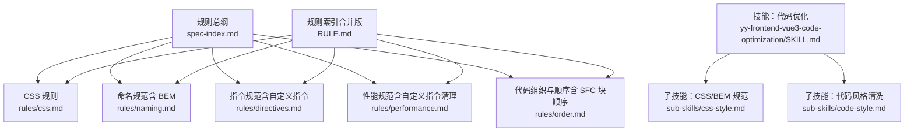
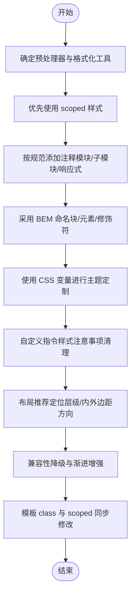
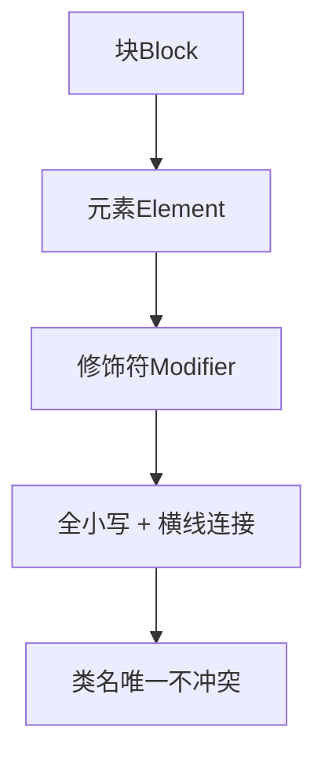
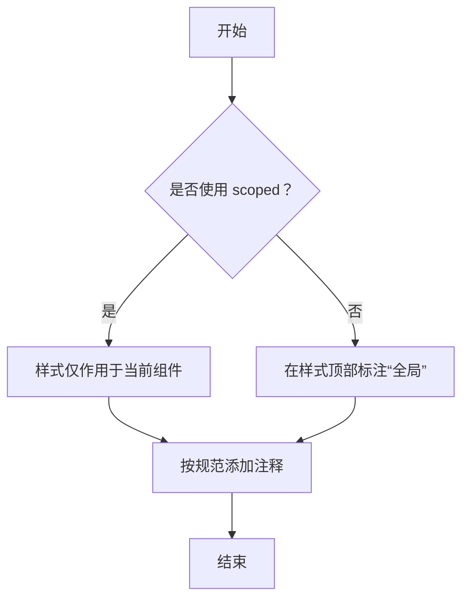
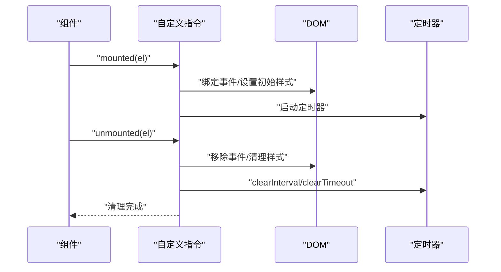
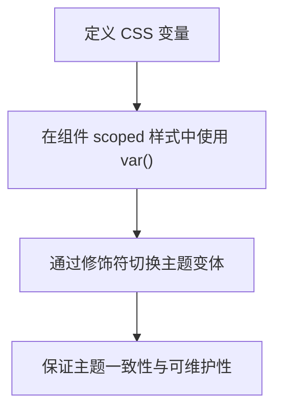
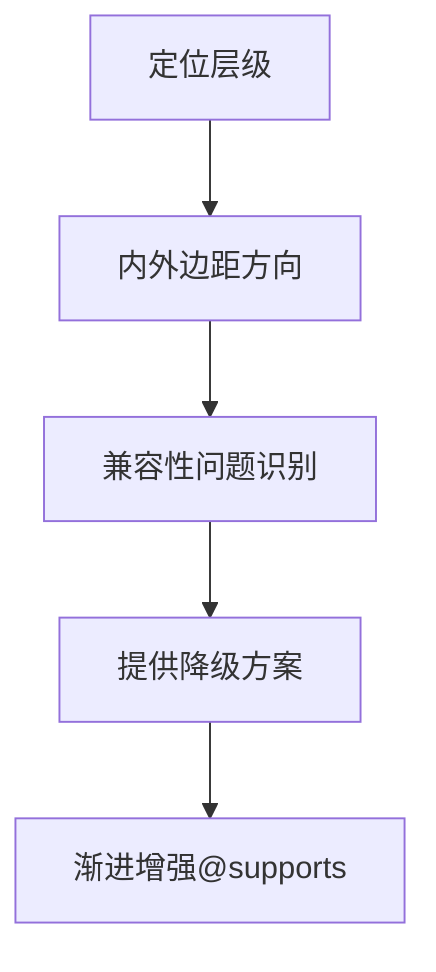
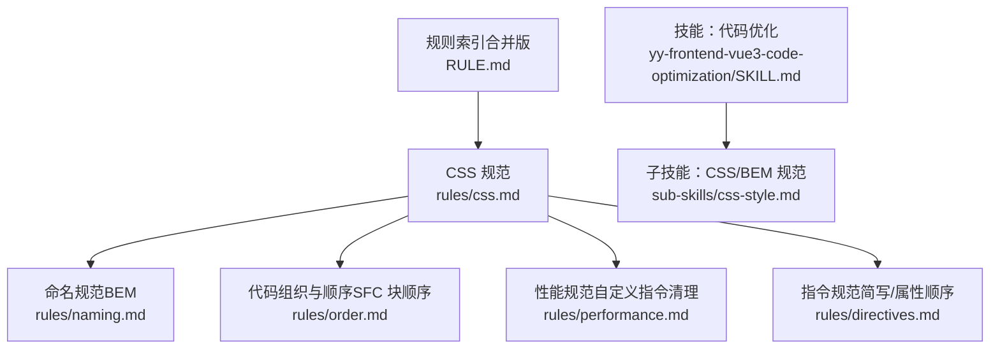

# CSS 规范

<cite>
**本文引用的文件**
- [css.md](file://rules/frontend-rules-vue3/references/css.md)
- [naming.md](file://rules/frontend-rules-vue3/references/naming.md)
- [directives.md](file://rules/frontend-rules-vue3/references/directives.md)
- [performance.md](file://rules/frontend-rules-vue3/references/performance.md)
- [order.md](file://rules/frontend-rules-vue3/references/order.md)
- [css.md](file://skills/yy-frontend-vue3-code-optimization/sub-skills/css-style.md)
- [css.md](file://skills/yy-frontend-vue3-code-optimization/rules/css.md)
- [css.md](file://skills/yy-frontend-vue3-review/rules/css.md)
- [RULE.md](file://rules/frontend-rules-vue3/RULE.md)
- [spec-index.md](file://rules/frontend-rules-vue3/references/spec-index.md)
- [SKILL.md](file://skills/yy-frontend-vue3-code-optimization/SKILL.md)
</cite>

## 目录
1. [简介](#简介)
2. [项目结构](#项目结构)
3. [核心组件](#核心组件)
4. [架构总览](#架构总览)
5. [详细组件分析](#详细组件分析)
6. [依赖分析](#依赖分析)
7. [性能考量](#性能考量)
8. [故障排查指南](#故障排查指南)
9. [结论](#结论)
10. [附录](#附录)

## 简介
本文件系统化阐述 Vue3 项目中的 CSS 规范，重点覆盖以下方面：
- BEM 命名方法的使用原则与落地方式
- 样式作用域管理（优先使用 scoped 与全局样式的标注规范）
- 自定义指令在样式中的应用与注意事项（含生命周期清理）
- CSS 变量的使用规范与主题定制最佳实践
- 兼容性问题与降级方案
- 与模板 class 同步修改的强制要求
- 与项目整体规范的关联与执行流程

## 项目结构
本规范由“规则索引”“子规则文件”“技能执行规范”共同构成，形成“总纲—细则—执行—验证”的闭环。

图表来源
- [spec-index.md:1-60](file://rules/frontend-rules-vue3/references/spec-index.md#L1-L60)
- [RULE.md:1-68](file://rules/frontend-rules-vue3/RULE.md#L1-L68)
- [SKILL.md:1-464](file://skills/yy-frontend-vue3-code-optimization/SKILL.md#L1-L464)

章节来源
- [RULE.md:1-68](file://rules/frontend-rules-vue3/RULE.md#L1-L68)
- [spec-index.md:1-60](file://rules/frontend-rules-vue3/references/spec-index.md#L1-L60)
- [SKILL.md:1-464](file://skills/yy-frontend-vue3-code-optimization/SKILL.md#L1-L464)

## 核心组件
- CSS 处理与格式化：Sass/SCSS、Less 预处理器，csscomb + Prettier 格式化，全局样式目录约定
- 样式注释与作用域：模块分组、子模块、响应式注释；scoped 优先，非 scoped 需标注“全局”
- BEM 命名：块/元素/修饰符三要素，全小写、横线连接、类名唯一
- 自定义指令清理：unmounted 钩子必须清理事件监听器与定时器
- 布局推荐：定位层级、外边距与内边距方向
- 兼容性指南：属性降级方案与渐进增强实践

章节来源
- [css.md:1-67](file://rules/frontend-rules-vue3/references/css.md#L1-L67)
- [naming.md:76-85](file://rules/frontend-rules-vue3/references/naming.md#L76-L85)
- [performance.md:115-128](file://rules/frontend-rules-vue3/references/performance.md#L115-L128)
- [order.md:7-11](file://rules/frontend-rules-vue3/references/order.md#L7-L11)

## 架构总览
CSS 规范在项目中的落地路径如下：

图表来源
- [css.md:1-67](file://rules/frontend-rules-vue3/references/css.md#L1-L67)
- [naming.md:76-85](file://rules/frontend-rules-vue3/references/naming.md#L76-L85)
- [performance.md:115-128](file://rules/frontend-rules-vue3/references/performance.md#L115-L128)
- [order.md:7-11](file://rules/frontend-rules-vue3/references/order.md#L7-L11)

## 详细组件分析

### BEM 命名规范
- 命名三要素
  - 块（Block）：独立模块，如 card、form
  - 元素（Element）：块内部子元素，使用双下划线连接，如 card__title、form__input
  - 修饰符（Modifier）：状态/样式变体，使用双连字符连接，如 card--dark、card__title--large
- 命名规则：全小写、横线连接、语义清晰、类名唯一不冲突
- 嵌套与 SCSS/LESS：推荐使用父选择器引用（&），嵌套层级不超过两层；媒体查询可嵌套在对应块/元素内部
- 禁止场景：嵌套层级过深（>2 层）、元素类型选择器嵌套、后代选择器嵌套

图表来源
- [naming.md:76-85](file://rules/frontend-rules-vue3/references/naming.md#L76-L85)
- [css-style.md:12-18](file://skills/yy-frontend-vue3-code-optimization/sub-skills/css-style.md#L12-L18)
- [css-style.md:21-61](file://skills/yy-frontend-vue3-code-optimization/sub-skills/css-style.md#L21-L61)

章节来源
- [naming.md:76-85](file://rules/frontend-rules-vue3/references/naming.md#L76-L85)
- [css-style.md:12-18](file://skills/yy-frontend-vue3-code-optimization/sub-skills/css-style.md#L12-L18)
- [css-style.md:21-61](file://skills/yy-frontend-vue3-code-optimization/sub-skills/css-style.md#L21-L61)

### 样式作用域与注释规范
- 作用域
  - 优先使用 scoped，确保样式仅作用于当前组件
  - 非 scoped 样式需在顶部标注“全局”，以警示影响范围
- 注释
  - 模块分组：/* 模块名称 */
  - 子模块：/* 模块 > 子模块 */
  - 响应式：/* 响应式 */

图表来源
- [css.md:19-24](file://rules/frontend-rules-vue3/references/css.md#L19-L24)
- [css.md:11-18](file://rules/frontend-rules-vue3/references/css.md#L11-L18)

章节来源
- [css.md:19-24](file://rules/frontend-rules-vue3/references/css.md#L19-L24)
- [css.md:11-18](file://rules/frontend-rules-vue3/references/css.md#L11-L18)

### 自定义指令在样式中的应用与注意事项
- 自定义指令生命周期清理
  - 在 unmounted 钩子中清理事件监听器与定时器，避免内存泄漏与副作用
- 指令简写与模板属性顺序
  - 统一使用指令简写形式（v-bind: → :、v-on: → @、v-slot: → #）
  - 模板属性顺序：is → v-for → v-if/v-else-if/v-else → v-show/v-cloak → id → props/attrs → v-on → v-html/v-text → v-slot

图表来源
- [performance.md:115-128](file://rules/frontend-rules-vue3/references/performance.md#L115-L128)
- [directives.md:60-98](file://rules/frontend-rules-vue3/references/directives.md#L60-L98)

章节来源
- [performance.md:115-128](file://rules/frontend-rules-vue3/references/performance.md#L115-L128)
- [directives.md:60-98](file://rules/frontend-rules-vue3/references/directives.md#L60-L98)

### CSS 变量使用规范与主题定制
- 使用 CSS 变量实现动态样式与主题切换
- 在组件作用域内定义变量，保证主题一致性与可维护性
- 与 BEM 结合，通过修饰符切换主题变体

图表来源
- [css-style.md:168-183](file://skills/yy-frontend-vue3-code-optimization/sub-skills/css-style.md#L168-L183)

章节来源
- [css-style.md:168-183](file://skills/yy-frontend-vue3-code-optimization/sub-skills/css-style.md#L168-L183)

### 布局推荐与兼容性指南
- 定位层级：position: relative 搭配 z-index: 0 创建定位上下文，避免子元素 z-index 影响外部元素
- 外边距与内边距方向：优先使用 padding-top/left/right、margin-bottom/left/right，避免 padding-bottom 与 margin-top
- 兼容性问题与降级方案：对 gap、aspect-ratio、100vh、inset、will-change、content-visibility、subgrid 等属性提供降级方案
- 渐进增强：使用 @supports 包裹新属性，不支持浏览器自动忽略

图表来源
- [css.md:33-44](file://rules/frontend-rules-vue3/references/css.md#L33-L44)
- [css.md:46-67](file://rules/frontend-rules-vue3/references/css.md#L46-L67)

章节来源
- [css.md:33-44](file://rules/frontend-rules-vue3/references/css.md#L33-L44)
- [css.md:46-67](file://rules/frontend-rules-vue3/references/css.md#L46-L67)

### 模板 class 与 scoped 同步修改
- 强制要求：当 scoped 样式中的 class 发生修改时，必须同步修改模板中的 class 属性，确保样式生效且不产生歧义
- 示例路径：参考子技能中的示例片段路径，包含修改前后对比

章节来源
- [css-style.md:127-166](file://skills/yy-frontend-vue3-code-optimization/sub-skills/css-style.md#L127-L166)

## 依赖分析
CSS 规范与其他模块的耦合关系如下：

图表来源
- [css.md:1-67](file://rules/frontend-rules-vue3/references/css.md#L1-L67)
- [naming.md:76-85](file://rules/frontend-rules-vue3/references/naming.md#L76-L85)
- [order.md:7-11](file://rules/frontend-rules-vue3/references/order.md#L7-L11)
- [performance.md:115-128](file://rules/frontend-rules-vue3/references/performance.md#L115-L128)
- [directives.md:60-98](file://rules/frontend-rules-vue3/references/directives.md#L60-L98)
- [SKILL.md:235-247](file://skills/yy-frontend-vue3-code-optimization/SKILL.md#L235-L247)
- [RULE.md:44-46](file://rules/frontend-rules-vue3/RULE.md#L44-L46)

章节来源
- [RULE.md:44-46](file://rules/frontend-rules-vue3/RULE.md#L44-L46)
- [SKILL.md:235-247](file://skills/yy-frontend-vue3-code-optimization/SKILL.md#L235-L247)

## 性能考量
- 自定义指令清理：在 unmounted 钩子中清理事件监听器与定时器，避免内存泄漏
- 模板层轻量化：模板只负责展示，不写复杂表达式与逻辑，简单逻辑可内联，避免在模板中执行昂贵计算
- 响应式性能：优先使用 computed 派生状态，减少 watch 滥用，大型数据列表考虑 shallowRef 减少深层响应式开销

章节来源
- [performance.md:115-128](file://rules/frontend-rules-vue3/references/performance.md#L115-L128)
- [performance.md:99-112](file://rules/frontend-rules-vue3/references/performance.md#L99-L112)

## 故障排查指南
- 作用域问题
  - 症状：样式意外影响其他组件
  - 排查：确认是否使用 scoped；若非 scoped，是否在样式顶部标注“全局”
- 命名冲突
  - 症状：BEM 命名不规范导致样式覆盖异常
  - 排查：检查块/元素/修饰符命名是否符合全小写、横线连接、类名唯一
- 嵌套过深
  - 症状：样式难以维护、特异性过高
  - 排查：检查嵌套层级是否超过两层，是否使用后代选择器
- 自定义指令副作用
  - 症状：内存泄漏、事件重复绑定
  - 排查：确认在 unmounted 钩子中清理事件监听器与定时器
- 兼容性问题
  - 症状：特定属性在某些浏览器表现异常
  - 排查：对照兼容性降级方案，提供回退样式或使用 @supports

章节来源
- [css.md:19-24](file://rules/frontend-rules-vue3/references/css.md#L19-L24)
- [naming.md:76-85](file://rules/frontend-rules-vue3/references/naming.md#L76-L85)
- [css-style.md:85-113](file://skills/yy-frontend-vue3-code-optimization/sub-skills/css-style.md#L85-L113)
- [performance.md:115-128](file://rules/frontend-rules-vue3/references/performance.md#L115-L128)
- [css.md:46-67](file://rules/frontend-rules-vue3/references/css.md#L46-L67)

## 结论
本规范以“BEM 命名 + scoped 作用域 + CSS 变量 + 自定义指令清理 + 兼容性降级”为核心，结合项目整体规则与技能执行流程，形成可落地、可验证的 Vue3 CSS 规范体系。建议在团队内统一推广，并通过子技能与规则索引持续迭代。

## 附录
- 代码示例路径（不含具体代码内容）
  - BEM 嵌套与修饰符示例：[css-style.md:23-59](file://skills/yy-frontend-vue3-code-optimization/sub-skills/css-style.md#L23-L59)
  - scoped 样式最佳实践示例：[css-style.md:63-83](file://skills/yy-frontend-vue3-code-optimization/sub-skills/css-style.md#L63-L83)
  - 禁止嵌套场景示例：[css-style.md:87-113](file://skills/yy-frontend-vue3-code-optimization/sub-skills/css-style.md#L87-L113)
  - 模板 class 同步修改示例：[css-style.md:133-166](file://skills/yy-frontend-vue3-code-optimization/sub-skills/css-style.md#L133-L166)
  - CSS 变量使用示例：[css-style.md:172-183](file://skills/yy-frontend-vue3-code-optimization/sub-skills/css-style.md#L172-L183)
  - 自定义指令清理示例：[performance.md:119-128](file://rules/frontend-rules-vue3/references/performance.md#L119-L128)
  - 指令简写与属性顺序示例：[directives.md:64-98](file://rules/frontend-rules-vue3/references/directives.md#L64-L98)
  - SFC 块顺序与导入分组示例：[order.md:37-88](file://rules/frontend-rules-vue3/references/order.md#L37-L88)
  - 规则索引与适用范围：[RULE.md:18-22](file://rules/frontend-rules-vue3/RULE.md#L18-L22)
  - 规范总纲与优先级：[spec-index.md:1-60](file://rules/frontend-rules-vue3/references/spec-index.md#L1-L60)
  - 技能执行与风险分级：[SKILL.md:48-78](file://skills/yy-frontend-vue3-code-optimization/SKILL.md#L48-L78)