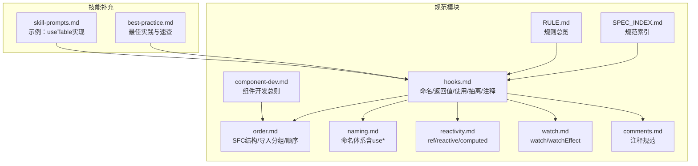
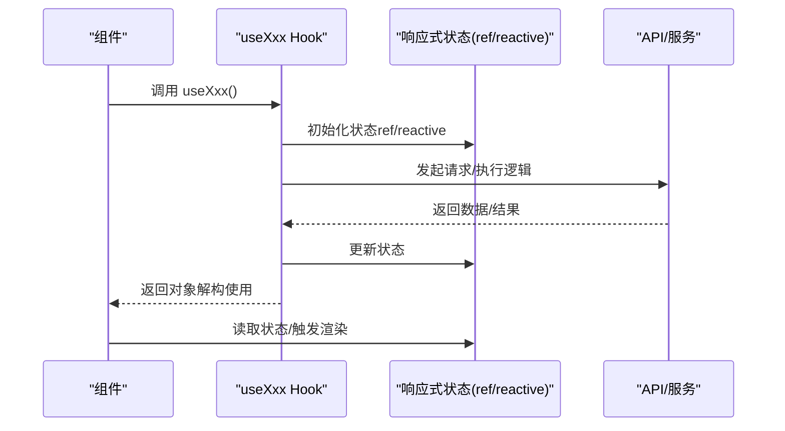
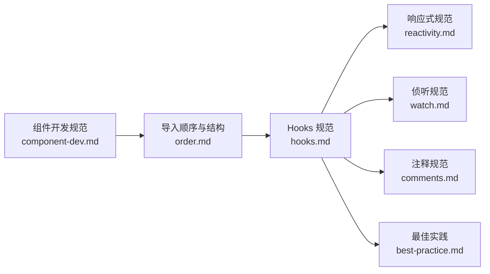

# Hooks 规范

<cite>
**本文引用的文件**
- [hooks.md](file://rules/frontend-rules-vue3/references/hooks.md)
- [order.md](file://rules/frontend-rules-vue3/references/order.md)
- [naming.md](file://rules/frontend-rules-vue3/references/naming.md)
- [reactivity.md](file://rules/frontend-rules-vue3/references/reactivity.md)
- [watch.md](file://rules/frontend-rules-vue3/references/watch.md)
- [comments.md](file://rules/frontend-rules-vue3/references/comments.md)
- [component-dev.md](file://rules/frontend-rules-vue3/references/component-dev.md)
- [SPEC_INDEX.md](file://rules/frontend-rules-vue3/references/spec-index.md)
- [RULE.md](file://rules/frontend-rules-vue3/RULE.md)
- [best-practice.md](file://skills/yy-frontend-vue3-review/references/best-practice.md)
- [skill-prompts.md](file://skills/yy-frontend-vue3-code-optimization/prompts/skill-prompts.md)
</cite>

## 目录
1. [简介](#简介)
2. [项目结构](#项目结构)
3. [核心组件](#核心组件)
4. [架构总览](#架构总览)
5. [详细组件分析](#详细组件分析)
6. [依赖分析](#依赖分析)
7. [性能考量](#性能考量)
8. [故障排查指南](#故障排查指南)
9. [结论](#结论)
10. [附录](#附录)

## 简介
本规范系统阐述 Vue3 组合式函数（Hooks）的命名、返回值、使用方式、抽离建议与导入顺序组织，结合响应式状态管理、侦听器规范、注释与组件开发规范，形成一套可落地、可复用、可演进的工程化实践。目标是帮助团队在大型项目中统一 Hooks 设计与实现，提升可维护性与协作效率。

## 项目结构
- 规范来源集中在 rules/frontend-rules-vue3/references 下的 hooks.md、order.md、naming.md、reactivity.md、watch.md、comments.md、component-dev.md、SPEC_INDEX.md、RULE.md 等文件。
- 技能侧补充了最佳实践与示例，位于 skills/yy-frontend-vue3-review/references/best-practice.md 与 skills/yy-frontend-vue3-code-optimization/prompts/skill-prompts.md。

图表来源
- [SPEC_INDEX.md:1-60](file://rules/frontend-rules-vue3/references/spec-index.md#L1-L60)
- [RULE.md:1-68](file://rules/frontend-rules-vue3/RULE.md#L1-L68)

章节来源
- [SPEC_INDEX.md:1-60](file://rules/frontend-rules-vue3/references/spec-index.md#L1-L60)
- [RULE.md:1-68](file://rules/frontend-rules-vue3/RULE.md#L1-L68)

## 核心组件
- 命名与文件组织：以 use 前缀命名，文件名与函数名一致，全局 Hooks 放置于 @src/hooks/，局部 Hooks 放置于组件同级目录。
- 返回值约定：统一返回对象；优先使用 toRefs 解构返回；禁止直接返回 reactive 对象；禁止将 Hooks 挂载到响应式数据上。
- 使用规范：组件中通过解构使用；生命周期钩子仅能在组件顶层或 setup 中调用；禁止在 Hooks 内部直接调用生命周期钩子；按注释规范标注“// hook: Hook名”。
- 抽离建议：可复用逻辑超过 30 行或跨 2 个以上组件使用时，必须抽离为 Hook；提供常见场景的 Hook 名称速查。
- 注释规范：JSDoc + @description 描述整体；内部 ref 与方法分别按规范注释；组件引入与 Hooks 引入均需标注。

章节来源
- [hooks.md:7-158](file://rules/frontend-rules-vue3/references/hooks.md#L7-L158)
- [comments.md:19-31](file://rules/frontend-rules-vue3/references/comments.md#L19-L31)
- [best-practice.md:40-59](file://skills/yy-frontend-vue3-review/references/best-practice.md#L40-L59)

## 架构总览
从组件到 Hooks 的调用关系与数据流如下：

图表来源
- [hooks.md:123-131](file://rules/frontend-rules-vue3/references/hooks.md#L123-L131)
- [reactivity.md:76-99](file://rules/frontend-rules-vue3/references/reactivity.md#L76-L99)

## 详细组件分析

### 命名与文件组织
- 命名：必须以 use 开头，如 useTable、useSearchForm、useUserFetch。
- 文件组织：文件名与函数名一致；全局 Hooks 放 @src/hooks/；局部 Hooks 放组件同级目录（如 ./useLocalForm.ts）。
- 与命名规范的关系：use* 命名属于 Hooks 命名体系的一部分，详见命名规范中的 Hooks 命名条目。

章节来源
- [hooks.md:7-11](file://rules/frontend-rules-vue3/references/hooks.md#L7-L11)
- [naming.md:46-53](file://rules/frontend-rules-vue3/references/naming.md#L46-L53)

### 返回值约定与响应式规则
- 统一返回对象；推荐使用 toRefs 解构返回；禁止直接返回 reactive 对象；禁止将 Hooks 挂载到响应式数据上。
- 响应式选择：优先使用 ref；reactive 仅用于复杂对象、批量更新、解构后仍需保持响应式的场景；computed 用于同步派生逻辑。
- 与 Hooks 的关系：Hooks 内部状态使用 ref/reactive 管理，对外统一返回对象，保证解构使用的便利性与响应式稳定性。

章节来源
- [hooks.md:14-18](file://rules/frontend-rules-vue3/references/hooks.md#L14-L18)
- [reactivity.md:7-28](file://rules/frontend-rules-vue3/references/reactivity.md#L7-L28)
- [reactivity.md:76-99](file://rules/frontend-rules-vue3/references/reactivity.md#L76-L99)

### 使用规范与生命周期
- 组件中通过解构使用：const { ... } = useXxx()。
- 生命周期：仅能在组件顶层或 setup 中调用生命周期钩子；禁止在 Hooks 内部直接调用生命周期钩子（除非 Hooks 本身在组件顶层执行）。
- 注释：组件引入后按注释规范标注“// hook: Hook名”。

章节来源
- [hooks.md:123-131](file://rules/frontend-rules-vue3/references/hooks.md#L123-L131)
- [comments.md:29-30](file://rules/frontend-rules-vue3/references/comments.md#L29-L30)

### 抽离建议与边界条件
- 抽离阈值：可复用逻辑超过 30 行或跨 2 个以上组件使用时，必须抽离为 Hook。
- 常见场景与 Hook 名称速查：useTable、useSearchForm、useFormValidate、useDialog、useUpload、usePermission 等。
- 边界条件：禁止将 Hooks 挂载到响应式数据上；禁止直接返回 reactive 对象；禁止在 Hooks 内部直接调用生命周期钩子（除非在组件顶层）。

章节来源
- [hooks.md:134-146](file://rules/frontend-rules-vue3/references/hooks.md#L134-L146)
- [best-practice.md:40-59](file://skills/yy-frontend-vue3-review/references/best-practice.md#L40-L59)

### 组件中 Hooks 的导入顺序与组织方式
- SFC 结构顺序：template → script setup → style scoped。
- script setup 内部顺序：imports → defineProps/defineEmits → 全局 Hooks → 业务逻辑（按功能模块分组：ref/reactive → computed → 方法 → watch → 生命周期钩子）→ defineExpose。
- Import 分组排序（4 组）：node_modules（外部依赖）→ types（类型导入）→ @src/（内部全局依赖）→ ./、../（内部相对依赖）；组间空一行，组内按字母顺序排列。
- Hooks 位置：全局 Hooks 放在“全局依赖”组，局部 Hooks 放在“内部相对依赖”组；按注释规范标注“// hook: Hook名”。

章节来源
- [order.md:7-26](file://rules/frontend-rules-vue3/references/order.md#L7-L26)
- [order.md:92-102](file://rules/frontend-rules-vue3/references/order.md#L92-L102)
- [order.md:37-87](file://rules/frontend-rules-vue3/references/order.md#L37-L87)
- [component-dev.md:13-20](file://rules/frontend-rules-vue3/references/component-dev.md#L13-L20)

### Hooks 的复用原则与边界条件
- 复用原则：当逻辑满足“可复用且超过 30 行或跨 2 个以上组件使用”时，必须抽离为 Hook；避免重复代码与分散逻辑。
- 边界条件：返回值必须为对象；禁止直接返回 reactive；禁止将 Hooks 挂载到响应式数据上；生命周期钩子仅能在组件顶层调用。

章节来源
- [hooks.md:134-136](file://rules/frontend-rules-vue3/references/hooks.md#L134-L136)
- [hooks.md:16-18](file://rules/frontend-rules-vue3/references/hooks.md#L16-L18)

### 常用 Hooks 的正确实现方式与最佳实践
- useTable 实现要点：使用 ref 管理分页、加载、数据源、总数；提供 fetchData 方法；返回对象统一解构使用；可选集成 useRequest 自动管理状态。
- 示例参考：技能提示中的 useTable 实现与使用示例展示了标准模板与最佳实践。

章节来源
- [hooks.md:20-119](file://rules/frontend-rules-vue3/references/hooks.md#L20-L119)
- [skill-prompts.md:1461-1531](file://skills/yy-frontend-vue3-code-optimization/prompts/skill-prompts.md#L1461-L1531)

## 依赖分析
- 组件开发规范与 Hooks 的关系：组件开发规范要求使用 <script setup>、严格顺序与注释；Hooks 的导入与组织必须遵循该顺序与注释规范。
- 响应式与 Hooks 的关系：Hooks 内部状态管理遵循 ref/reactive/computed 选择原则；返回值必须解构为对象，避免直接返回 reactive。
- 侦听与 Hooks 的关系：watch/watchEffect 的使用策略与生命周期钩子调用限制，直接影响 Hooks 的设计与实现边界。

图表来源
- [component-dev.md:13-20](file://rules/frontend-rules-vue3/references/component-dev.md#L13-L20)
- [order.md:15-26](file://rules/frontend-rules-vue3/references/order.md#L15-L26)
- [hooks.md:123-131](file://rules/frontend-rules-vue3/references/hooks.md#L123-L131)
- [reactivity.md:7-28](file://rules/frontend-rules-vue3/references/reactivity.md#L7-L28)
- [watch.md:7-12](file://rules/frontend-rules-vue3/references/watch.md#L7-L12)
- [comments.md:19-31](file://rules/frontend-rules-vue3/references/comments.md#L19-L31)
- [best-practice.md:40-46](file://skills/yy-frontend-vue3-review/references/best-practice.md#L40-L46)

章节来源
- [component-dev.md:13-20](file://rules/frontend-rules-vue3/references/component-dev.md#L13-L20)
- [order.md:15-26](file://rules/frontend-rules-vue3/references/order.md#L15-L26)
- [hooks.md:123-131](file://rules/frontend-rules-vue3/references/hooks.md#L123-L131)
- [reactivity.md:7-28](file://rules/frontend-rules-vue3/references/reactivity.md#L7-L28)
- [watch.md:7-12](file://rules/frontend-rules-vue3/references/watch.md#L7-L12)
- [comments.md:19-31](file://rules/frontend-rules-vue3/references/comments.md#L19-L31)
- [best-practice.md:40-46](file://skills/yy-frontend-vue3-review/references/best-practice.md#L40-L46)

## 性能考量
- 优先使用 computed 替代 watch 中的派生逻辑，利用缓存机制降低开销。
- 使用 ref 管理状态，避免不必要的 reactive 对象带来的解构丢失与批量更新成本。
- Hooks 返回对象统一解构使用，减少模板层的复杂度与渲染压力。
- watch/watchEffect 的配置（如 immediate、deep、flush）需根据场景权衡，避免过度刷新与资源泄漏。

章节来源
- [reactivity.md:132-200](file://rules/frontend-rules-vue3/references/reactivity.md#L132-L200)
- [watch.md:7-12](file://rules/frontend-rules-vue3/references/watch.md#L7-L12)
- [watch.md:105-147](file://rules/frontend-rules-vue3/references/watch.md#L105-L147)

## 故障排查指南
- 常见问题
  - 直接返回 reactive 对象：违反返回值约定，导致解构使用不便与响应式丢失风险。
  - 将 Hooks 挂载到响应式数据上：破坏状态独立性与可测试性。
  - 在 Hooks 内部直接调用生命周期钩子：生命周期钩子仅能在组件顶层或 setup 中调用。
  - 未按注释规范标注：影响代码可读性与协作效率。
- 排查步骤
  - 检查返回值是否为对象，必要时使用 toRefs 解构。
  - 检查是否在 Hooks 内部直接调用生命周期钩子。
  - 检查导入顺序与注释是否符合规范。
  - 检查 watch/watchEffect 的配置是否合理，是否存在资源未清理。

章节来源
- [hooks.md:14-18](file://rules/frontend-rules-vue3/references/hooks.md#L14-L18)
- [hooks.md:127-129](file://rules/frontend-rules-vue3/references/hooks.md#L127-L129)
- [comments.md:29-30](file://rules/frontend-rules-vue3/references/comments.md#L29-L30)
- [watch.md:105-147](file://rules/frontend-rules-vue3/references/watch.md#L105-L147)

## 结论
本规范以 hooks.md 为核心，结合 order.md、naming.md、reactivity.md、watch.md、comments.md、component-dev.md、SPEC_INDEX.md、RULE.md、best-practice.md、skill-prompts.md 等文件，构建了从命名、返回值、使用方式到导入顺序与最佳实践的完整闭环。遵循这些规范，可在大型 Vue3 项目中实现 Hooks 的高复用、低耦合与强一致性，显著提升开发效率与代码质量。

## 附录
- 规范总览与索引：通过 SPEC_INDEX.md 与 RULE.md 快速定位各模块规范与优先级。
- 常见场景速查：useTable、useSearchForm、useFormValidate、useDialog、useUpload、usePermission 等。

章节来源
- [SPEC_INDEX.md:1-60](file://rules/frontend-rules-vue3/references/spec-index.md#L1-L60)
- [RULE.md:1-68](file://rules/frontend-rules-vue3/RULE.md#L1-L68)
- [best-practice.md:49-59](file://skills/yy-frontend-vue3-review/references/best-practice.md#L49-L59)