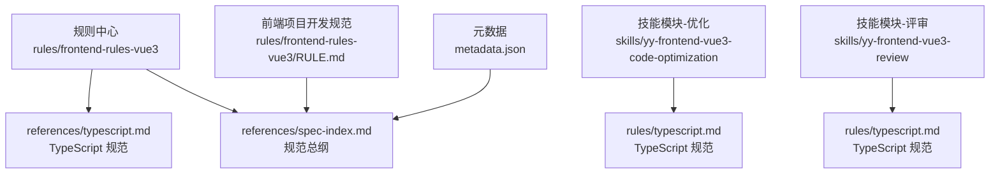
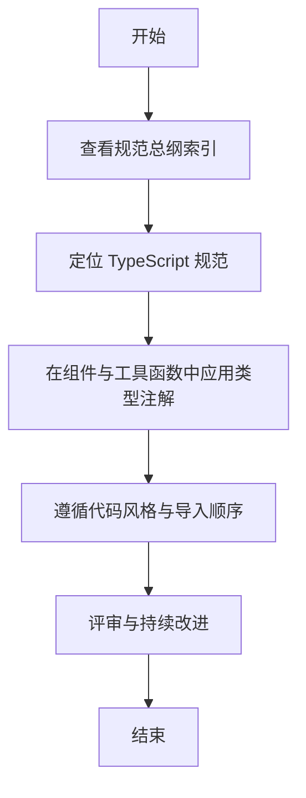
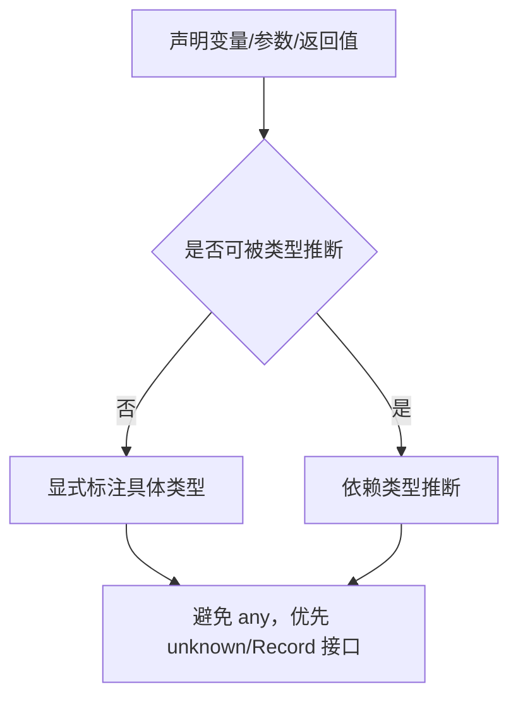
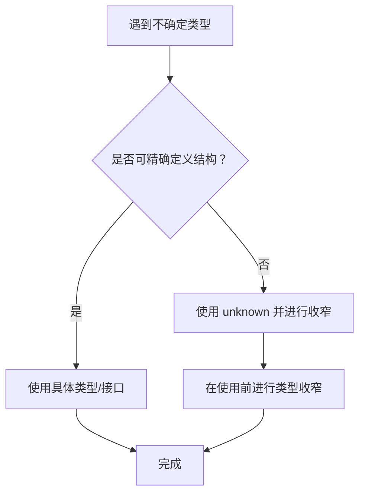
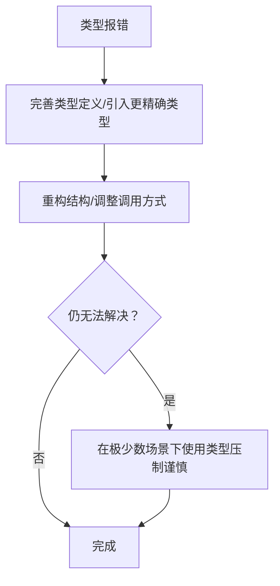
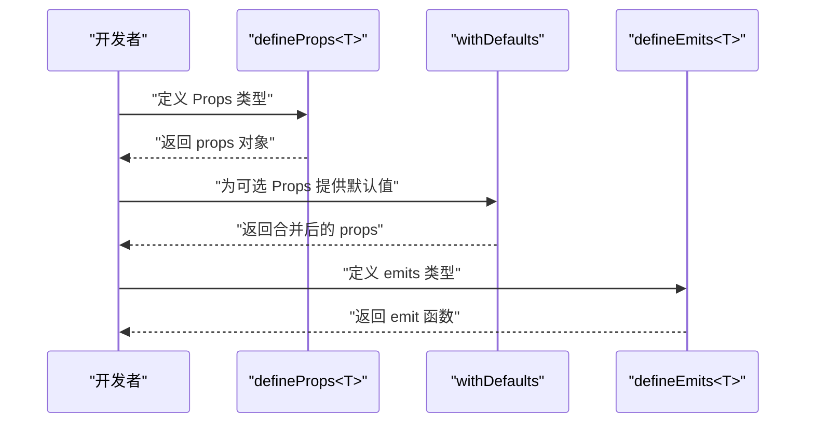
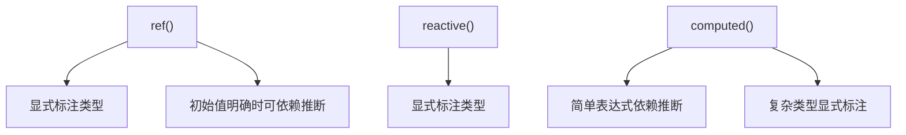
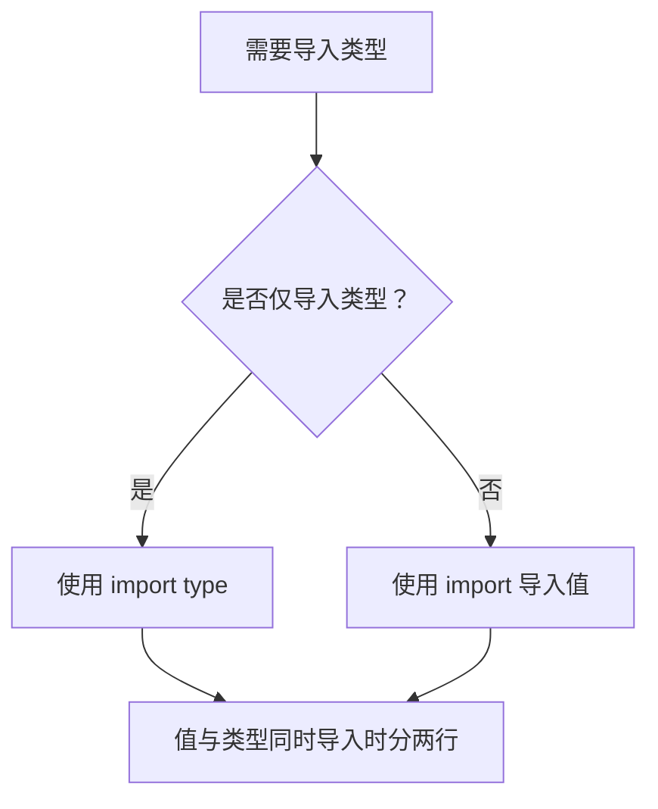
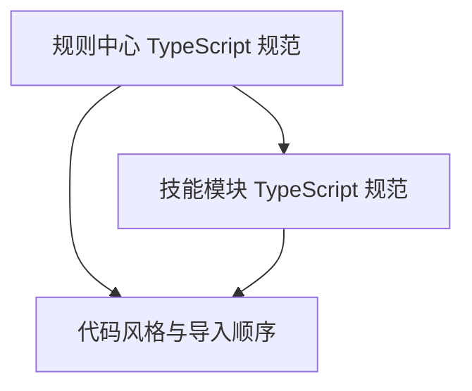

# TypeScript 规范

<cite>
**本文档引用的文件**
- [Vue3 TypeScript 规范（规则中心）](file://rules/frontend-rules-vue3/references/typescript.md)
- [Vue3 TypeScript 规范（技能-优化）](file://skills/yy-frontend-vue3-code-optimization/rules/typescript.md)
- [Vue3 TypeScript 规范（技能-评审）](file://skills/yy-frontend-vue3-review/rules/typescript.md)
- [Vue3 开发规范总纲（索引）](file://rules/frontend-rules-vue3/references/spec-index.md)
- [代码风格（技能-评审）](file://skills/yy-frontend-vue3-review/references/code-style.md)
- [Vue3 前端项目开发规范](file://rules/frontend-rules-vue3/RULE.md)
- [元数据（规则中心）](file://rules/frontend-rules-vue3/metadata.json)
</cite>

## 目录
1. [简介](#简介)
2. [项目结构](#项目结构)
3. [核心组件](#核心组件)
4. [架构总览](#架构总览)
5. [详细组件分析](#详细组件分析)
6. [依赖分析](#依赖分析)
7. [性能考虑](#性能考虑)
8. [故障排查指南](#故障排查指南)
9. [结论](#结论)
10. [附录](#附录)

## 简介
本规范面向 Vue3 项目中的 TypeScript 使用，系统性地定义了类型注解的强制要求、禁用 any 的原因与替代方案、不推荐使用 as any 与 @ts-ignore 的原因与正确处理方式、类型注解最佳实践与类型推断的合理利用，以及 import type 的使用场景与与其他导入方式的区别。目标是帮助团队在保持强类型约束的同时，提升代码可维护性与协作效率。

## 项目结构
本规范由“规则中心”与“技能子模块”共同维护，形成“基础规范/强烈推荐/风格指南”的三级优先级索引。TypeScript 规范位于“风格指南”类别，强调类型注解的强制性与类型压制的严格限制。

图表来源
- [Vue3 开发规范（规则中心）:1-68](file://rules/frontend-rules-vue3/RULE.md#L1-L68)
- [Vue3 开发规范总纲（索引）:1-60](file://rules/frontend-rules-vue3/references/spec-index.md#L1-L60)
- [Vue3 TypeScript 规范（规则中心）:1-202](file://rules/frontend-rules-vue3/references/typescript.md#L1-L202)
- [Vue3 TypeScript 规范（技能-优化）:1-202](file://skills/yy-frontend-vue3-code-optimization/rules/typescript.md#L1-L202)
- [Vue3 TypeScript 规范（技能-评审）:1-202](file://skills/yy-frontend-vue3-review/rules/typescript.md#L1-L202)
- [元数据（规则中心）:1-17](file://rules/frontend-rules-vue3/metadata.json#L1-L17)

章节来源
- [Vue3 开发规范（规则中心）:1-68](file://rules/frontend-rules-vue3/RULE.md#L1-L68)
- [Vue3 开发规范总纲（索引）:1-60](file://rules/frontend-rules-vue3/references/spec-index.md#L1-L60)
- [元数据（规则中心）:1-17](file://rules/frontend-rules-vue3/metadata.json#L1-L17)

## 核心组件
- 类型注解强制要求：参数、返回值、变量、模板 ref 必须明确类型。
- 禁止 any：使用 unknown、Record<string, unknown>、具体类型/接口替代。
- 组件 Props：必须使用 TypeScript 泛型定义，配合 withDefaults 设置默认值。
- 响应式类型：ref/reactive/computed 明确标注或合理利用类型推断。
- Emits 类型：必须使用 TypeScript 泛型定义。
- Hooks 返回值：必须声明返回值类型接口。
- 类型文件组织：全局类型、组件私有类型、全局注入的组织规范。
- 类型导入：import type 仅用于纯类型导入，值与类型同时导入时需分两行。
- 类型压制：不推荐使用 as any、@ts-ignore、@ts-expect-error，优先完善类型定义。

章节来源
- [Vue3 TypeScript 规范（规则中心）:7-202](file://rules/frontend-rules-vue3/references/typescript.md#L7-L202)
- [Vue3 TypeScript 规范（技能-优化）:7-202](file://skills/yy-frontend-vue3-code-optimization/rules/typescript.md#L7-L202)
- [Vue3 TypeScript 规范（技能-评审）:7-202](file://skills/yy-frontend-vue3-review/rules/typescript.md#L7-L202)

## 架构总览
TypeScript 规范在项目中的落地路径如下：
- 规范入口：通过“规范总纲”索引定位到“TypeScript 规范”。
- 规则来源：规则中心与技能模块均提供同一主题的规范文本，确保一致性。
- 工具链协同：代码风格与导入顺序规范为 TypeScript 强类型落地提供基础环境。

图表来源
- [Vue3 开发规范总纲（索引）:42-56](file://rules/frontend-rules-vue3/references/spec-index.md#L42-L56)
- [代码风格（技能-评审）:63-71](file://skills/yy-frontend-vue3-review/references/code-style.md#L63-L71)

章节来源
- [Vue3 开发规范总纲（索引）:42-56](file://rules/frontend-rules-vue3/references/spec-index.md#L42-L56)
- [代码风格（技能-评审）:63-71](file://skills/yy-frontend-vue3-review/references/code-style.md#L63-L71)

## 详细组件分析

### 一、类型注解强制要求
- 参数、返回值、变量、模板 ref 必须明确类型。
- 模板 ref 示例：组件模板引用必须指定元素类型，如 HTMLFormElement 或其联合类型。
- 合理利用类型推断：当初始值明确时可依赖推断，但无初始值时必须显式标注。

图表来源
- [Vue3 TypeScript 规范（规则中心）:7-13](file://rules/frontend-rules-vue3/references/typescript.md#L7-L13)
- [Vue3 TypeScript 规范（技能-优化）:7-13](file://skills/yy-frontend-vue3-code-optimization/rules/typescript.md#L7-L13)
- [Vue3 TypeScript 规范（技能-评审）:7-13](file://skills/yy-frontend-vue3-review/rules/typescript.md#L7-L13)

章节来源
- [Vue3 TypeScript 规范（规则中心）:7-13](file://rules/frontend-rules-vue3/references/typescript.md#L7-L13)
- [Vue3 TypeScript 规范（技能-优化）:7-13](file://skills/yy-frontend-vue3-code-optimization/rules/typescript.md#L7-L13)
- [Vue3 TypeScript 规范（技能-评审）:7-13](file://skills/yy-frontend-vue3-review/rules/typescript.md#L7-L13)

### 二、禁用 any 的原因与替代方案
- 禁止 any 的原因：any 会破坏类型系统，导致编译器跳过类型检查，掩盖潜在错误。
- 替代方案：
  - unknown：用于类型不确定的场景，使用前需进行收窄。
  - Record<string, unknown>：用于动态键值对对象。
  - 具体类型/接口：定义准确的数据结构，提升可维护性与可读性。

图表来源
- [Vue3 TypeScript 规范（规则中心）:14-29](file://rules/frontend-rules-vue3/references/typescript.md#L14-L29)
- [Vue3 TypeScript 规范（技能-优化）:14-29](file://skills/yy-frontend-vue3-code-optimization/rules/typescript.md#L14-L29)
- [Vue3 TypeScript 规范（技能-评审）:14-29](file://skills/yy-frontend-vue3-review/rules/typescript.md#L14-L29)

章节来源
- [Vue3 TypeScript 规范（规则中心）:14-29](file://rules/frontend-rules-vue3/references/typescript.md#L14-L29)
- [Vue3 TypeScript 规范（技能-优化）:14-29](file://skills/yy-frontend-vue3-code-optimization/rules/typescript.md#L14-L29)
- [Vue3 TypeScript 规范（技能-评审）:14-29](file://skills/yy-frontend-vue3-review/rules/typescript.md#L14-L29)

### 三、不推荐使用 as any 与 @ts-ignore 的原因与正确处理方式
- 不推荐的原因：as any、@ts-ignore、@ts-expect-error 会绕过类型检查，隐藏真实问题，降低代码质量与可维护性。
- 正确处理方式：优先通过完善类型定义、引入更精确的类型、重构结构等方式解决问题；仅在第三方库类型缺失或历史迁移过渡期等极少数场景下谨慎使用。

图表来源
- [Vue3 TypeScript 规范（规则中心）:199-202](file://rules/frontend-rules-vue3/references/typescript.md#L199-L202)
- [Vue3 TypeScript 规范（技能-优化）:199-202](file://skills/yy-frontend-vue3-code-optimization/rules/typescript.md#L199-L202)
- [Vue3 TypeScript 规范（技能-评审）:199-202](file://skills/yy-frontend-vue3-review/rules/typescript.md#L199-L202)

章节来源
- [Vue3 TypeScript 规范（规则中心）:199-202](file://rules/frontend-rules-vue3/references/typescript.md#L199-L202)
- [Vue3 TypeScript 规范（技能-优化）:199-202](file://skills/yy-frontend-vue3-code-optimization/rules/typescript.md#L199-L202)
- [Vue3 TypeScript 规范（技能-评审）:199-202](file://skills/yy-frontend-vue3-review/rules/typescript.md#L199-L202)

### 四、组件 Props 类型定义与默认值
- 必须使用 TypeScript 泛型定义 Props，避免运行时对象形式。
- 使用 withDefaults 为可选 Props 设置默认值，保证类型安全与行为一致。

图表来源
- [Vue3 TypeScript 规范（规则中心）:33-76](file://rules/frontend-rules-vue3/references/typescript.md#L33-L76)
- [Vue3 TypeScript 规范（技能-优化）:33-76](file://skills/yy-frontend-vue3-code-optimization/rules/typescript.md#L33-L76)
- [Vue3 TypeScript 规范（技能-评审）:33-76](file://skills/yy-frontend-vue3-review/rules/typescript.md#L33-L76)

章节来源
- [Vue3 TypeScript 规范（规则中心）:33-76](file://rules/frontend-rules-vue3/references/typescript.md#L33-L76)
- [Vue3 TypeScript 规范（技能-优化）:33-76](file://skills/yy-frontend-vue3-code-optimization/rules/typescript.md#L33-L76)
- [Vue3 TypeScript 规范（技能-评审）:33-76](file://skills/yy-frontend-vue3-review/rules/typescript.md#L33-L76)

### 五、响应式类型标注（ref/reactive/computed）
- ref<T>()：显式标注类型，必要时利用初始值进行类型推断。
- reactive<T>()：显式标注类型，确保对象结构清晰。
- computed<T>()：简单表达式可依赖推断；复杂类型需显式标注。

图表来源
- [Vue3 TypeScript 规范（规则中心）:79-125](file://rules/frontend-rules-vue3/references/typescript.md#L79-L125)
- [Vue3 TypeScript 规范（技能-优化）:79-125](file://skills/yy-frontend-vue3-code-optimization/rules/typescript.md#L79-L125)
- [Vue3 TypeScript 规范（技能-评审）:79-125](file://skills/yy-frontend-vue3-review/rules/typescript.md#L79-L125)

章节来源
- [Vue3 TypeScript 规范（规则中心）:79-125](file://rules/frontend-rules-vue3/references/typescript.md#L79-L125)
- [Vue3 TypeScript 规范（技能-优化）:79-125](file://skills/yy-frontend-vue3-code-optimization/rules/typescript.md#L79-L125)
- [Vue3 TypeScript 规范（技能-评审）:79-125](file://skills/yy-frontend-vue3-review/rules/typescript.md#L79-L125)

### 六、Emits 类型定义
- 必须使用 TypeScript 泛型定义 emits，避免运行时字符串数组形式。
- 明确事件签名，提升类型安全与 IDE 支持。

章节来源
- [Vue3 TypeScript 规范（规则中心）:129-144](file://rules/frontend-rules-vue3/references/typescript.md#L129-L144)
- [Vue3 TypeScript 规范（技能-优化）:129-144](file://skills/yy-frontend-vue3-code-optimization/rules/typescript.md#L129-L144)
- [Vue3 TypeScript 规范（技能-评审）:129-144](file://skills/yy-frontend-vue3-review/rules/typescript.md#L129-L144)

### 七、Hooks 返回值类型
- 必须为 Hooks 返回值声明类型接口，确保返回值结构清晰、类型安全。
- 推荐返回对象并通过 toRefs 解构，避免直接返回 reactive 对象。

章节来源
- [Vue3 TypeScript 规范（规则中心）:148-170](file://rules/frontend-rules-vue3/references/typescript.md#L148-L170)
- [Vue3 TypeScript 规范（技能-优化）:148-170](file://skills/yy-frontend-vue3-code-optimization/rules/typescript.md#L148-L170)
- [Vue3 TypeScript 规范（技能-评审）:148-170](file://skills/yy-frontend-vue3-review/rules/typescript.md#L148-L170)

### 八、类型文件组织
- 全局类型：放置于 src/types/ 目录。
- 组件私有类型：放置于组件同级目录或 SFC 内 export type。
- 全局注入：在 src/types/index.d.ts 中统一导出，便于项目全局引用。
- 命名规范：类型别名和接口以 I 前缀 + PascalCase。

章节来源
- [Vue3 TypeScript 规范（规则中心）:174-180](file://rules/frontend-rules-vue3/references/typescript.md#L174-L180)
- [Vue3 TypeScript 规范（技能-优化）:174-180](file://skills/yy-frontend-vue3-code-optimization/rules/typescript.md#L174-L180)
- [Vue3 TypeScript 规范（技能-评审）:174-180](file://skills/yy-frontend-vue3-review/rules/typescript.md#L174-L180)

### 九、import type 的使用场景与区别
- 使用场景：仅导入类型信息，不产生运行时依赖，减少打包体积。
- 规则：
  - 仅用于类型导入时使用 import type。
  - 值与类型同时导入时需分两行书写（import type 与 import 分开）。

图表来源
- [Vue3 TypeScript 规范（规则中心）:183-196](file://rules/frontend-rules-vue3/references/typescript.md#L183-L196)
- [Vue3 TypeScript 规范（技能-优化）:183-196](file://skills/yy-frontend-vue3-code-optimization/rules/typescript.md#L183-L196)
- [Vue3 TypeScript 规范（技能-评审）:183-196](file://skills/yy-frontend-vue3-review/rules/typescript.md#L183-L196)

章节来源
- [Vue3 TypeScript 规范（规则中心）:183-196](file://rules/frontend-rules-vue3/references/typescript.md#L183-L196)
- [Vue3 TypeScript 规范（技能-优化）:183-196](file://skills/yy-frontend-vue3-code-optimization/rules/typescript.md#L183-L196)
- [Vue3 TypeScript 规范（技能-评审）:183-196](file://skills/yy-frontend-vue3-review/rules/typescript.md#L183-L196)

### 十、类型注解最佳实践与类型推断的合理利用
- 优先显式标注复杂类型，简化后续维护。
- 初始值明确时可依赖推断，提高开发效率。
- 避免 any，优先使用 unknown、Record、具体接口。
- 在第三方库类型缺失时，通过 d.ts 或类型合并补充类型定义。

章节来源
- [Vue3 TypeScript 规范（规则中心）:7-29](file://rules/frontend-rules-vue3/references/typescript.md#L7-L29)
- [Vue3 TypeScript 规范（技能-优化）:7-29](file://skills/yy-frontend-vue3-code-optimization/rules/typescript.md#L7-L29)
- [Vue3 TypeScript 规范（技能-评审）:7-29](file://skills/yy-frontend-vue3-review/rules/typescript.md#L7-L29)

### 十一、常见类型错误与避免方法
- 错误：无初始值的 ref 未标注类型。
  - 避免方法：明确标注类型或提供初始值。
- 错误：使用 any 导致类型丢失。
  - 避免方法：改用 unknown/Record/具体接口。
- 错误：运行时对象形式定义 Props/Emits。
  - 避免方法：使用 TypeScript 泛型定义。
- 错误：混用 import 与 import type。
  - 避免方法：仅类型导入使用 import type，值与类型同时导入时分两行。

章节来源
- [Vue3 TypeScript 规范（规则中心）:7-13](file://rules/frontend-rules-vue3/references/typescript.md#L7-L13)
- [Vue3 TypeScript 规范（规则中心）:14-29](file://rules/frontend-rules-vue3/references/typescript.md#L14-L29)
- [Vue3 TypeScript 规范（规则中心）:33-76](file://rules/frontend-rules-vue3/references/typescript.md#L33-L76)
- [Vue3 TypeScript 规范（规则中心）:183-196](file://rules/frontend-rules-vue3/references/typescript.md#L183-L196)

## 依赖分析
- 规范来源一致性：规则中心与技能模块的 TypeScript 规范内容一致，确保团队执行标准统一。
- 工具链协同：代码风格与导入顺序规范为 TypeScript 强类型落地提供基础环境，减少因风格差异导致的类型检查问题。

图表来源
- [Vue3 TypeScript 规范（规则中心）:1-202](file://rules/frontend-rules-vue3/references/typescript.md#L1-L202)
- [Vue3 TypeScript 规范（技能-优化）:1-202](file://skills/yy-frontend-vue3-code-optimization/rules/typescript.md#L1-L202)
- [Vue3 TypeScript 规范（技能-评审）:1-202](file://skills/yy-frontend-vue3-review/rules/typescript.md#L1-L202)
- [代码风格（技能-评审）:63-71](file://skills/yy-frontend-vue3-review/references/code-style.md#L63-L71)

章节来源
- [Vue3 TypeScript 规范（规则中心）:1-202](file://rules/frontend-rules-vue3/references/typescript.md#L1-L202)
- [Vue3 TypeScript 规范（技能-优化）:1-202](file://skills/yy-frontend-vue3-code-optimization/rules/typescript.md#L1-L202)
- [Vue3 TypeScript 规范（技能-评审）:1-202](file://skills/yy-frontend-vue3-review/rules/typescript.md#L1-L202)
- [代码风格（技能-评审）:63-71](file://skills/yy-frontend-vue3-review/references/code-style.md#L63-L71)

## 性能考虑
- import type 仅导入类型信息，不引入运行时依赖，有助于减小打包体积。
- 明确类型注解可减少运行时类型判断与转换成本，提升执行效率。
- 合理使用类型推断与泛型，避免过度复杂化导致编译时间增加。

## 故障排查指南
- 类型报错频繁出现：
  - 检查是否使用了 any，替换为 unknown/Record/具体接口。
  - 检查是否混用了 import 与 import type，确保仅类型导入使用 import type。
- Props/Emits 类型不生效：
  - 确认使用 TypeScript 泛型定义，避免运行时对象形式。
- 响应式类型不明确：
  - 为 ref/reactive/computed 显式标注类型，或提供初始值以触发推断。
- 第三方库类型缺失：
  - 通过 d.ts 或类型合并补充类型定义，避免使用类型压制。

章节来源
- [Vue3 TypeScript 规范（规则中心）:14-29](file://rules/frontend-rules-vue3/references/typescript.md#L14-L29)
- [Vue3 TypeScript 规范（规则中心）:183-196](file://rules/frontend-rules-vue3/references/typescript.md#L183-L196)
- [Vue3 TypeScript 规范（规则中心）:33-76](file://rules/frontend-rules-vue3/references/typescript.md#L33-L76)
- [Vue3 TypeScript 规范（规则中心）:79-125](file://rules/frontend-rules-vue3/references/typescript.md#L79-L125)

## 结论
本规范通过强制类型注解、禁用 any、限制类型压制、明确 import type 使用方式与响应式类型标注，构建了 Vue3 项目中 TypeScript 的强类型基线。结合工具链与最佳实践，团队可在保证类型安全的前提下提升开发效率与代码质量。

## 附录
- 规范总纲索引与适用范围：参见规范总纲与前端项目开发规范。
- 规则版本与结构：参见规则中心元数据。

章节来源
- [Vue3 开发规范总纲（索引）:1-60](file://rules/frontend-rules-vue3/references/spec-index.md#L1-L60)
- [Vue3 开发规范（规则中心）:1-68](file://rules/frontend-rules-vue3/RULE.md#L1-L68)
- [元数据（规则中心）:1-17](file://rules/frontend-rules-vue3/metadata.json#L1-L17)