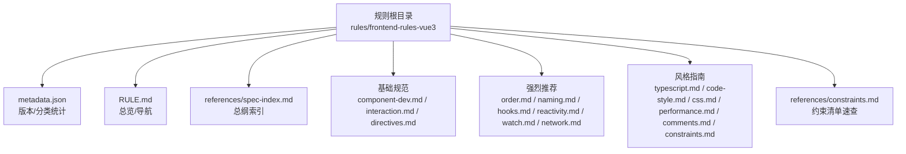
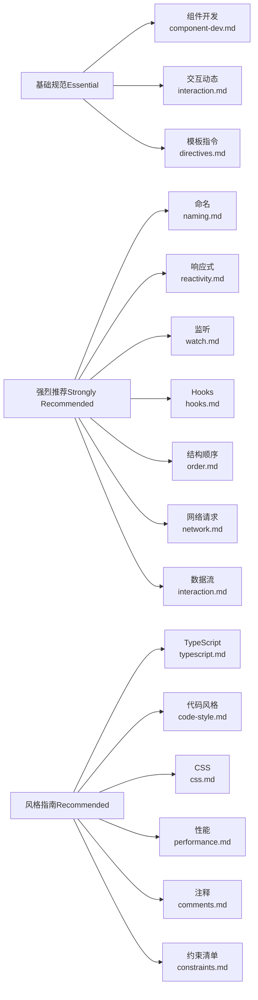
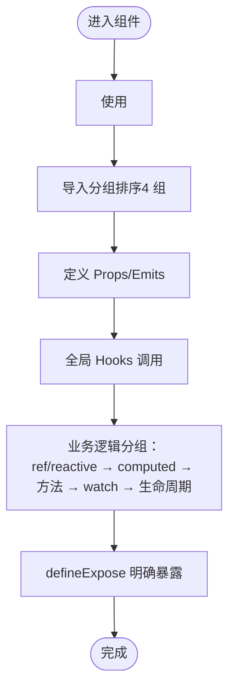
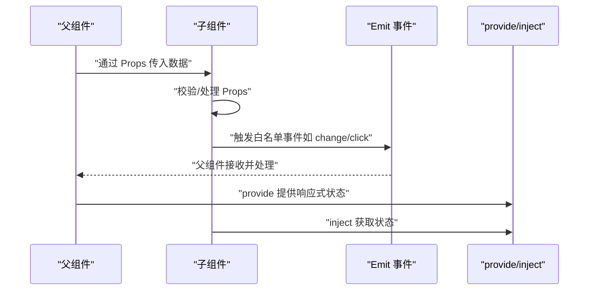
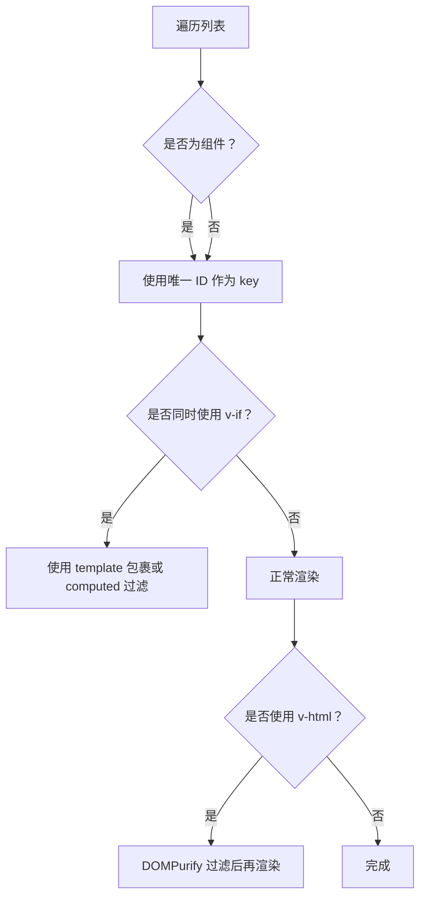
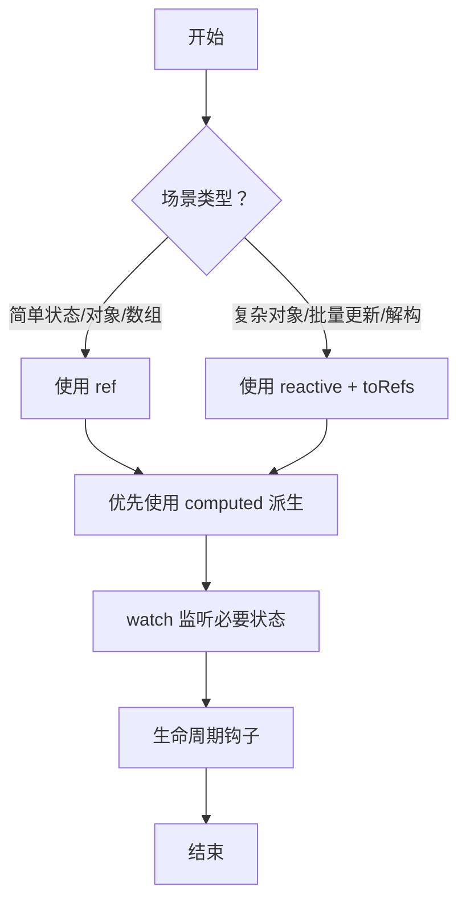
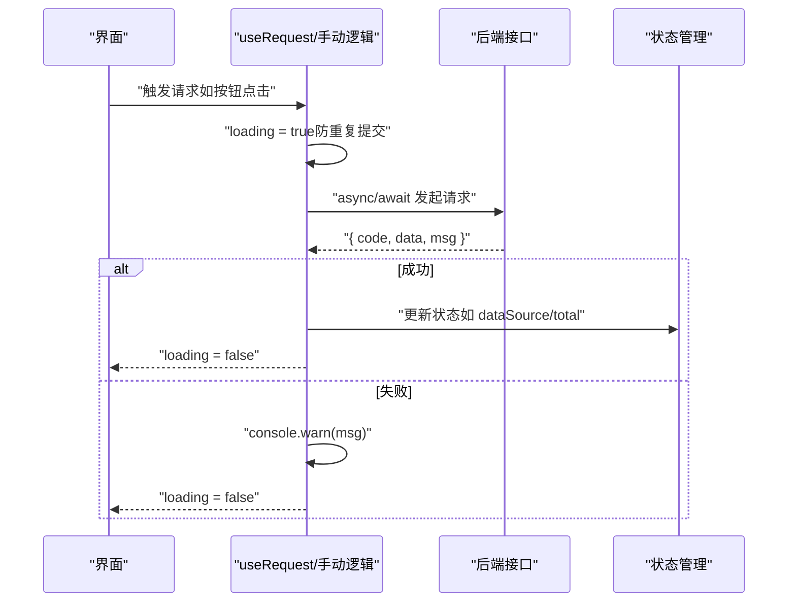
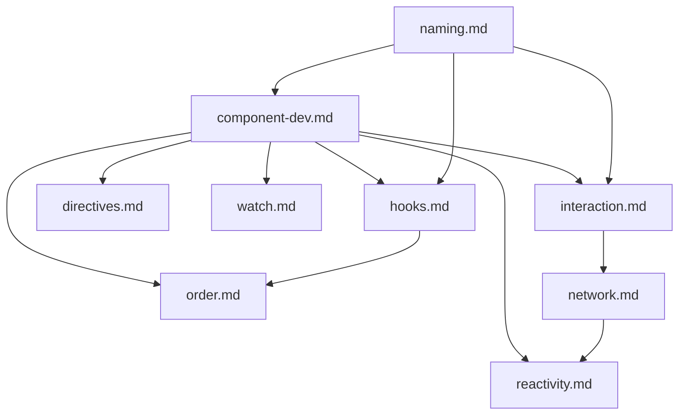

# Vue3 开发规则

<cite>
**本文引用的文件**
- [RULE.md](file://rules/frontend-rules-vue3/RULE.md)
- [metadata.json](file://rules/frontend-rules-vue3/metadata.json)
- [spec-index.md](file://rules/frontend-rules-vue3/references/spec-index.md)
- [component-dev.md](file://rules/frontend-rules-vue3/references/component-dev.md)
- [interaction.md](file://rules/frontend-rules-vue3/references/interaction.md)
- [directives.md](file://rules/frontend-rules-vue3/references/directives.md)
- [naming.md](file://rules/frontend-rules-vue3/references/naming.md)
- [reactivity.md](file://rules/frontend-rules-vue3/references/reactivity.md)
- [watch.md](file://rules/frontend-rules-vue3/references/watch.md)
- [hooks.md](file://rules/frontend-rules-vue3/references/hooks.md)
- [order.md](file://rules/frontend-rules-vue3/references/order.md)
- [network.md](file://rules/frontend-rules-vue3/references/network.md)
- [constraints.md](file://rules/frontend-rules-vue3/references/constraints.md)
- [best-practice.md](file://skills/yy-frontend-vue3-review/references/best-practice.md)
- [absolute-prohibitions.md](file://skills/yy-frontend-vue3-review/references/absolute-prohibitions.md)
</cite>

## 目录
1. [简介](#简介)
2. [项目结构](#项目结构)
3. [核心组件](#核心组件)
4. [架构总览](#架构总览)
5. [详细组件分析](#详细组件分析)
6. [依赖关系分析](#依赖关系分析)
7. [性能考量](#性能考量)
8. [故障排查指南](#故障排查指南)
9. [结论](#结论)
10. [附录](#附录)

## 简介
本文件系统化梳理 Vue3 前端开发规则，依据“基础规范（Essential）—强烈推荐（Strongly Recommended）—风格指南（Recommended）”三层优先级组织，覆盖组件开发、交互动态、模板指令、命名、响应式状态、Hooks、结构顺序、网络请求、约束清单、TypeScript、代码风格、CSS 角色、性能优化与注释规范。文档提供规则索引、应用场景、最佳实践与冲突解决机制，帮助团队在 Vue3 项目中达成一致性与高质量。

## 项目结构
规则体系以模块化方式组织，主入口文件汇总各子模块链接与快速导航，元数据文件给出版本、标签与分类统计。核心模块分布如下：
- 基础规范（Essential）：组件开发、交互动态、模板指令
- 强烈推荐（Strongly Recommended）：命名、响应式、监听、Hooks、结构顺序、网络请求、数据流
- 风格指南（Recommended）：TypeScript、代码风格、CSS、性能、注释、约束清单

图表来源
- [RULE.md:1-68](file://rules/frontend-rules-vue3/RULE.md#L1-L68)
- [metadata.json:1-17](file://rules/frontend-rules-vue3/metadata.json#L1-L17)
- [spec-index.md:1-60](file://rules/frontend-rules-vue3/references/spec-index.md#L1-L60)

章节来源
- [RULE.md:1-68](file://rules/frontend-rules-vue3/RULE.md#L1-L68)
- [metadata.json:1-17](file://rules/frontend-rules-vue3/metadata.json#L1-L17)

## 核心组件
- 基础规范（Essential）
  - 组件开发：强制使用 `<script setup>`，脚本结构顺序，模板元素特性顺序，插槽风格，方法职责与页面拆分，defineExpose。
  - 交互动态：Props 定义与类型注解、v-model 兼容写法、Emit 事件白名单与顺序、defineExpose、provide/inject、禁止 $parent/$children。
  - 模板指令：v-for 与 key、v-if 与 v-for 冲突、v-html 安全、指令简写、模板属性顺序。
- 强烈推荐（Strongly Recommended）
  - 命名：文件/组件/API/事件/常量/布尔值/Hooks（Props/Emit 详见交互动态）。
  - 响应式：ref/reactive/computed 选择与转换、computed 规范、try/catch 包裹。
  - 监听：watch/watchEffect 使用规范、清理资源、与 computed 选择策略。
  - Hooks：命名/返回值/抽离建议、使用规范、导入顺序。
  - 结构顺序：SFC 块顺序、4 组 import 排序、`<script setup>` 内部 5 段结构。
  - 网络请求：async/await、统一响应解构、错误处理、防重复提交。
  - 数据流：provide/inject、兄弟组件通信、响应式传递。
- 风格指南（Recommended）
  - TypeScript：禁用 any/as any/@ts-ignore、类型注解规范、import type。
  - 代码风格：Prettier 配置、箭头函数优先。
  - CSS：BEM 命名、scoped 优先、全局样式标注。
  - 性能：懒加载、KeepAlive、虚拟滚动、防抖节流、图片优化。
  - 注释：模板/脚本/样式注释格式、注释保护原则。
  - 约束清单：10 项禁止、5 项推荐、2 项不推荐、注意事项。

章节来源
- [spec-index.md:9-56](file://rules/frontend-rules-vue3/references/spec-index.md#L9-L56)
- [component-dev.md:1-81](file://rules/frontend-rules-vue3/references/component-dev.md#L1-L81)
- [interaction.md:1-125](file://rules/frontend-rules-vue3/references/interaction.md#L1-L125)
- [directives.md:1-105](file://rules/frontend-rules-vue3/references/directives.md#L1-L105)
- [naming.md:1-85](file://rules/frontend-rules-vue3/references/naming.md#L1-L85)
- [reactivity.md:1-227](file://rules/frontend-rules-vue3/references/reactivity.md#L1-L227)
- [watch.md:1-154](file://rules/frontend-rules-vue3/references/watch.md#L1-L154)
- [hooks.md:1-158](file://rules/frontend-rules-vue3/references/hooks.md#L1-L158)
- [order.md:1-141](file://rules/frontend-rules-vue3/references/order.md#L1-L141)
- [network.md:1-363](file://rules/frontend-rules-vue3/references/network.md#L1-L363)
- [constraints.md:1-45](file://rules/frontend-rules-vue3/references/constraints.md#L1-L45)

## 架构总览
三层优先级规则的组织与映射关系如下：

图表来源
- [metadata.json:7-16](file://rules/frontend-rules-vue3/metadata.json#L7-L16)
- [RULE.md:24-46](file://rules/frontend-rules-vue3/RULE.md#L24-L46)

## 详细组件分析

### 组件开发规范（component-dev.md）
- 强制使用 `<script setup>`，禁止 Options API 与 `this`。
- `<script setup>` 内部顺序：imports → defineProps/defineEmits → Hooks → 业务逻辑（ref/reactive/computed/方法/watch/生命周期）→ defineExpose。
- 模板元素特性顺序：is → v-for → v-if/else → v-show → id → props/attrs → v-on → v-html → v-slot。
- 插槽风格：使用动态风格（如 v-slot:[name]），禁止静态默认插槽。
- 方法职责单一、超长拆分；页面超 300 行建议拆分子组件。
- defineExpose 明确声明对外属性/方法，避免滥用。

图表来源
- [component-dev.md:13-24](file://rules/frontend-rules-vue3/references/component-dev.md#L13-L24)
- [order.md:15-32](file://rules/frontend-rules-vue3/references/order.md#L15-L32)

章节来源
- [component-dev.md:1-81](file://rules/frontend-rules-vue3/references/component-dev.md#L1-L81)
- [order.md:1-141](file://rules/frontend-rules-vue3/references/order.md#L1-L141)

### 交互动态规范（interaction.md）
- Props 定义：TS 类型注解、对象形式（required/default/validator）、camelCase 命名、必须注释说明。
- v-model 写法：Vue 3 标准（modelValue/update:modelValue）与 Ant Design Vue 风格（value/update:value）。
- Emit 事件白名单（19 种）：v-model 更新、交互类、弹窗类、操作类等；事件触发顺序优先级明确。
- defineExpose：仅暴露父组件必须调用的方法，避免暴露内部状态。
- 组件间通信：provide/inject 用于深层传参；兄弟组件通信使用 Pinia/Vuex；禁止 $parent/$children。

图表来源
- [interaction.md:7-125](file://rules/frontend-rules-vue3/references/interaction.md#L7-L125)

章节来源
- [interaction.md:1-125](file://rules/frontend-rules-vue3/references/interaction.md#L1-L125)

### 模板指令规范（directives.md）
- v-for 与 key：组件上必须使用 key，且必须是唯一 ID，禁止使用 index。
- v-if 与 v-for 冲突：禁止在同一元素上同时使用，推荐使用 template 包裹或 computed 预过滤。
- v-html 安全：必须用 DOMPurify 过滤 HTML，防止 XSS。
- 指令简写：v-bind → :、v-on → @、v-slot → #。
- 模板属性顺序：is → v-for → v-if/else → v-show → id → props/attrs → v-on → v-html → v-slot。

图表来源
- [directives.md:7-98](file://rules/frontend-rules-vue3/references/directives.md#L7-L98)

章节来源
- [directives.md:1-105](file://rules/frontend-rules-vue3/references/directives.md#L1-L105)

### 命名规范（naming.md）
- 文件与组件：组件文件多单词 + PascalCase；目录 kebab-case；组件使用 PascalCase。
- 函数命名：API 函数（api + Method + URLPath，小驼峰）；事件函数（on + EventName，小驼峰）。
- 变量与常量：常量全大写+下划线；Props camelCase；emit 事件 camelCase；布尔值 isXX/hasXX/showXX 前缀；变量/方法有意义命名。
- Hooks：必须以 use 开头；文件与函数名一致；全局放 @src/hooks/，局部放 ./hooks/useXxx.ts。
- TypeScript 类型：I + PascalCase；泛型参数单字母大写。
- CSS：BEM 命名（块/元素/修饰符），全小写、横线连接、类名唯一。

章节来源
- [naming.md:1-85](file://rules/frontend-rules-vue3/references/naming.md#L1-L85)

### 响应式状态规范（reactivity.md）
- 选择原则：优先使用 ref，尽可能少用 reactive；复杂对象/批量更新/解构场景使用 reactive。
- Reactive 转 Ref：简单状态、对象/数组数据、分页参数等场景转换为 ref；禁止直接返回 reactive 对象，必须 toRefs 解构。
- computed 规范：优先使用 computed 替代 watch 中的派生逻辑；命名使用 is/has/visible 或有意义名称；防御性 try/catch 包裹。
- 代码组织：ref/reactive → computed → 方法 → watch → 生命周期钩子。

图表来源
- [reactivity.md:7-227](file://rules/frontend-rules-vue3/references/reactivity.md#L7-L227)

章节来源
- [reactivity.md:1-227](file://rules/frontend-rules-vue3/references/reactivity.md#L1-L227)

### 监听规范（watch.md）
- 基本规则：深度监听（对象/数组）必须声明 deep: true；初始化需触发时加 immediate: true；清理定时器/事件监听。
- watch 与 watchEffect：watch 显式依赖、可获取新旧值、惰性执行；watchEffect 自动追踪、立即执行、适合简单副作用。
- 与 computed 选择：优先使用 computed 替代 watch 中的派生逻辑。
- 清理资源：定时器/事件监听在组件销毁时清理；onBeforeUnmount 中统一清理。

章节来源
- [watch.md:1-154](file://rules/frontend-rules-vue3/references/watch.md#L1-L154)

### Hooks 规范（hooks.md）
- 命名与文件组织：use 开头，文件名与函数名一致；全局 @src/hooks/，局部 ./hooks/useXxx.ts。
- 返回值：统一返回对象（推荐 toRefs 解构），禁止直接返回 reactive 对象；禁止将 Hooks 挂载到响应式数据上。
- 使用规范：组件中通过 const { ... } = useXxx() 解构使用；生命周期钩子只能在组件顶层或 setup 中调用；导入顺序见 order.md。
- 抽离建议：可复用逻辑超过 30 行或跨 2+ 组件使用时抽离为 Hook；常见场景：useTable、useSearchForm、useFormValidate、useDialog、useUpload、usePermission。
- Hook 内部注释：JSDoc + @description；内部 ref 与方法注释规范。

章节来源
- [hooks.md:1-158](file://rules/frontend-rules-vue3/references/hooks.md#L1-L158)

### 结构顺序规范（order.md）
- SFC 块顺序：template → script setup → style scoped。
- `<script setup>` 内部顺序：imports（4 组）→ defineProps/defineEmits → 全局 Hooks → 业务逻辑（按功能模块分组：ref/reactive → computed → 方法 → watch → 生命周期）→ defineExpose。
- Import 分组排序（4 组）：node_modules（外部依赖）→ types（类型导入）→ @src/（内部全局）→ ./../（内部相对）；组间空一行，组内按字母顺序排列。
- 模板属性顺序：is → v-for → v-if/else → v-show → id → props/attrs → v-on → v-html → v-slot。

章节来源
- [order.md:1-141](file://rules/frontend-rules-vue3/references/order.md#L1-L141)

### 网络请求规范（network.md）
- 前置检查：是否安装 ahooks-vue/vue-hooks-plus；已安装使用 useRequest（自动管理 loading/data），未安装使用 async/await + try/catch/finally。
- 异步处理：必须使用 async/await；目标结构统一为 { code, data, msg } 解构处理；禁止 .then 链式调用。
- 响应处理：单次解构，禁止连续解构；先判断成功（如 code === 0）再使用 data。
- 错误处理：禁止空 catch；业务错误在 else 分支 console.warn；全局错误捕获配置 errorHandler 并接入 Sentry。
- 防重复提交：useRequest 的 loading 自动控制按钮禁用；未安装时使用互斥锁 loading 防重复提交。
- 安全规范：v-html 必须 DOMPurify 过滤；敏感数据不在 URL 传 token/密码；不 console.log 用户凭证。

图表来源
- [network.md:1-363](file://rules/frontend-rules-vue3/references/network.md#L1-L363)

章节来源
- [network.md:1-363](file://rules/frontend-rules-vue3/references/network.md#L1-L363)

### 约束清单速查（constraints.md）
- 🔴 绝对禁止项（10 项）：连续解构、父改子数据、修改 ref/reactive 类型、修改 props、使用 mixins、无意义命名、使用 this、Options API、v-for 与 v-if 同元素、index 作为 key。
- 🟢 推荐项（5 项）：函数 try/catch、async/await、computed 优先、watch 深度/立即监听、Hooks 抽离。
- 🟡 不推荐项（5 项）：多层 try/catch 嵌套、生命周期 emit、可选链操作符、CSS 原生嵌套、:has() 伪类。
- ⚠️ 注意事项：未使用变量 ESLint 已关闭检查；v-html 需防范 XSS；等于运算符使用 == 不视为问题；注释检查默认忽略；不要过度封装。

章节来源
- [constraints.md:1-45](file://rules/frontend-rules-vue3/references/constraints.md#L1-L45)

### 最佳实践与补充（best-practice.md）
- 调试代码：清理 console.log/debugger；catch 块中的 console.warn 不视为问题。
- 样式规范：BEM 命名 + scoped 作用域；非 scoped 需标注“/* 全局 */”。
- 未使用变量：ESLint 已关闭检查，需自行清理。
- 函数 try/catch：推荐包裹 computed、函数等，catch 中使用 console.warn。
- Hooks 规范：可复用逻辑 >30 行或跨 2+ 组件时抽离；全局 Hooks 放 @src/hooks/，局部放 ./useLocalXxx.ts；必须返回对象（推荐 toRefs），禁止直接返回 reactive 对象；禁止将 Hooks 挂载到响应式数据上。
- 组件懒加载：路由和大组件使用 defineAsyncComponent 动态导入。
- KeepAlive：合理使用 <KeepAlive> 页面缓存。
- 样式区注释格式：模块分组、子模块、响应式三类注释格式。
- CSS 布局推荐：position:relative 搭配 z-index:0 创建定位上下文；优先使用 top/left/right 方向的 padding/margin。
- CSS 兼容性指南：gap/aspect-ratio/100vh/inset/will-change 等属性的兼容性与降级方案。
- 兼容性开发实践：Can I Use 查询兼容性；Autoprefixer + PostCSS 自动前缀；@supports 渐进增强。

章节来源
- [best-practice.md:1-123](file://skills/yy-frontend-vue3-review/references/best-practice.md#L1-L123)

### 绝对禁止项（absolute-prohibitions.md）
- 连续解构、修改子组件数据、修改 ref/reactive 类型、直接修改 props、使用 this、Options API、使用 mixins、多层 try/catch、生命周期 emit、无意义命名、v-for 与 v-if 同元素、index 作为 key。

章节来源
- [absolute-prohibitions.md:1-23](file://skills/yy-frontend-vue3-review/references/absolute-prohibitions.md#L1-L23)

## 依赖关系分析
- 规则耦合与内聚
  - 基础规范与强烈推荐模块高度内聚，共同构成组件开发的“基础设施”：组件开发依赖交互动态与模板指令；响应式与监听为业务逻辑提供状态支撑；Hooks 与结构顺序提升代码可复用性与可读性。
  - 风格指南模块提供统一的代码风格与最佳实践，降低沟通成本。
- 直接与间接依赖
  - 组件开发（component-dev.md）引用 order.md、interaction.md、directives.md、comments.md、reactivity.md、watch.md、hooks.md。
  - 交互动态（interaction.md）与网络请求（network.md）相互补充：前者定义接口契约，后者定义实现细节。
  - 命名规范（naming.md）贯穿所有模块，是风格统一的基础。
- 冲突与循环依赖
  - 规则文件之间无循环依赖，均为单向引用（如 component-dev.md 引用 order.md 等）。
- 外部依赖与集成点
  - DOMPurify 用于 v-html 安全过滤；useRequest（ahooks-vue/vue-hooks-plus）用于自动管理异步状态；Sentry 用于全局错误上报。

图表来源
- [component-dev.md:70-81](file://rules/frontend-rules-vue3/references/component-dev.md#L70-L81)
- [order.md:1-141](file://rules/frontend-rules-vue3/references/order.md#L1-L141)
- [interaction.md:1-125](file://rules/frontend-rules-vue3/references/interaction.md#L1-L125)
- [directives.md:1-105](file://rules/frontend-rules-vue3/references/directives.md#L1-L105)
- [reactivity.md:1-227](file://rules/frontend-rules-vue3/references/reactivity.md#L1-L227)
- [watch.md:1-154](file://rules/frontend-rules-vue3/references/watch.md#L1-L154)
- [hooks.md:1-158](file://rules/frontend-rules-vue3/references/hooks.md#L1-L158)
- [network.md:1-363](file://rules/frontend-rules-vue3/references/network.md#L1-L363)
- [naming.md:1-85](file://rules/frontend-rules-vue3/references/naming.md#L1-L85)

## 性能考量
- 懒加载：路由与大型组件使用 defineAsyncComponent 动态导入。
- KeepAlive：对频繁切换的页面启用缓存，减少重复渲染。
- 虚拟滚动：大数据列表使用虚拟滚动组件，降低 DOM 节点数量。
- 防抖节流：高频事件（搜索、滚动）使用防抖/节流，减少请求与计算压力。
- 图片优化：使用现代格式（WebP）、懒加载、尺寸适配与 CDN 加速。
- 模板层轻量化：模板职责分离、简单逻辑内联，复杂逻辑移入脚本或 Hooks。

章节来源
- [best-practice.md:74-101](file://skills/yy-frontend-vue3-review/references/best-practice.md#L74-L101)
- [network.md:249-335](file://rules/frontend-rules-vue3/references/network.md#L249-L335)

## 故障排查指南
- 常见问题与修复
  - v-for 与 v-if 同元素：改为 template 包裹或使用 computed 过滤。
  - v-html XSS：使用 DOMPurify 过滤后再渲染。
  - 连续解构：改为单次解构，避免 ...data.data。
  - 修改 props：使用 emit 通知父组件更新，而非直接修改。
  - 使用 this：在 <script setup> 中禁止使用 this。
  - Options API：统一迁移到 Composition API（<script setup>）。
  - index 作为 key：必须使用唯一 ID。
  - 多层 try/catch：扁平化异步逻辑，避免嵌套。
  - 生命周期 emit：不推荐在生命周期中主动向外 emit。
  - 可选链操作符：建议使用 lodash get 替代深层可选链。
  - CSS 原生嵌套：需经 PostCSS 编译后使用。
  - :has() 伪类：Safari 15.4-15.6 存在渲染 Bug，谨慎使用。
- 日志与告警
  - catch 块中使用 console.warn 记录错误；业务错误在 else 分支记录。
  - 全局错误捕获配置 errorHandler 并接入 Sentry 上报。

章节来源
- [constraints.md:3-45](file://rules/frontend-rules-vue3/references/constraints.md#L3-L45)
- [absolute-prohibitions.md:7-23](file://skills/yy-frontend-vue3-review/references/absolute-prohibitions.md#L7-L23)
- [network.md:113-147](file://rules/frontend-rules-vue3/references/network.md#L113-L147)

## 结论
本规则体系以“基础规范—强烈推荐—风格指南”三层优先级构建，覆盖 Vue3 组件开发的全生命周期与关键质量维度。通过统一的命名、结构顺序、响应式与 Hooks 规范，以及严格的网络请求与安全约束，能够有效降低耦合度、提升可读性与可维护性。建议团队在项目启动阶段即引入该规则集，并结合 CI/CD 进行自动化检查，持续演进。

## 附录
- 规则优先级处理与冲突解决机制
  - 基础规范（Essential）为强制项，任何违反均视为严重问题，必须立即修复。
  - 强烈推荐（Strongly Recommended）为高价值实践，应尽可能遵守；若与现有代码冲突，优先评估对稳定性与可维护性的收益，再决定迁移策略。
  - 风格指南（Recommended）为风格统一项，团队内部达成共识后严格执行；若与强推规则冲突，以强推为准。
  - 约束清单（constraints.md）提供“禁止/推荐/不推荐/注意事项”的快速参考，作为冲突裁决的依据之一。
  - 绝对禁止项（absolute-prohibitions.md）为红线，不得以任何理由绕过。
- 实施建议
  - 在项目中引入 ESLint/Prettier/TSC 检查，结合本规则进行定制化配置。
  - 将规则纳入代码评审清单，确保每次提交符合规范。
  - 定期回顾与更新规则，结合最佳实践（best-practice.md）持续优化。