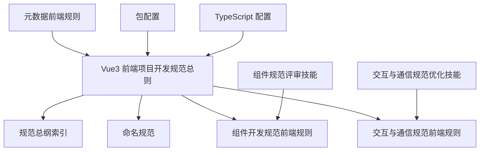
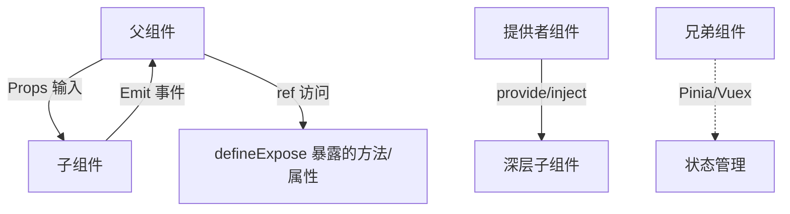
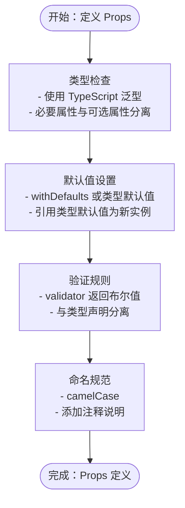
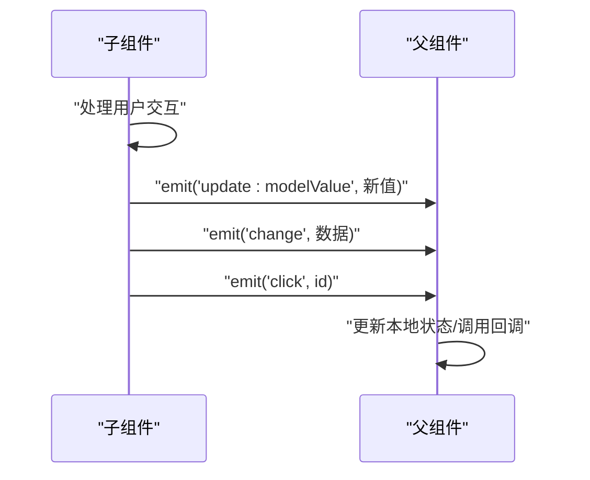
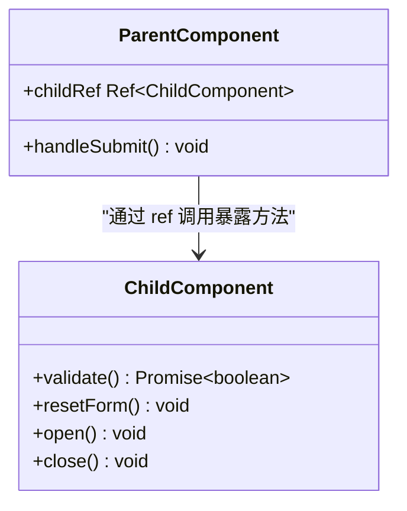
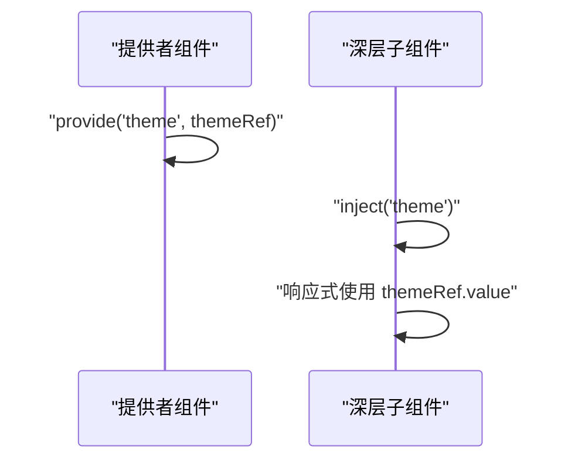
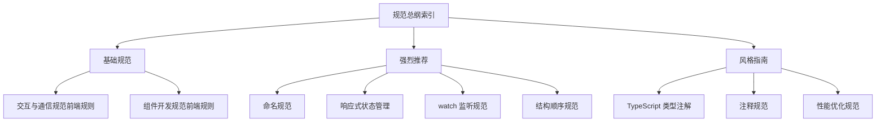

# 交互动态规范

<cite>
**本文档引用的文件**
- [交互与通信规范（前端规则）](file://rules/frontend-rules-vue3/references/interaction.md)
- [组件开发规范（前端规则）](file://rules/frontend-rules-vue3/references/component-dev.md)
- [Vue3 前端项目开发规范（总则）](file://rules/frontend-rules-vue3/RULE.md)
- [交互与通信规范（优化技能）](file://skills/yy-frontend-vue3-code-optimization/rules/interaction.md)
- [组件规范（评审技能）](file://skills/yy-frontend-vue3-review/references/component.md)
- [命名规范](file://rules/frontend-rules-vue3/references/naming.md)
- [规范总纲（索引）](file://rules/frontend-rules-vue3/references/spec-index.md)
- [元数据（前端规则）](file://rules/frontend-rules-vue3/metadata.json)
- [包配置](file://package.json)
- [TypeScript 配置](file://tsconfig.json)
</cite>

## 目录
1. [简介](#简介)
2. [项目结构](#项目结构)
3. [核心组件](#核心组件)
4. [架构概览](#架构概览)
5. [详细组件分析](#详细组件分析)
6. [依赖分析](#依赖分析)
7. [性能考虑](#性能考虑)
8. [故障排除指南](#故障排除指南)
9. [结论](#结论)
10. [附录](#附录)

## 简介
本规范系统阐述 Vue3 组件的交互动态设计与实现准则，聚焦于组件对外接口（Props/Emits/Expose）与组件间通信约定。目标是建立统一的组件交互模式，确保父子通信清晰、事件命名规范、对外暴露可控，并提供合理的组件间数据传递方案。

## 项目结构
本规范由多个相互引用的子模块构成，形成三级优先级体系（基础/强烈推荐/风格指南）。交互与通信相关内容主要分布在以下文件中：

**图表来源**
- [Vue3 前端项目开发规范（总则）:1-68](file://rules/frontend-rules-vue3/RULE.md#L1-L68)
- [交互与通信规范（前端规则）:1-125](file://rules/frontend-rules-vue3/references/interaction.md#L1-L125)
- [组件开发规范（前端规则）:1-81](file://rules/frontend-rules-vue3/references/component-dev.md#L1-L81)
- [命名规范:1-85](file://rules/frontend-rules-vue3/references/naming.md#L1-L85)
- [规范总纲（索引）:1-60](file://rules/frontend-rules-vue3/references/spec-index.md#L1-L60)
- [交互与通信规范（优化技能）:1-125](file://skills/yy-frontend-vue3-code-optimization/rules/interaction.md#L1-L125)
- [组件规范（评审技能）:1-105](file://skills/yy-frontend-vue3-review/references/component.md#L1-L105)
- [元数据（前端规则）:1-17](file://rules/frontend-rules-vue3/metadata.json#L1-L17)
- [包配置:1-46](file://package.json#L1-L46)
- [TypeScript 配置:1-24](file://tsconfig.json#L1-L24)

**章节来源**
- [Vue3 前端项目开发规范（总则）:1-68](file://rules/frontend-rules-vue3/RULE.md#L1-L68)
- [规范总纲（索引）:1-60](file://rules/frontend-rules-vue3/references/spec-index.md#L1-L60)

## 核心组件
本节聚焦组件对外接口与通信的关键要素，包括 Props 定义、Emit 事件白名单、defineExpose 使用规范以及 provide/inject 的正确姿势。

- Props 定义规范
  - 必须使用 `<script setup>` + TypeScript 类型注解
  - 至少指定类型，推荐使用对象形式，包含 required/default/validator
  - 命名采用 camelCase，必须添加注释说明参数含义
  - v-model 支持标准 modelValue 与 Ant Design Vue 风格 value
  - 禁止在子组件内部直接修改 props 值，数据流向为单向（父 -> 子）

- Emit 事件规范
  - 事件白名单：v-model 更新（update:modelValue/update:value）、交互类（change/click/select/expand/input/clear/remove/add）、弹窗类（open/close/show/hide）、操作类（cancel/confirm/ok/editSuccess/error）
  - 事件触发顺序建议：update:modelValue/update:value → 其他业务事件 → change/click
  - 使用 TypeScript 泛型定义明确参数类型

- defineExpose 使用规范
  - 明确声明：必须显式通过 defineExpose 向父组件暴露需要访问的属性或方法
  - 父组件访问：父组件通过 ref 访问子组件暴露的内容
  - 禁止滥用：仅暴露父组件业务必须调用的方法（如表单校验 validate、弹窗开启 open），不应暴露内部状态实现

- 组件间通信
  - provide/inject：仅用于 3 层以上深层组件传参，避免逐层传递 props；兄弟组件通信使用 Pinia/Vuex；响应式传递使用 provide('key', refValue)；谨慎使用全局变量或状态
  - 禁用 $parent/$children：禁止通过 $parent.$parent 链式访问父组件数据；禁止在 <script setup> 中使用 this；原因：组件耦合度高，破坏组件独立性；替代方案：使用 props/emit 或状态管理

**章节来源**
- [交互与通信规范（前端规则）:7-125](file://rules/frontend-rules-vue3/references/interaction.md#L7-L125)
- [交互与通信规范（优化技能）:7-125](file://skills/yy-frontend-vue3-code-optimization/rules/interaction.md#L7-L125)
- [组件开发规范（前端规则）:1-81](file://rules/frontend-rules-vue3/references/component-dev.md#L1-L81)
- [组件规范（评审技能）:52-105](file://skills/yy-frontend-vue3-review/references/component.md#L52-L105)

## 架构概览
下图展示了组件交互与通信的整体架构，强调从父组件到子组件的数据流、事件流以及对外暴露的边界控制。

**图表来源**
- [交互与通信规范（前端规则）:110-125](file://rules/frontend-rules-vue3/references/interaction.md#L110-L125)
- [交互与通信规范（优化技能）:110-125](file://skills/yy-frontend-vue3-code-optimization/rules/interaction.md#L110-L125)

## 详细组件分析

### Props 定义最佳实践
- 类型声明
  - 使用 TypeScript 泛型定义 props，确保类型安全
  - 对于可选属性使用 ? 修饰符，必要属性明确 required
  - 复杂类型建议拆分为独立接口或类型别名，便于复用与维护

- 默认值设置
  - 使用 withDefaults 或在类型定义中直接提供默认值
  - 对于引用类型（数组、对象），默认值应为全新实例，避免共享引用

- 验证规则
  - 使用 validator 函数进行运行时校验，返回布尔值表示是否通过
  - 将验证逻辑与类型声明分离，保持类型定义简洁

- 命名与注释
  - Props 命名采用 camelCase，避免与 HTML 属性冲突
  - 为每个 props 添加清晰的注释说明用途与取值范围

**图表来源**
- [交互与通信规范（前端规则）:9-21](file://rules/frontend-rules-vue3/references/interaction.md#L9-L21)
- [交互与通信规范（优化技能）:9-21](file://skills/yy-frontend-vue3-code-optimization/rules/interaction.md#L9-L21)
- [命名规范:26-35](file://rules/frontend-rules-vue3/references/naming.md#L26-L35)

**章节来源**
- [交互与通信规范（前端规则）:9-21](file://rules/frontend-rules-vue3/references/interaction.md#L9-L21)
- [交互与通信规范（优化技能）:9-21](file://skills/yy-frontend-vue3-code-optimization/rules/interaction.md#L9-L21)
- [命名规范:26-35](file://rules/frontend-rules-vue3/references/naming.md#L26-L35)

### Emit 事件白名单与命名规范
- 事件白名单
  - v-model 更新：update:modelValue（标准）、update:value（Ant Design Vue 风格）
  - 交互类：change、click、select、expand、input、clear、remove、add
  - 弹窗类：open、close、show、hide
  - 操作类：cancel、confirm、ok、editSuccess、error

- 事件命名规范
  - 使用 camelCase 命名，语义化表达交互意图
  - 事件名应简洁明了，避免歧义

- 事件触发顺序
  1) update:modelValue/update:value（绑定值更新）
  2) 其他业务事件
  3) change/click（交互反馈）

**图表来源**
- [交互与通信规范（前端规则）:47-82](file://rules/frontend-rules-vue3/references/interaction.md#L47-L82)
- [交互与通信规范（优化技能）:47-82](file://skills/yy-frontend-vue3-code-optimization/rules/interaction.md#L47-L82)

**章节来源**
- [交互与通信规范（前端规则）:47-82](file://rules/frontend-rules-vue3/references/interaction.md#L47-L82)
- [交互与通信规范（优化技能）:47-82](file://skills/yy-frontend-vue3-code-optimization/rules/interaction.md#L47-L82)

### defineExpose 使用场景与限制
- 使用场景
  - 表单组件：暴露 validate、resetFields 等方法供父组件调用
  - 弹窗组件：暴露 open、close 等方法控制显示状态
  - 工具类组件：暴露通用工具方法（如复制、导出）

- 限制与约束
  - 仅暴露父组件业务必须调用的方法，避免暴露内部状态实现
  - 不要暴露响应式数据本身，应暴露只读视图或受控访问方法
  - 避免暴露私有方法或内部实现细节

- 父组件访问
  - 父组件通过模板 ref 获取子组件实例
  - 通过类型断言确保类型安全

**图表来源**
- [交互与通信规范（前端规则）:86-106](file://rules/frontend-rules-vue3/references/interaction.md#L86-L106)
- [交互与通信规范（优化技能）:86-106](file://skills/yy-frontend-vue3-code-optimization/rules/interaction.md#L86-L106)

**章节来源**
- [交互与通信规范（前端规则）:86-106](file://rules/frontend-rules-vue3/references/interaction.md#L86-L106)
- [交互与通信规范（优化技能）:86-106](file://skills/yy-frontend-vue3-code-optimization/rules/interaction.md#L86-L106)

### provide/inject 正确使用方式
- 使用场景
  - 3 层以上深层组件传参，避免逐层传递 props
  - 需要在多处共享的状态或服务（如主题、语言、用户信息）

- 正确做法
  - 使用 provide('key', refValue) 保持响应式传递
  - 在 inject 中使用相同的 key 进行接收
  - 为 provide 的值提供默认值，避免 undefined

- 与状态管理的关系
  - 兄弟组件通信使用 Pinia/Vuex，避免通过 provide/inject 跨层级滥用
  - 谨慎使用全局变量或状态，避免造成难以追踪的副作用

**图表来源**
- [交互与通信规范（前端规则）:110-118](file://rules/frontend-rules-vue3/references/interaction.md#L110-L118)
- [交互与通信规范（优化技能）:110-118](file://skills/yy-frontend-vue3-code-optimization/rules/interaction.md#L110-L118)

**章节来源**
- [交互与通信规范（前端规则）:110-118](file://rules/frontend-rules-vue3/references/interaction.md#L110-L118)
- [交互与通信规范（优化技能）:110-118](file://skills/yy-frontend-vue3-code-optimization/rules/interaction.md#L110-L118)

### 为什么应该避免使用 $parent/$children
- 禁止原因
  - 组件耦合度高，破坏组件独立性
  - 链式访问父组件数据增加维护成本
  - 在 <script setup> 中禁止使用 this

- 替代方案
  - 使用 props/emit 实现父子通信
  - 使用状态管理（Pinia/Vuex）实现跨层级通信
  - 使用 provide/inject 实现跨层级依赖注入

**章节来源**
- [交互与通信规范（前端规则）:119-125](file://rules/frontend-rules-vue3/references/interaction.md#L119-L125)
- [交互与通信规范（优化技能）:119-125](file://skills/yy-frontend-vue3-code-optimization/rules/interaction.md#L119-L125)

## 依赖分析
本规范的依赖关系主要体现在模块间的引用与继承关系上，形成统一的开发约束体系。

**图表来源**
- [规范总纲（索引）:1-60](file://rules/frontend-rules-vue3/references/spec-index.md#L1-L60)
- [Vue3 前端项目开发规范（总则）:24-68](file://rules/frontend-rules-vue3/RULE.md#L24-L68)

**章节来源**
- [规范总纲（索引）:1-60](file://rules/frontend-rules-vue3/references/spec-index.md#L1-L60)
- [Vue3 前端项目开发规范（总则）:24-68](file://rules/frontend-rules-vue3/RULE.md#L24-L68)

## 性能考虑
- Props 传递
  - 避免传递大型对象或深度嵌套数据，优先传递必要字段
  - 对于复杂对象使用浅拷贝或不可变数据结构

- Emit 事件
  - 控制事件触发频率，避免高频事件导致的重渲染
  - 使用防抖/节流处理高频交互事件

- defineExpose
  - 仅暴露必要的方法，避免暴露大量内部状态
  - 对暴露的方法进行性能优化，避免阻塞主线程

- provide/inject
  - 使用 ref 进行响应式传递，避免不必要的深拷贝
  - 合理使用 provide/inject 的粒度，避免过度共享

## 故障排除指南
- Props 修改异常
  - 症状：子组件内部修改 props 导致父组件状态异常
  - 处理：改为通过 emit 事件通知父组件更新状态

- 事件命名不规范
  - 症状：事件名不符合白名单或语义不清
  - 处理：遵循 camelCase 命名规范，使用白名单内的事件名

- defineExpose 滥用
  - 症状：暴露过多内部状态或方法
  - 处理：仅暴露父组件业务必须调用的方法，提供受控访问接口

- provide/inject 响应式丢失
  - 症状：深层组件无法响应状态变化
  - 处理：使用 ref 进行响应式传递，确保类型一致

**章节来源**
- [交互与通信规范（前端规则）:40-44](file://rules/frontend-rules-vue3/references/interaction.md#L40-L44)
- [交互与通信规范（前端规则）:119-125](file://rules/frontend-rules-vue3/references/interaction.md#L119-L125)

## 结论
本规范为 Vue3 组件的交互动态设计提供了系统性的指导原则。通过严格的 Props 定义、规范的 Emit 事件白名单、受控的 defineExpose 使用以及合理的 provide/inject 应用，可以有效提升组件的可维护性、可测试性和可扩展性。建议在实际开发中严格遵循这些规范，并根据具体场景灵活应用。

## 附录
- 相关模块引用
  - 组件开发规范：[组件开发规范（前端规则）:1-81](file://rules/frontend-rules-vue3/references/component-dev.md#L1-L81)
  - 命名规范：[命名规范:1-85](file://rules/frontend-rules-vue3/references/naming.md#L1-L85)
  - 规范总纲：[规范总纲（索引）:1-60](file://rules/frontend-rules-vue3/references/spec-index.md#L1-L60)

- 版本信息
  - 元数据版本：2.0.0（发布日期：May 2026）
  - 适用范围：所有 src 目录下的 .vue/.ts/.js/.css/.scss/.less 文件

**章节来源**
- [元数据（前端规则）:1-17](file://rules/frontend-rules-vue3/metadata.json#L1-L17)
- [包配置:1-46](file://package.json#L1-L46)
- [TypeScript 配置:1-24](file://tsconfig.json#L1-L24)