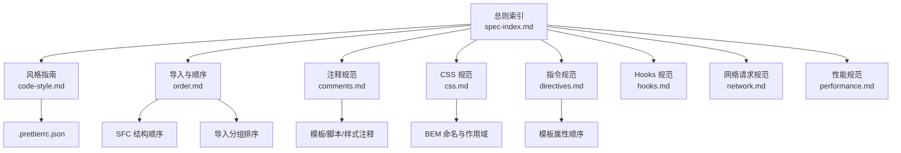
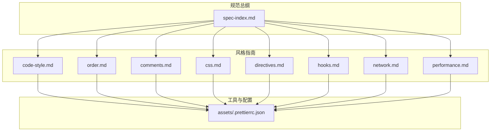
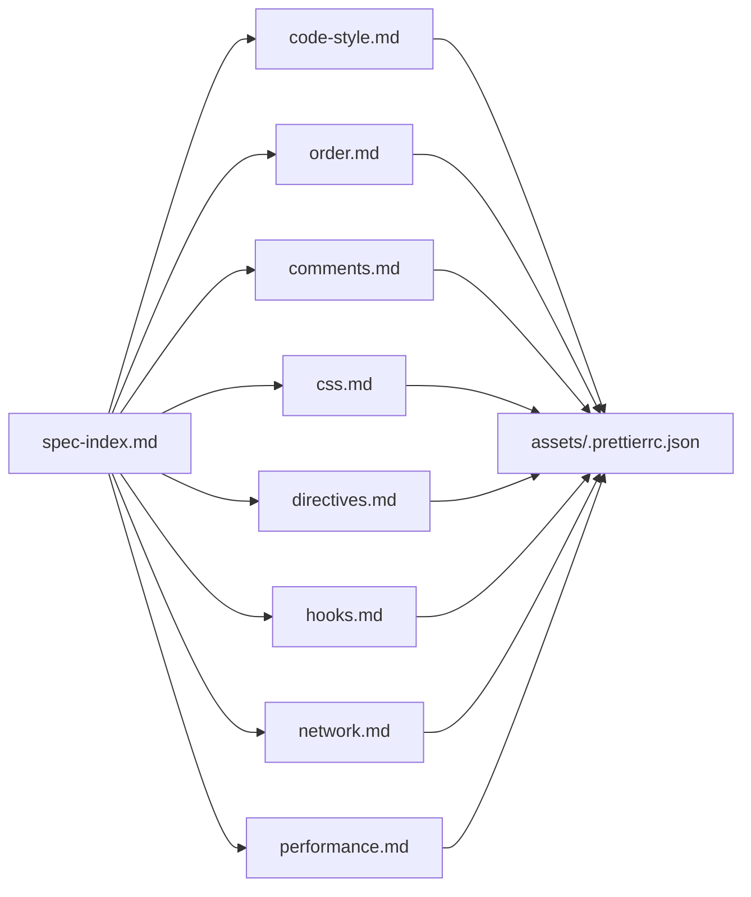

# 代码风格规范

<cite>
**本文引用的文件**
- [.prettierrc.json](file://rules/frontend-rules-vue3/assets/.prettierrc.json)
- [RULE.md](file://rules/frontend-rules-vue3/RULE.md)
- [metadata.json](file://rules/frontend-rules-vue3/metadata.json)
- [code-style.md](file://rules/frontend-rules-vue3/references/code-style.md)
- [order.md](file://rules/frontend-rules-vue3/references/order.md)
- [comments.md](file://rules/frontend-rules-vue3/references/comments.md)
- [css.md](file://rules/frontend-rules-vue3/references/css.md)
- [spec-index.md](file://rules/frontend-rules-vue3/references/spec-index.md)
- [reactivity.md](file://rules/frontend-rules-vue3/references/reactivity.md)
- [directives.md](file://rules/frontend-rules-vue3/references/directives.md)
- [hooks.md](file://rules/frontend-rules-vue3/references/hooks.md)
- [network.md](file://rules/frontend-rules-vue3/references/network.md)
- [performance.md](file://rules/frontend-rules-vue3/references/performance.md)
</cite>

## 目录
1. [简介](#简介)
2. [项目结构](#项目结构)
3. [核心组件](#核心组件)
4. [架构总览](#架构总览)
5. [详细组件分析](#详细组件分析)
6. [依赖关系分析](#依赖关系分析)
7. [性能考量](#性能考量)
8. [故障排查指南](#故障排查指南)
9. [结论](#结论)
10. [附录](#附录)

## 简介
本文件面向 Vue3 前端工程，系统化阐述“代码风格与格式化”规范，并详解 Prettier 配置如何落地到实际开发中。重点包括：
- Prettier 配置项与默认值的取舍原则
- 箭头函数优先使用的策略与例外场景
- 缩进、空行、注释等格式化细节
- 不同代码片段（SFC 结构、导入分组、模板属性、注释与样式）的风格统一标准
- 符合规范的示例与常见风格问题的修正思路

## 项目结构
该规范由“总则 + 子模块”构成，其中“代码风格与 Prettier 配置”位于“风格指南（Recommended）”类别下，配套有 Prettier 配置文件与若干参考模块（导入顺序、注释、CSS、指令、Hooks、网络、性能等）。

图表来源
- [spec-index.md:1-60](file://rules/frontend-rules-vue3/references/spec-index.md#L1-L60)
- [code-style.md:1-61](file://rules/frontend-rules-vue3/references/code-style.md#L1-L61)
- [order.md:1-141](file://rules/frontend-rules-vue3/references/order.md#L1-L141)
- [comments.md:1-83](file://rules/frontend-rules-vue3/references/comments.md#L1-L83)
- [css.md:1-67](file://rules/frontend-rules-vue3/references/css.md#L1-L67)
- [directives.md:1-105](file://rules/frontend-rules-vue3/references/directives.md#L1-L105)
- [hooks.md:1-158](file://rules/frontend-rules-vue3/references/hooks.md#L1-L158)
- [network.md:1-363](file://rules/frontend-rules-vue3/references/network.md#L1-L363)
- [performance.md:1-136](file://rules/frontend-rules-vue3/references/performance.md#L1-L136)
- [.prettierrc.json:1-20](file://rules/frontend-rules-vue3/assets/.prettierrc.json#L1-L20)

章节来源
- [RULE.md:1-68](file://rules/frontend-rules-vue3/RULE.md#L1-L68)
- [metadata.json:1-17](file://rules/frontend-rules-vue3/metadata.json#L1-L17)

## 核心组件
- Prettier 配置与格式化执行
  - 通过仓库内置的 Prettier 配置文件统一格式化规则，确保团队在缩进、引号、分号、行宽、尾随逗号、箭头函数括号等方面保持一致。
  - 关键点：2 空格缩进、单引号、分号、120 字符行长、尾随逗号“all”、箭头函数单参可省略括号、HTML 属性双引号、严格空白敏感等。
- 函数写法偏好
  - 优先使用箭头函数（const fn = () => {}），避免 function 声明，提升一致性与词法 this 稳定性。
  - 例外场景：需要显式绑定 this 的构造函数或需使用 arguments 的场景（如需透传实参的高阶函数），可保留 function，但需在团队评审中说明理由。

章节来源
- [code-style.md:1-61](file://rules/frontend-rules-vue3/references/code-style.md#L1-L61)
- [.prettierrc.json:1-20](file://rules/frontend-rules-vue3/assets/.prettierrc.json#L1-L20)

## 架构总览
下图展示了“代码风格规范”的落地路径：从总则索引出发，映射到风格指南、导入顺序、注释、CSS、指令、Hooks、网络与性能等模块，并最终由 Prettier 配置文件驱动格式化执行。

图表来源
- [spec-index.md:1-60](file://rules/frontend-rules-vue3/references/spec-index.md#L1-L60)
- [code-style.md:1-61](file://rules/frontend-rules-vue3/references/code-style.md#L1-L61)
- [order.md:1-141](file://rules/frontend-rules-vue3/references/order.md#L1-L141)
- [comments.md:1-83](file://rules/frontend-rules-vue3/references/comments.md#L1-L83)
- [css.md:1-67](file://rules/frontend-rules-vue3/references/css.md#L1-L67)
- [directives.md:1-105](file://rules/frontend-rules-vue3/references/directives.md#L1-L105)
- [hooks.md:1-158](file://rules/frontend-rules-vue3/references/hooks.md#L1-L158)
- [network.md:1-363](file://rules/frontend-rules-vue3/references/network.md#L1-L363)
- [performance.md:1-136](file://rules/frontend-rules-vue3/references/performance.md#L1-L136)
- [.prettierrc.json:1-20](file://rules/frontend-rules-vue3/assets/.prettierrc.json#L1-L20)

## 详细组件分析

### Prettier 配置与集成
- 配置文件位置与用途
  - 配置文件位于 rules/frontend-rules-vue3/assets/.prettierrc.json，用于统一 JS/TS/JSX/Vue 模板的格式化行为。
- 关键规则与取舍
  - 缩进：2 空格（tabWidth: 2）
  - 引号：JS/TS 使用单引号（singleQuote: true），JSX 属性使用单引号（jsxSingleQuote: true），Vue 模板属性使用双引号（vueHtmlAttributes: "double"）
  - 分号：语句末尾必须有分号（semi: true）
  - 行宽：120 字符（printWidth: 120）
  - 尾随逗号：多行对象/数组末尾加逗号（trailingComma: "all"）
  - 箭头函数：单参数可省略括号（arrowParens: "avoid"）
  - 对象括号：保留空格（bracketSpacing: true），括号不与内容同行（bracketSameLine: false）
  - HTML 空白敏感：严格处理（htmlWhitespaceSensitivity: "strict"）
  - 文档散文换行：从不换行（proseWrap: "never"）
  - Vue 脚本/样式缩进：不额外缩进（vueIndentScriptAndStyle: false）
- 集成方式
  - 在本地开发与 CI 中统一使用 Prettier 执行格式化，确保提交前与合并前的代码风格一致。
  - 与编辑器（VS Code 等）集成，保存即格式化，避免风格分歧。

章节来源
- [.prettierrc.json:1-20](file://rules/frontend-rules-vue3/assets/.prettierrc.json#L1-L20)
- [code-style.md:5-28](file://rules/frontend-rules-vue3/references/code-style.md#L5-L28)

### 箭头函数优先与传统函数使用场景
- 优先原则
  - 统一使用 const fn = () => {} 的箭头函数写法，避免 function 声明，提升一致性与词法 this 稳定性。
- 例外场景
  - 需要显式绑定 this 的构造函数或需使用 arguments 的场景（如需透传实参的高阶函数），可保留 function，但需在评审中说明理由。
- 与响应式与 Hooks 的协同
  - 在 ref/reactive/computed 的使用中，优先采用 computed 与箭头函数派生状态，减少副作用与 watch 滥用。

章节来源
- [code-style.md:51-61](file://rules/frontend-rules-vue3/references/code-style.md#L51-L61)
- [reactivity.md:132-200](file://rules/frontend-rules-vue3/references/reactivity.md#L132-L200)

### 缩进、空行与注释格式化要求
- 缩进与空行
  - 统一 2 空格缩进；导入分组之间空一行；脚本内部按功能模块分组，组内遵循 ref/reactive → computed → 方法 → watch → 生命周期钩子的顺序。
- 注释规范
  - 模板区：根节点、循环、条件分支、关键区块、插槽节点均使用统一注释格式。
  - 脚本区：顶部 JSDoc 记录改动时间与内容；props/ref/reactive/computed/watch/函数/组件/Hook 等均按规范添加注释。
  - 样式区：模块分组、子模块、响应式、全局样式等使用统一注释格式。
  - 注释保护原则：逻辑变更时注释必须同步更新；正确注释只增不改，仅在三种情况下允许修改。

章节来源
- [order.md:15-36](file://rules/frontend-rules-vue3/references/order.md#L15-L36)
- [comments.md:1-83](file://rules/frontend-rules-vue3/references/comments.md#L1-L83)

### 不同代码片段的风格统一标准
- SFC 结构顺序
  - 模板 → script setup → style scoped 的块顺序固定。
- 导入分组与排序
  - 四组导入：node_modules → types → @src 全局 → ./ ../ 相对路径；组间空一行，组内按字母顺序排列。
- 模板属性顺序
  - 定义（is）→ v-for → v-if/v-else-if/v-else → v-show → id → props/attrs → v-on → v-html/v-text → 动态 v-slot。
- 注释与样式
  - 模块分组、子模块、响应式、全局样式等使用统一注释格式；优先使用 scoped，必要时标注“全局”。

章节来源
- [order.md:7-141](file://rules/frontend-rules-vue3/references/order.md#L7-L141)
- [directives.md:80-99](file://rules/frontend-rules-vue3/references/directives.md#L80-L99)
- [css.md:9-32](file://rules/frontend-rules-vue3/references/css.md#L9-L32)
- [comments.md:7-67](file://rules/frontend-rules-vue3/references/comments.md#L7-L67)

### 具体示例与常见问题修正
- 示例路径（请参考以下文件路径以获取符合规范的示例）
  - SFC 结构与导入分组示例：[示例片段:37-88](file://rules/frontend-rules-vue3/references/order.md#L37-L88)
  - 模板属性顺序示例：[示例片段:94-98](file://rules/frontend-rules-vue3/references/directives.md#L94-L98)
  - 注释规范示例（脚本顶部 JSDoc）：[示例片段:37-55](file://rules/frontend-rules-vue3/references/comments.md#L37-L55)
  - CSS 注释与作用域示例：[示例片段:11-23](file://rules/frontend-rules-vue3/references/css.md#L11-L23)
- 常见风格问题与修正思路
  - 未遵循 Prettier 配置：统一使用配置文件执行格式化，确保缩进、引号、分号、行宽、尾随逗号、箭头函数括号等一致。
  - 导入顺序混乱：按四组分组与字母顺序重排，组间空一行。
  - 模板属性顺序不统一：按 is → v-for → v-if/else → v-show → id → props → v-on → v-html → v-slot 顺序调整。
  - 注释缺失或过时：按注释保护原则补充或更新注释，确保与代码行为一致。

章节来源
- [order.md:92-141](file://rules/frontend-rules-vue3/references/order.md#L92-L141)
- [directives.md:80-105](file://rules/frontend-rules-vue3/references/directives.md#L80-L105)
- [comments.md:33-83](file://rules/frontend-rules-vue3/references/comments.md#L33-L83)
- [css.md:9-32](file://rules/frontend-rules-vue3/references/css.md#L9-L32)

## 依赖关系分析
- 规范之间的耦合与协作
  - 总则索引（spec-index.md）将“风格指南（code-style.md）”与其他模块（导入顺序、注释、CSS、指令、Hooks、网络、性能）串联，形成闭环。
  - Prettier 配置文件（.prettierrc.json）是风格落地的基础设施，被所有模块共同依赖。
- 外部依赖与集成点
  - 编辑器与 CI：统一使用 Prettier 执行格式化，保障提交质量。
  - 与 ESLint/TS 的协同：在 TS/JS/JSX/Vue 文件中，Prettier 负责格式化，ESLint/TS 负责语法与类型检查，二者互补。

图表来源
- [spec-index.md:1-60](file://rules/frontend-rules-vue3/references/spec-index.md#L1-L60)
- [code-style.md:1-61](file://rules/frontend-rules-vue3/references/code-style.md#L1-L61)
- [order.md:1-141](file://rules/frontend-rules-vue3/references/order.md#L1-L141)
- [comments.md:1-83](file://rules/frontend-rules-vue3/references/comments.md#L1-L83)
- [css.md:1-67](file://rules/frontend-rules-vue3/references/css.md#L1-L67)
- [directives.md:1-105](file://rules/frontend-rules-vue3/references/directives.md#L1-L105)
- [hooks.md:1-158](file://rules/frontend-rules-vue3/references/hooks.md#L1-L158)
- [network.md:1-363](file://rules/frontend-rules-vue3/references/network.md#L1-L363)
- [performance.md:1-136](file://rules/frontend-rules-vue3/references/performance.md#L1-L136)
- [.prettierrc.json:1-20](file://rules/frontend-rules-vue3/assets/.prettierrc.json#L1-L20)

## 性能考量
- 与风格的关系
  - 统一的风格有助于减少不必要的渲染与计算：例如将复杂逻辑移至 computed，避免在模板中执行昂贵计算；使用防抖/节流优化高频事件；合理使用 KeepAlive 与虚拟滚动。
- 实践建议
  - 在保证可读性的前提下，尽量缩短单行长度（结合 printWidth=120），减少不必要的嵌套与多层解构。
  - 使用 computed 与 shallowRef 等工具降低响应式开销。

章节来源
- [performance.md:53-112](file://rules/frontend-rules-vue3/references/performance.md#L53-L112)
- [reactivity.md:132-200](file://rules/frontend-rules-vue3/references/reactivity.md#L132-L200)

## 故障排查指南
- Prettier 格式化结果与预期不符
  - 检查 .prettierrc.json 是否被正确读取；确认编辑器/CI 使用的是同一版本的 Prettier。
- 导入顺序被破坏
  - 按四组分组与字母顺序重排，组间空一行；必要时借助自动化工具（如 ESLint 插件）辅助排序。
- 注释与代码不一致
  - 按注释保护原则更新注释；若注释正确但不够详细，应追加而非覆盖。
- 模板属性顺序不统一
  - 按 is → v-for → v-if/else → v-show → id → props → v-on → v-html → v-slot 顺序调整。

章节来源
- [.prettierrc.json:1-20](file://rules/frontend-rules-vue3/assets/.prettierrc.json#L1-L20)
- [order.md:92-141](file://rules/frontend-rules-vue3/references/order.md#L92-L141)
- [comments.md:70-83](file://rules/frontend-rules-vue3/references/comments.md#L70-L83)
- [directives.md:80-105](file://rules/frontend-rules-vue3/references/directives.md#L80-L105)

## 结论
通过将 Prettier 配置与“风格指南”模块化落地，Vue3 项目可在团队协作中实现高度一致的代码外观与可读性。建议：
- 将 Prettier 集成到本地与 CI 流程，确保格式化成为默认动作。
- 以“箭头函数优先”“导入分组排序”“模板属性顺序”“注释保护原则”为抓手，持续提升代码质量。
- 在性能与可维护性之间取得平衡，优先采用 computed、防抖/节流、KeepAlive 与虚拟滚动等手段。

## 附录
- 快速导航（来自总则索引）
  - 规范总纲：三级优先级索引（基础/强烈推荐/风格指南）
  - 组件开发：SFC 结构、JSDoc、元素顺序、方法职责、页面拆分
  - 交互通信：Props 定义、Emit 白名单、defineExpose、provide/inject、禁用 $parent/$children
  - 模板指令：v-for/key、v-if 冲突、v-html 安全、指令简写、属性顺序
  - 结构顺序：4 组 import 排序、script setup 内部 5 段结构
  - 命名规范：文件/组件/API/事件/常量/布尔值/Hooks
  - Hooks：命名/返回值/使用规范、抽离建议、组件中导入顺序
  - 响应式：ref 优先、reactive 转 ref、computed 规范、try/catch 包裹
  - 监听：watch 深度/立即、清理资源、与 computed 选择策略
  - 网络请求：async/await、统一响应解构、错误处理、安全规范
  - 代码风格：Prettier 配置、箭头函数优先
  - 注释：模板/脚本/样式注释格式、注释保护原则
  - CSS/BEM：BEM 命名、scoped 优先、自定义指令
  - TypeScript：禁止 any / as any / @ts-ignore、类型注解规范、import type
  - 性能：懒加载、KeepAlive、虚拟滚动、防抖节流、图片优化
  - 约束清单：10 项禁止、5 项推荐、2 项不推荐、注意事项

章节来源
- [spec-index.md:1-60](file://rules/frontend-rules-vue3/references/spec-index.md#L1-L60)
- [RULE.md:48-68](file://rules/frontend-rules-vue3/RULE.md#L48-L68)