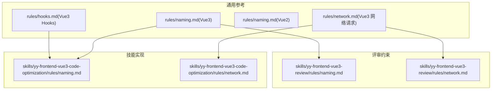
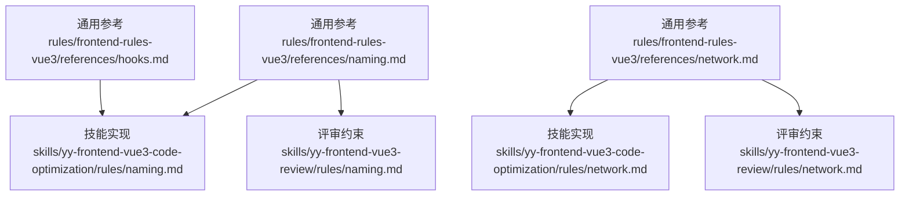
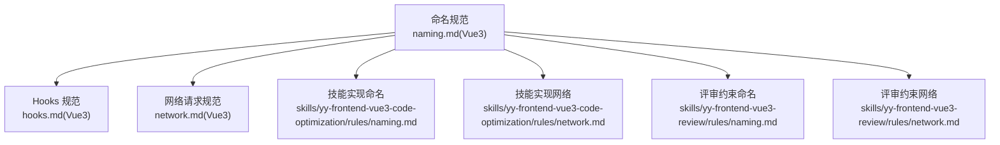

# 命名规范

<cite>
**本文引用的文件**
- [naming.md（Vue3 命名规范）](file://rules/frontend-rules-vue3/references/naming.md)
- [naming.md（Vue3 命名规范，技能版）](file://skills/yy-frontend-vue3-code-optimization/rules/naming.md)
- [naming.md（Vue3 命名规范，评审版）](file://skills/yy-frontend-vue3-review/rules/naming.md)
- [hooks.md（Vue3 组合式函数规范）](file://rules/frontend-rules-vue3/references/hooks.md)
- [naming.md（Vue2 命名规范）](file://rules/frontend-rules-vue2/references/naming.md)
- [naming.md（Vue2 命名规范，技能版）](file://skills/yy-frontend-vue2-code-optimization/rules/naming.md)
- [naming.md（Vue2 命名规范，评审版）](file://skills/yy-frontend-vue2-review/rules/naming.md)
- [rule-prompts-simple.md（Vue2 规则提示）](file://rules/frontend-rules-vue2/prompts/rule-prompts-simple.md)
- [network.md（Vue3 网络请求规范）](file://rules/frontend-rules-vue3/references/network.md)
- [network.md（Vue3 网络请求规范，技能版）](file://skills/yy-frontend-vue3-code-optimization/rules/network.md)
- [network.md（Vue3 网络请求规范，评审版）](file://skills/yy-frontend-vue3-review/rules/network.md)
</cite>

## 目录
1. [简介](#简介)
2. [项目结构](#项目结构)
3. [核心组件](#核心组件)
4. [架构总览](#架构总览)
5. [详细组件分析](#详细组件分析)
6. [依赖关系分析](#依赖关系分析)
7. [性能考量](#性能考量)
8. [故障排查指南](#故障排查指南)
9. [结论](#结论)
10. [附录](#附录)

## 简介
本文件系统化梳理 Vue3 项目的命名规范，覆盖文件与组件、函数、变量与常量、Props/Emit、布尔值、Hooks、TypeScript 类型以及 CSS BEM 命名约定，并结合仓库中的规则与示例，给出正反面案例与最佳实践，帮助团队在大型项目中保持一致、可读、可维护的命名风格。

## 项目结构
本仓库将“命名规范”沉淀在多处位置，形成“通用参考 + 技能实现 + 评审约束”的三层结构：
- 通用参考：rules/frontend-rules-vue3/references/naming.md 与 hooks.md
- 技能实现：skills/yy-frontend-vue3-code-optimization/rules/naming.md 与 rules/network.md
- 评审约束：skills/yy-frontend-vue3-review/rules/naming.md 与 rules/network.md

下图展示命名相关规则在仓库中的分布与引用关系：

图表来源
- [naming.md（Vue3 命名规范）:1-85](file://rules/frontend-rules-vue3/references/naming.md#L1-L85)
- [hooks.md（Vue3 组合式函数规范）:1-158](file://rules/frontend-rules-vue3/references/hooks.md#L1-L158)
- [naming.md（Vue3 命名规范，技能版）:1-85](file://skills/yy-frontend-vue3-code-optimization/rules/naming.md#L1-L85)
- [network.md（Vue3 网络请求规范，技能版）:1-303](file://skills/yy-frontend-vue3-code-optimization/rules/network.md#L1-L303)
- [naming.md（Vue3 命名规范，评审版）:1-85](file://skills/yy-frontend-vue3-review/rules/naming.md#L1-L85)
- [network.md（Vue3 网络请求规范，评审版）:1-303](file://skills/yy-frontend-vue3-review/rules/network.md#L1-L303)

章节来源
- [naming.md（Vue3 命名规范）:1-85](file://rules/frontend-rules-vue3/references/naming.md#L1-L85)
- [hooks.md（Vue3 组合式函数规范）:1-158](file://rules/frontend-rules-vue3/references/hooks.md#L1-L158)
- [naming.md（Vue3 命名规范，技能版）:1-85](file://skills/yy-frontend-vue3-code-optimization/rules/naming.md#L1-L85)
- [network.md（Vue3 网络请求规范，技能版）:1-303](file://skills/yy-frontend-vue3-code-optimization/rules/network.md#L1-L303)
- [naming.md（Vue3 命名规范，评审版）:1-85](file://skills/yy-frontend-vue3-review/rules/naming.md#L1-L85)
- [network.md（Vue3 网络请求规范，评审版）:1-303](file://skills/yy-frontend-vue3-review/rules/network.md#L1-L303)

## 核心组件
本节聚焦命名规范的关键维度与要点，便于快速查阅与对照。

- 文件与组件命名
  - 组件文件名：多单词 + PascalCase（如 UserList.vue、UserCard.vue）
  - 目录命名：kebab-case（如 user-profile）
  - 组件使用：PascalCase（如 <UserCard />）
  - 注意：组件名应使用多个单词，避免与 HTML 原生元素冲突

- 函数命名体系
  - API 函数：api + Method + URLPath（小驼峰，如 apiGetUserInfo、apiPostLogin）
  - 事件函数：on + EventName（小驼峰，如 onClickSubmit、onChangeInput）

- 变量与常量规范
  - 常量：全大写 + 下划线（如 MAX_RETRY_COUNT、APP_CONFIG）
  - Props：camelCase（如 userName、isLoading）
  - emit 事件：camelCase（如 userChange）
  - 布尔值：isXX / hasXX / showXX 前缀（如 isVisible、hasPermission）
  - 变量/方法：有意义的驼峰命名，禁止 data1、temp2 等无意义命名

- Vue3 组合式 API 命名
  - ref/reactive/computed：camelCase（如 isLoading、userName、formData、dataSource、isSelected、totalPage）

- Hooks 命名规范
  - 必须以 use 开头，文件名与函数名一致，存放于 src/hooks/（全局）或组件同级目录
  - 返回值：统一返回对象（推荐 toRefs 解构后返回），禁止直接返回 reactive 对象
  - 生命周期钩子：仅能在组件顶层或 setup 中调用，禁止在 Hooks 内部直接调用

- TypeScript 类型命名
  - 类型别名/接口：I + PascalCase（如 IUserInfo、ITableConfig、IUser、ITable）
  - 泛型参数：单字母大写（如 T、K、V）

- CSS 命名（BEM 规范）
  - 块：独立模块（如 card、form）
  - 元素：块内部子元素（如 card__title、form__input）
  - 修饰符：状态/样式变体（如 card--dark、card__title--large）
  - 规则：全小写、横线连接、无嵌套、类名唯一

章节来源
- [naming.md（Vue3 命名规范）:7-85](file://rules/frontend-rules-vue3/references/naming.md#L7-L85)
- [hooks.md（Vue3 组合式函数规范）:7-158](file://rules/frontend-rules-vue3/references/hooks.md#L7-L158)
- [naming.md（Vue3 命名规范，技能版）:7-85](file://skills/yy-frontend-vue3-code-optimization/rules/naming.md#L7-L85)
- [naming.md（Vue3 命名规范，评审版）:7-85](file://skills/yy-frontend-vue3-review/rules/naming.md#L7-L85)

## 架构总览
下图展示命名规范在不同层级的落地关系：通用参考作为基线，技能实现负责工程化落地，评审约束保障质量与一致性。

图表来源
- [naming.md（Vue3 命名规范）:1-85](file://rules/frontend-rules-vue3/references/naming.md#L1-L85)
- [hooks.md（Vue3 组合式函数规范）:1-158](file://rules/frontend-rules-vue3/references/hooks.md#L1-L158)
- [naming.md（Vue3 命名规范，技能版）:1-85](file://skills/yy-frontend-vue3-code-optimization/rules/naming.md#L1-L85)
- [naming.md（Vue3 命名规范，评审版）:1-85](file://skills/yy-frontend-vue3-review/rules/naming.md#L1-L85)
- [network.md（Vue3 网络请求规范，技能版）:1-303](file://skills/yy-frontend-vue3-code-optimization/rules/network.md#L1-L303)
- [network.md（Vue3 网络请求规范，评审版）:1-303](file://skills/yy-frontend-vue3-review/rules/network.md#L1-L303)

## 详细组件分析

### 文件与组件命名
- 规范要点
  - 文件名：多单词 + PascalCase
  - 目录：kebab-case
  - 使用：PascalCase
  - 避免与 HTML 原生元素冲突

- 正面案例
  - 组件文件：UserList.vue、UserProfile.vue
  - 目录：user-profile、product-card
  - 使用：<UserCard />

- 反面案例
  - 组件文件：user-list.vue（少于两个单词）
  - 目录：UserProfile（应为 kebab-case）
  - 使用：<user-card />（应为 PascalCase）

章节来源
- [naming.md（Vue3 命名规范）:7-16](file://rules/frontend-rules-vue3/references/naming.md#L7-L16)
- [naming.md（Vue3 命名规范，技能版）:7-16](file://skills/yy-frontend-vue3-code-optimization/rules/naming.md#L7-L16)
- [naming.md（Vue3 命名规范，评审版）:7-16](file://skills/yy-frontend-vue3-review/rules/naming.md#L7-L16)

### 函数命名体系
- 规范要点
  - API 函数：api + Method + URLPath（小驼峰）
  - 事件函数：on + EventName（小驼峰）

- 正面案例
  - API：apiGetUserInfo、apiPostLogin
  - 事件：onClickSubmit、onChangeInput

- 反面案例
  - API：getUserInfo（缺少 api 前缀）、get_user_info（缺少驼峰）
  - 事件：clickSubmit（缺少 on 前缀）、change_input（缺少驼峰）

章节来源
- [naming.md（Vue3 命名规范）:19-25](file://rules/frontend-rules-vue3/references/naming.md#L19-L25)
- [naming.md（Vue3 命名规范，技能版）:19-25](file://skills/yy-frontend-vue3-code-optimization/rules/naming.md#L19-L25)
- [naming.md（Vue3 命名规范，评审版）:19-25](file://skills/yy-frontend-vue3-review/rules/naming.md#L19-L25)
- [rule-prompts-simple.md（Vue2 规则提示）:53-79](file://rules/frontend-rules-vue2/prompts/rule-prompts-simple.md#L53-L79)

### 变量与常量规范
- 规范要点
  - 常量：全大写 + 下划线
  - Props：camelCase
  - emit 事件：camelCase
  - 布尔值：isXX / hasXX / showXX 前缀
  - 变量/方法：有意义的驼峰命名，避免 data1、temp2

- 正面案例
  - 常量：MAX_RETRY_COUNT、APP_CONFIG
  - Props：userName、isLoading
  - emit：userChange、formSubmit
  - 布尔值：isVisible、hasPermission、showSidebar
  - 变量：searchQuery、dataSource、loading

- 反面案例
  - 常量：MaxRetryCount（大小写不一致）、max_retry_count（缺少下划线）
  - Props：user_name（下划线）、isLoadingFlag（非 camelCase）
  - emit：user_change（下划线）、form_submit（下划线）
  - 布尔值：visible、permission（缺少 is/has/show 前缀）
  - 变量：data1、temp2（无意义命名）

章节来源
- [naming.md（Vue3 命名规范）:26-35](file://rules/frontend-rules-vue3/references/naming.md#L26-L35)
- [naming.md（Vue3 命名规范，技能版）:26-35](file://skills/yy-frontend-vue3-code-optimization/rules/naming.md#L26-L35)
- [naming.md（Vue3 命名规范，评审版）:26-35](file://skills/yy-frontend-vue3-review/rules/naming.md#L26-L35)
- [naming.md（Vue2 命名规范）:28-36](file://rules/frontend-rules-vue2/references/naming.md#L28-L36)
- [naming.md（Vue2 命名规范，技能版）:28-36](file://skills/yy-frontend-vue2-code-optimization/rules/naming.md#L28-L36)
- [naming.md（Vue2 命名规范，评审版）:26-34](file://skills/yy-frontend-vue2-review/rules/naming.md#L26-L34)

### Props 与 Emit 的特殊命名要求
- Props 必须使用 camelCase
- emit 事件必须使用 camelCase
- 建议在声明时添加注释说明用途（尤其在 Vue2 Options API 中）

- 正面案例
  - Props：userName、isLoading、selectedId
  - emit：userChange、formSubmit、dialogClose

- 反面案例
  - Props：user_name、is_loading（使用下划线）
  - emit：user-change、form-submit（使用连字符）

章节来源
- [naming.md（Vue3 命名规范）:31-32](file://rules/frontend-rules-vue3/references/naming.md#L31-L32)
- [naming.md（Vue2 命名规范）:33-33](file://rules/frontend-rules-vue2/references/naming.md#L33-L33)
- [naming.md（Vue2 命名规范，技能版）:33-33](file://skills/yy-frontend-vue2-code-optimization/rules/naming.md#L33-L33)
- [naming.md（Vue2 命名规范，评审版）:16-19](file://skills/yy-frontend-vue2-review/rules/naming.md#L16-L19)

### 布尔值命名最佳实践
- 前缀约定
  - isXX：布尔状态（如 isLoading、isValid、isDisabled）
  - hasXX：存在性判断（如 hasData、hasPermission、hasError）
  - visible/showXX：可见性（如 isDialogVisible、showSidebar）
  - formatted/parsed：数据转换（如 formattedDate、parsedJson）
  - total/count：统计数量（如 totalCount、filteredCount）

- 正面案例
  - isEditing、hasRole、showTooltip、formattedPrice、totalCount

- 反面案例
  - editing、role、tooltip、price、count（缺少前缀，含义不明确）

章节来源
- [naming.md（Vue3 命名规范）:33-33](file://rules/frontend-rules-vue3/references/naming.md#L33-L33)
- [naming.md（Vue2 命名规范，评审版）:26-34](file://skills/yy-frontend-vue2-review/references/naming.md#L26-L34)

### Hooks 命名规范
- 命名与文件组织
  - 必须以 use 开头（如 useTable、useSearchForm、usePagination）
  - 文件名与函数名一致，存放于 src/hooks/（全局）或组件同级目录

- 返回值规范
  - 统一返回对象（推荐 toRefs 解构后返回）
  - 禁止直接返回 reactive 对象
  - 禁止将 Hooks 挂载到响应式数据上（如 const state = reactive(useXxx())）

- 使用规范
  - 组件中通过 const { ... } = useXxx() 解构使用
  - Hooks 内部使用 ref/reactive 管理状态
  - 生命周期钩子（如 onMounted）只能在组件顶层或 setup 中调用
  - 禁止在 Hooks 内部直接调用生命周期钩子

- 抽离建议
  - 可复用逻辑超过 30 行或跨 2 个以上组件使用时，必须抽离为 Hook
  - 常见场景：useTable、useSearchForm、useFormValidate、useDialog、useUpload、usePermission

- 正面案例
  - 文件：useTable.ts，函数：useTable
  - 返回：{ loading, dataSource, total, pagination, getDataSourceTotal }

- 反面案例
  - 文件：table.ts（缺少 use 前缀）
  - 返回：直接返回 reactive 对象
  - 在 Hooks 内部调用 onMounted

章节来源
- [hooks.md（Vue3 组合式函数规范）:7-158](file://rules/frontend-rules-vue3/references/hooks.md#L7-L158)

### TypeScript 类型命名
- 规范要点
  - 类型别名/接口：I + PascalCase（如 IUserInfo、ITableConfig、IUser、ITable）
  - 泛型参数：单字母大写（如 T、K、V）

- 正面案例
  - IUserInfo、ITableConfig、IUser、ITable、T、K、V

- 反面案例
  - iUserInfo（缺少大写 I）、ITableConfigInterface（接口后缀冗余）

章节来源
- [naming.md（Vue3 命名规范）:54-61](file://rules/frontend-rules-vue3/references/naming.md#L54-L61)
- [naming.md（Vue3 命名规范，技能版）:54-61](file://skills/yy-frontend-vue3-code-optimization/rules/naming.md#L54-L61)
- [naming.md（Vue3 命名规范，评审版）:54-61](file://skills/yy-frontend-vue3-review/rules/naming.md#L54-L61)

### CSS BEM 命名
- 规范要点
  - 块：独立模块（如 card、form）
  - 元素：块内部子元素（如 card__title、form__input）
  - 修饰符：状态/样式变体（如 card--dark、card__title--large）
  - 规则：全小写、横线连接、无嵌套、类名唯一

- 正面案例
  - card、card__title、card--dark、card__title--large

- 反面案例
  - Card、Card__Title、card_dark（大小写与连接符不规范）

章节来源
- [naming.md（Vue3 命名规范）:76-85](file://rules/frontend-rules-vue3/references/naming.md#L76-L85)
- [naming.md（Vue3 命名规范，技能版）:76-85](file://skills/yy-frontend-vue3-code-optimization/rules/naming.md#L76-L85)
- [naming.md（Vue3 命名规范，评审版）:76-85](file://skills/yy-frontend-vue3-review/rules/naming.md#L76-L85)

## 依赖关系分析
- 规则依赖
  - Vue3 命名规范与 Hooks 规范共同构成 Vue3 组件与状态层的命名基线
  - 网络请求规范与命名规范协同，确保 API 函数命名与请求流程一致

- 实施依赖
  - 技能实现层将通用参考转化为可执行的规则与示例
  - 评审约束层对实现结果进行质量把关

图表来源
- [naming.md（Vue3 命名规范）:1-85](file://rules/frontend-rules-vue3/references/naming.md#L1-L85)
- [hooks.md（Vue3 组合式函数规范）:1-158](file://rules/frontend-rules-vue3/references/hooks.md#L1-L158)
- [network.md（Vue3 网络请求规范）:1-303](file://rules/frontend-rules-vue3/references/network.md#L1-L303)
- [naming.md（Vue3 命名规范，技能版）:1-85](file://skills/yy-frontend-vue3-code-optimization/rules/naming.md#L1-L85)
- [network.md（Vue3 网络请求规范，技能版）:1-303](file://skills/yy-frontend-vue3-code-optimization/rules/network.md#L1-L303)
- [naming.md（Vue3 命名规范，评审版）:1-85](file://skills/yy-frontend-vue3-review/rules/naming.md#L1-L85)
- [network.md（Vue3 网络请求规范，评审版）:1-303](file://skills/yy-frontend-vue3-review/rules/network.md#L1-L303)

## 性能考量
- 命名一致性有助于提升代码可读性与可维护性，间接降低重构成本与引入错误的概率
- Hooks 的统一返回与 toRefs 解构可减少不必要的响应式包裹开销
- API 函数命名清晰可索引，有利于后续自动化工具与文档生成

## 故障排查指南
- 常见问题
  - 组件名使用单个单词或 kebab-case：修正为 PascalCase 并确保多单词
  - Props/Emit 使用下划线或连字符：统一改为 camelCase
  - 布尔值缺少 is/has/show 前缀：补充前缀以增强语义
  - Hooks 缺少 use 前缀或返回值不规范：按规范修正
  - 类型命名缺少 I 前缀或泛型参数不规范：按规范修正

- 定位与修复
  - 使用 LSP 或 AST-grep 全局查找引用，确保替换完整
  - diff 预览变更，确认无误后再执行
  - 避免与第三方库 API 冲突，保留外部约定不变

章节来源
- [naming.md（Vue3 命名规范，技能版）:1-42](file://skills/yy-frontend-vue3-code-optimization/sub-skills/naming.md#L1-L42)
- [naming.md（Vue2 命名规范，技能版）:1-41](file://skills/yy-frontend-vue2-code-optimization/sub-skills/naming.md#L1-L41)

## 结论
本规范以 Vue3 为核心，覆盖文件与组件、函数、变量与常量、Props/Emit、布尔值、Hooks、TypeScript 类型与 CSS BEM 命名约定，并通过通用参考、技能实现与评审约束三层结构确保落地与质量。遵循本规范可显著提升代码一致性与可维护性，建议在团队内统一推广并纳入代码审查流程。

## 附录
- 相关规则文件
  - Vue3 命名规范：rules/frontend-rules-vue3/references/naming.md
  - Vue3 Hooks 规范：rules/frontend-rules-vue3/references/hooks.md
  - Vue3 网络请求规范：rules/frontend-rules-vue3/references/network.md
  - Vue2 命名规范：rules/frontend-rules-vue2/references/naming.md
  - Vue2 规则提示：rules/frontend-rules-vue2/prompts/rule-prompts-simple.md