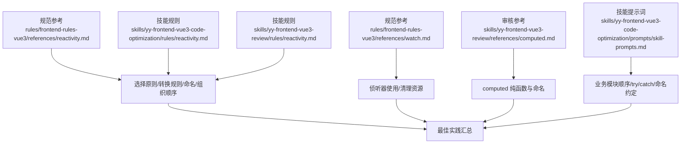
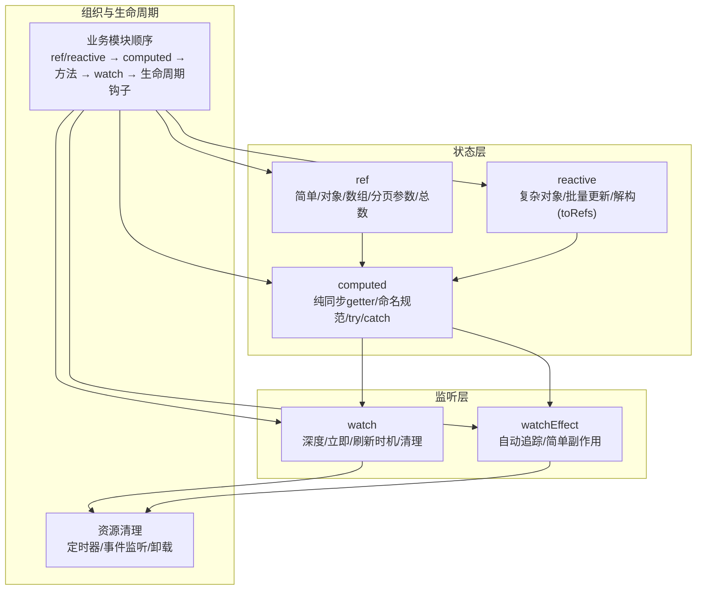
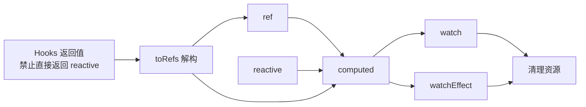

# 响应式状态管理

<cite>
**本文引用的文件**
- [rules/frontend-rules-vue3/references/reactivity.md](file://rules/frontend-rules-vue3/references/reactivity.md)
- [rules/frontend-rules-vue3/references/watch.md](file://rules/frontend-rules-vue3/references/watch.md)
- [skills/yy-frontend-vue3-code-optimization/rules/reactivity.md](file://skills/yy-frontend-vue3-code-optimization/rules/reactivity.md)
- [skills/yy-frontend-vue3-review/rules/reactivity.md](file://skills/yy-frontend-vue3-review/rules/reactivity.md)
- [skills/yy-frontend-vue3-review/references/computed.md](file://skills/yy-frontend-vue3-review/references/computed.md)
- [skills/yy-frontend-vue3-code-optimization/prompts/skill-prompts.md](file://skills/yy-frontend-vue3-code-optimization/prompts/skill-prompts.md)
</cite>

## 目录
1. [简介](#简介)
2. [项目结构](#项目结构)
3. [核心组件](#核心组件)
4. [架构总览](#架构总览)
5. [详细组件分析](#详细组件分析)
6. [依赖分析](#依赖分析)
7. [性能考量](#性能考量)
8. [故障排查指南](#故障排查指南)
9. [结论](#结论)
10. [附录](#附录)

## 简介
本文件系统化阐述 Vue3 响应式状态管理规范，围绕 ref、reactive、computed 的选择原则与使用场景，给出响应式数据转换规则（reactive 转 ref），强调 try/catch 包裹在响应式状态中的重要性，并总结初始化、更新与销毁的最佳实践。文档同时提供可追溯的“代码片段路径”以便查阅原始示例。

## 项目结构
本仓库中与 Vue3 响应式状态管理直接相关的知识主要分布在以下位置：
- 规范参考：rules/frontend-rules-vue3/references/reactivity.md、watch.md
- 技能规则与提示词：skills/yy-frontend-vue3-code-optimization/rules/reactivity.md、prompts/skill-prompts.md
- 审核技能规则与参考：skills/yy-frontend-vue3-review/rules/reactivity.md、references/computed.md

图表来源
- [rules/frontend-rules-vue3/references/reactivity.md:1-227](file://rules/frontend-rules-vue3/references/reactivity.md#L1-L227)
- [rules/frontend-rules-vue3/references/watch.md:1-154](file://rules/frontend-rules-vue3/references/watch.md#L1-L154)
- [skills/yy-frontend-vue3-code-optimization/rules/reactivity.md:1-227](file://skills/yy-frontend-vue3-code-optimization/rules/reactivity.md#L1-L227)
- [skills/yy-frontend-vue3-review/rules/reactivity.md:1-227](file://skills/yy-frontend-vue3-review/rules/reactivity.md#L1-L227)
- [skills/yy-frontend-vue3-review/references/computed.md:1-22](file://skills/yy-frontend-vue3-review/references/computed.md#L1-L22)
- [skills/yy-frontend-vue3-code-optimization/prompts/skill-prompts.md:1-800](file://skills/yy-frontend-vue3-code-optimization/prompts/skill-prompts.md#L1-L800)

章节来源
- [rules/frontend-rules-vue3/references/reactivity.md:1-227](file://rules/frontend-rules-vue3/references/reactivity.md#L1-L227)
- [rules/frontend-rules-vue3/references/watch.md:1-154](file://rules/frontend-rules-vue3/references/watch.md#L1-L154)
- [skills/yy-frontend-vue3-code-optimization/rules/reactivity.md:1-227](file://skills/yy-frontend-vue3-code-optimization/rules/reactivity.md#L1-L227)
- [skills/yy-frontend-vue3-review/rules/reactivity.md:1-227](file://skills/yy-frontend-vue3-review/rules/reactivity.md#L1-L227)
- [skills/yy-frontend-vue3-review/references/computed.md:1-22](file://skills/yy-frontend-vue3-review/references/computed.md#L1-L22)
- [skills/yy-frontend-vue3-code-optimization/prompts/skill-prompts.md:1-800](file://skills/yy-frontend-vue3-code-optimization/prompts/skill-prompts.md#L1-L800)

## 核心组件
- ref：优先使用，适用于简单状态、对象拆分、数组、分页参数与总数等。访问需使用 .value。
- reactive：仅在复杂对象、批量更新、对象解构（配合 toRefs）时使用。
- computed：除后端交互与定时器外，尽可能使用 computed，保持纯同步 getter，必要时使用 try/catch 包裹防御性逻辑。
- watch/watchEffect：精确控制依赖、深度监听、立即执行与刷新时机；注意清理定时器与事件监听；将派生逻辑迁移到 computed。

章节来源
- [rules/frontend-rules-vue3/references/reactivity.md:7-30](file://rules/frontend-rules-vue3/references/reactivity.md#L7-L30)
- [rules/frontend-rules-vue3/references/reactivity.md:132-205](file://rules/frontend-rules-vue3/references/reactivity.md#L132-L205)
- [rules/frontend-rules-vue3/references/watch.md:7-101](file://rules/frontend-rules-vue3/references/watch.md#L7-L101)
- [skills/yy-frontend-vue3-review/references/computed.md:7-22](file://skills/yy-frontend-vue3-review/references/computed.md#L7-L22)
- [skills/yy-frontend-vue3-code-optimization/prompts/skill-prompts.md:86-124](file://skills/yy-frontend-vue3-code-optimization/prompts/skill-prompts.md#L86-L124)

## 架构总览
Vue3 响应式状态管理的总体思路是：以 ref 为主、reactive 为辅、computed 优先，结合 watch/watchEffect 实现副作用与监听，最终形成清晰的业务模块结构与生命周期资源清理。

图表来源
- [rules/frontend-rules-vue3/references/reactivity.md:220-227](file://rules/frontend-rules-vue3/references/reactivity.md#L220-L227)
- [rules/frontend-rules-vue3/references/watch.md:15-154](file://rules/frontend-rules-vue3/references/watch.md#L15-L154)
- [skills/yy-frontend-vue3-code-optimization/prompts/skill-prompts.md:86-124](file://skills/yy-frontend-vue3-code-optimization/prompts/skill-prompts.md#L86-L124)

## 详细组件分析

### 选择原则与场景
- 优先使用 ref：简单状态、对象拆分、数组、分页请求参数与总数。
- 使用 reactive 的场景：复杂对象结构、批量属性更新、对象解构（配合 toRefs）。
- computed 原则：纯同步 getter，命名使用 is/has/visible 或有意义名称，避免异步与副作用。
- 侦听器：watch 精确依赖，watchEffect 自动追踪；均需注意深度监听、立即执行与清理。

章节来源
- [rules/frontend-rules-vue3/references/reactivity.md:7-30](file://rules/frontend-rules-vue3/references/reactivity.md#L7-L30)
- [rules/frontend-rules-vue3/references/reactivity.md:132-205](file://rules/frontend-rules-vue3/references/reactivity.md#L132-L205)
- [rules/frontend-rules-vue3/references/watch.md:7-101](file://rules/frontend-rules-vue3/references/watch.md#L7-L101)
- [skills/yy-frontend-vue3-review/references/computed.md:7-22](file://skills/yy-frontend-vue3-review/references/computed.md#L7-L22)

### reactive 转 ref 规则与转换示例
- 简单状态：将 reactive({ count: 0 }) 转为 ref(0)。
- 对象数据：将 reactive({ name: '', age: 0 }) 拆分为独立 ref（如 userName/ref(''), userAge/ref(0)）。
- 数组数据：将 reactive([]) 转为 ref([])。
- 分页请求参数：保持 pagination = ref({ page, limit }) 组合 ref；分页总数 total 使用独立 ref。

章节来源
- [rules/frontend-rules-vue3/references/reactivity.md:32-74](file://rules/frontend-rules-vue3/references/reactivity.md#L32-L74)
- [skills/yy-frontend-vue3-code-optimization/rules/reactivity.md:32-74](file://skills/yy-frontend-vue3-code-optimization/rules/reactivity.md#L32-L74)
- [skills/yy-frontend-vue3-review/rules/reactivity.md:32-74](file://skills/yy-frontend-vue3-review/rules/reactivity.md#L32-L74)

### Hooks 中的规范与 toRefs 使用
- 禁止直接返回 reactive 对象；如需解构，使用 toRefs。
- useForm 示例：直接返回 reactive 禁止；推荐使用独立 ref 或 toRefs。

章节来源
- [rules/frontend-rules-vue3/references/reactivity.md:76-99](file://rules/frontend-rules-vue3/references/reactivity.md#L76-L99)
- [skills/yy-frontend-vue3-code-optimization/rules/reactivity.md:76-99](file://skills/yy-frontend-vue3-code-optimization/rules/reactivity.md#L76-L99)
- [skills/yy-frontend-vue3-review/rules/reactivity.md:76-99](file://skills/yy-frontend-vue3-review/rules/reactivity.md#L76-L99)

### computed 的防御性 try/catch 包裹
- 对可能抛错的边界情况（如长度比较、JSON.parse 等）建议包裹 try/catch，返回安全 fallback。
- 命名建议使用 is/has/visible 或有意义名称；避免异步与副作用。

章节来源
- [rules/frontend-rules-vue3/references/reactivity.md:141-154](file://rules/frontend-rules-vue3/references/reactivity.md#L141-L154)
- [rules/frontend-rules-vue3/references/reactivity.md:156-185](file://rules/frontend-rules-vue3/references/reactivity.md#L156-L185)
- [skills/yy-frontend-vue3-review/references/computed.md:19-22](file://skills/yy-frontend-vue3-review/references/computed.md#L19-L22)

### 侦听器与资源清理
- watch：深度监听需声明 deep: true；初始化需触发时加 immediate: true；刷新时机可选 flush: 'post'。
- watchEffect：适合简单副作用；复杂逻辑建议拆分为 watch 或普通函数。
- 清理：定时器、事件监听在组件销毁时清理；watch 中的定时器需在 onBeforeUnmount 清理。

章节来源
- [rules/frontend-rules-vue3/references/watch.md:15-154](file://rules/frontend-rules-vue3/references/watch.md#L15-L154)

### 业务模块内部组织顺序
- 组内顺序：ref/reactive → computed → 方法 → watch → 生命周期钩子。
- computed 必须 try/catch；命名使用 is/has/visible；ref 访问必须 .value。

章节来源
- [rules/frontend-rules-vue3/references/reactivity.md:220-227](file://rules/frontend-rules-vue3/references/reactivity.md#L220-L227)
- [skills/yy-frontend-vue3-code-optimization/prompts/skill-prompts.md:86-124](file://skills/yy-frontend-vue3-code-optimization/prompts/skill-prompts.md#L86-L124)

### 代码片段路径示例（不含具体代码内容）
- reactive 转 ref 优化前后对比：[示例路径:45-74](file://rules/frontend-rules-vue3/references/reactivity.md#L45-L74)
- Hooks 中 toRefs 使用：[示例路径:80-99](file://rules/frontend-rules-vue3/references/reactivity.md#L80-L99)
- computed 防御性 try/catch：[示例路径:145-154](file://rules/frontend-rules-vue3/references/reactivity.md#L145-L154)
- watch 基本结构与配置：[示例路径:19-51](file://rules/frontend-rules-vue3/references/watch.md#L19-L51)
- watchEffect 使用与对比：[示例路径:70-82](file://rules/frontend-rules-vue3/references/watch.md#L70-L82)
- 定时器清理与事件监听清理：[示例路径:109-147](file://rules/frontend-rules-vue3/references/watch.md#L109-L147)
- 业务模块顺序与命名规范：[示例路径:220-227](file://rules/frontend-rules-vue3/references/reactivity.md#L220-L227), [示例路径:86-124](file://skills/yy-frontend-vue3-code-optimization/prompts/skill-prompts.md#L86-L124)

## 依赖分析
- 组件耦合与内聚：优先使用 ref 提升可维护性；reactive 仅在必要时使用，避免过度耦合。
- 直接与间接依赖：computed 作为纯 getter，减少对副作用的依赖；watch/watchEffect 仅用于副作用与监听。
- 外部依赖与集成点：网络请求统一模式（如 useRequest 或 async/await + try/catch），与响应式状态解耦。
- 接口契约：Hooks 返回值统一对象，禁止直接返回 reactive 对象；使用 toRefs 时确保解构后仍保持响应式。

图表来源
- [rules/frontend-rules-vue3/references/reactivity.md:76-99](file://rules/frontend-rules-vue3/references/reactivity.md#L76-L99)
- [rules/frontend-rules-vue3/references/watch.md:105-147](file://rules/frontend-rules-vue3/references/watch.md#L105-L147)
- [skills/yy-frontend-vue3-review/rules/reactivity.md:76-99](file://skills/yy-frontend-vue3-review/rules/reactivity.md#L76-L99)

章节来源
- [rules/frontend-rules-vue3/references/reactivity.md:76-99](file://rules/frontend-rules-vue3/references/reactivity.md#L76-L99)
- [rules/frontend-rules-vue3/references/watch.md:105-147](file://rules/frontend-rules-vue3/references/watch.md#L105-L147)
- [skills/yy-frontend-vue3-review/rules/reactivity.md:76-99](file://skills/yy-frontend-vue3-review/rules/reactivity.md#L76-L99)

## 性能考量
- 优先使用 computed：利用缓存机制减少重复计算，避免在 watch 中做派生逻辑。
- 尽可能使用 ref：细粒度响应式更新，降低不必要的批量更新开销。
- 深度监听与刷新时机：watch 的 deep: true 与 flush: 'post' 会影响性能，按需启用。
- 资源清理：及时清理定时器与事件监听，防止内存泄漏与多余渲染。

## 故障排查指南
- 解构丢失响应式：reactive 解构会丢失响应式，需使用 toRefs。
- 访问方式错误：ref 需使用 .value，reactive 直接访问属性。
- 类型推断差异：ref 类型推断更明确，reactive 可能需要额外类型定义。
- 批量更新影响：reactive 的批量更新更简洁，ref 需逐个更新。
- computed 异步与副作用：computed 应为纯同步 getter，避免异步逻辑与副作用。
- 侦听器配置不当：未声明 deep: true 导致对象/数组变化未被监听；未清理定时器与事件监听导致资源泄漏。

章节来源
- [rules/frontend-rules-vue3/references/reactivity.md:101-107](file://rules/frontend-rules-vue3/references/reactivity.md#L101-L107)
- [rules/frontend-rules-vue3/references/reactivity.md:171-185](file://rules/frontend-rules-vue3/references/reactivity.md#L171-L185)
- [rules/frontend-rules-vue3/references/watch.md:105-147](file://rules/frontend-rules-vue3/references/watch.md#L105-L147)

## 结论
- 以 ref 为主、reactive 为辅、computed 优先，是 Vue3 响应式状态管理的三大基石。
- reactive 转 ref 能显著提升可维护性与类型安全性；Hooks 中必须使用 toRefs 保持解构后的响应式。
- computed 的 try/catch 包裹能有效防御边界错误，提升稳定性。
- watch/watchEffect 的正确使用与资源清理，是保证性能与稳定性的关键。
- 严格的业务模块顺序与命名规范，有助于团队协作与长期演进。

## 附录
- 业务模块顺序参考：ref/reactive → computed → 方法 → watch → 生命周期钩子
- computed 命名建议：is/has/visible 或有意义名称
- ref 访问必须使用 .value
- Hooks 返回值统一对象，禁止直接返回 reactive 对象

章节来源
- [rules/frontend-rules-vue3/references/reactivity.md:220-227](file://rules/frontend-rules-vue3/references/reactivity.md#L220-L227)
- [skills/yy-frontend-vue3-review/references/computed.md:13-15](file://skills/yy-frontend-vue3-review/references/computed.md#L13-L15)
- [skills/yy-frontend-vue3-code-optimization/prompts/skill-prompts.md:123-124](file://skills/yy-frontend-vue3-code-optimization/prompts/skill-prompts.md#L123-L124)