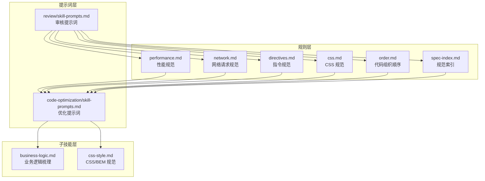
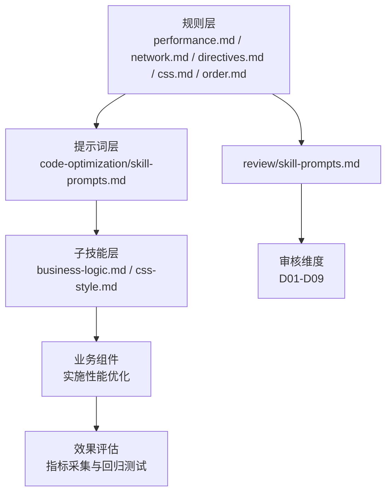
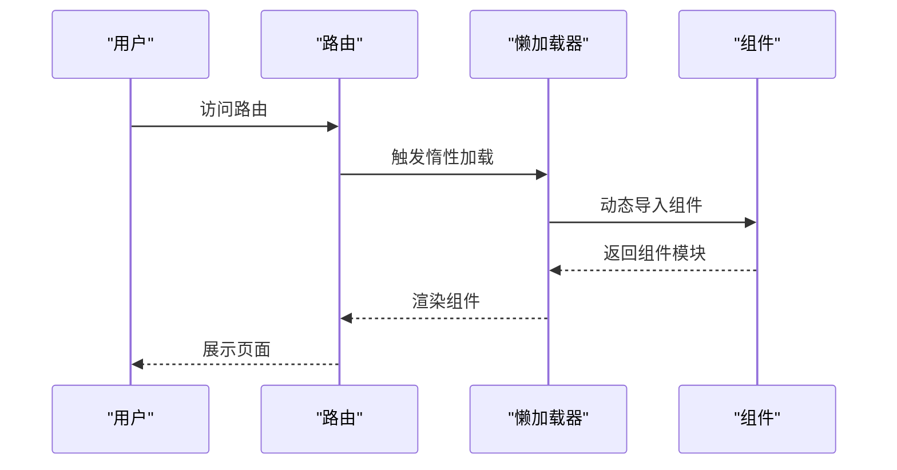
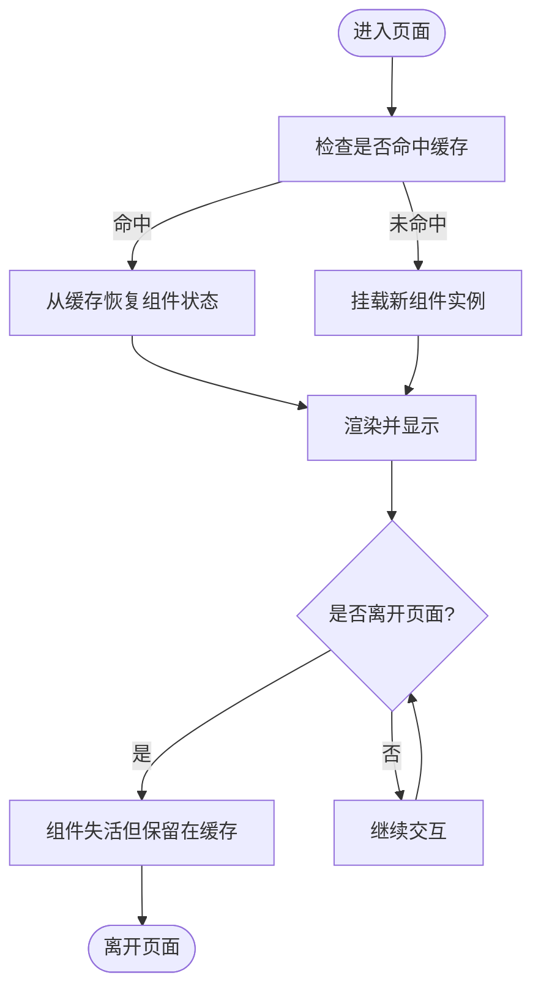
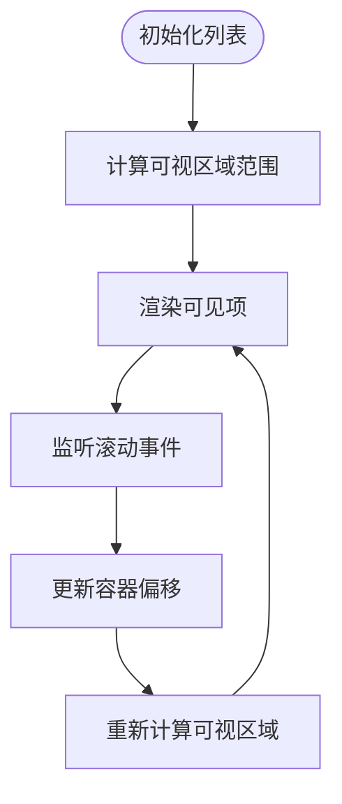
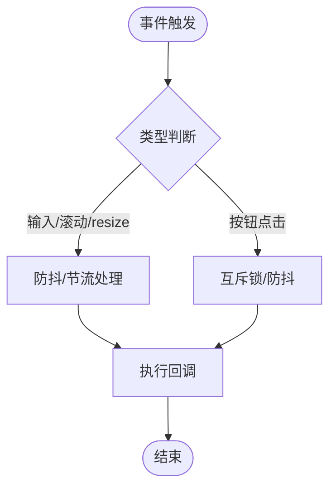
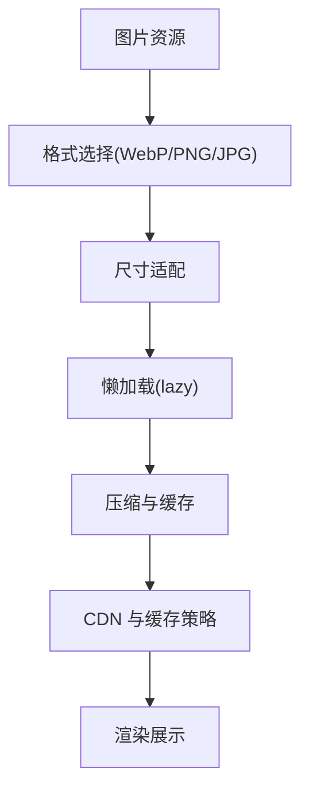
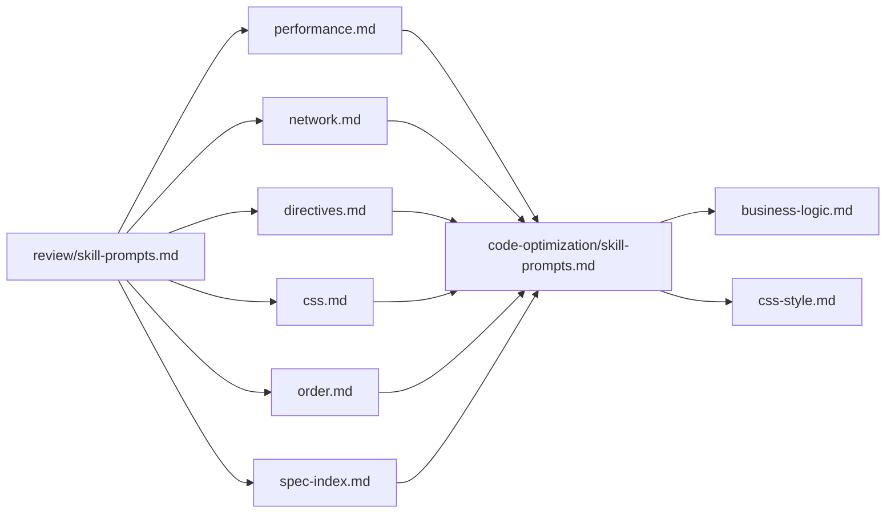

# 性能优化规范

<cite>
**本文引用的文件**
- [performance.md](file://skills/yy-frontend-vue3-code-optimization/rules/performance.md)
- [performance.md](file://rules/frontend-rules-vue3/references/performance.md)
- [network.md](file://rules/frontend-rules-vue3/references/network.md)
- [directives.md](file://rules/frontend-rules-vue3/references/directives.md)
- [css.md](file://rules/frontend-rules-vue3/references/css.md)
- [order.md](file://rules/frontend-rules-vue3/references/order.md)
- [spec-index.md](file://rules/frontend-rules-vue3/references/spec-index.md)
- [business-logic.md](file://skills/yy-frontend-vue3-code-optimization/sub-skills/business-logic.md)
- [css-style.md](file://skills/yy-frontend-vue3-code-optimization/sub-skills/css-style.md)
- [skill-prompts.md](file://skills/yy-frontend-vue3-code-optimization/prompts/skill-prompts.md)
- [skill-prompts.md](file://skills/yy-frontend-vue3-review/prompts/skill-prompts.md)
</cite>

## 目录
1. [简介](#简介)
2. [项目结构](#项目结构)
3. [核心组件](#核心组件)
4. [架构总览](#架构总览)
5. [详细组件分析](#详细组件分析)
6. [依赖分析](#依赖分析)
7. [性能考量](#性能考量)
8. [故障排查指南](#故障排查指南)
9. [结论](#结论)
10. [附录](#附录)

## 简介
本规范面向 Vue3 项目的前端工程，系统阐述性能优化的关键手段与落地实践，包括组件懒加载、KeepAlive 缓存策略、虚拟滚动、防抖与节流、图片优化、模板层轻量化、响应式性能、自定义指令清理以及路由守卫清理等。文档结合仓库中的规则与提示词文件，提供可操作的实施路径与效果评估方法，帮助团队在保证质量的前提下持续提升应用性能与用户体验。

## 项目结构
本仓库围绕 Vue3 前端开发形成“规则 + 提示词 + 子技能”的体系：
- 规则层：集中于 rules/frontend-rules-vue3/references 下，覆盖性能、网络、指令、CSS、顺序等专项规范。
- 提示词层：skills/yy-frontend-vue3-code-optimization 与 skills/yy-frontend-vue3-review 下的 skill-prompts.md，定义优化与审核的执行流程、风险分级与输出格式。
- 子技能层：business-logic.md、css-style.md 等，细化具体优化动作的边界与注意事项。

图表来源
- [performance.md:1-136](file://rules/frontend-rules-vue3/references/performance.md#L1-L136)
- [network.md:1-363](file://rules/frontend-rules-vue3/references/network.md#L1-L363)
- [directives.md:1-105](file://rules/frontend-rules-vue3/references/directives.md#L1-L105)
- [css.md:1-67](file://rules/frontend-rules-vue3/references/css.md#L1-L67)
- [order.md:1-141](file://rules/frontend-rules-vue3/references/order.md#L1-L141)
- [spec-index.md:1-60](file://rules/frontend-rules-vue3/references/spec-index.md#L1-L60)
- [skill-prompts.md:1-800](file://skills/yy-frontend-vue3-code-optimization/prompts/skill-prompts.md#L1-L800)
- [skill-prompts.md:1-613](file://skills/yy-frontend-vue3-review/prompts/skill-prompts.md#L1-L613)
- [business-logic.md:1-123](file://skills/yy-frontend-vue3-code-optimization/sub-skills/business-logic.md#L1-L123)
- [css-style.md:1-227](file://skills/yy-frontend-vue3-code-optimization/sub-skills/css-style.md#L1-L227)

章节来源
- [spec-index.md:1-60](file://rules/frontend-rules-vue3/references/spec-index.md#L1-L60)
- [skill-prompts.md:1-800](file://skills/yy-frontend-vue3-code-optimization/prompts/skill-prompts.md#L1-L800)
- [skill-prompts.md:1-613](file://skills/yy-frontend-vue3-review/prompts/skill-prompts.md#L1-L613)

## 核心组件
- 组件懒加载：使用 defineAsyncComponent 动态导入大型组件，或路由页面使用惰性加载，降低初始包体与首屏渲染压力。
- KeepAlive 缓存：对不常更新的页面或组件使用 <KeepAlive>，通过 include/exclude 精准控制缓存范围，避免内存泄漏。
- 虚拟滚动：长列表（≥100 项）采用虚拟滚动组件，仅渲染可视区域元素，显著降低 DOM 数量与重排重绘成本。
- 防抖与节流：高频事件（搜索输入、滚动、窗口 resize）使用防抖/节流，减少无效请求与过度渲染。
- 图片优化：优先 WebP 格式、按需尺寸、非首屏图片懒加载，结合原生 loading="lazy" 实现。
- 模板层轻量化：模板仅负责展示，避免复杂表达式与昂贵计算，优先使用 computed。
- 响应式性能：优先 computed，必要时使用 shallowRef 降低深层响应式开销，避免在 watch 中执行同步 DOM 操作。
- 自定义指令清理：在 unmounted 钩子中清理事件监听器与定时器，防止内存泄漏。
- 路由守卫清理：在 beforeRouteLeave 中清理定时器、取消未完成请求、关闭弹窗，全局守卫统一处理登录与权限。

章节来源
- [performance.md:7-136](file://rules/frontend-rules-vue3/references/performance.md#L7-L136)
- [performance.md:7-136](file://skills/yy-frontend-vue3-code-optimization/rules/performance.md#L7-L136)

## 架构总览
下图展示了性能优化在项目中的落地路径：规则层提供策略与边界，提示词层定义执行流程与风险分级，子技能层细化具体动作，最终在业务组件中实施并评估效果。

图表来源
- [performance.md:1-136](file://rules/frontend-rules-vue3/references/performance.md#L1-L136)
- [network.md:1-363](file://rules/frontend-rules-vue3/references/network.md#L1-L363)
- [directives.md:1-105](file://rules/frontend-rules-vue3/references/directives.md#L1-L105)
- [css.md:1-67](file://rules/frontend-rules-vue3/references/css.md#L1-L67)
- [order.md:1-141](file://rules/frontend-rules-vue3/references/order.md#L1-L141)
- [skill-prompts.md:1-800](file://skills/yy-frontend-vue3-code-optimization/prompts/skill-prompts.md#L1-L800)
- [skill-prompts.md:1-613](file://skills/yy-frontend-vue3-review/prompts/skill-prompts.md#L1-L613)
- [business-logic.md:1-123](file://skills/yy-frontend-vue3-code-optimization/sub-skills/business-logic.md#L1-L123)
- [css-style.md:1-227](file://skills/yy-frontend-vue3-code-optimization/sub-skills/css-style.md#L1-L227)

## 详细组件分析

### 组件懒加载
- 实施方式
  - 大组件使用 defineAsyncComponent 动态导入，按需加载。
  - 路由页面使用 () => import() 惰性加载，拆分路由包。
- 适用场景
  - 体积较大的对话框、图表组件、富文本编辑器等。
  - 非首屏访问的页面或二级页面。
- 效果评估
  - 首屏 JS 包体积下降、首屏渲染时间缩短、路由切换更流畅。
  - 可通过打包分析工具（如 webpack-bundle-analyzer）观察包体变化。

图表来源
- [performance.md:9-18](file://rules/frontend-rules-vue3/references/performance.md#L9-L18)
- [performance.md:9-18](file://skills/yy-frontend-vue3-code-optimization/rules/performance.md#L9-L18)

章节来源
- [performance.md:9-18](file://rules/frontend-rules-vue3/references/performance.md#L9-L18)
- [performance.md:9-18](file://skills/yy-frontend-vue3-code-optimization/rules/performance.md#L9-L18)

### KeepAlive 缓存与策略
- 使用原则
  - 对不常更新的页面或组件启用 <KeepAlive>，减少重复挂载卸载带来的开销。
  - 通过 include/exclude 精准控制缓存范围，避免不必要的内存占用。
- 缓存策略
  - include 列表：仅缓存白名单组件。
  - exclude 列表：排除黑名单组件，避免缓存频繁更新的数据。
  - 结合路由元信息（meta.cache）实现按页面粒度控制。
- 效果评估
  - 页面切换时长下降、组件状态保持、内存占用可控。

图表来源
- [performance.md:22-31](file://rules/frontend-rules-vue3/references/performance.md#L22-L31)
- [performance.md:22-31](file://skills/yy-frontend-vue3-code-optimization/rules/performance.md#L22-L31)

章节来源
- [performance.md:22-31](file://rules/frontend-rules-vue3/references/performance.md#L22-L31)
- [performance.md:22-31](file://skills/yy-frontend-vue3-code-optimization/rules/performance.md#L22-L31)

### 虚拟滚动
- 实现原理
  - 仅渲染可视区域内的元素，通过固定 item 高度或估算高度，动态计算可见区间。
  - 滚动时更新容器偏移，保证列表滚动的平滑体验。
- 适用场景
  - 长列表（≥100 项）：消息列表、订单列表、用户列表等。
- 性能优势
  - 显著降低 DOM 数量，减少重排重绘，提升首屏与滚动性能。
- 效果评估
  - DOM 节点数下降、滚动帧率提升、内存占用降低。

图表来源
- [performance.md:35-49](file://rules/frontend-rules-vue3/references/performance.md#L35-L49)
- [performance.md:35-49](file://skills/yy-frontend-vue3-code-optimization/rules/performance.md#L35-L49)

章节来源
- [performance.md:35-49](file://rules/frontend-rules-vue3/references/performance.md#L35-L49)
- [performance.md:35-49](file://skills/yy-frontend-vue3-code-optimization/rules/performance.md#L35-L49)

### 防抖与节流
- 使用场景与参数建议
  - 搜索框输入：防抖，延迟 250–500ms，避免频繁请求。
  - 滚动事件：节流，间隔 100–200ms，控制更新频率。
  - 窗口 resize：节流，间隔 100–160ms，平衡布局计算与性能。
  - 按钮点击：防抖或互斥锁，防止重复提交。
- 参数调优
  - 以 60fps（约 16.7ms）为基准，滚动与 resize 节流间隔建议在 100–200ms。
  - 搜索防抖建议在 250–500ms，兼顾实时性与请求次数。
- 效果评估
  - 请求总量下降、CPU 占用降低、交互更顺滑。

图表来源
- [performance.md:53-82](file://rules/frontend-rules-vue3/references/performance.md#L53-L82)
- [performance.md:53-82](file://skills/yy-frontend-vue3-code-optimization/rules/performance.md#L53-L82)

章节来源
- [performance.md:53-82](file://rules/frontend-rules-vue3/references/performance.md#L53-L82)
- [performance.md:53-82](file://skills/yy-frontend-vue3-code-optimization/rules/performance.md#L53-L82)

### 图片优化与资源压缩
- 最佳实践
  - 格式：优先 WebP，体积更小；PNG/JPG 用于兼容性需求。
  - 尺寸：使用合适尺寸，避免大图小用；服务端裁剪或客户端缩放。
  - 懒加载：非首屏图片使用 loading="lazy"，减少初始渲染负担。
- 资源压缩策略
  - 图片压缩：开启无损/有损压缩，控制质量阈值。
  - 多分辨率适配：提供多尺寸资源，按设备像素比选择。
  - CDN 与缓存：结合 CDN 与强缓存策略，降低重复下载。
- 效果评估
  - 首屏图片加载时间下降、带宽消耗减少、页面整体加载速度提升。

图表来源
- [performance.md:86-95](file://rules/frontend-rules-vue3/references/performance.md#L86-L95)
- [performance.md:86-95](file://skills/yy-frontend-vue3-code-optimization/rules/performance.md#L86-L95)

章节来源
- [performance.md:86-95](file://rules/frontend-rules-vue3/references/performance.md#L86-L95)
- [performance.md:86-95](file://skills/yy-frontend-vue3-code-optimization/rules/performance.md#L86-L95)

### 模板层轻量化与响应式性能
- 模板层轻量化
  - 模板仅负责展示，不写复杂表达式与逻辑；简单逻辑可内联，避免过度封装为函数。
  - 避免在模板中执行昂贵计算，优先使用 computed。
- 响应式性能
  - 优先使用 computed 派生状态，减少 watch 滥用。
  - 大型数据列表考虑使用 shallowRef 减少深层响应式开销。
  - 避免在 watch 中执行同步 DOM 操作，降低主线程阻塞。
- 效果评估
  - 模板解析与更新更快、computed 复用率更高、watch 触发更可控。

章节来源
- [performance.md:99-112](file://rules/frontend-rules-vue3/references/performance.md#L99-L112)
- [performance.md:99-112](file://skills/yy-frontend-vue3-code-optimization/rules/performance.md#L99-L112)

### 自定义指令清理与路由守卫清理
- 自定义指令清理
  - 在 unmounted 钩子中清理事件监听器与定时器，防止内存泄漏。
- 路由守卫清理
  - beforeRouteLeave 中清理定时器、取消未完成请求、关闭弹窗。
  - 全局守卫统一处理登录校验、权限控制，避免重复逻辑。
- 效果评估
  - 内存占用稳定、页面切换更安全、避免资源泄漏。

章节来源
- [performance.md:115-136](file://rules/frontend-rules-vue3/references/performance.md#L115-L136)
- [performance.md:115-136](file://skills/yy-frontend-vue3-code-optimization/rules/performance.md#L115-L136)

## 依赖分析
性能优化涉及多层依赖与耦合关系：
- 规则与提示词的耦合：性能规范作为输入，指导优化与审核流程。
- 子技能与业务组件的耦合：子技能细化具体动作，最终在组件中落地。
- 外部依赖：lodash-es 的 debounce/throttle、DOMPurify 的 v-html 过滤、CDN 与打包工具等。

图表来源
- [performance.md:1-136](file://rules/frontend-rules-vue3/references/performance.md#L1-L136)
- [network.md:1-363](file://rules/frontend-rules-vue3/references/network.md#L1-L363)
- [directives.md:1-105](file://rules/frontend-rules-vue3/references/directives.md#L1-L105)
- [css.md:1-67](file://rules/frontend-rules-vue3/references/css.md#L1-L67)
- [order.md:1-141](file://rules/frontend-rules-vue3/references/order.md#L1-L141)
- [spec-index.md:1-60](file://rules/frontend-rules-vue3/references/spec-index.md#L1-L60)
- [business-logic.md:1-123](file://skills/yy-frontend-vue3-code-optimization/sub-skills/business-logic.md#L1-L123)
- [css-style.md:1-227](file://skills/yy-frontend-vue3-code-optimization/sub-skills/css-style.md#L1-L227)
- [skill-prompts.md:1-800](file://skills/yy-frontend-vue3-code-optimization/prompts/skill-prompts.md#L1-L800)
- [skill-prompts.md:1-613](file://skills/yy-frontend-vue3-review/prompts/skill-prompts.md#L1-L613)

章节来源
- [spec-index.md:1-60](file://rules/frontend-rules-vue3/references/spec-index.md#L1-L60)
- [skill-prompts.md:1-800](file://skills/yy-frontend-vue3-code-optimization/prompts/skill-prompts.md#L1-L800)
- [skill-prompts.md:1-613](file://skills/yy-frontend-vue3-review/prompts/skill-prompts.md#L1-L613)

## 性能考量
- 指标建议
  - 首屏 JS 包体积、首屏渲染时间、交互延迟、滚动帧率、内存占用、请求次数与体积。
- 评估方法
  - 使用浏览器开发者工具的 Performance/Network/Timeline 面板进行观测。
  - 结合自动化测试与回归测试，确保优化前后指标稳定。
  - 对关键路径（首屏、路由切换、滚动）进行 A/B 对比实验。
- 风险控制
  - 优化前先进行打包分析与基线测试，避免引入新的性能退化。
  - 对高频事件的防抖/节流参数进行灰度发布，逐步调整到最优值。

## 故障排查指南
- 常见问题
  - KeepAlive 缓存过多导致内存上涨：检查 include/exclude 配置，定期清理无用缓存。
  - 虚拟滚动滚动卡顿：检查 item 高度是否固定、可视区域计算是否准确。
  - 防抖/节流参数不当：输入延迟过高或请求过于频繁，需根据场景调整。
  - 图片加载慢：检查格式、尺寸与懒加载是否生效，CDN 与缓存策略是否合理。
  - 自定义指令未清理：出现内存泄漏或事件重复绑定，检查 unmounted 钩子。
  - 路由守卫未清理：页面切换异常或请求悬挂，检查 beforeRouteLeave。
- 定位方法
  - 使用 Performance 面板定位长任务与重排重绘热点。
  - 使用 Network 面板分析请求频次与体积。
  - 使用 Memory 面板监控内存增长趋势。

章节来源
- [performance.md:115-136](file://rules/frontend-rules-vue3/references/performance.md#L115-L136)
- [performance.md:115-136](file://skills/yy-frontend-vue3-code-optimization/rules/performance.md#L115-L136)

## 结论
本规范以规则与提示词为依据，围绕组件懒加载、KeepAlive、虚拟滚动、防抖节流、图片优化等关键点，提供了可执行的实施路径与效果评估方法。通过模板层轻量化、响应式性能优化、自定义指令与路由守卫清理，可系统性降低渲染与交互成本，提升用户体验与稳定性。建议在项目中建立性能基线与回归测试机制，持续迭代优化策略。

## 附录
- 相关规则与提示词文件路径
  - 规则：rules/frontend-rules-vue3/references/performance.md、network.md、directives.md、css.md、order.md、spec-index.md
  - 提示词：skills/yy-frontend-vue3-code-optimization/prompts/skill-prompts.md、skills/yy-frontend-vue3-review/prompts/skill-prompts.md
  - 子技能：skills/yy-frontend-vue3-code-optimization/sub-skills/business-logic.md、css-style.md