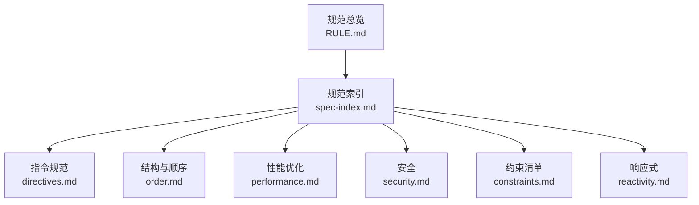
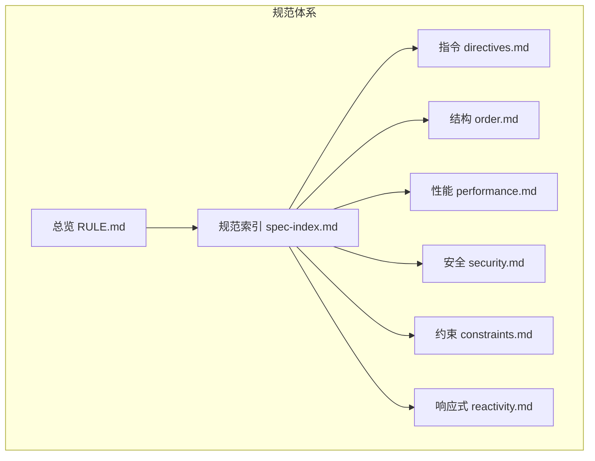
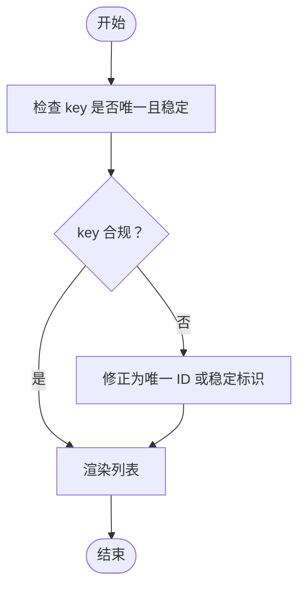
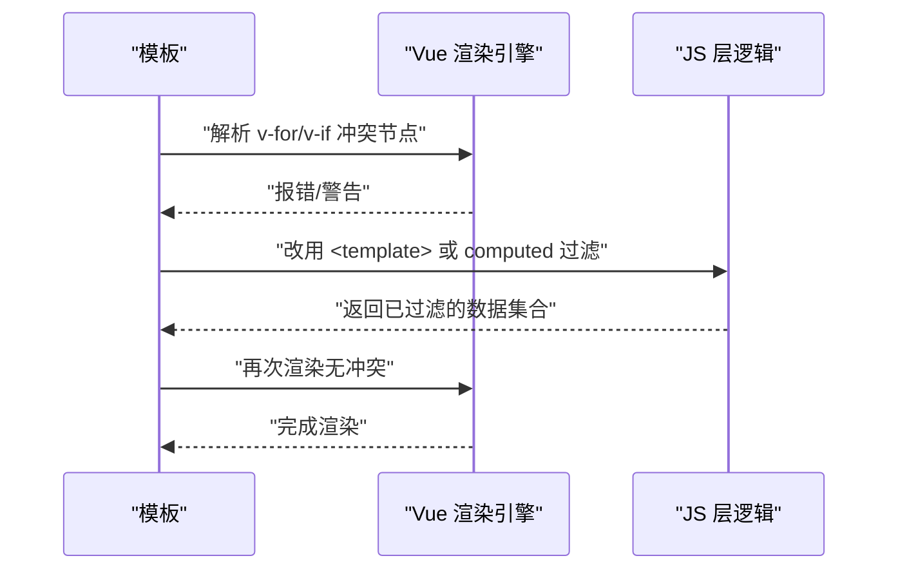
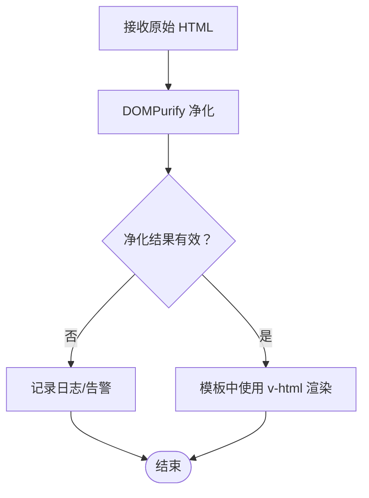
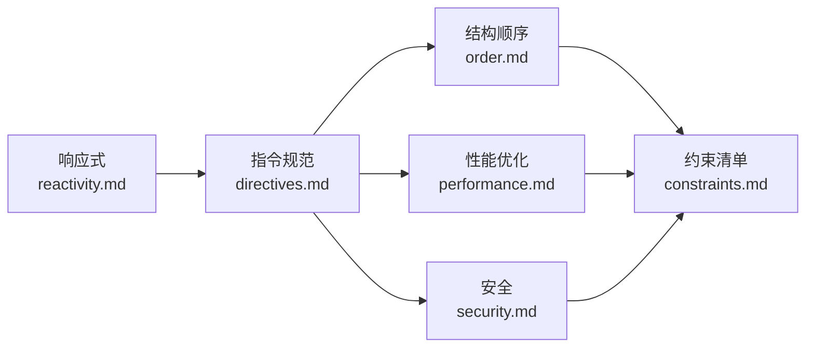

# 模板指令规范

<cite>
**本文引用的文件**
- [directives.md](file://rules/frontend-rules-vue3/references/directives.md)
- [performance.md](file://rules/frontend-rules-vue3/references/performance.md)
- [order.md](file://rules/frontend-rules-vue3/references/order.md)
- [security.md](file://skills/yy-frontend-vue3-review/references/security.md)
- [RULE.md](file://rules/frontend-rules-vue3/RULE.md)
- [spec-index.md](file://rules/frontend-rules-vue3/references/spec-index.md)
- [constraints.md](file://rules/frontend-rules-vue3/references/constraints.md)
- [reactivity.md](file://rules/frontend-rules-vue3/references/reactivity.md)
</cite>

## 目录
1. [简介](#简介)
2. [项目结构](#项目结构)
3. [核心组件](#核心组件)
4. [架构概览](#架构概览)
5. [详细组件分析](#详细组件分析)
6. [依赖分析](#依赖分析)
7. [性能考量](#性能考量)
8. [故障排查指南](#故障排查指南)
9. [结论](#结论)
10. [附录](#附录)

## 简介
本文件系统化梳理 Vue3 模板指令规范，聚焦以下关键主题：
- v-for 与 key 的正确使用与性能考量
- v-if 与 v-show 的区别与使用场景
- v-html 的安全风险与替代方案
- 指令简写形式与模板属性顺序要求
- 常见错误与最佳实践

目标是帮助开发者在保证正确性的前提下，写出高性能、可维护、可审查的模板代码。

## 项目结构
该规范来自 Vue3 前端规则集，围绕“模板指令”“结构顺序”“性能优化”“安全”等维度形成体系化的参考文件。核心文件分布如下：
- 指令规范：directives.md
- 结构与顺序：order.md
- 性能优化：performance.md
- 安全：security.md
- 规则总览：RULE.md
- 规范索引：spec-index.md
- 约束清单：constraints.md
- 响应式：reactivity.md

图表来源
- [RULE.md:1-68](file://rules/frontend-rules-vue3/RULE.md#L1-L68)
- [spec-index.md:1-60](file://rules/frontend-rules-vue3/references/spec-index.md#L1-L60)

章节来源
- [RULE.md:1-68](file://rules/frontend-rules-vue3/RULE.md#L1-L68)
- [spec-index.md:1-60](file://rules/frontend-rules-vue3/references/spec-index.md#L1-L60)

## 核心组件
本节从“指令正确性、性能与安全”的角度，提炼模板指令的关键要点与实施建议。

- v-for 与 key
  - 必须配合 key 使用，且 key 必须是唯一 ID；禁止使用 index 作为 key。
  - 选择唯一 ID 可显著提升列表重排、组件状态维护与 diff 算法效率。
  - 参考：[directives.md:7-18](file://rules/frontend-rules-vue3/references/directives.md#L7-L18)

- v-if 与 v-for 冲突
  - 禁止在同一元素上同时使用 v-if 与 v-for。
  - 推荐做法：使用 <template> 包裹；或通过 computed 预先过滤数据。
  - 参考：[directives.md:22-39](file://rules/frontend-rules-vue3/references/directives.md#L22-L39)

- v-show 与 v-if 的区别
  - v-if：条件不满足时不会渲染，具备更好的初始渲染性能与内存占用。
  - v-show：始终渲染，通过切换 CSS 显示/隐藏，适合频繁切换的场景。
  - 参考：[directives.md:86-87](file://rules/frontend-rules-vue3/references/directives.md#L86-L87)

- v-html 的安全
  - 可使用，但必须进行 XSS 防护（例如使用 DOMPurify 过滤）。
  - 参考：[directives.md:43-56](file://rules/frontend-rules-vue3/references/directives.md#L43-L56)，[security.md:7-11](file://skills/yy-frontend-vue3-review/references/security.md#L7-L11)

- 指令简写
  - 统一使用简写形式：v-bind:attr → :attr；v-on:event → @event；v-slot:name → #name。
  - 参考：[directives.md:60-76](file://rules/frontend-rules-vue3/references/directives.md#L60-L76)

- 模板属性顺序
  - HTML 元素属性顺序：is → v-for → v-if/v-else-if/v-else → v-show/v-cloak → id → props/attrs → v-on(@) → v-html/v-text → 动态 v-slot(#)
  - 参考：[directives.md:80-98](file://rules/frontend-rules-vue3/references/directives.md#L80-L98)

章节来源
- [directives.md:7-18](file://rules/frontend-rules-vue3/references/directives.md#L7-L18)
- [directives.md:22-39](file://rules/frontend-rules-vue3/references/directives.md#L22-L39)
- [directives.md:43-56](file://rules/frontend-rules-vue3/references/directives.md#L43-L56)
- [directives.md:60-76](file://rules/frontend-rules-vue3/references/directives.md#L60-L76)
- [directives.md:80-98](file://rules/frontend-rules-vue3/references/directives.md#L80-L98)
- [security.md:7-11](file://skills/yy-frontend-vue3-review/references/security.md#L7-L11)

## 架构概览
模板指令规范在整体规范体系中的定位与关联如下：

图表来源
- [RULE.md:1-68](file://rules/frontend-rules-vue3/RULE.md#L1-L68)
- [spec-index.md:1-60](file://rules/frontend-rules-vue3/references/spec-index.md#L1-L60)

## 详细组件分析

### v-for 与 key 的正确使用
- 选择原则
  - key 必须稳定、唯一、可预测，优先使用实体的唯一 ID。
  - 避免使用 index 作为 key，否则在列表插入/删除/排序时会导致组件状态错乱与性能下降。
- 性能考量
  - 合理的 key 可减少不必要的组件重建与 DOM diff 成本，提升交互流畅度。
- 常见错误
  - 在循环中使用数组下标或临时 ID。
  - 在动态列表中未更新 key。
- 最佳实践
  - 列表项具备唯一标识时，直接使用该标识作为 key。
  - 若无唯一标识，可在数据源层面补充稳定 ID。
  - 对于复杂列表，结合 computed 预先筛选/排序，减少不必要的渲染。

图表来源
- [directives.md:7-18](file://rules/frontend-rules-vue3/references/directives.md#L7-L18)

章节来源
- [directives.md:7-18](file://rules/frontend-rules-vue3/references/directives.md#L7-L18)

### v-if 与 v-for 冲突
- 冲突原因
  - 同一元素同时使用 v-if 与 v-for 会产生歧义：是先遍历再过滤，还是先判断再遍历？
- 解决方案
  - 使用 <template> 包裹 v-for，将 v-if 放在模板外层，确保先遍历再过滤。
  - 或者通过 computed 预先过滤数据，减少模板中的条件判断。
- 性能影响
  - 将过滤逻辑前置到 JS 层，可避免每次渲染都重复计算 v-if 条件，降低模板复杂度。

图表来源
- [directives.md:22-39](file://rules/frontend-rules-vue3/references/directives.md#L22-L39)

章节来源
- [directives.md:22-39](file://rules/frontend-rules-vue3/references/directives.md#L22-L39)

### v-show 与 v-if 的区别与使用场景
- v-if
  - 条件不满足时不渲染，初始渲染成本低，内存占用小。
  - 适合“极少出现”的场景，如权限控制、条件开关。
- v-show
  - 始终渲染，通过 CSS 控制显示/隐藏，切换成本低。
  - 适合“频繁切换”的场景，如 Tab 切换、侧边栏展开/收起。
- 选择建议
  - 频繁切换用 v-show；一次性渲染成本高的场景用 v-if。

章节来源
- [directives.md:86-87](file://rules/frontend-rules-vue3/references/directives.md#L86-L87)

### v-html 的安全风险与替代方案
- 安全风险
  - 直接渲染不受信任的 HTML 存在 XSS 风险。
- 防护措施
  - 使用 DOMPurify 等库对 HTML 进行净化，移除潜在恶意脚本。
  - 在模板中仅消费已净化的安全 HTML。
- 替代方案
  - 使用 v-text 输出纯文本。
  - 使用结构化数据与组件化渲染，避免拼接 HTML 字符串。
  - 对富文本内容采用受控组件或富文本编辑器插件。

图表来源
- [directives.md:43-56](file://rules/frontend-rules-vue3/references/directives.md#L43-L56)
- [security.md:7-11](file://skills/yy-frontend-vue3-review/references/security.md#L7-L11)

章节来源
- [directives.md:43-56](file://rules/frontend-rules-vue3/references/directives.md#L43-L56)
- [security.md:7-11](file://skills/yy-frontend-vue3-review/references/security.md#L7-L11)

### 指令简写与属性顺序
- 指令简写
  - v-bind:attr → :attr
  - v-on:event → @event
  - v-slot:name → #name
  - 统一简写可提升模板可读性与一致性。
- 属性顺序
  - is → v-for → v-if/v-else-if/v-else → v-show/v-cloak → id → props/attrs → v-on(@) → v-html/v-text → 动态 v-slot(#)
  - 保持统一顺序便于审查与维护。

章节来源
- [directives.md:60-76](file://rules/frontend-rules-vue3/references/directives.md#L60-L76)
- [directives.md:80-98](file://rules/frontend-rules-vue3/references/directives.md#L80-L98)

## 依赖分析
模板指令规范与其他规范模块存在强关联，共同构成前端工程的质量基线。

图表来源
- [directives.md:1-105](file://rules/frontend-rules-vue3/references/directives.md#L1-L105)
- [order.md:1-141](file://rules/frontend-rules-vue3/references/order.md#L1-L141)
- [performance.md:1-136](file://rules/frontend-rules-vue3/references/performance.md#L1-L136)
- [security.md:1-16](file://skills/yy-frontend-vue3-review/references/security.md#L1-L16)
- [constraints.md:1-45](file://rules/frontend-rules-vue3/references/constraints.md#L1-L45)
- [reactivity.md:1-227](file://rules/frontend-rules-vue3/references/reactivity.md#L1-L227)

章节来源
- [directives.md:1-105](file://rules/frontend-rules-vue3/references/directives.md#L1-L105)
- [order.md:1-141](file://rules/frontend-rules-vue3/references/order.md#L1-L141)
- [performance.md:1-136](file://rules/frontend-rules-vue3/references/performance.md#L1-L136)
- [security.md:1-16](file://skills/yy-frontend-vue3-review/references/security.md#L1-L16)
- [constraints.md:1-45](file://rules/frontend-rules-vue3/references/constraints.md#L1-L45)
- [reactivity.md:1-227](file://rules/frontend-rules-vue3/references/reactivity.md#L1-L227)

## 性能考量
- 模板层轻量化
  - 模板只负责展示，避免复杂表达式与逻辑；简单逻辑可内联，复杂逻辑使用 computed。
  - 参考：[performance.md:99-104](file://rules/frontend-rules-vue3/references/performance.md#L99-L104)
- 列表渲染优化
  - 使用稳定唯一的 key；长列表使用虚拟滚动；必要时通过 computed 预过滤。
  - 参考：[directives.md:7-18](file://rules/frontend-rules-vue3/references/directives.md#L7-L18)，[performance.md:35-49](file://rules/frontend-rules-vue3/references/performance.md#L35-L49)
- 避免不必要的渲染
  - v-if 与 v-show 的合理选择；将昂贵计算放入 computed；减少模板中的分支判断。
  - 参考：[directives.md:86-87](file://rules/frontend-rules-vue3/references/directives.md#L86-L87)，[reactivity.md:132-205](file://rules/frontend-rules-vue3/references/reactivity.md#L132-L205)

章节来源
- [performance.md:99-104](file://rules/frontend-rules-vue3/references/performance.md#L99-L104)
- [directives.md:7-18](file://rules/frontend-rules-vue3/references/directives.md#L7-L18)
- [performance.md:35-49](file://rules/frontend-rules-vue3/references/performance.md#L35-L49)
- [directives.md:86-87](file://rules/frontend-rules-vue3/references/directives.md#L86-L87)
- [reactivity.md:132-205](file://rules/frontend-rules-vue3/references/reactivity.md#L132-L205)

## 故障排查指南
- v-for 与 v-if 冲突
  - 症状：模板报错或渲染异常；列表状态错乱。
  - 处理：将 v-if 移至 <template> 外层或通过 computed 预过滤。
  - 参考：[directives.md:22-39](file://rules/frontend-rules-vue3/references/directives.md#L22-L39)
- 使用 index 作为 key
  - 症状：列表插入/删除/排序时组件状态错乱、性能下降。
  - 处理：改为唯一 ID；若无唯一 ID，补充稳定标识。
  - 参考：[directives.md:10-18](file://rules/frontend-rules-vue3/references/directives.md#L10-L18)，[constraints.md:15-16](file://rules/frontend-rules-vue3/references/constraints.md#L15-L16)
- v-html 导致 XSS
  - 症状：页面被注入脚本；用户会话被劫持。
  - 处理：使用 DOMPurify 净化；避免直接渲染不受信任内容。
  - 参考：[directives.md:43-56](file://rules/frontend-rules-vue3/references/directives.md#L43-L56)，[security.md:7-11](file://skills/yy-frontend-vue3-review/references/security.md#L7-L11)
- 模板属性顺序不一致
  - 症状：审查困难、维护成本上升。
  - 处理：统一顺序；借助工具链（如 Prettier）自动格式化。
  - 参考：[directives.md:80-98](file://rules/frontend-rules-vue3/references/directives.md#L80-L98)

章节来源
- [directives.md:22-39](file://rules/frontend-rules-vue3/references/directives.md#L22-L39)
- [directives.md:10-18](file://rules/frontend-rules-vue3/references/directives.md#L10-L18)
- [constraints.md:15-16](file://rules/frontend-rules-vue3/references/constraints.md#L15-L16)
- [directives.md:43-56](file://rules/frontend-rules-vue3/references/directives.md#L43-L56)
- [security.md:7-11](file://skills/yy-frontend-vue3-review/references/security.md#L7-L11)
- [directives.md:80-98](file://rules/frontend-rules-vue3/references/directives.md#L80-L98)

## 结论
- 指令正确性是模板质量的基石：key 选择、v-if/v-show 与 v-for 的搭配、v-html 的安全处理，均直接影响渲染性能与安全性。
- 规范统一带来可维护性：指令简写与属性顺序的统一，有助于团队协作与代码审查。
- 性能优化贯穿全栈：模板层的轻量化、列表渲染优化、计算逻辑前置，都是保障用户体验的关键。
- 安全是红线：任何涉及不受信任内容的渲染都必须进行安全处理。

## 附录
- 快速索引
  - 指令规范总览：[spec-index.md:18-21](file://rules/frontend-rules-vue3/references/spec-index.md#L18-L21)
  - 模板属性顺序：[directives.md:80-98](file://rules/frontend-rules-vue3/references/directives.md#L80-L98)
  - 约束清单（禁止项）：[constraints.md:3-16](file://rules/frontend-rules-vue3/references/constraints.md#L3-L16)