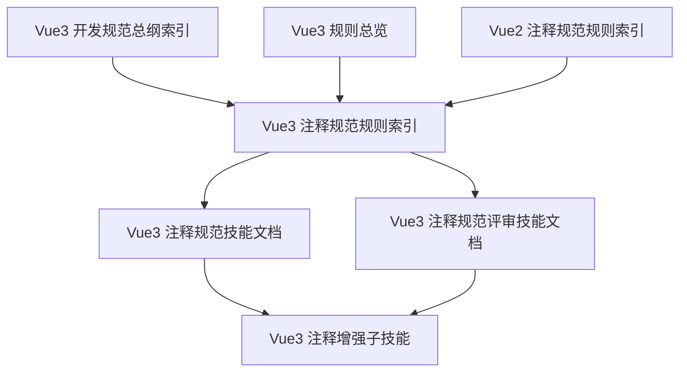
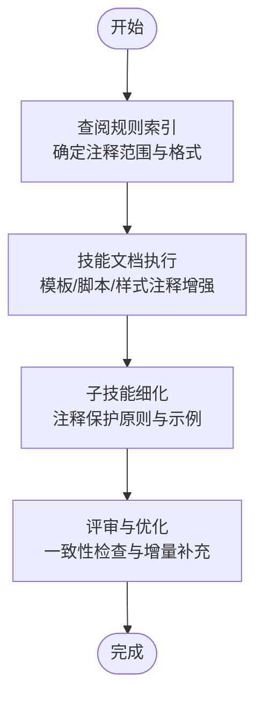
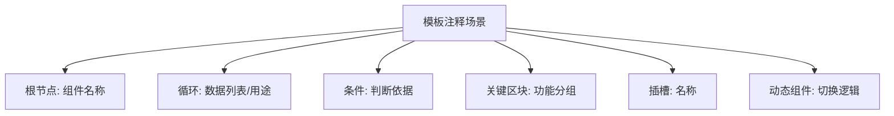
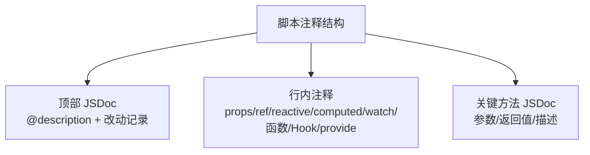
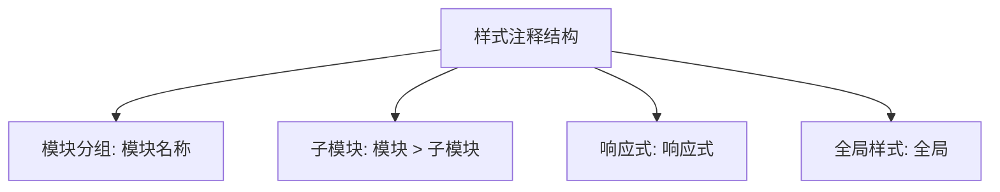
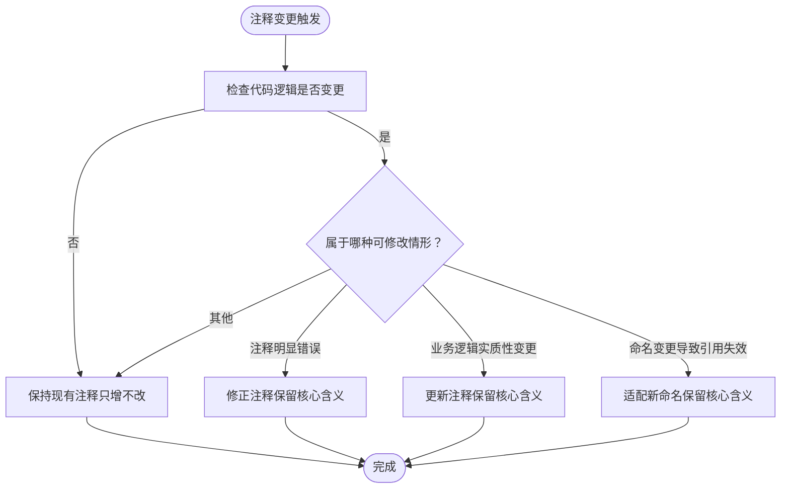
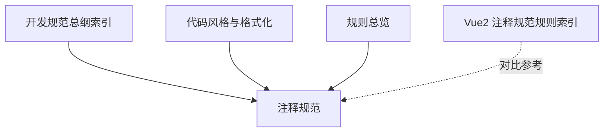

# 注释规范

<cite>
**本文引用的文件**
- [Vue3 注释规范（技能文档）](file://skills/yy-frontend-vue3-code-optimization/rules/comments.md)
- [Vue3 注释规范（评审技能文档）](file://skills/yy-frontend-vue3-review/rules/comments.md)
- [Vue3 注释规范（规则索引）](file://rules/frontend-rules-vue3/references/comments.md)
- [Vue3 注释增强子技能](file://skills/yy-frontend-vue3-code-optimization/sub-skills/comments.md)
- [Vue3 开发规范总纲（索引）](file://rules/frontend-rules-vue3/references/spec-index.md)
- [Vue3 代码风格与格式化](file://rules/frontend-rules-vue3/references/code-style.md)
- [Vue3 规则总览](file://rules/frontend-rules-vue3/RULE.md)
- [Vue2 注释规范（规则索引）](file://rules/frontend-rules-vue2/references/comments.md)
- [Vue2 规则总览](file://rules/frontend-rules-vue2/RULE.md)
- [yy-frontend-vue3-code-optimization 技能说明](file://skills/yy-frontend-vue3-code-optimization/SKILL.md)
</cite>

## 目录
1. [简介](#简介)
2. [项目结构](#项目结构)
3. [核心组件](#核心组件)
4. [架构概览](#架构概览)
5. [详细组件分析](#详细组件分析)
6. [依赖分析](#依赖分析)
7. [性能考虑](#性能考虑)
8. [故障排查指南](#故障排查指南)
9. [结论](#结论)
10. [附录](#附录)

## 简介
本文件系统化阐述 Vue3 单文件组件（SFC）中模板区、脚本区与样式区的注释规范，涵盖注释格式、使用场景、注释保护原则、维护责任与过时注释处理方式，并提供可操作的评估标准与示例路径，帮助团队统一注释风格、提升可读性与可维护性。

## 项目结构
围绕注释规范，仓库内形成了“规则索引 + 技能文档 + 子技能”的分层结构：
- 规则索引：提供注释规范的权威条目与导航
- 技能文档：面向自动化优化与评审的落地规则
- 子技能：细化注释增强的执行原则与示例

图表来源
- [Vue3 注释规范（规则索引）:1-83](file://rules/frontend-rules-vue3/references/comments.md#L1-L83)
- [Vue3 注释规范（技能文档）:1-83](file://skills/yy-frontend-vue3-code-optimization/rules/comments.md#L1-L83)
- [Vue3 注释规范（评审技能文档）:1-83](file://skills/yy-frontend-vue3-review/rules/comments.md#L1-L83)
- [Vue3 注释增强子技能:1-288](file://skills/yy-frontend-vue3-code-optimization/sub-skills/comments.md#L1-L288)
- [Vue3 开发规范总纲（索引）:1-60](file://rules/frontend-rules-vue3/references/spec-index.md#L1-L60)
- [Vue3 规则总览:1-68](file://rules/frontend-rules-vue3/RULE.md#L1-L68)
- [Vue2 注释规范（规则索引）:1-106](file://rules/frontend-rules-vue2/references/comments.md#L1-L106)

章节来源
- [Vue3 注释规范（规则索引）:1-83](file://rules/frontend-rules-vue3/references/comments.md#L1-L83)
- [Vue3 注释规范（技能文档）:1-83](file://skills/yy-frontend-vue3-code-optimization/rules/comments.md#L1-L83)
- [Vue3 注释规范（评审技能文档）:1-83](file://skills/yy-frontend-vue3-review/rules/comments.md#L1-L83)
- [Vue3 注释增强子技能:1-288](file://skills/yy-frontend-vue3-code-optimization/sub-skills/comments.md#L1-L288)
- [Vue3 开发规范总纲（索引）:1-60](file://rules/frontend-rules-vue3/references/spec-index.md#L1-L60)
- [Vue3 规则总览:1-68](file://rules/frontend-rules-vue3/RULE.md#L1-L68)
- [Vue2 注释规范（规则索引）:1-106](file://rules/frontend-rules-vue2/references/comments.md#L1-L106)

## 核心组件
- 模板区注释：用于标识根节点、循环、条件分支、关键区块、插槽节点与动态组件，统一采用 HTML 注释格式，便于在 DOM 中可见且易于定位。
- 脚本区注释：顶部使用 JSDoc（@description 等）概述组件职责、核心流程与关键数据来源；行内注释用于 props/ref/reactive/computed/watch/函数/Hook/provide 等，强调“中文描述、简洁明确”。
- 样式区注释：模块分组、子模块、响应式区块与全局样式需标注，便于样式层次与作用域管理。
- 注释保护原则：注释必须与代码行为保持一致；正确注释“只增不改”，仅在三种情形允许修改：注释明显错误、业务逻辑实质性变更、命名变更导致引用失效。

章节来源
- [Vue3 注释规范（规则索引）:7-83](file://rules/frontend-rules-vue3/references/comments.md#L7-L83)
- [Vue3 注释规范（技能文档）:7-83](file://skills/yy-frontend-vue3-code-optimization/rules/comments.md#L7-L83)
- [Vue3 注释规范（评审技能文档）:7-83](file://skills/yy-frontend-vue3-review/rules/comments.md#L7-L83)
- [Vue3 注释增强子技能:75-288](file://skills/yy-frontend-vue3-code-optimization/sub-skills/comments.md#L75-L288)

## 架构概览
注释规范在项目中的落地路径如下：
- 规则索引提供权威条目与导航
- 技能文档将规则转化为可执行的子技能
- 子技能细化注释增强的执行原则与示例
- 总纲与规则总览提供范围与优先级指引

图表来源
- [Vue3 注释规范（规则索引）:1-83](file://rules/frontend-rules-vue3/references/comments.md#L1-L83)
- [Vue3 注释规范（技能文档）:1-83](file://skills/yy-frontend-vue3-code-optimization/rules/comments.md#L1-L83)
- [Vue3 注释增强子技能:1-288](file://skills/yy-frontend-vue3-code-optimization/sub-skills/comments.md#L1-L288)
- [Vue3 规则总览:1-68](file://rules/frontend-rules-vue3/RULE.md#L1-L68)

## 详细组件分析

### 模板区注释
- 根节点：使用 HTML 注释标识组件名称，便于 DOM 定位与调试
- 循环节点：标注“循环: 描述”，帮助理解 v-for 的数据来源与用途
- 条件分支：标注“条件: 描述”，明确 v-if/v-show 的判断依据
- 关键区块：标注“区块名称”，用于分隔重要 UI 结构
- 插槽节点：标注“插槽: name”，明确具名插槽用途
- 动态组件：标注“动态组件: 描述”，说明切换逻辑或来源

图表来源
- [Vue3 注释规范（规则索引）:7-16](file://rules/frontend-rules-vue3/references/comments.md#L7-L16)
- [Vue3 注释增强子技能:75-110](file://skills/yy-frontend-vue3-code-optimization/sub-skills/comments.md#L75-L110)

章节来源
- [Vue3 注释规范（规则索引）:7-16](file://rules/frontend-rules-vue3/references/comments.md#L7-L16)
- [Vue3 注释增强子技能:75-110](file://skills/yy-frontend-vue3-code-optimization/sub-skills/comments.md#L75-L110)

### 脚本区注释
- 顶部 JSDoc：使用 @description 概述组件职责、核心业务流程与关键数据来源；每次修改需记录“改动时间”和“改动内容”，倒序排列
- 行内注释：用于 props、ref/reactive、computed、watch、函数、组件引入、Hook 引入、provide 等，统一“中文描述、简洁明确”
- 关键方法：必须添加 JSDoc（含参数、返回值、简要描述），行内注释 ≤1 行，JSDoc ≤5 行

图表来源
- [Vue3 注释规范（规则索引）:19-55](file://rules/frontend-rules-vue3/references/comments.md#L19-L55)
- [Vue3 注释规范（技能文档）:19-55](file://skills/yy-frontend-vue3-code-optimization/rules/comments.md#L19-L55)
- [Vue3 注释增强子技能:112-217](file://skills/yy-frontend-vue3-code-optimization/sub-skills/comments.md#L112-L217)

章节来源
- [Vue3 注释规范（规则索引）:19-55](file://rules/frontend-rules-vue3/references/comments.md#L19-L55)
- [Vue3 注释规范（技能文档）:19-55](file://skills/yy-frontend-vue3-code-optimization/rules/comments.md#L19-L55)
- [Vue3 注释增强子技能:112-217](file://skills/yy-frontend-vue3-code-optimization/sub-skills/comments.md#L112-L217)

### 样式区注释
- 模块分组：标注“模块名称”，用于区分功能模块
- 子模块：标注“模块 > 子模块”，体现层级关系
- 响应式：标注“响应式”，明确媒体查询或断点区域
- 全局样式：非 scoped 样式需标注“全局”，便于作用域管理

图表来源
- [Vue3 注释规范（规则索引）:59-67](file://rules/frontend-rules-vue3/references/comments.md#L59-L67)
- [Vue3 注释增强子技能:229-257](file://skills/yy-frontend-vue3-code-optimization/sub-skills/comments.md#L229-L257)

章节来源
- [Vue3 注释规范（规则索引）:59-67](file://rules/frontend-rules-vue3/references/comments.md#L59-L67)
- [Vue3 注释增强子技能:229-257](file://skills/yy-frontend-vue3-code-optimization/sub-skills/comments.md#L229-L257)

### 注释保护原则与维护责任
- 同步更新：代码逻辑变更时，对应注释必须同步更新，确保注释与代码行为一致
- 只增不改：已有注释若内容正确，禁止改动，仅在以下三种情况允许修改：
  1) 注释明显错误（与代码实际行为不符）
  2) 业务逻辑已发生实质性变更（旧注释不再适用）
  3) 命名变更导致旧注释引用了不存在的标识符
- 禁止修改的常见场景：注释风格不同、表述方式有差异但含义一致、注释正确但不够详细（应追加而非覆盖）

图表来源
- [Vue3 注释规范（规则索引）:70-83](file://rules/frontend-rules-vue3/references/comments.md#L70-L83)
- [Vue3 注释增强子技能:12-35](file://skills/yy-frontend-vue3-code-optimization/sub-skills/comments.md#L12-L35)

章节来源
- [Vue3 注释规范（规则索引）:70-83](file://rules/frontend-rules-vue3/references/comments.md#L70-L83)
- [Vue3 注释增强子技能:12-35](file://skills/yy-frontend-vue3-code-optimization/sub-skills/comments.md#L12-L35)

### 注释质量评估标准
- 准确性：注释描述与代码行为一致，无歧义
- 完整性：关键方法、复杂逻辑、特殊处理、Hook 使用等均有相应注释
- 一致性：格式统一、语言统一（中文）、长度控制（JSDoc ≤5 行，行内注释 ≤1 行）
- 可读性：描述简洁明确，避免冗余与模糊表述
- 可追溯性：脚本顶部 JSDoc 记录改动时间与改动内容，倒序排列

章节来源
- [Vue3 注释规范（规则索引）:33-55](file://rules/frontend-rules-vue3/references/comments.md#L33-L55)
- [Vue3 注释增强子技能:114-117](file://skills/yy-frontend-vue3-code-optimization/sub-skills/comments.md#L114-L117)

## 依赖分析
注释规范与其他规范模块存在紧密耦合：
- 与“开发规范总纲（索引）”共同构成规范体系，提供优先级与导航
- 与“代码风格与格式化”协同，确保注释与代码风格一致（如 Prettier 配置）
- 与“规则总览”关联，明确适用范围（.vue/.ts/.js/.css/.scss/.less）

图表来源
- [Vue3 开发规范总纲（索引）:1-60](file://rules/frontend-rules-vue3/references/spec-index.md#L1-L60)
- [Vue3 代码风格与格式化:1-61](file://rules/frontend-rules-vue3/references/code-style.md#L1-L61)
- [Vue3 规则总览:1-68](file://rules/frontend-rules-vue3/RULE.md#L1-L68)
- [Vue2 注释规范（规则索引）:1-106](file://rules/frontend-rules-vue2/references/comments.md#L1-L106)

章节来源
- [Vue3 开发规范总纲（索引）:1-60](file://rules/frontend-rules-vue3/references/spec-index.md#L1-L60)
- [Vue3 代码风格与格式化:1-61](file://rules/frontend-rules-vue3/references/code-style.md#L1-L61)
- [Vue3 规则总览:1-68](file://rules/frontend-rules-vue3/RULE.md#L1-L68)
- [Vue2 注释规范（规则索引）:1-106](file://rules/frontend-rules-vue2/references/comments.md#L1-L106)

## 性能考虑
- 注释本身不直接影响运行时性能，但良好的注释可减少理解成本，间接提升开发与维护效率
- 避免在注释中存放大量冗余信息，保持简洁与聚焦
- 在大规模组件中，优先保证关键路径与复杂逻辑的注释完整性

## 故障排查指南
- 注释与代码不一致：优先检查最近一次逻辑变更，同步更新注释
- 注释缺失：在关键方法、复杂判断、特殊业务逻辑、Hook 使用处补充注释
- 注释风格不统一：参照规则索引与子技能示例，统一格式与语言
- 过时注释处理：遵循“只增不改”原则；若确需修改，按可修改情形进行微调并保留核心含义

章节来源
- [Vue3 注释规范（规则索引）:70-83](file://rules/frontend-rules-vue3/references/comments.md#L70-L83)
- [Vue3 注释增强子技能:12-35](file://skills/yy-frontend-vue3-code-optimization/sub-skills/comments.md#L12-L35)

## 结论
通过统一模板区、脚本区与样式区的注释格式，强化注释保护原则与维护责任，团队可以显著提升代码可读性、可维护性与协作效率。建议在日常开发中严格执行“只增不改”与“同步更新”原则，并结合子技能示例进行持续优化。

## 附录
- 适用范围与优先级：参见“Vue3 规则总览”与“开发规范总纲（索引）”
- 代码风格与格式化：参见“代码风格与格式化”
- Vue2 注释规范（对比参考）：参见“Vue2 注释规范（规则索引）”

章节来源
- [Vue3 规则总览:1-68](file://rules/frontend-rules-vue3/RULE.md#L1-L68)
- [Vue3 开发规范总纲（索引）:1-60](file://rules/frontend-rules-vue3/references/spec-index.md#L1-L60)
- [Vue3 代码风格与格式化:1-61](file://rules/frontend-rules-vue3/references/code-style.md#L1-L61)
- [Vue2 注释规范（规则索引）:1-106](file://rules/frontend-rules-vue2/references/comments.md#L1-L106)