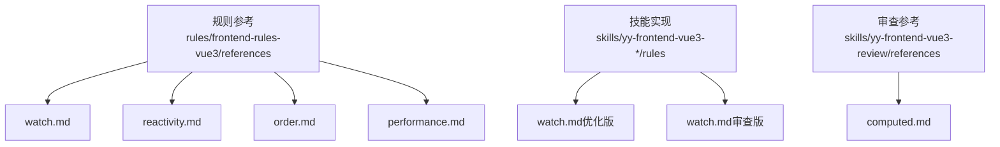
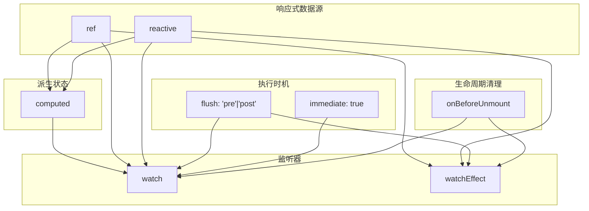
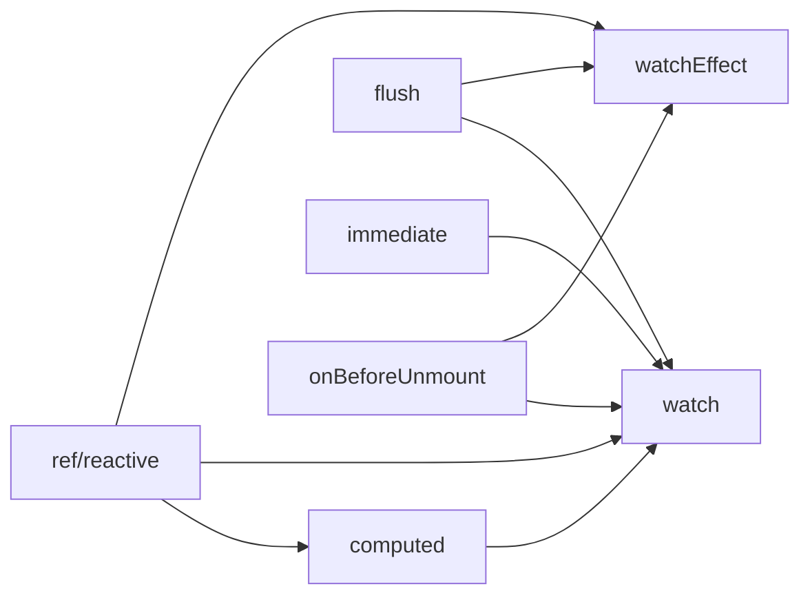

# 监听规范

<cite>
**本文引用的文件**
- [watch.md](file://rules/frontend-rules-vue3/references/watch.md)
- [reactivity.md](file://rules/frontend-rules-vue3/references/reactivity.md)
- [order.md](file://rules/frontend-rules-vue3/references/order.md)
- [performance.md](file://rules/frontend-rules-vue3/references/performance.md)
- [computed.md](file://skills/yy-frontend-vue3-review/references/computed.md)
- [watch.md（优化版）](file://skills/yy-frontend-vue3-code-optimization/rules/watch.md)
- [watch.md（审查版）](file://skills/yy-frontend-vue3-review/rules/watch.md)
</cite>

## 目录
1. [简介](#简介)
2. [项目结构](#项目结构)
3. [核心组件](#核心组件)
4. [架构总览](#架构总览)
5. [详细组件分析](#详细组件分析)
6. [依赖分析](#依赖分析)
7. [性能考量](#性能考量)
8. [故障排查指南](#故障排查指南)
9. [结论](#结论)
10. [附录](#附录)

## 简介
本规范系统化阐述 Vue3 监听体系：watch 与 watchEffect 的使用边界、深度监听与立即执行的配置、清理资源与内存泄漏防范、以及与 computed 的选择策略与性能权衡。目标是帮助团队建立一致、可维护且高性能的响应式监听实践。

## 项目结构
本仓库围绕 Vue3 前端规则与最佳实践构建，监听规范相关内容主要分布在以下位置：
- 规则参考：rules/frontend-rules-vue3/references 下的 watch.md、reactivity.md、order.md、performance.md
- 技能实现：skills/yy-frontend-vue3-code-optimization/rules 与 skills/yy-frontend-vue3-review/rules 下的 watch.md
- 审查参考：skills/yy-frontend-vue3-review/references 下的 computed.md

图表来源
- [watch.md:1-154](file://rules/frontend-rules-vue3/references/watch.md#L1-L154)
- [reactivity.md:1-227](file://rules/frontend-rules-vue3/references/reactivity.md#L1-L227)
- [order.md:1-141](file://rules/frontend-rules-vue3/references/order.md#L1-L141)
- [performance.md:1-136](file://rules/frontend-rules-vue3/references/performance.md#L1-L136)
- [watch.md（优化版）:1-154](file://skills/yy-frontend-vue3-code-optimization/rules/watch.md#L1-L154)
- [watch.md（审查版）:1-154](file://skills/yy-frontend-vue3-review/rules/watch.md#L1-L154)
- [computed.md:1-22](file://skills/yy-frontend-vue3-review/references/computed.md#L1-L22)

章节来源
- [watch.md:1-154](file://rules/frontend-rules-vue3/references/watch.md#L1-L154)
- [reactivity.md:1-227](file://rules/frontend-rules-vue3/references/reactivity.md#L1-L227)
- [order.md:1-141](file://rules/frontend-rules-vue3/references/order.md#L1-L141)
- [performance.md:1-136](file://rules/frontend-rules-vue3/references/performance.md#L1-L136)
- [watch.md（优化版）:1-154](file://skills/yy-frontend-vue3-code-optimization/rules/watch.md#L1-L154)
- [watch.md（审查版）:1-154](file://skills/yy-frontend-vue3-review/rules/watch.md#L1-L154)
- [computed.md:1-22](file://skills/yy-frontend-vue3-review/references/computed.md#L1-L22)

## 核心组件
- 监听器：watch 与 watchEffect
- 派生状态：computed
- 响应式基础：ref 与 reactive
- 代码组织与顺序：在 script setup 内部的声明顺序
- 性能与清理：flush 时机、防抖节流、资源清理

章节来源
- [watch.md:15-102](file://rules/frontend-rules-vue3/references/watch.md#L15-L102)
- [reactivity.md:132-205](file://rules/frontend-rules-vue3/references/reactivity.md#L132-L205)
- [order.md:29-31](file://rules/frontend-rules-vue3/references/order.md#L29-L31)
- [performance.md:53-82](file://rules/frontend-rules-vue3/references/performance.md#L53-L82)

## 架构总览
下图展示了监听体系在组件中的位置与相互关系：watch 与 watchEffect 作为副作用执行器，computed 作为纯派生状态，ref/reactive 提供响应式数据源，flush 与 immediate 控制执行时机，onBeforeUnmount 等生命周期负责清理。

图表来源
- [watch.md:37-51](file://rules/frontend-rules-vue3/references/watch.md#L37-L51)
- [reactivity.md:132-205](file://rules/frontend-rules-vue3/references/reactivity.md#L132-L205)
- [order.md:29-31](file://rules/frontend-rules-vue3/references/order.md#L29-L31)
- [performance.md:107-111](file://rules/frontend-rules-vue3/references/performance.md#L107-L111)

## 详细组件分析

### watch 与 watchEffect 的区别与选择
- 依赖声明：watch 显式指定监听源，watchEffect 自动追踪依赖
- 新旧值：watch 可获取新旧值，watchEffect 无法获取
- 执行时机：watch 默认惰性，可通过 immediate:true 立即执行；watchEffect 立即执行
- 适用场景：精确控制监听源用 watch；简单副作用用 watchEffect
- 推荐策略：优先使用 watch，需要自动追踪时使用 watchEffect

章节来源
- [watch.md:92-102](file://rules/frontend-rules-vue3/references/watch.md#L92-L102)
- [watch.md（优化版）:92-102](file://skills/yy-frontend-vue3-code-optimization/rules/watch.md#L92-L102)
- [watch.md（审查版）:92-102](file://skills/yy-frontend-vue3-review/rules/watch.md#L92-L102)

### 深度监听与立即执行
- 深度监听：对象/数组变化必须显式声明 deep: true
- 立即执行：初始化即触发时添加 immediate: true
- 刷新时机：flush: 'post'（默认 'pre'，DOM 更新前）

章节来源
- [watch.md:9-11](file://rules/frontend-rules-vue3/references/watch.md#L9-L11)
- [watch.md:37-51](file://rules/frontend-rules-vue3/references/watch.md#L37-L51)
- [watch.md（优化版）:37-51](file://skills/yy-frontend-vue3-code-optimization/rules/watch.md#L37-L51)
- [watch.md（审查版）:37-51](file://skills/yy-frontend-vue3-review/rules/watch.md#L37-L51)

### 监听器与 computed 的选择策略
- 优先使用 computed 替代 watch 中的派生逻辑，利用缓存机制
- computed 应为纯函数，避免副作用（如修改响应式数据、发起网络请求）
- 命名建议使用 is/has/visible 等语义化前缀
- 复杂逻辑建议 try/catch 包裹并返回安全 fallback

章节来源
- [watch.md:86-89](file://rules/frontend-rules-vue3/references/watch.md#L86-L89)
- [reactivity.md:132-205](file://rules/frontend-rules-vue3/references/reactivity.md#L132-L205)
- [computed.md:7-22](file://skills/yy-frontend-vue3-review/references/computed.md#L7-L22)

### 清理资源与内存泄漏防范
- 定时器：在 watch 分支中创建与清理，组件销毁时再次清理
- 事件监听：在 watch 分支中注册与移除，组件销毁时再次移除
- 生命周期：统一在 onBeforeUnmount 中清理未完成任务、定时器、事件监听器

章节来源
- [watch.md:105-147](file://rules/frontend-rules-vue3/references/watch.md#L105-L147)
- [watch.md（优化版）:105-147](file://skills/yy-frontend-vue3-code-optimization/rules/watch.md#L105-L147)
- [watch.md（审查版）:105-147](file://skills/yy-frontend-vue3-review/rules/watch.md#L105-L147)

### 代码组织与顺序
- 在 script setup 内部，按功能模块分组，模块内顺序：ref/reactive → computed → 方法 → watch → 生命周期钩子
- 有助于提升可读性与可维护性，便于定位监听器与副作用

章节来源
- [order.md:29-31](file://rules/frontend-rules-vue3/references/order.md#L29-L31)

### 性能与执行时机
- flush: 'post' 可避免在 DOM 更新前进行昂贵操作
- 频繁触发场景使用防抖/节流（如搜索框输入、滚动事件、窗口 resize）
- 优先使用 computed 派生状态，减少 watch 滥用
- 大型数据列表考虑 shallowRef 减少深层响应式开销

章节来源
- [watch.md:37-51](file://rules/frontend-rules-vue3/references/watch.md#L37-L51)
- [performance.md:53-82](file://rules/frontend-rules-vue3/references/performance.md#L53-L82)
- [performance.md:107-111](file://rules/frontend-rules-vue3/references/performance.md#L107-L111)

## 依赖分析
- 监听器依赖响应式数据源（ref/reactive）与 computed
- computed 依赖于 ref/reactive 的稳定输入
- watch 与 watchEffect 依赖 flush 与 immediate 控制执行时机
- 生命周期钩子负责清理资源，防止内存泄漏

图表来源
- [watch.md:37-51](file://rules/frontend-rules-vue3/references/watch.md#L37-L51)
- [reactivity.md:132-205](file://rules/frontend-rules-vue3/references/reactivity.md#L132-L205)
- [order.md:29-31](file://rules/frontend-rules-vue3/references/order.md#L29-L31)

## 性能考量
- 优先使用 computed 派生状态，减少 watch 滥用
- 使用防抖/节流控制高频事件
- 合理设置 flush 时机，避免在 DOM 更新前执行昂贵操作
- 大型数据列表考虑 shallowRef，减少深层响应式开销

章节来源
- [performance.md:107-111](file://rules/frontend-rules-vue3/references/performance.md#L107-L111)
- [performance.md:53-82](file://rules/frontend-rules-vue3/references/performance.md#L53-L82)

## 故障排查指南
- 常见陷阱
  - 对象/数组变化未声明 deep: true 导致未触发
  - 初始化未触发逻辑却期望立即执行
  - 在 watch 中执行同步 DOM 操作导致性能问题
  - 忘记清理定时器、事件监听器导致内存泄漏
- 排查步骤
  - 确认监听源是否正确声明（ref/reactive/computed）
  - 检查是否需要 deep: true 与 immediate: true
  - 检查 flush 时机是否合适
  - 在 onBeforeUnmount 中统一清理资源

章节来源
- [watch.md:9-11](file://rules/frontend-rules-vue3/references/watch.md#L9-L11)
- [watch.md:105-147](file://rules/frontend-rules-vue3/references/watch.md#L105-L147)
- [performance.md:107-111](file://rules/frontend-rules-vue3/references/performance.md#L107-L111)

## 结论
- 优先使用 watch，需要自动追踪时使用 watchEffect
- 对象/数组变化必须声明 deep: true；初始化需触发时添加 immediate: true
- 优先使用 computed 替代 watch 中的派生逻辑，利用缓存机制
- 在 onBeforeUnmount 中统一清理定时器、事件监听器等资源
- 合理设置 flush 时机，结合防抖/节流与 shallowRef 等手段优化性能

## 附录
- 最佳实践清单
  - 监听器注释规范：以“// watch:”开头，简述监听目的
  - 代码组织：ref/reactive → computed → 方法 → watch → 生命周期钩子
  - 性能优化：优先 computed、防抖/节流、合理 flush 时机、shallowRef
  - 资源清理：watch 分支内创建/注册，组件销毁时再次清理

章节来源
- [watch.md:53-62](file://rules/frontend-rules-vue3/references/watch.md#L53-L62)
- [order.md:29-31](file://rules/frontend-rules-vue3/references/order.md#L29-L31)
- [performance.md:53-82](file://rules/frontend-rules-vue3/references/performance.md#L53-L82)