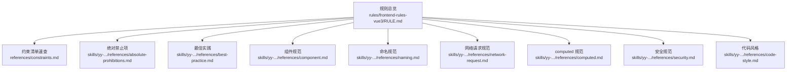
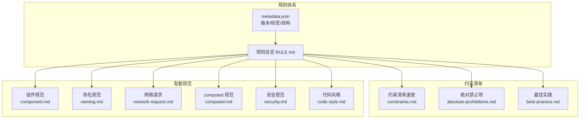
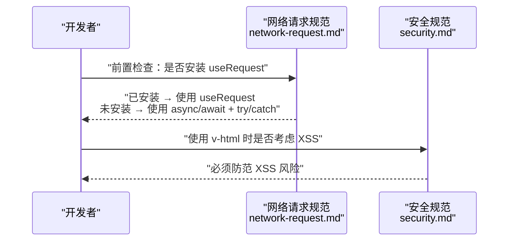
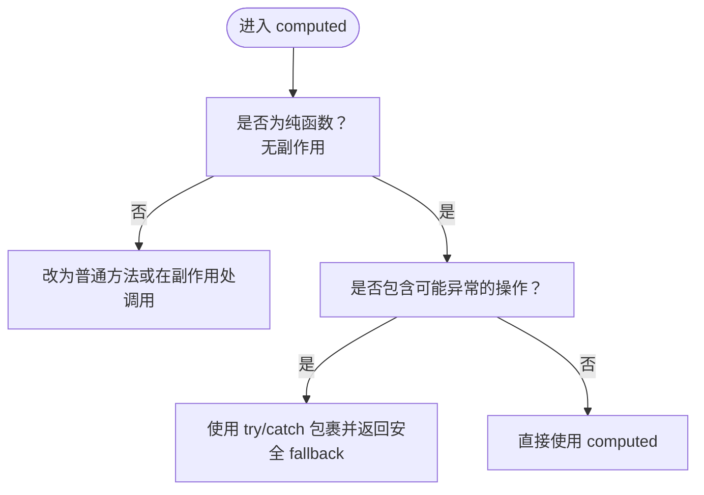
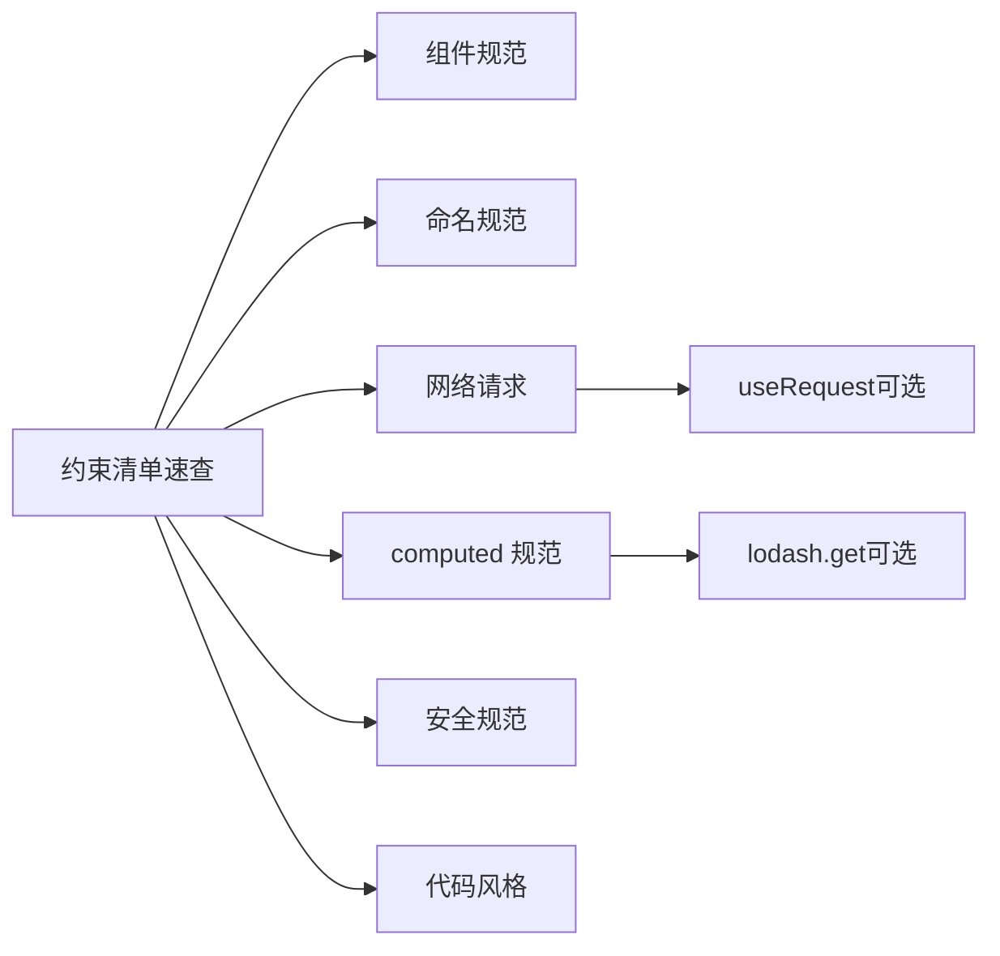

# 约束清单

<cite>
**本文档引用的文件**
- [RULE.md](file://rules/frontend-rules-vue3/RULE.md)
- [metadata.json](file://rules/frontend-rules-vue3/metadata.json)
- [constraints.md](file://rules/frontend-rules-vue3/references/constraints.md)
- [absolute-prohibitions.md](file://skills/yy-frontend-vue3-review/references/absolute-prohibitions.md)
- [best-practice.md](file://skills/yy-frontend-vue3-review/references/best-practice.md)
- [component.md](file://skills/yy-frontend-vue3-review/references/component.md)
- [computed.md](file://skills/yy-frontend-vue3-review/references/computed.md)
- [naming.md](file://skills/yy-frontend-vue3-review/references/naming.md)
- [network-request.md](file://skills/yy-frontend-vue3-review/references/network-request.md)
- [security.md](file://skills/yy-frontend-vue3-review/references/security.md)
- [code-style.md](file://skills/yy-frontend-vue3-review/references/code-style.md)
</cite>

## 目录
1. [简介](#简介)
2. [项目结构](#项目结构)
3. [核心组件](#核心组件)
4. [架构总览](#架构总览)
5. [详细组件分析](#详细组件分析)
6. [依赖分析](#依赖分析)
7. [性能考虑](#性能考虑)
8. [故障排查指南](#故障排查指南)
9. [结论](#结论)
10. [附录](#附录)

## 简介
本文件面向 Vue3 Composition API 项目，系统化梳理“约束清单”：10 项绝对禁止、5 项推荐、2 项不推荐，以及适用范围与例外说明。目标是帮助团队在开发过程中规避常见风险，统一代码风格与最佳实践，提升可维护性与安全性。

## 项目结构
- 规则主入口与模块索引位于前端规则 Vue3 的根文件，按“基础/强烈推荐/风格指南”三级组织。
- 约束清单速查位于 references 目录，配套“绝对禁止”“最佳实践”“组件规范”“命名规范”“网络请求”“computed 规范”“安全”“代码风格”等子模块，形成闭环。

图表来源
- [RULE.md:1-68](file://rules/frontend-rules-vue3/RULE.md#L1-L68)
- [constraints.md:1-45](file://rules/frontend-rules-vue3/references/constraints.md#L1-L45)
- [absolute-prohibitions.md:1-23](file://skills/yy-frontend-vue3-review/references/absolute-prohibitions.md#L1-L23)
- [best-practice.md:1-123](file://skills/yy-frontend-vue3-review/references/best-practice.md#L1-L123)
- [component.md:1-105](file://skills/yy-frontend-vue3-review/references/component.md#L1-L105)
- [naming.md:1-33](file://skills/yy-frontend-vue3-review/references/naming.md#L1-L33)
- [network-request.md:1-39](file://skills/yy-frontend-vue3-review/references/network-request.md#L1-L39)
- [computed.md:1-22](file://skills/yy-frontend-vue3-review/references/computed.md#L1-L22)
- [security.md:1-16](file://skills/yy-frontend-vue3-review/references/security.md#L1-L16)
- [code-style.md:1-71](file://skills/yy-frontend-vue3-review/references/code-style.md#L1-L71)

章节来源
- [RULE.md:1-68](file://rules/frontend-rules-vue3/RULE.md#L1-L68)
- [metadata.json:1-17](file://rules/frontend-rules-vue3/metadata.json#L1-L17)

## 核心组件
- 约束清单速查：明确列出 10 项绝对禁止、5 项推荐、2 项不推荐与注意事项，作为一线开发的“行为守则”。
- 绝对禁止项：涉及数据解构、父子组件状态修改、props 修改、混入、命名、this 使用、Options API、v-for 与 v-if 同元素、key 使用等。
- 推荐项：函数 try/catch、async/await、computed 优先、watch 深度/立即监听、可复用逻辑抽离为 Hooks。
- 不推荐项：多层 try/catch 嵌套、生命周期 emit、可选链、CSS 原生嵌套、:has() 伪类等。

章节来源
- [constraints.md:1-45](file://rules/frontend-rules-vue3/references/constraints.md#L1-L45)
- [absolute-prohibitions.md:1-23](file://skills/yy-frontend-vue3-review/references/absolute-prohibitions.md#L1-L23)
- [best-practice.md:1-123](file://skills/yy-frontend-vue3-review/references/best-practice.md#L1-L123)

## 架构总览
下图展示“约束清单”在整体规则体系中的定位与与其他模块的关系：

图表来源
- [RULE.md:1-68](file://rules/frontend-rules-vue3/RULE.md#L1-L68)
- [metadata.json:1-17](file://rules/frontend-rules-vue3/metadata.json#L1-L17)
- [constraints.md:1-45](file://rules/frontend-rules-vue3/references/constraints.md#L1-L45)
- [absolute-prohibitions.md:1-23](file://skills/yy-frontend-vue3-review/references/absolute-prohibitions.md#L1-L23)
- [best-practice.md:1-123](file://skills/yy-frontend-vue3-review/references/best-practice.md#L1-L123)
- [component.md:1-105](file://skills/yy-frontend-vue3-review/references/component.md#L1-L105)
- [naming.md:1-33](file://skills/yy-frontend-vue3-review/references/naming.md#L1-L33)
- [network-request.md:1-39](file://skills/yy-frontend-vue3-review/references/network-request.md#L1-L39)
- [computed.md:1-22](file://skills/yy-frontend-vue3-review/references/computed.md#L1-L22)
- [security.md:1-16](file://skills/yy-frontend-vue3-review/references/security.md#L1-L16)
- [code-style.md:1-71](file://skills/yy-frontend-vue3-review/references/code-style.md#L1-L71)

## 详细组件分析

### 一、10 项绝对禁止（红线）
- 连续数据解构：禁止深层链式解构，降低可读性与健壮性。
- 父组件修改子组件数据：破坏单向数据流，引发状态不可控。
- 修改 ref/reactive 类型：后端给什么用什么，避免类型漂移。
- 修改 props：props 只读访问，使用 emit 与父组件协作。
- 使用 mixins：Composition API 时代，优先 Hooks/组合式函数。
- 无意义命名：如 data1、temp2，降低可读性与可维护性。
- 在 <script setup> 中使用 this：Composition API 不提供 this 上下文。
- 使用 Options API：统一采用 <script setup> + 组合式 API。
- v-for 与 v-if 同元素：可能导致不必要的重复渲染或逻辑混乱。
- index 作为 key：必须使用唯一 ID，避免列表重排错乱。

章节来源
- [constraints.md:5-16](file://rules/frontend-rules-vue3/references/constraints.md#L5-L16)
- [absolute-prohibitions.md:11-22](file://skills/yy-frontend-vue3-review/references/absolute-prohibitions.md#L11-L22)
- [component.md:13-14](file://skills/yy-frontend-vue3-review/references/component.md#L13-L14)
- [component.md:62-63](file://skills/yy-frontend-vue3-review/references/component.md#L62-L63)

### 二、5 项推荐（建议统一）
- 函数 try/catch：包裹函数内容，catch 中使用 console.warn，避免异常吞掉。
- async/await：少用 .then 链式写法，提升可读性与调试体验。
- computed 优先：能用 computed 解决的，避免频繁 ref/reactive 变更。
- watch 深度/立即监听：按需使用 deep/immediate，避免性能浪费。
- Hooks 抽离：可复用逻辑超过 30 行或跨 2+ 组件，必须抽离为 Hook。

章节来源
- [constraints.md:22-26](file://rules/frontend-rules-vue3/references/constraints.md#L22-L26)
- [best-practice.md:36-36](file://skills/yy-frontend-vue3-review/references/best-practice.md#L36-L36)
- [best-practice.md:44-45](file://skills/yy-frontend-vue3-review/references/best-practice.md#L44-L45)
- [component.md:88-92](file://skills/yy-frontend-vue3-review/references/component.md#L88-L92)

### 三、2 项不推荐（尽量避免）
- 多层 try/catch 嵌套：异步操作尽量扁平化，提升可读性与可维护性。
- 生命周期 emit：不推荐在生命周期中主动向外 emit，避免副作用。
- 可选链操作符 ?..：不推荐 a?.b?.c，建议使用 lodash get 替代以增强健壮性。
- CSS 原生嵌套：不推荐直接使用原生嵌套，需经 PostCSS 编译后使用。
- :has() 伪类：Safari 15.4-15.6 存在严重渲染 Bug，谨慎在生产使用。

章节来源
- [constraints.md:32-36](file://rules/frontend-rules-vue3/references/constraints.md#L32-L36)
- [best-practice.md:106-114](file://skills/yy-frontend-vue3-review/references/best-practice.md#L106-L114)

### 四、适用范围与例外说明
- 适用范围：所有 src 目录下的 .vue/.ts/.js/.css/.scss/.less 文件；仅允许操作 src 目录；适用于 Vue3 单文件组件的模板区、<script setup> 脚本区、样式区。
- 例外与注意事项：
  - 未使用变量：ESLint 已关闭检查，需自行清理。
  - v-html：可使用，但必须防范 XSS 风险。
  - 等于运算符：使用 == 不视为问题。
  - 注释检查：注释相关问题默认忽略。
  - 不要过度封装：简单逻辑直接写在 template 中。

章节来源
- [RULE.md:18-22](file://rules/frontend-rules-vue3/RULE.md#L18-L22)
- [constraints.md:40-44](file://rules/frontend-rules-vue3/references/constraints.md#L40-L44)
- [security.md:9-9](file://skills/yy-frontend-vue3-review/references/security.md#L9-L9)

### 五、关键流程与示例路径（对比说明）
以下通过序列图展示“网络请求”与“computed 使用”的正确与常见错误对比思路（示例路径，不展示具体代码内容）：

图表来源
- [network-request.md:9-12](file://skills/yy-frontend-vue3-review/references/network-request.md#L9-L12)
- [network-request.md:16-25](file://skills/yy-frontend-vue3-review/references/network-request.md#L16-L25)
- [security.md:9-9](file://skills/yy-frontend-vue3-review/references/security.md#L9-L9)

图表来源
- [computed.md:7-21](file://skills/yy-frontend-vue3-review/references/computed.md#L7-L21)

## 依赖分析
- 模块耦合关系：约束清单速查作为“行为守则”，与“组件规范”“命名规范”“网络请求”“computed 规范”“安全规范”“代码风格”等模块强关联，共同构成开发基线。
- 外部依赖：PostCSS/Autoprefixer、useRequest（ahooks-vue/vue-hooks-plus）、lodash（get）等工具链影响实现细节与可选方案。

图表来源
- [constraints.md:1-45](file://rules/frontend-rules-vue3/references/constraints.md#L1-L45)
- [component.md:1-105](file://skills/yy-frontend-vue3-review/references/component.md#L1-L105)
- [naming.md:1-33](file://skills/yy-frontend-vue3-review/references/naming.md#L1-L33)
- [network-request.md:1-39](file://skills/yy-frontend-vue3-review/references/network-request.md#L1-L39)
- [computed.md:1-22](file://skills/yy-frontend-vue3-review/references/computed.md#L1-L22)
- [security.md:1-16](file://skills/yy-frontend-vue3-review/references/security.md#L1-L16)
- [code-style.md:1-71](file://skills/yy-frontend-vue3-review/references/code-style.md#L1-L71)

## 性能考虑
- 推荐使用 computed 优先，减少不必要的响应式变更与重渲染。
- 合理使用 watch 的 deep/immediate，避免深度遍历与初始触发带来的开销。
- 组件懒加载与 KeepAlive 缓存结合使用，平衡首屏与交互性能。
- CSS 布局优先使用 padding-top/padding-left 等方向性属性，减少 margin-top 带来的塌陷与重排风险。

章节来源
- [best-practice.md:76-82](file://skills/yy-frontend-vue3-review/references/best-practice.md#L76-L82)
- [best-practice.md:98-100](file://skills/yy-frontend-vue3-review/references/best-practice.md#L98-L100)

## 故障排查指南
- 网络请求异常：优先检查是否安装 useRequest；若未安装，确保使用 async/await + try/catch/finally 并进行统一响应处理。
- XSS 风险：使用 v-html 时必须进行输入校验与输出转义。
- computed 异常：对可能抛出异常的逻辑使用 try/catch 包裹并返回安全 fallback。
- 命名问题：避免无意义命名，遵循小驼峰、PascalCase、全大写下划线等规范。
- 组件通信：Props 只读访问，通过 emit 与父组件协作；避免直接修改子组件状态。

章节来源
- [network-request.md:16-38](file://skills/yy-frontend-vue3-review/references/network-request.md#L16-L38)
- [security.md:9-9](file://skills/yy-frontend-vue3-review/references/security.md#L9-L9)
- [computed.md:19-21](file://skills/yy-frontend-vue3-review/references/computed.md#L19-L21)
- [naming.md:30-32](file://skills/yy-frontend-vue3-review/references/naming.md#L30-L32)
- [component.md:52-64](file://skills/yy-frontend-vue3-review/references/component.md#L52-L64)

## 结论
- 约束清单是 Vue3 项目开发的“高压线”，必须严格遵守；推荐项与不推荐项提供了可落地的改进方向。
- 在实际工程中，建议将“约束清单”纳入代码评审与自动化检查流程，持续优化团队交付质量与一致性。

## 附录
- 快速导航（来自规则总览）：涵盖规范总纲、组件开发、交互通信、模板指令、结构顺序、命名规范、Hooks、响应式、监听、网络请求、代码风格、注释、CSS/BEM、TypeScript、性能、约束清单等模块。

章节来源
- [RULE.md:50-67](file://rules/frontend-rules-vue3/RULE.md#L50-L67)