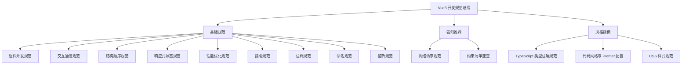
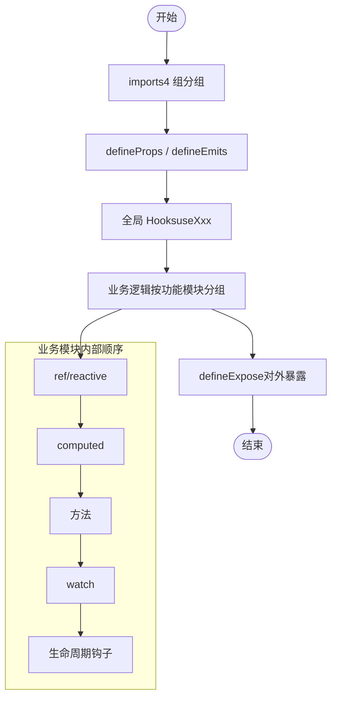
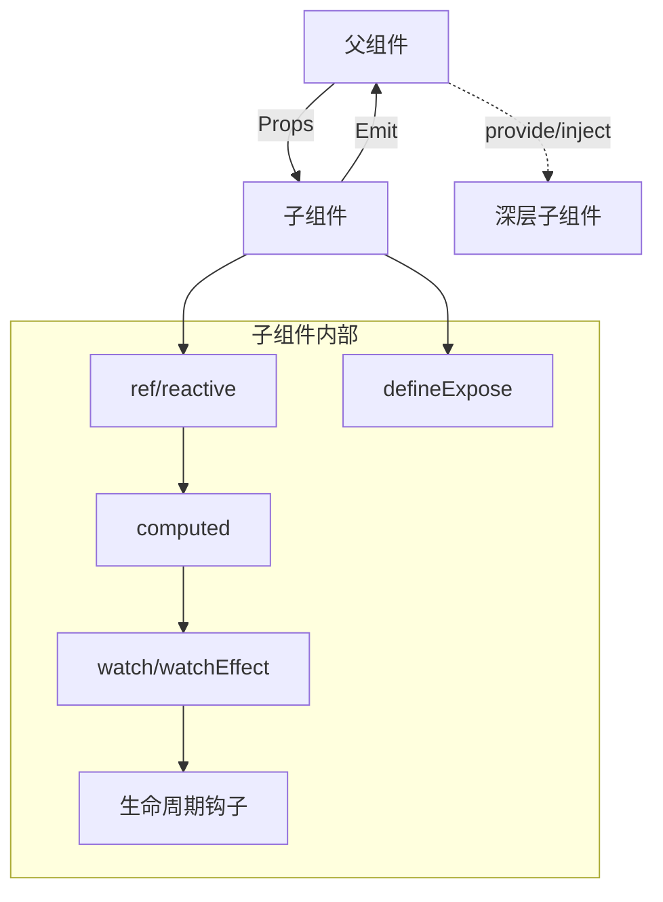
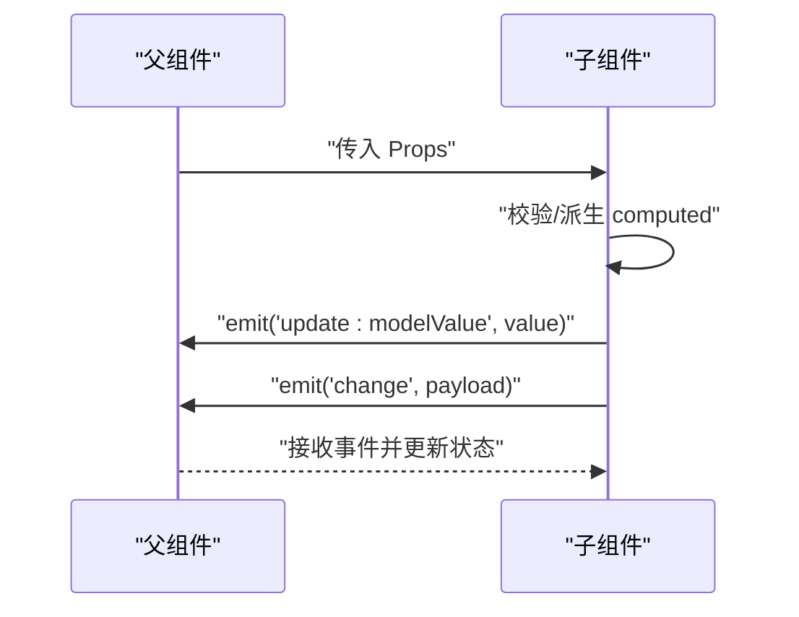
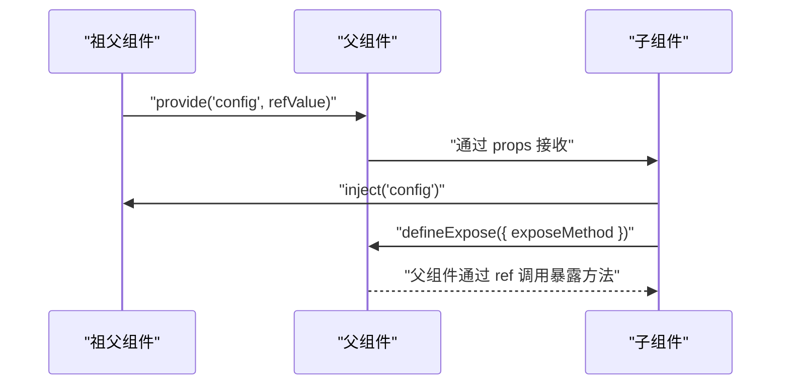
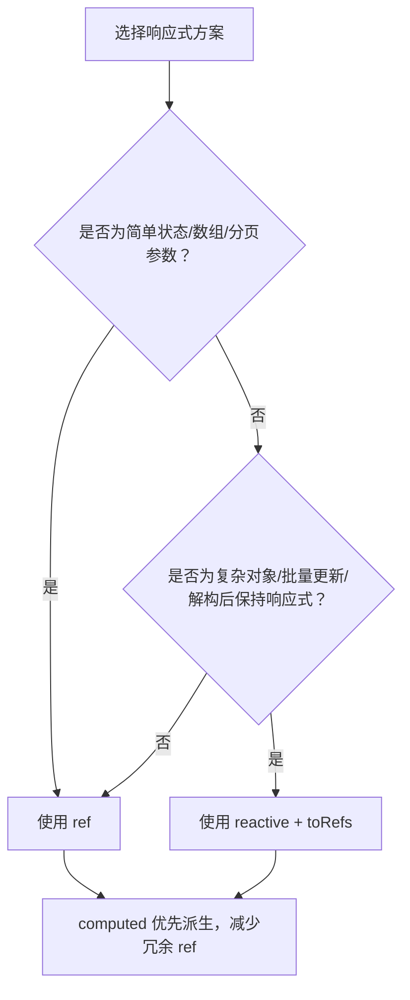
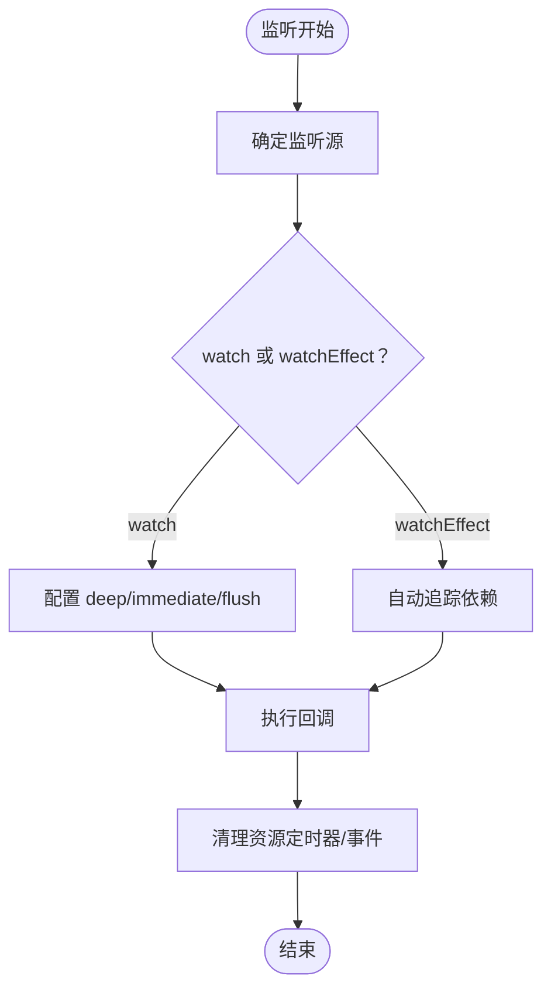
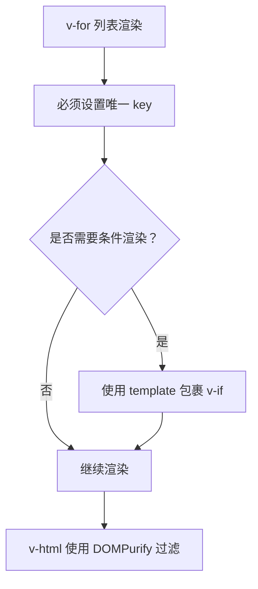
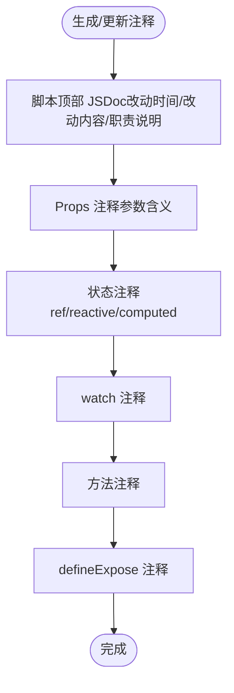
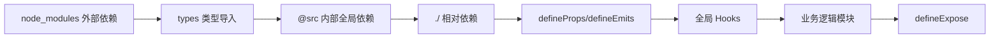

# 组件开发规范

<cite>
**本文引用的文件**
- [RULE.md](file://rules/frontend-rules-vue3/RULE.md)
- [component-dev.md](file://rules/frontend-rules-vue3/references/component-dev.md)
- [order.md](file://rules/frontend-rules-vue3/references/order.md)
- [reactivity.md](file://rules/frontend-rules-vue3/references/reactivity.md)
- [performance.md](file://rules/frontend-rules-vue3/references/performance.md)
- [interaction.md](file://rules/frontend-rules-vue3/references/interaction.md)
- [directives.md](file://rules/frontend-rules-vue3/references/directives.md)
- [comments.md](file://rules/frontend-rules-vue3/references/comments.md)
- [naming.md](file://rules/frontend-rules-vue3/references/naming.md)
- [watch.md](file://rules/frontend-rules-vue3/references/watch.md)
- [SKILL.md](file://skills/yy-frontend-vue3-code-optimization/SKILL.md)
- [business-logic.md](file://skills/yy-frontend-vue3-code-optimization/sub-skills/business-logic.md)
- [code-style.md](file://skills/yy-frontend-vue3-code-optimization/sub-skills/code-style.md)
- [css-style.md](file://skills/yy-frontend-vue3-code-optimization/sub-skills/css-style.md)
- [yy-frontend-vue3-review/SKILL.md](file://skills/yy-frontend-vue3-review/SKILL.md)
</cite>

## 目录
1. [简介](#简介)
2. [项目结构](#项目结构)
3. [核心组件](#核心组件)
4. [架构概览](#架构概览)
5. [详细组件分析](#详细组件分析)
6. [依赖分析](#依赖分析)
7. [性能考量](#性能考量)
8. [故障排查指南](#故障排查指南)
9. [结论](#结论)
10. [附录](#附录)

## 简介
本规范面向 Vue3 组件开发，聚焦于 `<script setup>` 脚本结构的最佳实践，涵盖 JSDoc 注释规范、元素顺序安排、方法职责划分、页面拆分策略、生命周期管理、状态管理模式与性能优化技巧。同时系统阐述 Props 定义、Emit 使用、defineExpose 与 provide/inject 的正确用法，以及组件间通信模式与数据流向。

## 项目结构
Vue3 开发规范由“总纲索引”“基础规范”“强烈推荐”“风格指南”三大层级构成，配套“AI 行为约束”“约束清单速查”等模块，形成从宏观到微观的完整规范体系。其中与组件开发直接相关的关键模块包括：
- 组件开发规范：规定 `<script setup>` 使用、脚本结构顺序、JSDoc、模板属性顺序、v-slot 风格、模板层轻量化、方法职责与页面拆分、defineExpose 等
- 交互通信规范：Props 定义、Emit 白名单、defineEmits、defineExpose、provide/inject、禁用 $parent/$children
- 结构顺序规范：SFC 块顺序、imports 分组排序、脚本内部声明顺序、模板属性顺序
- 响应式状态规范：ref/reactive/computed 的选择与转换、computed 规范、Hooks 规范
- 性能优化规范：组件懒加载、KeepAlive、虚拟滚动、防抖节流、图片优化、模板层轻量化、响应式性能
- 指令规范：v-for/key、v-if/v-for 冲突、v-html 安全、指令简写、模板属性顺序
- 注释规范：模板/脚本/样式注释格式与注释保护原则
- 命名规范：文件/组件/API/事件/常量/Hooks 命名约定
- 监听规范：watch/watchEffect 的使用与清理

**图表来源**
- [RULE.md: 8-68:8-68](file://rules/frontend-rules-vue3/RULE.md#L8-L68)

**章节来源**
- [RULE.md: 8-68:8-68](file://rules/frontend-rules-vue3/RULE.md#L8-L68)

## 核心组件
本节聚焦 `<script setup>` 脚本结构与交互定义的规范要点，结合顺序、职责与拆分策略，帮助开发者建立一致的组件开发范式。

- 必须使用 `<script setup>` 语法，禁止 Options API 写法与在脚本中使用 this
- `<script setup>` 内部声明必须按“imports → defineProps/defineEmits → 全局 Hooks → 业务逻辑（按功能模块分组：ref/reactive → computed → 方法 → watch → 生命周期钩子）→ defineExpose”的宏观顺序排列
- 脚本顶部需添加 JSDoc 注释，说明组件名称、页面职责、核心业务流程、关键数据来源
- 模板层轻量化：模板只负责展示，不写复杂表达式；简单逻辑可内联，不过度封装为函数
- 方法职责单一，函数名语义清晰；方法超过 20 行考虑拆分
- 页面拆分建议：组件超过 300 行时，建议拆分独立子组件；按功能区块拆分：搜索表单、数据表格、分页器、操作按钮组
- v-slot 风格：使用动态风格（如 v-slot:[name]），禁止静态默认插槽写法
- 模板属性顺序：is → v-for → v-if/else → v-show → id → props → v-on → v-html → v-slot

**图表来源**
- [order.md: 15-36:15-36](file://rules/frontend-rules-vue3/references/order.md#L15-L36)
- [component-dev.md: 13-68:13-68](file://rules/frontend-rules-vue3/references/component-dev.md#L13-L68)

**章节来源**
- [component-dev.md: 7-68:7-68](file://rules/frontend-rules-vue3/references/component-dev.md#L7-L68)
- [order.md: 15-36:15-36](file://rules/frontend-rules-vue3/references/order.md#L15-L36)

## 架构概览
下图展示了 Vue3 组件在运行时的数据与控制流：父组件通过 Props 传入数据，子组件通过 Emit 事件向上反馈，必要时通过 defineExpose 暴露方法供父组件调用；provide/inject 用于深层组件传参；响应式状态通过 ref/reactive/computed 管理，watch/watchEffect 监听变化并清理资源；模板层保持轻量化，复杂逻辑下沉到组合式函数或 Hooks。

**图表来源**
- [interaction.md: 86-125:86-125](file://rules/frontend-rules-vue3/references/interaction.md#L86-L125)
- [reactivity.md: 208-227:208-227](file://rules/frontend-rules-vue3/references/reactivity.md#L208-L227)
- [watch.md: 15-154:15-154](file://rules/frontend-rules-vue3/references/watch.md#L15-L154)

## 详细组件分析

### Props 定义与 Emit 使用
- Props 必须使用 TypeScript 泛型定义，类型规范详见 TypeScript 规范；建议包含 required/default/validator；命名使用 camelCase；必须添加注释说明参数含义
- v-model 写法：Vue 3 标准使用 modelValue 配合 update:modelValue；Ant Design Vue 风格使用 value 配合 update:value
- Emit 事件必须使用白名单（19 种），建议顺序为 update:modelValue/value → 其他业务事件 → change/click
- 禁止修改 Props；Props 是单向数据流，如需修改父级状态，必须通过 Emit 事件通知父组件

**图表来源**
- [interaction.md: 7-82:7-82](file://rules/frontend-rules-vue3/references/interaction.md#L7-L82)

**章节来源**
- [interaction.md: 7-82:7-82](file://rules/frontend-rules-vue3/references/interaction.md#L7-L82)

### defineExpose 与 provide/inject
- defineExpose 必须显式声明，仅暴露父组件业务必须调用的方法（如表单校验 validate、弹窗开启 open），不应暴露内部状态实现
- provide/inject 仅用于 3 层以上深层组件传参，避免逐层传递 props；兄弟组件通信使用 Pinia/Vuex；使用 provide('key', refValue) 保持响应式
- 禁止通过 $parent/$children 链式访问父组件数据；禁止在 `<script setup>` 中使用 this

**图表来源**
- [interaction.md: 86-125:86-125](file://rules/frontend-rules-vue3/references/interaction.md#L86-L125)

**章节来源**
- [interaction.md: 86-125:86-125](file://rules/frontend-rules-vue3/references/interaction.md#L86-L125)

### 响应式状态管理（ref/reactive/computed）
- 优先使用 ref，尽可能少用 reactive；复杂对象、批量属性更新、解构后仍需保持响应式时使用 reactive
- Hooks 中禁止直接返回 reactive 对象，必须使用 toRefs 解构后返回
- computed 用于同步派生逻辑，不应处理异步逻辑或副作用；对可能抛错的计算逻辑建议包裹 try/catch
- 在业务模块内部，按 ref/reactive → computed → 方法 → watch → 生命周期钩子的顺序组织

**图表来源**
- [reactivity.md: 7-106:7-106](file://rules/frontend-rules-vue3/references/reactivity.md#L7-L106)
- [reactivity.md: 220-227:220-227](file://rules/frontend-rules-vue3/references/reactivity.md#L220-L227)

**章节来源**
- [reactivity.md: 7-106:7-106](file://rules/frontend-rules-vue3/references/reactivity.md#L7-L106)
- [reactivity.md: 220-227:220-227](file://rules/frontend-rules-vue3/references/reactivity.md#L220-L227)

### 监听与生命周期
- watch/watchEffect 的使用：深度监听需声明 deep:true；初始化需触发时加 immediate:true；定时器、事件监听在组件销毁时清理
- watch 与 computed 的选择：watch 中的派生逻辑优先使用 computed 替代，利用其缓存机制
- 生命周期钩子在业务模块末尾集中声明，避免散落各处

**图表来源**
- [watch.md: 15-154:15-154](file://rules/frontend-rules-vue3/references/watch.md#L15-L154)

**章节来源**
- [watch.md: 15-154:15-154](file://rules/frontend-rules-vue3/references/watch.md#L15-L154)

### 模板指令与属性顺序
- v-for 必须配合 key 使用，key 必须用唯一 ID，禁止使用 index
- 禁止将 v-if 与 v-for 同时用在同一个元素上；可通过 template 包裹或 computed 预过滤
- v-html 必须用 DOMPurify 过滤 HTML，防止 XSS 攻击
- 指令简写：v-bind:attr → :attr，v-on:event → @event，v-slot:name → #name
- 模板属性顺序：is → v-for → v-if/else → v-show → id → props → v-on → v-html → v-slot

**图表来源**
- [directives.md: 7-99:7-99](file://rules/frontend-rules-vue3/references/directives.md#L7-L99)

**章节来源**
- [directives.md: 7-99:7-99](file://rules/frontend-rules-vue3/references/directives.md#L7-L99)

### 注释规范与 JSDoc
- 脚本顶部 JSDoc：记录改动时间与改动内容，说明组件名称、页面职责、核心业务流程、关键数据来源
- 行内注释：props、ref/reactive、computed、watch、方法、组件引入、Hooks 引入、provide 等均需按规范添加注释
- 注释保护原则：逻辑变更时注释必须同步更新；已有注释若内容正确，只增不改

**图表来源**
- [comments.md: 19-56:19-56](file://rules/frontend-rules-vue3/references/comments.md#L19-L56)

**章节来源**
- [comments.md: 19-56:19-56](file://rules/frontend-rules-vue3/references/comments.md#L19-L56)

### 命名规范
- 文件与组件命名：组件文件名多单词 + PascalCase，目录命名 kebab-case，组件使用 PascalCase
- 函数命名：API 函数 api + Method + URLPath，事件函数 on + EventName
- 变量与常量：常量全大写 + 下划线，Props camelCase，emit 事件 camelCase，布尔值 isXX/hasXX/showXX 前缀
- Hooks：use + 功能名，如 useTable、useSearchForm
- TypeScript 类型：I + PascalCase，泛型参数单字母大写

**章节来源**
- [naming.md: 7-85:7-85](file://rules/frontend-rules-vue3/references/naming.md#L7-L85)

## 依赖分析
组件开发规范强调“导入分组排序”与“脚本结构顺序”，二者共同保证代码可读性与可维护性。

**图表来源**
- [order.md: 92-128:92-128](file://rules/frontend-rules-vue3/references/order.md#L92-L128)
- [order.md: 15-36:15-36](file://rules/frontend-rules-vue3/references/order.md#L15-L36)

**章节来源**
- [order.md: 92-128:92-128](file://rules/frontend-rules-vue3/references/order.md#L92-L128)
- [order.md: 15-36:15-36](file://rules/frontend-rules-vue3/references/order.md#L15-L36)

## 性能考量
- 组件懒加载：使用 defineAsyncComponent 动态导入；路由页面使用 () => import() 惰性加载
- KeepAlive 缓存：通过 include/exclude 精确控制缓存范围，避免内存泄漏
- 虚拟滚动：长列表（100+ 项）使用虚拟滚动组件，仅渲染可视区域
- 防抖节流：搜索框输入使用防抖，滚动/窗口 resize 使用节流
- 图片优化：WebP 优先、合适尺寸、非首屏图片懒加载
- 模板层轻量化：模板只负责展示，不写复杂表达式；简单逻辑可内联
- 响应式性能：优先使用 computed 派生状态，减少 watch 滥用；大型数据列表考虑 shallowRef；避免在 watch 中执行同步 DOM 操作
- 自定义指令清理：unmounted 钩子中清理事件监听器和定时器
- 路由守卫清理：beforeRouteLeave 中清理定时器、取消未完成请求、关闭弹窗

**章节来源**
- [performance.md: 7-136:7-136](file://rules/frontend-rules-vue3/references/performance.md#L7-L136)

## 故障排查指南
- 绝对禁止项：连续解构、父改子数据、修改 ref/reactive 类型、修改 props、在 `<script setup>` 中使用 this、使用 Options API、使用 mixins、多层 try/catch、生命周期 emit、无意义命名、v-for 与 v-if 同元素、index 作为 key、使用 any 类型
- 网络请求规范：前置检查 useRequest，async/await + try/catch/finally，禁止多层 try/catch，禁止连续解构，统一响应模式
- computed 规范：纯函数原则、有意义命名、复杂逻辑建议 try/catch 兜底
- 逻辑错误：空指针、数组越界、逻辑判断、方法内部顺序、ref `.value` 访问
- 安全漏洞：v-html XSS 风险、敏感信息硬编码/泄露
- 最佳实践：调试代码清理、BEM + scoped、未使用变量、defineExpose、组件拆分、懒加载、KeepAlive、Hooks 规范、函数 try/catch

**章节来源**
- [yy-frontend-vue3-review/SKILL.md: 36-88:36-88](file://skills/yy-frontend-vue3-review/SKILL.md#L36-L88)
- [yy-frontend-vue3-review/SKILL.md: 148-206:148-206](file://skills/yy-frontend-vue3-review/SKILL.md#L148-L206)

## 结论
本规范以“总纲索引—基础规范—强烈推荐—风格指南”的层级结构，系统化地定义了 Vue3 组件开发的行为准则与最佳实践。围绕 `<script setup>` 的脚本结构、Props/Emit/defineExpose/ provide/inject 的交互设计、响应式状态与监听策略、模板指令与注释规范、命名与性能优化等方面，提供了可落地的实施路径。建议在团队内统一执行，结合代码优化与审核技能，持续提升代码质量与协作效率。

## 附录
- 业务逻辑梳理：在 `<script setup>` 标签顶部生成结构化业务说明 JSDoc，记录改动时间与改动内容，倒序排列
- 代码风格清洗：优先执行 Prettier 格式化，再手动调整结构与顺序；导入按 4 组排序，脚本结构按顺序组织，模板属性按顺序排列
- CSS/BEM 规范：块/元素/修饰符命名，scoped 样式与模板 class 同步修改，嵌套层级不超过 2 层

**章节来源**
- [business-logic.md: 49-123:49-123](file://skills/yy-frontend-vue3-code-optimization/sub-skills/business-logic.md#L49-L123)
- [code-style.md: 26-233:26-233](file://skills/yy-frontend-vue3-code-optimization/sub-skills/code-style.md#L26-L233)
- [css-style.md: 12-166:12-166](file://skills/yy-frontend-vue3-code-optimization/sub-skills/css-style.md#L12-L166)