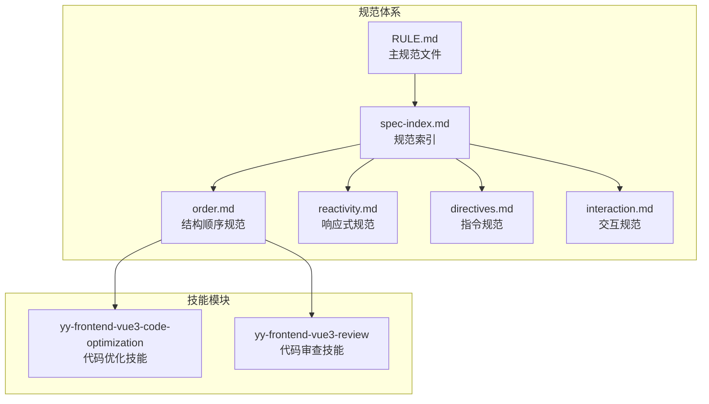

# 结构顺序规范

<cite>
**本文档引用的文件**
- [order.md](file://rules/frontend-rules-vue3/references/order.md)
- [order.md](file://skills/yy-frontend-vue3-code-optimization/rules/order.md)
- [order.md](file://skills/yy-frontend-vue3-review/rules/order.md)
- [spec-index.md](file://rules/frontend-rules-vue3/references/spec-index.md)
- [RULE.md](file://rules/frontend-rules-vue3/RULE.md)
- [reactivity.md](file://rules/frontend-rules-vue3/references/reactivity.md)
- [directives.md](file://rules/frontend-rules-vue3/references/directives.md)
- [interaction.md](file://rules/frontend-rules-vue3/references/interaction.md)
</cite>

## 目录
1. [简介](#简介)
2. [项目结构](#项目结构)
3. [核心组件](#核心组件)
4. [架构概览](#架构概览)
5. [详细组件分析](#详细组件分析)
6. [依赖关系分析](#依赖关系分析)
7. [性能考虑](#性能考虑)
8. [故障排除指南](#故障排除指南)
9. [结论](#结论)

## 简介

Vue3 SFC（单文件组件）结构顺序规范是确保代码可读性、可维护性和团队协作效率的重要准则。本规范定义了 Vue3 单文件组件内部结构、导入语句分组以及 `<script setup>` 内部逻辑的排列顺序。

该规范的核心目标是：
- 提高代码的可读性和可维护性
- 标准化团队开发流程
- 减少代码审查中的争议
- 优化 IDE 开发体验
- 便于代码重构和迁移

## 项目结构

该项目采用模块化的规范管理体系，主要包含以下关键文件：



**图表来源**
- [RULE.md:1-68](file://rules/frontend-rules-vue3/RULE.md#L1-L68)
- [spec-index.md:1-60](file://rules/frontend-rules-vue3/references/spec-index.md#L1-L60)

**章节来源**
- [RULE.md:1-68](file://rules/frontend-rules-vue3/RULE.md#L1-L68)
- [spec-index.md:1-60](file://rules/frontend-rules-vue3/references/spec-index.md#L1-L60)

## 核心组件

### SFC 块顺序规范

Vue3 单文件组件内部必须遵循严格的块顺序：

| 顺序 | 组件块 | 说明 |
|------|--------|------|
| 1 | `<template>` | 模板结构定义 |
| 2 | `<script setup>` | 组合式 API 逻辑 |
| 3 | `<style scoped>` | 作用域样式 |

这种顺序确保了从视图到逻辑再到样式的清晰层次关系。

**章节来源**
- [order.md:7-12](file://rules/frontend-rules-vue3/references/order.md#L7-L12)

### `<script setup>` 内部结构顺序

`<script setup>` 内部声明必须按照以下宏观顺序排列：

| 步骤 | 内容 | 说明 |
|------|------|------|
| 1 | `imports` | 导入（4 组） |
| 2 | `defineProps` / `defineEmits` | 交互定义 |
| 3 | 全局 Hooks | `useXxx`（如 `useRouter`、`useTable` 等） |
| 4 | 业务逻辑 | 按功能模块分组 |
| 5 | `defineExpose` | 对外暴露 |

**章节来源**
- [order.md:15-26](file://rules/frontend-rules-vue3/references/order.md#L15-L26)

## 架构概览

Vue3 SFC 结构顺序规范的整体架构体现了从外到内、从抽象到具体的设计理念：

```mermaid
flowchart TD
A[SFC 组件] --> B[模板层]
A --> C[脚本层]
A --> D[样式层]
C --> E[导入分组]
C --> F[交互定义]
C --> G[全局 Hooks]
C --> H[业务逻辑]
C --> I[对外暴露]
E --> J[node_modules 外部依赖]
E --> K[types 类型导入]
E --> L[@src/ 内部全局依赖]
E --> M[./ 相对依赖]
H --> N[功能模块分组]
N --> O[ref/reactive 状态]
N --> P[computed 计算属性]
N --> Q[方法函数]
N --> R[watch 监听器]
N --> S[生命周期钩子]
```

**图表来源**
- [order.md:92-102](file://rules/frontend-rules-vue3/references/order.md#L92-L102)
- [order.md:27-31](file://rules/frontend-rules-vue3/references/order.md#L27-L31)

## 详细组件分析

### Import 分组排序（4 组）

将 `import` 语句分为四个逻辑分组，每组之间用空行分隔，组内按字母顺序排列：

#### 第一组：node_modules（外部依赖）
- **包含**：`vue`、`dayjs`、`lodash` 等第三方库
- **特点**：最外层的依赖包，通常不需要相对路径
- **排序**：按字母顺序排列

#### 第二组：types（类型导入）
- **包含**：所有 `import type` 导入的纯类型
- **特点**：只导入类型信息，不包含运行时代码
- **排序**：按字母顺序排列

#### 第三组：内部全局依赖（@src/）
- **包含**：`@src/` 开头的路径（API、工具、Hooks、Store、常量、组件等）
- **特点**：项目内部的全局模块，便于跨文件复用
- **排序**：按字母顺序排列

#### 第四组：内部相对依赖（./、../）
- **包含**：`./` 或 `../` 开头的相对路径（工具、Hooks、常量、组件等）
- **特点**：组件局部使用的模块，路径相对明确
- **排序**：按字母顺序排列

**排序原则**：外部优先 → 类型次之 → 全局在前 → 相对在后 → 组内按字母顺序排列

**章节来源**
- [order.md:92-102](file://rules/frontend-rules-vue3/references/order.md#L92-L102)

### `<script setup>` 内部结构顺序详解

#### 第一步：导入（4 组）
导入语句必须严格遵循 4 组分组和字母排序规则。这种设计确保了依赖关系的清晰可见性和维护便利性。

#### 第二步：交互定义
包括 `defineProps` 和 `defineEmits`，定义组件的对外接口和事件系统。

#### 第三步：全局 Hooks
使用 `useXxx` 形式的全局 Hooks，如 `useRouter`、`useTable` 等，这些 Hooks 提供了组件级别的状态管理和功能增强。

#### 第四步：业务逻辑
这是最复杂的部分，需要按功能模块进行分组。每个功能模块内部遵循特定的顺序：


**图表来源**
- [order.md:29-31](file://rules/frontend-rules-vue3/references/order.md#L29-L31)

#### 第五步：对外暴露
使用 `defineExpose` 明确暴露需要父组件访问的属性和方法。

**章节来源**
- [order.md:15-31](file://rules/frontend-rules-vue3/references/order.md#L15-L31)

### 功能模块分组原则

在同一类别的逻辑中，应尽可能按功能模块分组，避免杂乱堆砌。每个功能模块内部通常遵循：

`ref`/`reactive` → `computed` → 方法 → `watch` → 生命周期钩子

这种顺序体现了从状态定义到行为实现的渐进式设计思路。

**章节来源**
- [order.md:27-31](file://rules/frontend-rules-vue3/references/order.md#L27-L31)

## 依赖关系分析

Vue3 SFC 结构顺序规范体现了清晰的依赖层次关系：

```mermaid
graph TB
subgraph "依赖层次"
A[外部依赖<br/>node_modules] --> B[全局依赖<br/>@src/]
B --> C[相对依赖<br/>./]
C --> D[本地模块<br/>组件内部]
E[类型导入<br/>import type] --> F[纯类型定义]
F --> G[编译时信息]
end
subgraph "逻辑层次"
H[模板层] --> I[脚本层]
I --> J[样式层]
K[交互定义] --> L[业务逻辑]
L --> M[对外暴露]
end
A -.-> H
E -.-> H
K -.-> I
L -.-> I
```

**图表来源**
- [order.md:96-99](file://rules/frontend-rules-vue3/references/order.md#L96-L99)
- [order.md:21-25](file://rules/frontend-rules-vue3/references/order.md#L21-L25)

### 模板属性顺序

模板属性的统一排列顺序有助于提高模板的可读性和一致性：

1. 定义（`is`）
2. `v-for`
3. `v-if` / `v-else-if` / `v-else`
4. `v-show` / `v-cloak`
5. `id`
6. `props/attrs`
7. `v-on`（`@`）
8. `v-html` / `v-text`
9. 动态 `v-slot`（`#`）

**章节来源**
- [directives.md:80-98](file://rules/frontend-rules-vue3/references/directives.md#L80-L98)

## 性能考虑

### 导入优化策略

1. **按需导入**：只导入实际使用的模块，避免不必要的代码加载
2. **类型分离**：将类型导入放在单独的分组中，便于编译器优化
3. **路径优化**：合理使用 `@src/` 别名，减少相对路径的复杂度

### 逻辑组织优化

1. **功能模块化**：将相关的状态、计算属性、方法和监听器组织在同一个模块中
2. **生命周期优化**：将生命周期钩子放在模块末尾，便于追踪组件的初始化过程
3. **暴露最小化**：只暴露必要的接口，减少父组件的耦合度

## 故障排除指南

### 常见问题及解决方案

#### 问题1：导入顺序错误
**症状**：IDE 报告导入顺序警告，代码审查失败
**解决方案**：严格按照 4 组分组和字母顺序重新排列导入语句

#### 问题2：业务逻辑混乱
**症状**：组件逻辑难以理解，维护困难
**解决方案**：将相关功能组织成独立的模块，每个模块遵循 `ref`/`reactive` → `computed` → 方法 → `watch` → 生命周期钩子的顺序

#### 问题3：对外暴露过多
**症状**：父组件过度依赖子组件内部实现
**解决方案**：使用 `defineExpose` 明确暴露必要的接口，避免暴露内部状态

### 最佳实践检查清单

- [ ] SFC 块顺序正确：`<template>` → `<script setup>` → `<style scoped>`
- [ ] 导入分组完整且有序
- [ ] 交互定义清晰明确
- [ ] 全局 Hooks 使用合理
- [ ] 业务逻辑模块化组织
- [ ] 对外暴露最小化原则
- [ ] 模板属性按统一顺序排列

**章节来源**
- [order.md:132-135](file://rules/frontend-rules-vue3/references/order.md#L132-L135)

## 结论

Vue3 SFC 结构顺序规范通过标准化的代码组织方式，显著提升了代码质量和开发效率。该规范的核心价值在于：

1. **提升可读性**：清晰的层次结构和统一的排序规则
2. **增强可维护性**：模块化的业务逻辑和明确的依赖关系
3. **促进团队协作**：统一的编码标准减少了沟通成本
4. **优化开发体验**：IDE 支持和自动格式化提高了开发效率

通过严格执行这些规范，团队可以建立高质量的 Vue3 项目代码库，为长期维护和发展奠定坚实基础。建议在项目启动阶段就引入这套规范，并在代码审查过程中严格执行，确保代码质量的一致性。