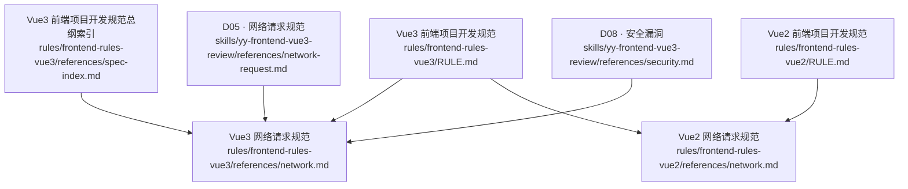
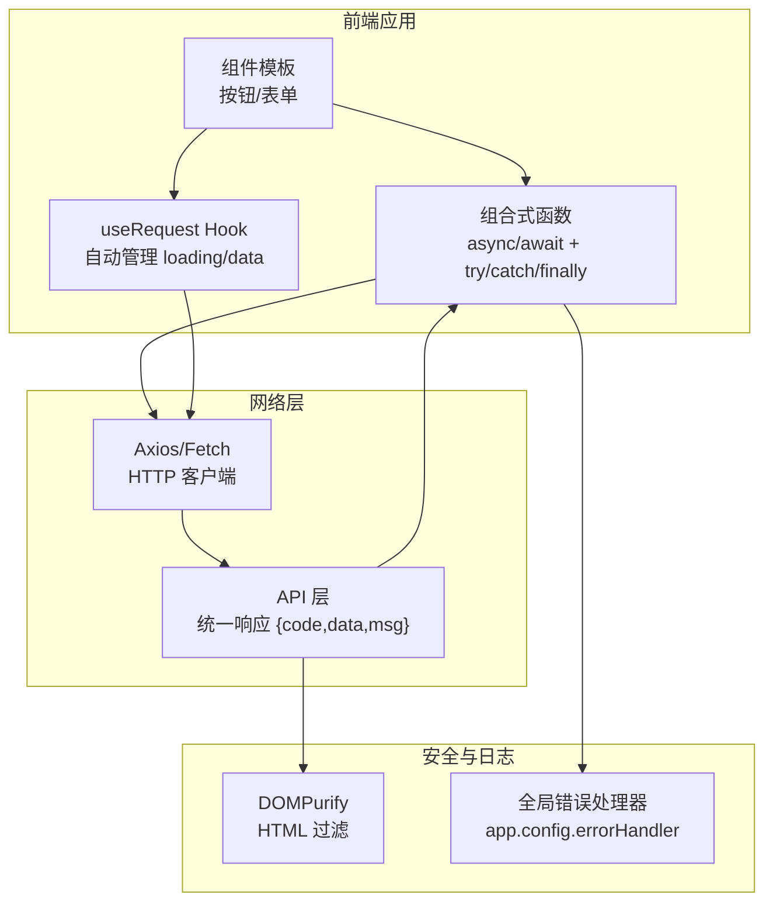
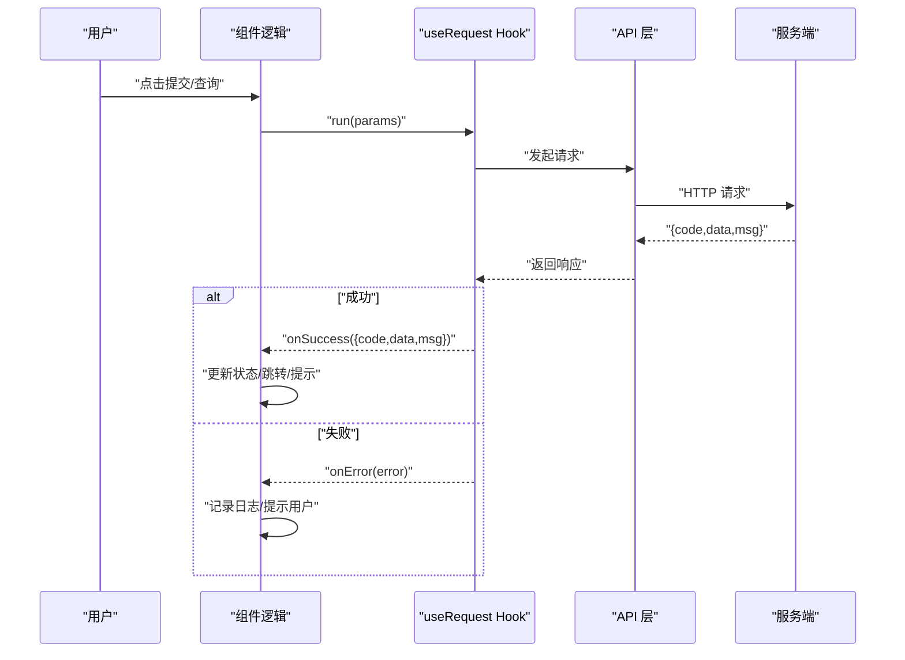
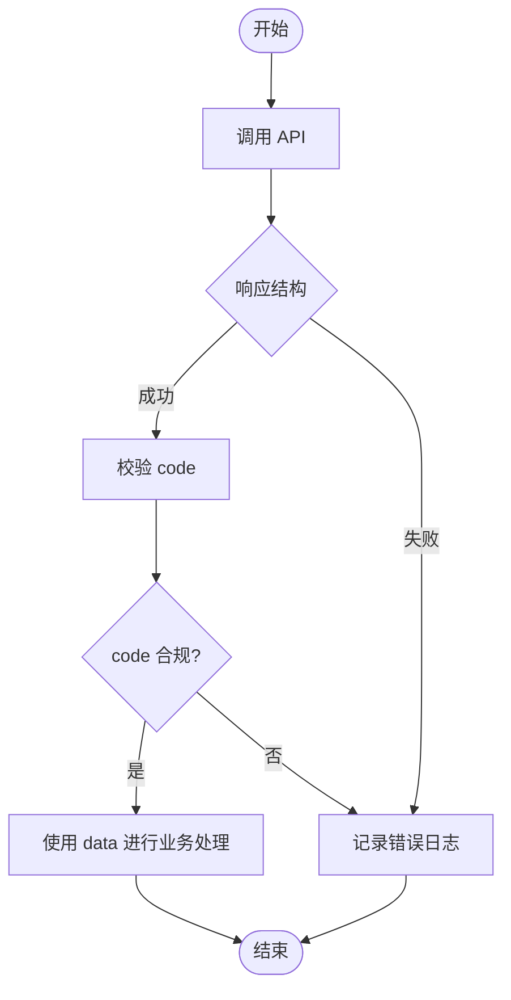
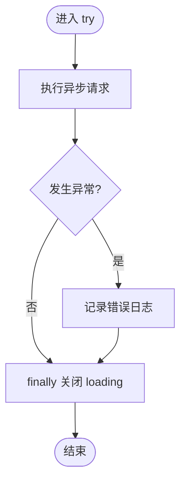
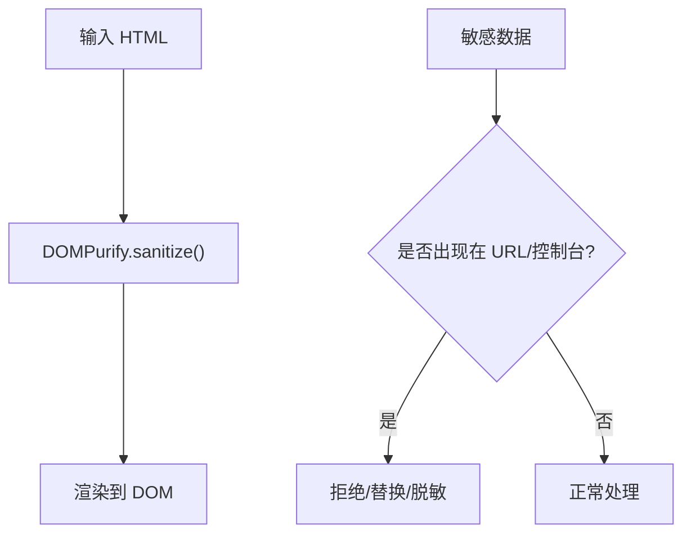
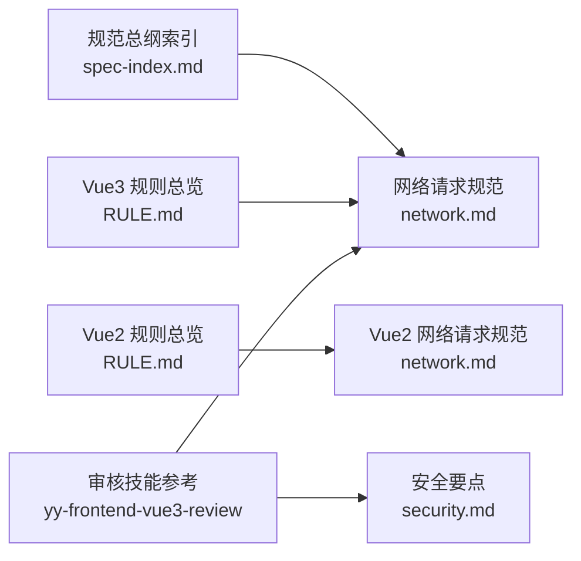

# 网络请求规范

<cite>
**本文引用的文件列表**
- [Vue3 网络请求规范](file://rules/frontend-rules-vue3/references/network.md)
- [D05 · 网络请求规范](file://skills/yy-frontend-vue3-review/references/network-request.md)
- [Vue3 前端项目开发规范总纲（索引）](file://rules/frontend-rules-vue3/references/spec-index.md)
- [Vue3 前端项目开发规范](file://rules/frontend-rules-vue3/RULE.md)
- [Vue2 网络请求规范](file://rules/frontend-rules-vue2/references/network.md)
- [Vue2 前端项目开发规范](file://rules/frontend-rules-vue2/RULE.md)
- [D08 · 安全漏洞](file://skills/yy-frontend-vue3-review/references/security.md)
</cite>

## 目录
1. [简介](#简介)
2. [项目结构](#项目结构)
3. [核心组件](#核心组件)
4. [架构概览](#架构概览)
5. [详细组件分析](#详细组件分析)
6. [依赖关系分析](#依赖关系分析)
7. [性能考虑](#性能考虑)
8. [故障排查指南](#故障排查指南)
9. [结论](#结论)
10. [附录](#附录)

## 简介
本规范面向 Vue3 项目，系统阐述网络请求与安全的工程化标准，重点覆盖：
- async/await 的正确使用方式与错误处理机制
- 统一响应解构与数据处理流程
- 网络请求的安全约束与防护措施
- 错误处理最佳实践（用户友好提示与日志记录）
- 具体场景的正确实现方式与安全注意事项

本规范既适用于新项目初始化，也适用于存量代码重构，确保请求流程清晰、健壮、可维护且安全可控。

## 项目结构
仓库中与网络请求和安全相关的规范分布在多个位置：
- Vue3 规范模块：rules/frontend-rules-vue3 下的 references/network.md、references/spec-index.md、RULE.md
- Vue3 审核技能参考：skills/yy-frontend-vue3-review/references/network-request.md、security.md
- Vue2 规范模块：rules/frontend-rules-vue2/references/network.md、RULE.md
- 规范总纲索引：按优先级组织各模块，便于快速定位“网络请求”相关规则

图表来源
- [Vue3 网络请求规范:1-363](file://rules/frontend-rules-vue3/references/network.md#L1-L363)
- [Vue3 前端项目开发规范总纲（索引）:1-60](file://rules/frontend-rules-vue3/references/spec-index.md#L1-L60)
- [Vue3 前端项目开发规范:1-68](file://rules/frontend-rules-vue3/RULE.md#L1-L68)
- [D05 · 网络请求规范:1-39](file://skills/yy-frontend-vue3-review/references/network-request.md#L1-L39)
- [D08 · 安全漏洞:1-16](file://skills/yy-frontend-vue3-review/references/security.md#L1-L16)
- [Vue2 网络请求规范:1-180](file://rules/frontend-rules-vue2/references/network.md#L1-L180)
- [Vue2 前端项目开发规范:1-62](file://rules/frontend-rules-vue2/RULE.md#L1-L62)

章节来源
- [Vue3 网络请求规范:1-363](file://rules/frontend-rules-vue3/references/network.md#L1-L363)
- [Vue3 前端项目开发规范总纲（索引）:1-60](file://rules/frontend-rules-vue3/references/spec-index.md#L1-L60)
- [Vue3 前端项目开发规范:1-68](file://rules/frontend-rules-vue3/RULE.md#L1-L68)
- [D05 · 网络请求规范:1-39](file://skills/yy-frontend-vue3-review/references/network-request.md#L1-L39)
- [D08 · 安全漏洞:1-16](file://skills/yy-frontend-vue3-review/references/security.md#L1-L16)
- [Vue2 网络请求规范:1-180](file://rules/frontend-rules-vue2/references/network.md#L1-L180)
- [Vue2 前端项目开发规范:1-62](file://rules/frontend-rules-vue2/RULE.md#L1-L62)

## 核心组件
本节从规范层面梳理网络请求的关键要素，帮助读者建立统一的认知框架。

- 异步处理与错误处理
  - 必须使用 async/await，禁止 .then() 链式调用
  - 统一使用 try/catch/finally 结构（未使用 useRequest 时）
  - 禁止空 catch，捕获错误后必须进行记录
  - 业务错误处理：在 else 分支中 console.warn 记录

- 响应解构与数据处理
  - 单次解构，禁止 ...data.data 连续解构
  - 统一响应模式 { code, data, msg } 解构处理
  - 先判断成功后使用数据，再进行类型守卫

- 防重复提交
  - 对于表单提交、支付等写操作，请求进行中通过 loading 状态禁用按钮
  - useRequest 的 loading 自动控制，按钮直接用 :disabled="loading" 禁用
  - 未安装 useRequest 时使用互斥锁（loading.value）防止重复点击

- 安全约束
  - v-html 必须用 DOMPurify 过滤 HTML，防止 XSS
  - 敏感数据不得出现在 URL 中（如 token/密码），不得在控制台打印用户凭证
  - 全局错误捕获：配置 app.config.errorHandler，并配合 Sentry 上报

章节来源
- [Vue3 网络请求规范:19-146](file://rules/frontend-rules-vue3/references/network.md#L19-L146)
- [Vue3 网络请求规范:249-354](file://rules/frontend-rules-vue3/references/network.md#L249-L354)
- [Vue2 网络请求规范:7-180](file://rules/frontend-rules-vue2/references/network.md#L7-L180)
- [D08 · 安全漏洞:1-16](file://skills/yy-frontend-vue3-review/references/security.md#L1-L16)

## 架构概览
下图展示了 Vue3 网络请求的整体架构与关键交互点，包括请求发起、状态管理、错误处理与安全过滤。

图表来源
- [Vue3 网络请求规范:5-354](file://rules/frontend-rules-vue3/references/network.md#L5-L354)
- [D05 · 网络请求规范:1-39](file://skills/yy-frontend-vue3-review/references/network-request.md#L1-L39)
- [D08 · 安全漏洞:1-16](file://skills/yy-frontend-vue3-review/references/security.md#L1-L16)

## 详细组件分析

### 组件一：请求发起与状态管理
- useRequest 模式
  - manual 模式用于按钮点击/表单提交等场景
  - onSuccess/onError 分别处理成功与失败分支
  - loading 自动控制，模板中直接绑定 :disabled="loading"

- 手动模式（未安装 useRequest）
  - 使用 ref 控制 loading 状态
  - 防重复提交：loading.value 互斥锁
  - finally 中统一关闭 loading，避免遗漏

图表来源
- [Vue3 网络请求规范:152-215](file://rules/frontend-rules-vue3/references/network.md#L152-L215)
- [Vue3 网络请求规范:253-303](file://rules/frontend-rules-vue3/references/network.md#L253-L303)

章节来源
- [Vue3 网络请求规范:152-303](file://rules/frontend-rules-vue3/references/network.md#L152-L303)

### 组件二：统一响应解构与数据处理
- 单次解构原则
  - 禁止连续解构（如 ...data.data），避免深层依赖
  - 统一响应模式 { code, data, msg }，便于集中处理

- 成功与失败分支
  - 先判断 code，再访问 data
  - 失败时记录 msg，必要时向用户展示

图表来源
- [Vue3 网络请求规范:70-109](file://rules/frontend-rules-vue3/references/network.md#L70-L109)
- [Vue2 网络请求规范:77-116](file://rules/frontend-rules-vue2/references/network.md#L77-L116)

章节来源
- [Vue3 网络请求规范:70-109](file://rules/frontend-rules-vue3/references/network.md#L70-L109)
- [Vue2 网络请求规范:77-116](file://rules/frontend-rules-vue2/references/network.md#L77-L116)

### 组件三：错误处理最佳实践
- 禁止空 catch
  - 捕获错误后必须记录，至少 console.warn
- 业务错误处理
  - code 非成功时在 else 分支记录日志
- 用户提示
  - 成功时可显示成功消息
  - 失败时向用户展示 msg 或通用提示

图表来源
- [Vue3 网络请求规范:113-146](file://rules/frontend-rules-vue3/references/network.md#L113-L146)
- [Vue2 网络请求规范:120-153](file://rules/frontend-rules-vue2/references/network.md#L120-L153)

章节来源
- [Vue3 网络请求规范:113-146](file://rules/frontend-rules-vue3/references/network.md#L113-L146)
- [Vue2 网络请求规范:120-153](file://rules/frontend-rules-vue2/references/network.md#L120-L153)

### 组件四：安全约束与防护措施
- v-html XSS 防护
  - 使用 DOMPurify 对 HTML 进行过滤
- 敏感信息保护
  - 不在 URL 中传输 token/密码
  - 不在控制台打印用户凭证
- 全局错误捕获
  - 配置 app.config.errorHandler
  - 集成 Sentry 等平台进行上报

图表来源
- [Vue3 网络请求规范:347-354](file://rules/frontend-rules-vue3/references/network.md#L347-L354)
- [Vue2 网络请求规范:176-180](file://rules/frontend-rules-vue2/references/network.md#L176-L180)
- [D08 · 安全漏洞:1-16](file://skills/yy-frontend-vue3-review/references/security.md#L1-L16)

章节来源
- [Vue3 网络请求规范:347-354](file://rules/frontend-rules-vue3/references/network.md#L347-L354)
- [Vue2 网络请求规范:176-180](file://rules/frontend-rules-vue2/references/network.md#L176-L180)
- [D08 · 安全漏洞:1-16](file://skills/yy-frontend-vue3-review/references/security.md#L1-L16)

## 依赖关系分析
- 规范层级
  - 总纲索引（spec-index.md）将“网络请求”列为“强烈推荐”模块，便于团队聚焦
  - Vue3 规范（RULE.md）与 Vue2 规范（RULE.md）分别列出网络请求模块
- 技能参考
  - yy-frontend-vue3-review 提供了更简洁的网络请求与安全要点（network-request.md、security.md）

图表来源
- [Vue3 前端项目开发规范总纲（索引）:38-38](file://rules/frontend-rules-vue3/references/spec-index.md#L38-L38)
- [Vue3 前端项目开发规范:37-37](file://rules/frontend-rules-vue3/RULE.md#L37-L37)
- [Vue2 前端项目开发规范:28-28](file://rules/frontend-rules-vue2/RULE.md#L28-L28)
- [D05 · 网络请求规范:1-39](file://skills/yy-frontend-vue3-review/references/network-request.md#L1-L39)
- [D08 · 安全漏洞:1-16](file://skills/yy-frontend-vue3-review/references/security.md#L1-L16)

章节来源
- [Vue3 前端项目开发规范总纲（索引）:38-38](file://rules/frontend-rules-vue3/references/spec-index.md#L38-L38)
- [Vue3 前端项目开发规范:37-37](file://rules/frontend-rules-vue3/RULE.md#L37-L37)
- [Vue2 前端项目开发规范:28-28](file://rules/frontend-rules-vue2/RULE.md#L28-L28)
- [D05 · 网络请求规范:1-39](file://skills/yy-frontend-vue3-review/references/network-request.md#L1-L39)
- [D08 · 安全漏洞:1-16](file://skills/yy-frontend-vue3-review/references/security.md#L1-L16)

## 性能考虑
- 防重复提交
  - 使用 loading 状态或互斥锁，避免用户重复点击导致的重复请求
- 请求合并与缓存
  - 对于高频查询，结合 useRequest 的缓存策略减少不必要的网络开销
- 响应解构优化
  - 单次解构降低对象遍历成本，避免深层嵌套带来的性能损耗

章节来源
- [Vue3 网络请求规范:249-303](file://rules/frontend-rules-vue3/references/network.md#L249-L303)

## 故障排查指南
- 常见问题
  - 空 catch 导致异常被吞掉：确保 catch 中至少记录日志
  - 连续解构引发运行时错误：改为单次解构
  - 未关闭 loading 导致按钮无法再次点击：统一在 finally 中关闭
- 日志与监控
  - 全局错误处理器记录异常堆栈
  - 集成 Sentry 进行异常上报与追踪

章节来源
- [Vue3 网络请求规范:113-146](file://rules/frontend-rules-vue3/references/network.md#L113-L146)
- [Vue3 网络请求规范:347-354](file://rules/frontend-rules-vue3/references/network.md#L347-L354)

## 结论
本规范以 Vue3 为核心，围绕 async/await、统一响应解构、错误处理与安全防护构建了一套完整的工程化标准。通过 useRequest 的自动化状态管理、严格的响应解构规范、完善的错误处理与日志记录，以及对 XSS、敏感信息泄露等安全风险的系统性防护，能够有效提升网络请求的可靠性、可维护性与安全性。建议在项目中严格执行，并结合团队评审与自动化检查工具持续落地。

## 附录
- 相关文件路径
  - [Vue3 网络请求规范](file://rules/frontend-rules-vue3/references/network.md)
  - [D05 · 网络请求规范](file://skills/yy-frontend-vue3-review/references/network-request.md)
  - [Vue3 前端项目开发规范总纲（索引）](file://rules/frontend-rules-vue3/references/spec-index.md)
  - [Vue3 前端项目开发规范](file://rules/frontend-rules-vue3/RULE.md)
  - [Vue2 网络请求规范](file://rules/frontend-rules-vue2/references/network.md)
  - [Vue2 前端项目开发规范](file://rules/frontend-rules-vue2/RULE.md)
  - [D08 · 安全漏洞](file://skills/yy-frontend-vue3-review/references/security.md)