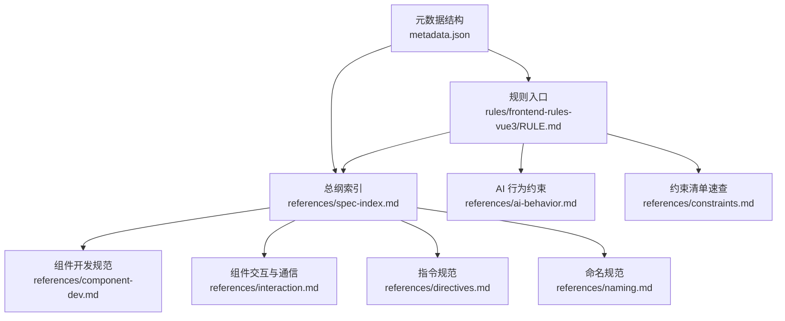
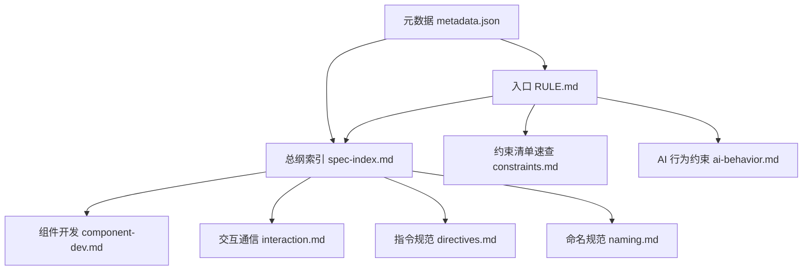
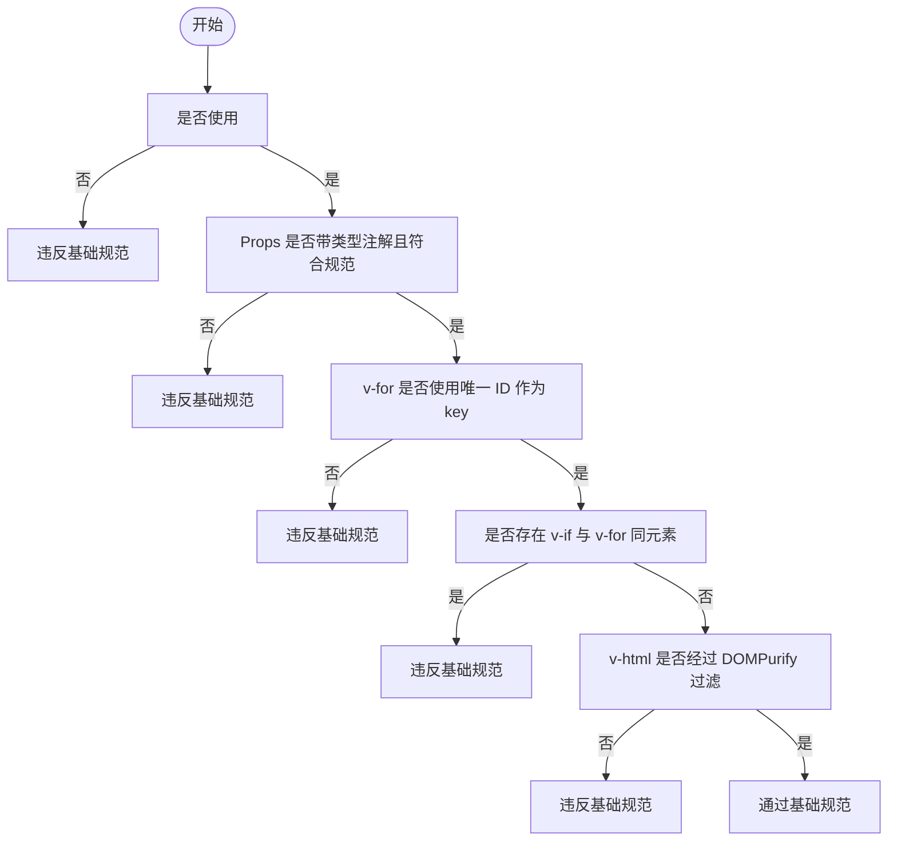
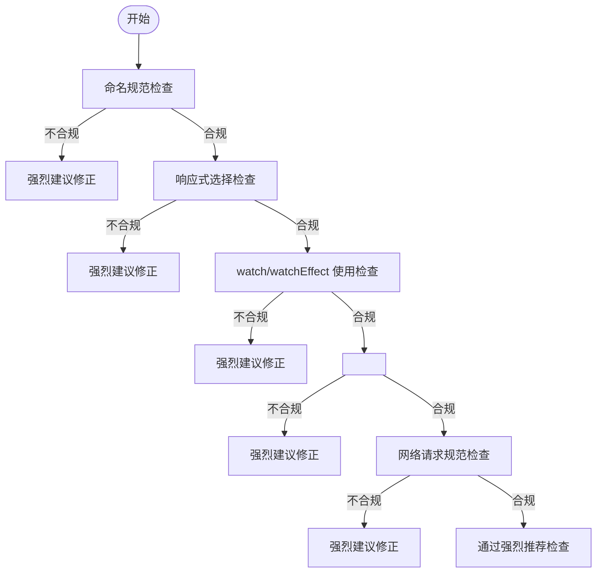
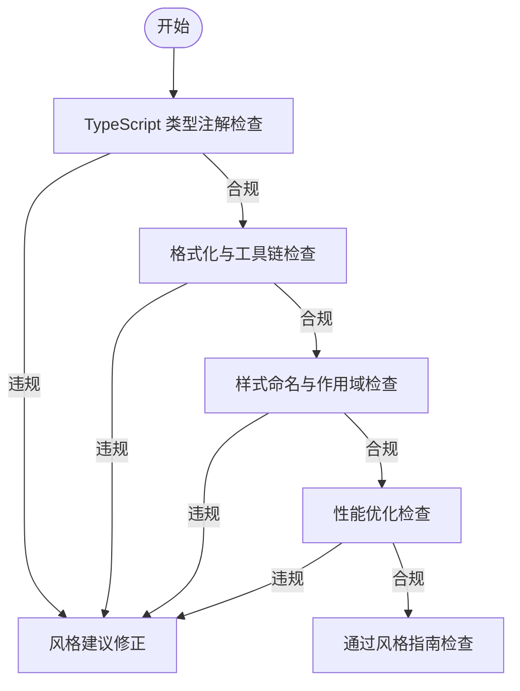
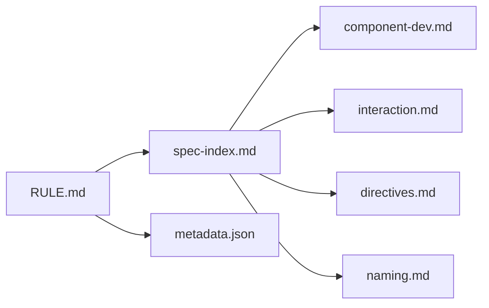

# 规范总纲

<cite>
**本文引用的文件**
- [rules/frontend-rules-vue3/RULE.md](file://rules/frontend-rules-vue3/RULE.md)
- [rules/frontend-rules-vue3/metadata.json](file://rules/frontend-rules-vue3/metadata.json)
- [rules/frontend-rules-vue3/references/spec-index.md](file://rules/frontend-rules-vue3/references/spec-index.md)
- [rules/frontend-rules-vue3/references/ai-behavior.md](file://rules/frontend-rules-vue3/references/ai-behavior.md)
- [rules/frontend-rules-vue3/references/constraints.md](file://rules/frontend-rules-vue3/references/constraints.md)
- [rules/frontend-rules-vue3/references/component-dev.md](file://rules/frontend-rules-vue3/references/component-dev.md)
- [rules/frontend-rules-vue3/references/interaction.md](file://rules/frontend-rules-vue3/references/interaction.md)
- [rules/frontend-rules-vue3/references/directives.md](file://rules/frontend-rules-vue3/references/directives.md)
- [rules/frontend-rules-vue3/references/naming.md](file://rules/frontend-rules-vue3/references/naming.md)
</cite>

## 目录
1. [简介](#简介)
2. [项目结构](#项目结构)
3. [核心组件](#核心组件)
4. [架构总览](#架构总览)
5. [详细组件分析](#详细组件分析)
6. [依赖分析](#依赖分析)
7. [性能考量](#性能考量)
8. [故障排查指南](#故障排查指南)
9. [结论](#结论)
10. [附录](#附录)

## 简介
本文件是 Vue3 前端项目开发规范的“总纲”，系统阐述三级优先级体系：基础规范（Essential）、强烈推荐（Strongly Recommended）、风格指南（Recommended）。它既是规则的索引，也是项目落地执行的导航图。总纲明确了每级规则的适用范围、场景边界、违反后果与例外情况，并提供优先级索引表，帮助开发者快速定位到具体规则模块。

## 项目结构
该规范以模块化方式组织，核心入口位于 Vue3 规则集，配套元数据描述了分类结构；总纲索引文件汇总了三大优先级的规则要点与链接，便于快速查阅。

图表来源
- [rules/frontend-rules-vue3/RULE.md:1-68](file://rules/frontend-rules-vue3/RULE.md#L1-L68)
- [rules/frontend-rules-vue3/metadata.json:1-17](file://rules/frontend-rules-vue3/metadata.json#L1-L17)
- [rules/frontend-rules-vue3/references/spec-index.md:1-60](file://rules/frontend-rules-vue3/references/spec-index.md#L1-L60)

章节来源
- [rules/frontend-rules-vue3/RULE.md:1-68](file://rules/frontend-rules-vue3/RULE.md#L1-L68)
- [rules/frontend-rules-vue3/metadata.json:1-17](file://rules/frontend-rules-vue3/metadata.json#L1-L17)

## 核心组件
- 三级优先级体系
  - 基础规范（Essential）：必须遵守，规避错误与潜在 Bug
  - 强烈推荐（Strongly Recommended）：显著提升可读性与开发体验，应尽可能遵守
  - 风格指南（Recommended）：在多种同样好的实践之间保持一致，统一团队风格
- 适用范围与约束
  - 适用文件：src 目录下所有 .vue、.ts、.js、.css、.scss、.less
  - 目录约束：仅允许操作 src 目录下的文件
  - 适用区域：Vue3 单文件组件的模板区、<script setup> 脚本区、样式区
- AI 行为约束
  - 允许在对话中直接输出文字说明、总结或代码片段
  - 允许修改代码中的注释和 JSDoc
  - 禁止未经用户明确要求就创建 README、说明文档等
  - 允许修改 src 目录下的文件；禁止修改 src 目录之外的任何文件（除非用户明确指定）

章节来源
- [rules/frontend-rules-vue3/RULE.md:18-22](file://rules/frontend-rules-vue3/RULE.md#L18-L22)
- [rules/frontend-rules-vue3/references/ai-behavior.md:1-29](file://rules/frontend-rules-vue3/references/ai-behavior.md#L1-L29)

## 架构总览
总纲将规则按优先级分层，形成“入口—索引—细则”的金字塔结构。入口文件提供总体说明与导航，索引文件给出三大优先级的规则清单与链接，细则文件深入到具体模块（如组件开发、交互通信、指令、命名等）。

图表来源
- [rules/frontend-rules-vue3/RULE.md:10-68](file://rules/frontend-rules-vue3/RULE.md#L10-L68)
- [rules/frontend-rules-vue3/references/spec-index.md:1-60](file://rules/frontend-rules-vue3/references/spec-index.md#L1-L60)
- [rules/frontend-rules-vue3/metadata.json:7-16](file://rules/frontend-rules-vue3/metadata.json#L7-L16)

## 详细组件分析

### 基础规范（Essential）
- 定义与目标
  - 必须遵守，主要目的是规避错误和潜在的 Bug
- 适用场景
  - 所有 Vue3 组件开发的基础安全线
- 违反后果
  - 易引发运行时异常、渲染错乱、内存泄漏、安全风险
- 重点规则概览
  - 必须使用 <script setup>，禁止 Options API 写法（含 data()/methods/mounted 等）
  - Props 定义规范：类型注解、v-model 兼容、使用限制
  - 数据修改限制：禁止修改 props、禁止父组件直接修改子组件内部状态
  - v-for 与 key：唯一 ID 作为 key，禁止使用 index
  - v-if 与 v-for 冲突：禁止在同一元素上同时使用
  - v-html 安全：必须用 DOMPurify 过滤 HTML
- 例外情况
  - 无绝对例外；若确需兼容旧代码，应在迁移计划中明确替换路径

图表来源
- [rules/frontend-rules-vue3/references/spec-index.md:9-21](file://rules/frontend-rules-vue3/references/spec-index.md#L9-L21)
- [rules/frontend-rules-vue3/references/directives.md:7-18](file://rules/frontend-rules-vue3/references/directives.md#L7-L18)
- [rules/frontend-rules-vue3/references/directives.md:22-39](file://rules/frontend-rules-vue3/references/directives.md#L22-L39)
- [rules/frontend-rules-vue3/references/directives.md:43-56](file://rules/frontend-rules-vue3/references/directives.md#L43-L56)
- [rules/frontend-rules-vue3/references/interaction.md:7-44](file://rules/frontend-rules-vue3/references/interaction.md#L7-L44)

章节来源
- [rules/frontend-rules-vue3/references/spec-index.md:9-21](file://rules/frontend-rules-vue3/references/spec-index.md#L9-L21)
- [rules/frontend-rules-vue3/references/directives.md:7-18](file://rules/frontend-rules-vue3/references/directives.md#L7-L18)
- [rules/frontend-rules-vue3/references/directives.md:22-39](file://rules/frontend-rules-vue3/references/directives.md#L22-L39)
- [rules/frontend-rules-vue3/references/directives.md:43-56](file://rules/frontend-rules-vue3/references/directives.md#L43-L56)
- [rules/frontend-rules-vue3/references/interaction.md:7-44](file://rules/frontend-rules-vue3/references/interaction.md#L7-L44)

### 强烈推荐（Strongly Recommended）
- 定义与目标
  - 显著改善代码可读性与开发体验，应尽可能遵守
- 适用场景
  - 日常开发中提升一致性与可维护性的最佳实践
- 违反后果
  - 可能导致阅读成本上升、协作效率下降、重构难度增加
- 重点规则概览
  - 文件与标识符命名：组件、文件、API、事件、常量、Boolean、Hooks、TypeScript 类型命名
  - ref/reactive/computed 原则：选择原则、reactive 转 ref 规则、computed 规范
  - watch 规范：watch/watchEffect 使用规范、清理机制、与 computed 选择策略
  - Hooks 组合式函数规范：命名、返回值、使用方式、抽离建议
  - <script setup> 结构与代码组织：SFC 块顺序、Import 分组、脚本内部声明顺序
  - 模板属性顺序：HTML 元素上属性的统一排列顺序
  - 状态管理：provide/inject、兄弟组件通信、响应式传递
  - 组件交互与通信：Props、v-model 兼容、Emit 事件白名单、defineExpose
  - 网络请求规范：异步处理、响应解构、错误处理、防止重复提交

图表来源
- [rules/frontend-rules-vue3/references/spec-index.md:24-39](file://rules/frontend-rules-vue3/references/spec-index.md#L24-L39)
- [rules/frontend-rules-vue3/references/naming.md:1-85](file://rules/frontend-rules-vue3/references/naming.md#L1-L85)
- [rules/frontend-rules-vue3/references/interaction.md:110-125](file://rules/frontend-rules-vue3/references/interaction.md#L110-L125)

章节来源
- [rules/frontend-rules-vue3/references/spec-index.md:24-39](file://rules/frontend-rules-vue3/references/spec-index.md#L24-L39)
- [rules/frontend-rules-vue3/references/naming.md:1-85](file://rules/frontend-rules-vue3/references/naming.md#L1-L85)
- [rules/frontend-rules-vue3/references/interaction.md:110-125](file://rules/frontend-rules-vue3/references/interaction.md#L110-L125)

### 风格指南（Recommended）
- 定义与目标
  - 在多种同样好的实践之间选择一个并保持一致，统一团队风格
- 适用场景
  - 代码风格、格式化、注释、样式、性能优化等非功能性细节
- 违反后果
  - 主要影响团队一致性与长期可维护性，通常不会导致运行时错误
- 重点规则概览
  - TypeScript 类型注解：禁止 any，参数/返回值/变量明确类型
  - TypeScript 约束：不推荐 as any、@ts-ignore、@ts-expect-error
  - 格式化与工具链：Prettier 配置、箭头函数优先
  - 指令简写：v-bind → :、v-on → @、v-slot → #
  - 样式命名与作用域：BEM 规范、scoped 优先、全局样式标注
  - 注释规范：模板区、脚本区、样式区注释格式，注释保护原则
  - 性能优化：组件懒加载、KeepAlive、虚拟滚动、防抖节流、图片优化
  - 约束清单：禁止/推荐/不推荐/注意事项速查

图表来源
- [rules/frontend-rules-vue3/references/spec-index.md:42-56](file://rules/frontend-rules-vue3/references/spec-index.md#L42-L56)

章节来源
- [rules/frontend-rules-vue3/references/spec-index.md:42-56](file://rules/frontend-rules-vue3/references/spec-index.md#L42-L56)

### 规则优先级索引表
- 基础规范（Essential）
  - 必须使用 <script setup>
  - Props 定义规范
  - 数据修改限制
  - v-for 与 key
  - v-if 与 v-for 冲突
  - v-html 安全
- 强烈推荐（Strongly Recommended）
  - 文件与标识符命名
  - ref/reactive/computed 原则
  - watch 规范
  - Hooks 组合式函数规范
  - <script setup> 结构与代码组织
  - 模板属性顺序
  - 状态管理
  - 组件交互与通信
  - 网络请求规范
- 风格指南（Recommended）
  - TypeScript 类型注解
  - TypeScript 约束
  - 格式化与工具链
  - 指令简写
  - 样式命名与作用域
  - 注释规范
  - 性能优化
  - 约束清单

章节来源
- [rules/frontend-rules-vue3/references/spec-index.md:13-56](file://rules/frontend-rules-vue3/references/spec-index.md#L13-L56)

### 实施与平衡建议
- 优先级应用原则
  - 基础规范必须 100% 落地，作为“红线”
  - 强烈推荐应作为“默认选项”，在团队内统一执行
  - 风格指南用于统一风格，允许在团队内达成共识后微调
- 例外与回退策略
  - 若确需例外，应在变更记录中说明理由与替代方案，并纳入后续评审
- 工具与自动化
  - 使用 ESLint/Prettier 等工具固化基础规范与风格指南
  - 对“强烈推荐”类规则，可通过团队评审与代码检查共同保障

## 依赖分析
- 入口与索引
  - RULE.md 提供总体导航与范围说明
  - spec-index.md 提供三大优先级的规则索引与链接
- 细则模块
  - component-dev.md、interaction.md、directives.md、naming.md 等模块分别覆盖组件开发、交互通信、指令与命名等主题
- 元数据
  - metadata.json 描述了分类结构与模块数量，便于工具与流程集成

图表来源
- [rules/frontend-rules-vue3/RULE.md:10-68](file://rules/frontend-rules-vue3/RULE.md#L10-L68)
- [rules/frontend-rules-vue3/metadata.json:7-16](file://rules/frontend-rules-vue3/metadata.json#L7-L16)
- [rules/frontend-rules-vue3/references/spec-index.md:1-60](file://rules/frontend-rules-vue3/references/spec-index.md#L1-L60)

章节来源
- [rules/frontend-rules-vue3/RULE.md:10-68](file://rules/frontend-rules-vue3/RULE.md#L10-L68)
- [rules/frontend-rules-vue3/metadata.json:7-16](file://rules/frontend-rules-vue3/metadata.json#L7-L16)
- [rules/frontend-rules-vue3/references/spec-index.md:1-60](file://rules/frontend-rules-vue3/references/spec-index.md#L1-L60)

## 性能考量
- 基础层面
  - 避免在模板中编写复杂逻辑，遵循“模板层轻量化”原则
  - 合理使用 computed/ref/reactive，减少不必要的重计算与响应式开销
- 指令与渲染
  - v-for 使用唯一 ID 作为 key，避免列表重排带来的性能损耗
  - 避免在同一元素上同时使用 v-if 与 v-for，降低渲染分支复杂度
- 网络与资源
  - 使用 async/await 统一异步处理，避免链式 then 带来的可读性与性能问题
  - 对 v-html 场景使用 DOMPurify 过滤，减少 XSS 风险与潜在的二次渲染

章节来源
- [rules/frontend-rules-vue3/references/spec-index.md:42-56](file://rules/frontend-rules-vue3/references/spec-index.md#L42-L56)
- [rules/frontend-rules-vue3/references/directives.md:7-18](file://rules/frontend-rules-vue3/references/directives.md#L7-L18)
- [rules/frontend-rules-vue3/references/directives.md:22-39](file://rules/frontend-rules-vue3/references/directives.md#L22-L39)
- [rules/frontend-rules-vue3/references/interaction.md:110-125](file://rules/frontend-rules-vue3/references/interaction.md#L110-L125)

## 故障排查指南
- 常见违规与修复
  - 连续数据解构：避免 ...data.data 的深层解构，改为扁平化或中间变量
  - 父组件修改子组件数据：通过 emit 事件通知父组件更新，而非直接修改
  - 修改 ref/reactive 类型：严格遵循后端提供的类型，不做二次转换
  - 修改 props：使用只读访问，必要时通过 emit 事件回传
  - 使用 mixins：改用 Hooks/组合式函数
  - 无意义命名：避免 data1、temp2 等无语义命名
  - 在 <script setup> 中使用 this：严格遵守 Composition API 语法
  - Options API：统一迁移到 <script setup> + TypeScript
  - v-for 与 v-if 同元素：使用 template 包裹或 computed 预过滤
  - index 作为 key：统一使用唯一 ID
- 推荐与不推荐
  - 推荐：函数 try/catch 包裹、async/await、computed 优先、watch 深度/立即监听按需使用、Hooks 抽离
  - 不推荐：多层 try/catch 嵌套、生命周期 emit、可选链操作符 ?.、CSS 原生嵌套、:has() 伪类（特定浏览器版本）

章节来源
- [rules/frontend-rules-vue3/references/constraints.md:1-45](file://rules/frontend-rules-vue3/references/constraints.md#L1-L45)

## 结论
本总纲以“基础规范—强烈推荐—风格指南”三层体系构建 Vue3 开发的“安全网+最佳实践+统一风格”。通过明确的适用范围、违反后果与平衡策略，帮助团队在保证质量与安全的前提下，持续提升开发效率与代码一致性。建议在团队内将基础规范作为强制检查项，将强烈推荐作为默认执行项，将风格指南作为团队共识项，结合工具链与评审流程，确保规范有效落地。

## 附录
- 适用范围与例外
  - 适用文件：src 目录下所有 .vue/.ts/.js/.css/.scss/.less
  - 目录约束：仅允许操作 src 目录下的文件
  - 例外：若确需例外，应在变更记录中说明理由与替代方案，并纳入后续评审
- AI 行为约束
  - 允许在对话中直接输出文字说明、总结或代码片段
  - 允许修改代码中的注释和 JSDoc
  - 禁止未经用户明确要求就创建 README、说明文档等
  - 允许修改 src 目录下的文件；禁止修改 src 目录之外的任何文件（除非用户明确指定）

章节来源
- [rules/frontend-rules-vue3/RULE.md:18-22](file://rules/frontend-rules-vue3/RULE.md#L18-L22)
- [rules/frontend-rules-vue3/references/ai-behavior.md:1-29](file://rules/frontend-rules-vue3/references/ai-behavior.md#L1-L29)