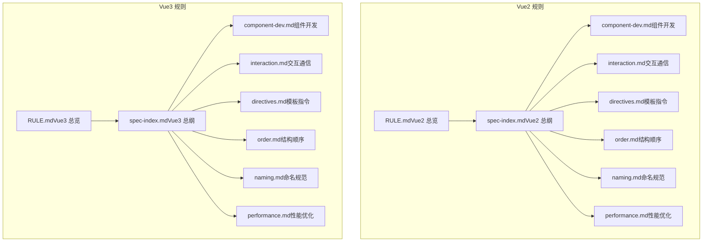
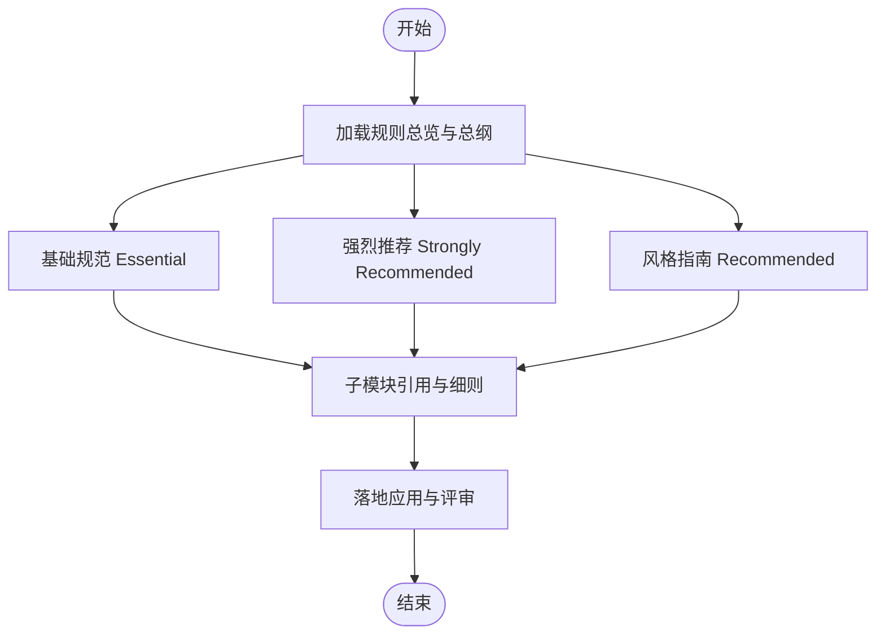
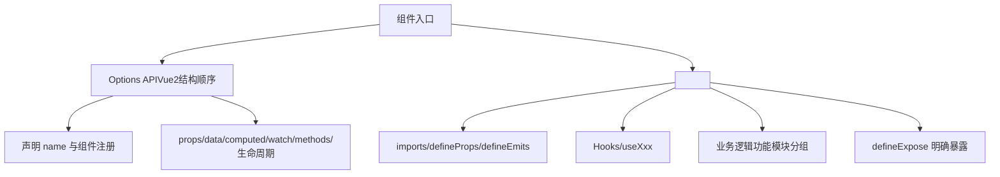
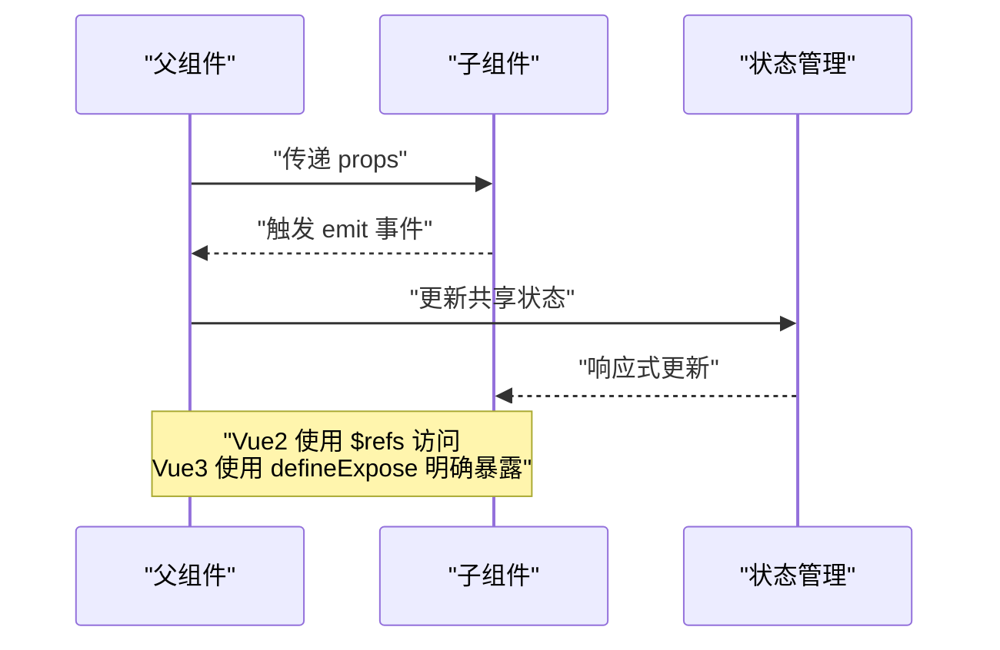
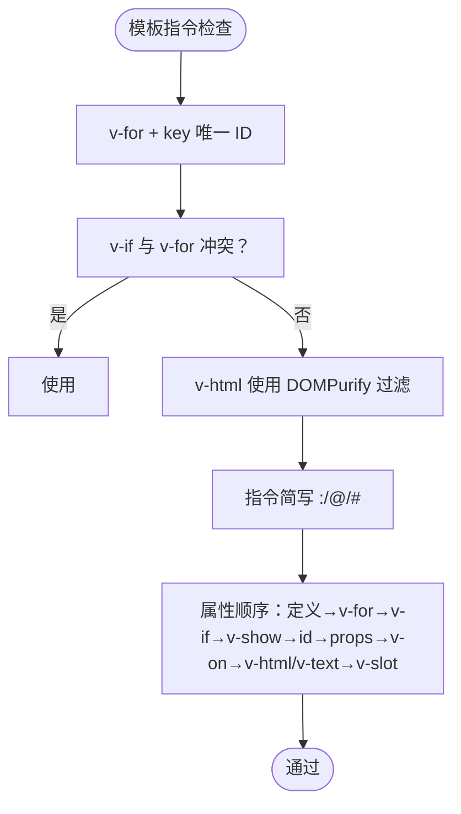
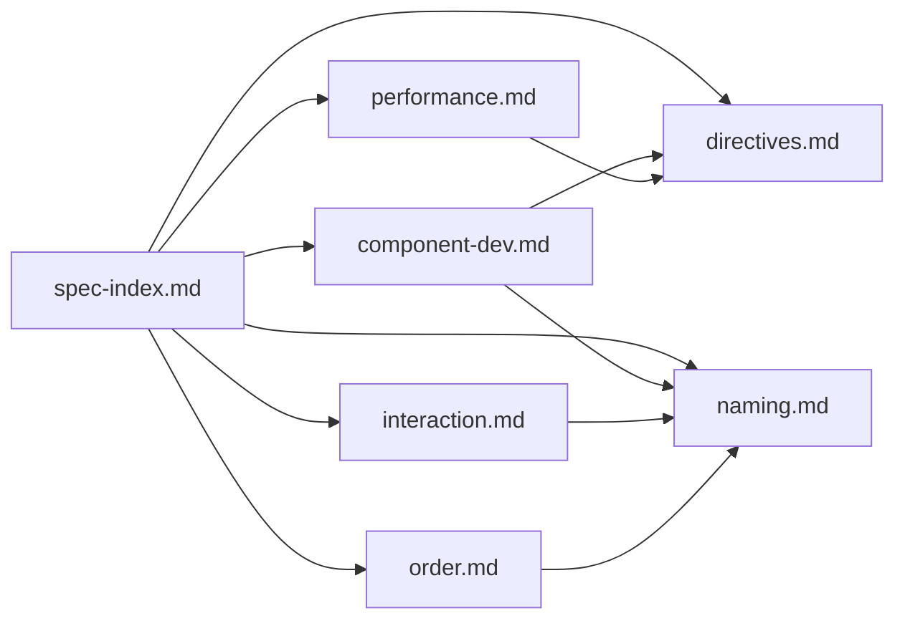

# 前端开发规则

<cite>
**本文引用的文件**
- [RULE.md（Vue2 规则总览）](file://rules/frontend-rules-vue2/RULE.md)
- [RULE.md（Vue3 规则总览）](file://rules/frontend-rules-vue3/RULE.md)
- [metadata.json（Vue3 规则元数据）](file://rules/frontend-rules-vue3/metadata.json)
- [spec-index.md（Vue2 规则总纲）](file://rules/frontend-rules-vue2/references/spec-index.md)
- [spec-index.md（Vue3 规则总纲）](file://rules/frontend-rules-vue3/references/spec-index.md)
- [component-dev.md（Vue2 组件开发）](file://rules/frontend-rules-vue2/references/component-dev.md)
- [component-dev.md（Vue3 组件开发）](file://rules/frontend-rules-vue3/references/component-dev.md)
- [interaction.md（Vue2 组件交互与通信）](file://rules/frontend-rules-vue2/references/interaction.md)
- [interaction.md（Vue3 组件交互与通信）](file://rules/frontend-rules-vue3/references/interaction.md)
- [directives.md（Vue2 模板指令）](file://rules/frontend-rules-vue2/references/directives.md)
- [directives.md（Vue3 模板指令）](file://rules/frontend-rules-vue3/references/directives.md)
- [order.md（Vue2 代码组织与顺序）](file://rules/frontend-rules-vue2/references/order.md)
- [order.md（Vue3 代码组织与顺序）](file://rules/frontend-rules-vue3/references/order.md)
- [naming.md（Vue2 命名规范）](file://rules/frontend-rules-vue2/references/naming.md)
- [naming.md（Vue3 命名规范）](file://rules/frontend-rules-vue3/references/naming.md)
- [performance.md（Vue2 性能优化）](file://rules/frontend-rules-vue2/references/performance.md)
- [performance.md（Vue3 性能优化）](file://rules/frontend-rules-vue3/references/performance.md)
</cite>

## 目录
1. [简介](#简介)
2. [项目结构](#项目结构)
3. [核心组件](#核心组件)
4. [架构总览](#架构总览)
5. [详细组件分析](#详细组件分析)
6. [依赖分析](#依赖分析)
7. [性能考量](#性能考量)
8. [故障排查指南](#故障排查指南)
9. [结论](#结论)
10. [附录](#附录)

## 简介
本文件系统化梳理前端开发规则体系，聚焦 Vue2 与 Vue3 的规则差异与共性，明确规则的三层优先级（基础规范 Essential、强烈推荐 Strongly Recommended、风格指南 Recommended），并围绕组件开发、交互通信、模板指令、命名与结构顺序、性能优化等主题展开。文档还提供规则应用的实践案例与迁移指南，帮助团队统一质量标准、提升开发效率。

## 项目结构
规则体系采用“总览 + 子模块”的模块化组织方式：
- 规则总览文件（RULE.md）：概述适用范围、优先级索引与快速导航
- 规则总纲（spec-index.md）：按优先级组织的规则索引与说明
- 子模块：按主题拆分（组件开发、交互通信、指令规范、命名、结构顺序、性能、代码风格、约束清单等）

图表来源
- [RULE.md（Vue2 规则总览）:1-62](file://rules/frontend-rules-vue2/RULE.md#L1-L62)
- [RULE.md（Vue3 规则总览）:1-68](file://rules/frontend-rules-vue3/RULE.md#L1-L68)
- [spec-index.md（Vue2 规则总纲）:1-61](file://rules/frontend-rules-vue2/references/spec-index.md#L1-L61)
- [spec-index.md（Vue3 规则总纲）:1-60](file://rules/frontend-rules-vue3/references/spec-index.md#L1-L60)

章节来源
- [RULE.md（Vue2 规则总览）:1-62](file://rules/frontend-rules-vue2/RULE.md#L1-L62)
- [RULE.md（Vue3 规则总览）:1-68](file://rules/frontend-rules-vue3/RULE.md#L1-L68)

## 核心组件
- 规则总览（RULE.md）：给出适用范围、优先级索引与快速导航，是进入各子模块的入口
- 规则总纲（spec-index.md）：按优先级组织规则清单，便于检索与对照
- 子模块：覆盖组件开发、交互通信、模板指令、结构顺序、命名、性能、代码风格、约束清单等

章节来源
- [RULE.md（Vue2 规则总览）:18-62](file://rules/frontend-rules-vue2/RULE.md#L18-L62)
- [RULE.md（Vue3 规则总览）:18-68](file://rules/frontend-rules-vue3/RULE.md#L18-L68)
- [spec-index.md（Vue2 规则总纲）:11-61](file://rules/frontend-rules-vue2/references/spec-index.md#L11-L61)
- [spec-index.md（Vue3 规则总纲）:9-60](file://rules/frontend-rules-vue3/references/spec-index.md#L9-L60)

## 架构总览
规则体系采用“总纲索引 + 子模块引用”的架构，确保：
- 规则优先级清晰：Essential（规避错误）→ Strongly Recommended（提升可读性）→ Recommended（统一风格）
- 模块职责明确：每个子模块聚焦单一主题，避免重复与交叉
- 可扩展性强：新增规则只需补充子模块并更新总纲索引

## 详细组件分析

### Vue2 与 Vue3 规则对比与适用场景
- 技术栈差异
  - Vue2：Options API（data、methods、computed、watch、生命周期）
  - Vue3：Composition API（<script setup>、ref/reactive/computed、Hooks）
- 适用场景
  - Vue2：存量项目、仍使用 Options API 的团队
  - Vue3：新项目、追求组合式能力与类型安全的团队
- 迁移要点
  - 从 Options API 迁移到 Composition API（<script setup>）
  - 从 $parent/$children 迁移到 provide/inject 或状态管理
  - 从 v-model 标准迁移到 update:modelValue 或 Ant Design Vue 风格

章节来源
- [RULE.md（Vue2 规则总览）:38-44](file://rules/frontend-rules-vue2/RULE.md#L38-L44)
- [RULE.md（Vue3 规则总览）:18-23](file://rules/frontend-rules-vue3/RULE.md#L18-L23)
- [interaction.md（Vue2 组件交互与通信）:125-130](file://rules/frontend-rules-vue2/references/interaction.md#L125-L130)
- [interaction.md（Vue3 组件交互与通信）:119-125](file://rules/frontend-rules-vue3/references/interaction.md#L119-L125)

### 规则优先级与冲突解决机制
- 优先级
  - Essential：必须遵守，规避错误与潜在 Bug
  - Strongly Recommended：显著提升可读性与开发体验，应尽可能遵守
  - Recommended：统一风格，保持一致性
- 冲突解决
  - 当不同模块规则存在冲突时，以更高优先级模块为准
  - 若涉及跨版本差异（Vue2/Vue3），以目标技术栈的规则为准
  - 无法直接判定时，参考总纲索引中的说明与示例

章节来源
- [spec-index.md（Vue2 规则总纲）:11-61](file://rules/frontend-rules-vue2/references/spec-index.md#L11-L61)
- [spec-index.md（Vue3 规则总纲）:9-60](file://rules/frontend-rules-vue3/references/spec-index.md#L9-L60)

### 组件开发（Component Dev）
- Vue2
  - Options API 结构顺序：name → components → props → data → computed → watch → methods → 生命周期
  - 组件必须声明 name，模板层轻量化，方法职责单一，页面拆分建议
- Vue3
  - 必须使用 <script setup>，禁止使用 Options API 写法
  - 结构顺序：imports → defineProps/defineEmits → Hooks → 业务逻辑（按功能模块分组）→ defineExpose
  - defineExpose 明确声明对外暴露内容

图表来源
- [component-dev.md（Vue2 组件开发）:12-28](file://rules/frontend-rules-vue2/references/component-dev.md#L12-L28)
- [order.md（Vue2 代码组织与顺序）:15-32](file://rules/frontend-rules-vue2/references/order.md#L15-L32)
- [component-dev.md（Vue3 组件开发）:7-25](file://rules/frontend-rules-vue3/references/component-dev.md#L7-L25)
- [order.md（Vue3 代码组织与顺序）:15-36](file://rules/frontend-rules-vue3/references/order.md#L15-L36)

章节来源
- [component-dev.md（Vue2 组件开发）:1-92](file://rules/frontend-rules-vue2/references/component-dev.md#L1-L92)
- [order.md（Vue2 代码组织与顺序）:1-131](file://rules/frontend-rules-vue2/references/order.md#L1-L131)
- [component-dev.md（Vue3 组件开发）:1-81](file://rules/frontend-rules-vue3/references/component-dev.md#L1-L81)
- [order.md（Vue3 代码组织与顺序）:1-141](file://rules/frontend-rules-vue3/references/order.md#L1-L141)

### 交互通信（Interaction & Communication）
- Props/Emits
  - Vue2：Props 明确 type/default/注释；Emits 事件白名单与顺序
  - Vue3：TypeScript 类型注解；defineEmits 明确参数类型；update:modelValue/update:value
- 对外暴露与访问
  - Vue2：父组件通过 $refs 访问子组件方法
  - Vue3：defineExpose 明确声明暴露内容
- 组件间通信
  - provide/inject：仅用于深层传参；兄弟组件通信使用状态管理
  - 禁用 $parent/$children，避免链式访问

图表来源
- [interaction.md（Vue2 组件交互与通信）:7-130](file://rules/frontend-rules-vue2/references/interaction.md#L7-L130)
- [interaction.md（Vue3 组件交互与通信）:7-125](file://rules/frontend-rules-vue3/references/interaction.md#L7-L125)

章节来源
- [interaction.md（Vue2 组件交互与通信）:1-130](file://rules/frontend-rules-vue2/references/interaction.md#L1-L130)
- [interaction.md（Vue3 组件交互与通信）:1-125](file://rules/frontend-rules-vue3/references/interaction.md#L1-L125)

### 模板指令（Directives）
- v-for 与 key：必须使用唯一 ID，禁止使用 index
- v-if 与 v-for 冲突：禁止在同一元素上同时使用，推荐使用 <template> 包裹或 computed 预过滤
- v-html 安全：必须用 DOMPurify 过滤 HTML
- 指令简写：统一使用 :/@/# 简写
- 模板属性顺序：定义 → v-for → v-if/v-else-if/v-else → v-show/v-cloak → id → props/attrs → v-on → v-html/v-text → 动态 v-slot（Vue3）

图表来源
- [directives.md（Vue2 模板指令）:7-116](file://rules/frontend-rules-vue2/references/directives.md#L7-L116)
- [directives.md（Vue3 模板指令）:7-105](file://rules/frontend-rules-vue3/references/directives.md#L7-L105)

章节来源
- [directives.md（Vue2 模板指令）:1-116](file://rules/frontend-rules-vue2/references/directives.md#L1-L116)
- [directives.md（Vue3 模板指令）:1-105](file://rules/frontend-rules-vue3/references/directives.md#L1-L105)

### 结构顺序与导入分组（Order）
- Vue2：SFC 块顺序 template → script → style；script 内部 8 段顺序；3 组 import 分组（外部/全局/相对）
- Vue3：<script setup> 内部 4 组 import 分组（外部/类型/全局/相对），并按功能模块分组组织业务逻辑

章节来源
- [order.md（Vue2 代码组织与顺序）:1-131](file://rules/frontend-rules-vue2/references/order.md#L1-L131)
- [order.md（Vue3 代码组织与顺序）:1-141](file://rules/frontend-rules-vue3/references/order.md#L1-L141)

### 命名规范（Naming）
- Vue2：组件文件名 PascalCase、目录 kebab-case、函数命名 API/onXxx、变量/常量/布尔值命名规范、CSS BEM
- Vue3：新增 Hooks 命名（useXxx）、TypeScript 类型命名（I + PascalCase）、ref/reactive/computed 命名

章节来源
- [naming.md（Vue2 命名规范）:1-73](file://rules/frontend-rules-vue2/references/naming.md#L1-L73)
- [naming.md（Vue3 命名规范）:1-85](file://rules/frontend-rules-vue3/references/naming.md#L1-L85)

### 性能优化（Performance）
- Vue2：组件懒加载、KeepAlive、虚拟滚动、防抖节流、图片优化、模板层轻量化、响应式陷阱规避
- Vue3：组件懒加载（defineAsyncComponent）、KeepAlive、虚拟滚动、防抖节流、图片优化、模板层轻量化、浅响应式优化、自定义指令清理

章节来源
- [performance.md（Vue2 性能优化）:1-179](file://rules/frontend-rules-vue2/references/performance.md#L1-L179)
- [performance.md（Vue3 性能优化）:1-136](file://rules/frontend-rules-vue3/references/performance.md#L1-L136)

### 规则模块与优先级映射
- Vue2
  - Essential：组件开发（Options API）、交互通信（Props/Emit/$refs/provide/inject）、指令规范（v-for/key/v-if/v-html）
  - Strongly Recommended：命名、结构顺序、网络请求与安全
  - Recommended：代码风格、注释、CSS、性能、约束清单
- Vue3
  - Essential：组件开发（<script setup>）、交互通信（Props/Emit/defineExpose/provide/inject）、指令规范
  - Strongly Recommended：命名、响应式状态（ref/reactive/computed）、watch、Hooks、结构顺序、网络请求、约束清单
  - Recommended：TypeScript、代码风格、CSS、性能、注释

章节来源
- [RULE.md（Vue2 规则总览）:18-62](file://rules/frontend-rules-vue2/RULE.md#L18-L62)
- [RULE.md（Vue3 规则总览）:24-68](file://rules/frontend-rules-vue3/RULE.md#L24-L68)
- [spec-index.md（Vue2 规则总纲）:11-61](file://rules/frontend-rules-vue2/references/spec-index.md#L11-L61)
- [spec-index.md（Vue3 规则总纲）:9-60](file://rules/frontend-rules-vue3/references/spec-index.md#L9-L60)

## 依赖分析
- 模块耦合
  - 各子模块相互引用（如组件开发引用指令与命名），形成清晰的依赖链
  - 总纲索引集中管理优先级与模块关系，降低耦合度
- 外部依赖
  - Vue2：Options API 生态（data、methods、computed、watch、生命周期）
  - Vue3：Composition API 生态（<script setup>、ref/reactive/computed、Hooks、defineExpose）

图表来源
- [spec-index.md（Vue2 规则总纲）:1-61](file://rules/frontend-rules-vue2/references/spec-index.md#L1-L61)
- [spec-index.md（Vue3 规则总纲）:1-60](file://rules/frontend-rules-vue3/references/spec-index.md#L1-L60)

章节来源
- [spec-index.md（Vue2 规则总纲）:1-61](file://rules/frontend-rules-vue2/references/spec-index.md#L1-L61)
- [spec-index.md（Vue3 规则总纲）:1-60](file://rules/frontend-rules-vue3/references/spec-index.md#L1-L60)

## 性能考量
- 懒加载与缓存：组件与路由懒加载、KeepAlive 精确缓存
- 长列表优化：虚拟滚动减少 DOM 数量
- 高频事件：防抖节流降低触发频率
- 模板层：避免复杂表达式与昂贵计算，优先使用 computed
- 响应式：Vue2 注意响应式陷阱，Vue3 谨慎使用 watch，必要时使用 shallowRef

章节来源
- [performance.md（Vue2 性能优化）:1-179](file://rules/frontend-rules-vue2/references/performance.md#L1-L179)
- [performance.md（Vue3 性能优化）:1-136](file://rules/frontend-rules-vue3/references/performance.md#L1-L136)

## 故障排查指南
- 常见问题
  - v-for 未设置唯一 key：导致组件状态错乱
  - v-if 与 v-for 同用：引发渲染异常
  - v-html 未过滤：存在 XSS 风险
  - Props 被子组件修改：破坏单向数据流
  - $parent/$children 链式访问：组件耦合度高
- 排查步骤
  - 检查指令使用是否符合规范
  - 校验 Props 定义与 Emits 白名单
  - 确认模板属性顺序与指令简写
  - 核对结构顺序与导入分组
  - 验证命名规范与类型注解

章节来源
- [directives.md（Vue2 模板指令）:7-116](file://rules/frontend-rules-vue2/references/directives.md#L7-L116)
- [directives.md（Vue3 模板指令）:7-105](file://rules/frontend-rules-vue3/references/directives.md#L7-L105)
- [interaction.md（Vue2 组件交互与通信）:37-130](file://rules/frontend-rules-vue2/references/interaction.md#L37-L130)
- [interaction.md（Vue3 组件交互与通信）:40-125](file://rules/frontend-rules-vue3/references/interaction.md#L40-L125)
- [order.md（Vue2 代码组织与顺序）:15-131](file://rules/frontend-rules-vue2/references/order.md#L15-L131)
- [order.md（Vue3 代码组织与顺序）:15-141](file://rules/frontend-rules-vue3/references/order.md#L15-L141)
- [naming.md（Vue2 命名规范）:1-73](file://rules/frontend-rules-vue2/references/naming.md#L1-L73)
- [naming.md（Vue3 命名规范）:1-85](file://rules/frontend-rules-vue3/references/naming.md#L1-L85)

## 结论
该规则体系以“总纲索引 + 子模块”为核心，清晰划分三层优先级，覆盖组件开发、交互通信、模板指令、命名与结构顺序、性能优化等关键主题。Vue2 与 Vue3 在 API 风格、交互方式与性能优化细节上存在差异，团队可根据技术栈选择相应规则集，并在迁移过程中遵循优先级与冲突解决机制，确保代码质量与开发效率的持续提升。

## 附录
- 规则元数据（Vue3）
  - 版本与摘要：规则体系版本、发布日期、作者摘要
  - 标签与结构：标签、子模块总数、三大类别的模块清单
  - 适用范围：src 目录下 .vue/.ts/.js/.css/.scss/.less 文件

章节来源
- [metadata.json（Vue3 规则元数据）:1-17](file://rules/frontend-rules-vue3/metadata.json#L1-L17)