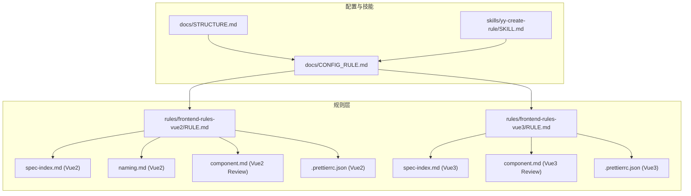
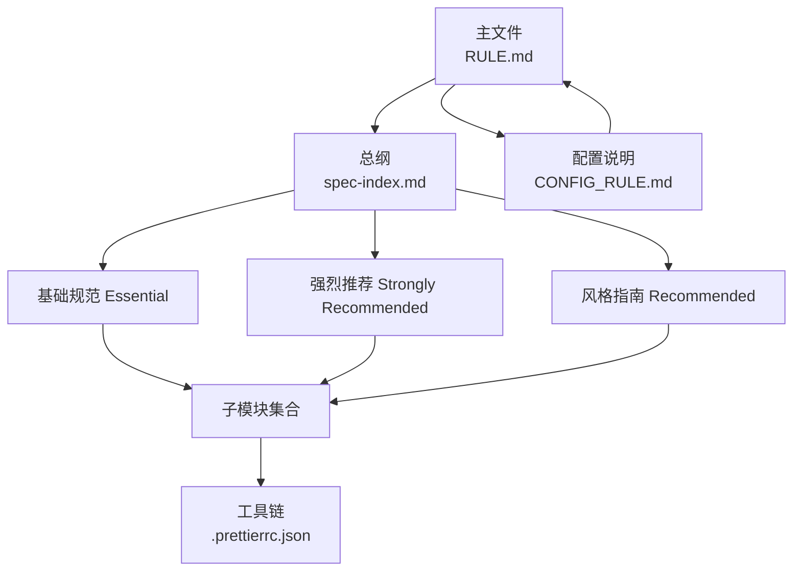
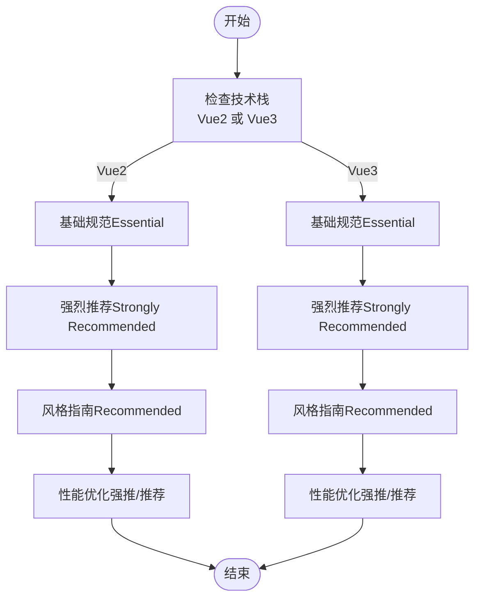
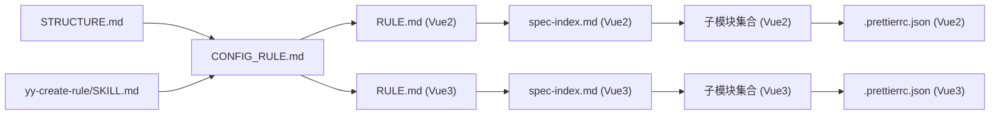

# 规则层级体系

<cite>
**本文引用的文件**
- [rules/frontend-rules-vue2/RULE.md](file://rules/frontend-rules-vue2/RULE.md)
- [rules/frontend-rules-vue3/RULE.md](file://rules/frontend-rules-vue3/RULE.md)
- [rules/frontend-rules-vue2/references/spec-index.md](file://rules/frontend-rules-vue2/references/spec-index.md)
- [rules/frontend-rules-vue3/references/spec-index.md](file://rules/frontend-rules-vue3/references/spec-index.md)
- [rules/frontend-rules-vue2/references/naming.md](file://rules/frontend-rules-vue2/references/naming.md)
- [skills/yy-frontend-vue2-review/references/component.md](file://skills/yy-frontend-vue2-review/references/component.md)
- [skills/yy-frontend-vue3-review/references/component.md](file://skills/yy-frontend-vue3-review/references/component.md)
- [rules/frontend-rules-vue2/assets/.prettierrc.json](file://rules/frontend-rules-vue2/assets/.prettierrc.json)
- [rules/frontend-rules-vue3/assets/.prettierrc.json](file://rules/frontend-rules-vue3/assets/.prettierrc.json)
- [docs/CONFIG_RULE.md](file://docs/CONFIG_RULE.md)
- [docs/STRUCTURE.md](file://docs/STRUCTURE.md)
- [skills/yy-create-rule/SKILL.md](file://skills/yy-create-rule/SKILL.md)
</cite>

## 目录
1. [简介](#简介)
2. [项目结构](#项目结构)
3. [核心组件](#核心组件)
4. [架构总览](#架构总览)
5. [详细组件分析](#详细组件分析)
6. [依赖分析](#依赖分析)
7. [性能考量](#性能考量)
8. [故障排查指南](#故障排查指南)
9. [结论](#结论)
10. [附录](#附录)

## 简介
本文件系统化阐述前端开发规则的“层级体系”，聚焦于 Vue2/Vue3 两条主线，围绕“基础规范（Essential）”“强烈推荐（Strongly Recommended）”“风格指南（Recommended）”三层优先级，解释其定义、特点、强制性与应用场景，并给出规则分类标准、选择原则、实际应用案例、层级间关系与冲突化解机制，以及规则制定与持续改进方法。文档以仓库中的规则文件与技能为依据，辅以可视化图示帮助不同背景读者快速掌握。

## 项目结构
规则体系由“规则主文件 + 子模块 + 配置与技能”构成：
- 规则主文件：分别在 Vue2/Vue3 目录下提供顶层规则索引与导航，明确三层优先级与适用范围。
- 子模块：按功能域拆分（命名、组件开发、交互通信、指令、顺序、网络、性能、注释、约束、AI 行为等），便于按需引用与维护。
- 配置与技能：提供规则生效方式、项目结构说明、以及创建/更新规则的自动化技能。

图表来源
- [rules/frontend-rules-vue2/RULE.md:1-62](file://rules/frontend-rules-vue2/RULE.md#L1-L62)
- [rules/frontend-rules-vue3/RULE.md:1-68](file://rules/frontend-rules-vue3/RULE.md#L1-L68)
- [rules/frontend-rules-vue2/references/spec-index.md:1-61](file://rules/frontend-rules-vue2/references/spec-index.md#L1-L61)
- [rules/frontend-rules-vue3/references/spec-index.md:1-60](file://rules/frontend-rules-vue3/references/spec-index.md#L1-L60)
- [rules/frontend-rules-vue2/references/naming.md:1-73](file://rules/frontend-rules-vue2/references/naming.md#L1-L73)
- [skills/yy-frontend-vue2-review/references/component.md:1-195](file://skills/yy-frontend-vue2-review/references/component.md#L1-L195)
- [skills/yy-frontend-vue3-review/references/component.md:1-105](file://skills/yy-frontend-vue3-review/references/component.md#L1-L105)
- [rules/frontend-rules-vue2/assets/.prettierrc.json:1-19](file://rules/frontend-rules-vue2/assets/.prettierrc.json#L1-L19)
- [rules/frontend-rules-vue3/assets/.prettierrc.json:1-20](file://rules/frontend-rules-vue3/assets/.prettierrc.json#L1-L20)
- [docs/CONFIG_RULE.md:1-34](file://docs/CONFIG_RULE.md#L1-L34)
- [docs/STRUCTURE.md:1-10](file://docs/STRUCTURE.md#L1-L10)
- [skills/yy-create-rule/SKILL.md:1-133](file://skills/yy-create-rule/SKILL.md#L1-L133)

章节来源
- [docs/STRUCTURE.md:1-10](file://docs/STRUCTURE.md#L1-L10)

## 核心组件
- 规则主文件（Vue2/Vue3）：定义三层优先级、适用范围、快速导航与模块索引，是规则体系的“宪法”。
- 规范总纲（spec-index）：按优先级组织规则清单，提供“详见”链接，便于检索与落地。
- 子模块：覆盖命名、组件开发、交互通信、指令、顺序、网络、性能、注释、约束、AI 行为等，形成“规则地图”。
- 工具与配置：Prettier 配置保障风格统一；配置文档说明规则生效方式；规则创建技能支撑持续演进。

章节来源
- [rules/frontend-rules-vue2/RULE.md:18-36](file://rules/frontend-rules-vue2/RULE.md#L18-L36)
- [rules/frontend-rules-vue3/RULE.md:24-46](file://rules/frontend-rules-vue3/RULE.md#L24-L46)
- [rules/frontend-rules-vue2/references/spec-index.md:11-56](file://rules/frontend-rules-vue2/references/spec-index.md#L11-L56)
- [rules/frontend-rules-vue3/references/spec-index.md:9-55](file://rules/frontend-rules-vue3/references/spec-index.md#L9-L55)

## 架构总览
规则层级体系采用“主文件 + 总纲 + 子模块”的分层架构：
- 主文件：提供高层索引与导航，明确三层优先级与适用范围。
- 总纲：将规则按优先级归档，形成“规则索引树”，便于检索与落地。
- 子模块：按功能域细化规则，支持独立维护与按需引用。
- 工具链：Prettier 配置统一风格；配置文档说明规则生效方式；规则创建技能支持持续改进。

图表来源
- [rules/frontend-rules-vue2/RULE.md:10-42](file://rules/frontend-rules-vue2/RULE.md#L10-L42)
- [rules/frontend-rules-vue3/RULE.md:10-22](file://rules/frontend-rules-vue3/RULE.md#L10-L22)
- [rules/frontend-rules-vue2/references/spec-index.md:11-56](file://rules/frontend-rules-vue2/references/spec-index.md#L11-L56)
- [rules/frontend-rules-vue3/references/spec-index.md:9-55](file://rules/frontend-rules-vue3/references/spec-index.md#L9-L55)
- [rules/frontend-rules-vue2/assets/.prettierrc.json:1-19](file://rules/frontend-rules-vue2/assets/.prettierrc.json#L1-L19)
- [rules/frontend-rules-vue3/assets/.prettierrc.json:1-20](file://rules/frontend-rules-vue3/assets/.prettierrc.json#L1-L20)
- [docs/CONFIG_RULE.md:1-34](file://docs/CONFIG_RULE.md#L1-L34)

## 详细组件分析

### 三层优先级定义与强制性
- 基础规范（Essential）
  - 定义：必须遵守，主要规避错误与潜在 Bug。
  - 特点：强制性强、边界清晰、违反即报错。
  - 应用场景：组件开发、指令使用、交互通信、响应式陷阱等。
  - 示例：Vue2 必须使用 Options API、v-for 与 key、v-if 与 v-for 冲突、v-html 安全；Vue3 必须使用 `<script setup>`、Props 定义规范、数据修改限制等。
- 强烈推荐（Strongly Recommended）
  - 定义：显著提升可读性与开发体验，应尽可能遵守。
  - 特点：建议性较强、影响工程化质量。
  - 应用场景：命名、SFC 结构顺序、Import 分组、组件交互、模板属性顺序、网络请求等。
  - 示例：Vue2 的命名与顺序、Vue3 的 Hooks、响应式与监听规范等。
- 风格指南（Recommended）
  - 定义：在多种同样好的实践中选择并保持一致，统一团队风格。
  - 特点：风格导向、可协商、强调一致性。
  - 应用场景：代码风格、注释规范、样式命名、性能优化、约束清单等。
  - 示例：Prettier 配置、注释格式、BEM 命名、性能优化策略等。

章节来源
- [rules/frontend-rules-vue2/references/spec-index.md:11-56](file://rules/frontend-rules-vue2/references/spec-index.md#L11-L56)
- [rules/frontend-rules-vue3/references/spec-index.md:9-55](file://rules/frontend-rules-vue3/references/spec-index.md#L9-L55)
- [rules/frontend-rules-vue2/RULE.md:18-36](file://rules/frontend-rules-vue2/RULE.md#L18-L36)
- [rules/frontend-rules-vue3/RULE.md:24-46](file://rules/frontend-rules-vue3/RULE.md#L24-L46)

### 规则分类标准与选择原则
- 技术栈与适用范围
  - Vue2：Options API、SFC 三段式结构、模板/脚本/样式顺序、命名与注释、性能优化、约束清单。
  - Vue3：<script setup、组合式 API、Hooks、响应式与监听、TypeScript 类型约束、模板属性顺序。
- 选择原则
  - 以“Essential”为底线，优先满足“无错”；再以“Strongly Recommended”提升“可维护性”；最后以“Recommended”统一“风格”。
  - 根据项目阶段与团队成熟度调整覆盖范围：新项目优先启用全部三层；成熟项目可聚焦“Recommended”以稳定风格。

章节来源
- [rules/frontend-rules-vue2/RULE.md:38-44](file://rules/frontend-rules-vue2/RULE.md#L38-L44)
- [rules/frontend-rules-vue3/RULE.md:18-22](file://rules/frontend-rules-vue3/RULE.md#L18-L22)
- [rules/frontend-rules-vue2/references/spec-index.md:11-56](file://rules/frontend-rules-vue2/references/spec-index.md#L11-L56)
- [rules/frontend-rules-vue3/references/spec-index.md:9-55](file://rules/frontend-rules-vue3/references/spec-index.md#L9-L55)

### 实际应用案例与选层策略
- 案例一：组件开发
  - Vue2：严格遵循 Options API 的脚本结构顺序与生命周期顺序，避免 mixins，模板元素特性按固定顺序排列，Props 明确类型与注释，Emit 事件白名单与顺序规范。
  - Vue3：必须使用 `<script setup>`，禁止使用 this 与 mixins，脚本结构顺序为 imports → defineProps → defineEmits → 全局 Hooks → 业务模块 → defineExpose，ref 优先、computed 优先于逻辑计算。
- 案例二：命名与顺序
  - Vue2：组件文件与使用均采用 PascalCase，API 函数与事件函数命名规范，data/computed 命名规范，BEM 样式命名。
  - Vue3：增加 Hooks 命名与返回值规范，Props/Emit 与交互事件白名单，模板属性顺序统一。
- 案例三：性能与网络
  - Vue2：懒加载、KeepAlive、虚拟滚动、防抖节流、$set 响应式陷阱规避。
  - Vue3：组件懒加载、KeepAlive、虚拟滚动、防抖节流、图片优化、async/await 统一错误处理。

章节来源
- [skills/yy-frontend-vue2-review/references/component.md:9-49](file://skills/yy-frontend-vue2-review/references/component.md#L9-L49)
- [skills/yy-frontend-vue3-review/references/component.md:7-36](file://skills/yy-frontend-vue3-review/references/component.md#L7-L36)
- [rules/frontend-rules-vue2/references/naming.md:1-73](file://rules/frontend-rules-vue2/references/naming.md#L1-L73)
- [rules/frontend-rules-vue2/RULE.md:50-59](file://rules/frontend-rules-vue2/RULE.md#L50-L59)
- [rules/frontend-rules-vue3/RULE.md:52-66](file://rules/frontend-rules-vue3/RULE.md#L52-L66)

### 规则之间的相互关系与依赖
- 依赖关系
  - 组件开发（Essential）是交互通信（Essential）的前提，缺少组件结构规范，通信规则难以落地。
  - 命名（Strongly Recommended）与顺序（Strongly Recommended）共同保证可读性与一致性，是风格指南（Recommended）的基础。
  - 性能优化（Strongly Recommended/Recommended）依赖于组件与网络请求规范的正确实施。
- 冲突化解机制
  - 当某条规则与其他规则存在冲突时，以“Essential > Strongly Recommended > Recommended”的优先级进行裁决。
  - 若出现跨版本差异（如 Vue2 与 Vue3），以“技术栈匹配”为准，分别适用各自总纲与子模块。

图表来源
- [rules/frontend-rules-vue2/references/spec-index.md:11-56](file://rules/frontend-rules-vue2/references/spec-index.md#L11-L56)
- [rules/frontend-rules-vue3/references/spec-index.md:9-55](file://rules/frontend-rules-vue3/references/spec-index.md#L9-L55)

## 依赖分析
- 主文件与总纲：主文件提供导航与范围，总纲提供优先级索引与“详见”链接，二者共同构成规则检索与落地的桥梁。
- 子模块与工具链：子模块细化规则，Prettier 配置保障风格统一；配置文档说明规则生效方式；规则创建技能支撑持续改进。
- 依赖耦合：规则主文件与总纲耦合度低，便于独立维护；子模块与主文件/总纲松耦合，按需引用；工具链与规则解耦，独立配置。

图表来源
- [rules/frontend-rules-vue2/RULE.md:10-42](file://rules/frontend-rules-vue2/RULE.md#L10-L42)
- [rules/frontend-rules-vue3/RULE.md:10-22](file://rules/frontend-rules-vue3/RULE.md#L10-L22)
- [rules/frontend-rules-vue2/references/spec-index.md:11-56](file://rules/frontend-rules-vue2/references/spec-index.md#L11-L56)
- [rules/frontend-rules-vue3/references/spec-index.md:9-55](file://rules/frontend-rules-vue3/references/spec-index.md#L9-L55)
- [rules/frontend-rules-vue2/assets/.prettierrc.json:1-19](file://rules/frontend-rules-vue2/assets/.prettierrc.json#L1-L19)
- [rules/frontend-rules-vue3/assets/.prettierrc.json:1-20](file://rules/frontend-rules-vue3/assets/.prettierrc.json#L1-L20)
- [docs/CONFIG_RULE.md:1-34](file://docs/CONFIG_RULE.md#L1-L34)
- [docs/STRUCTURE.md:1-10](file://docs/STRUCTURE.md#L1-L10)
- [skills/yy-create-rule/SKILL.md:1-133](file://skills/yy-create-rule/SKILL.md#L1-L133)

## 性能考量
- 规则驱动的性能优化
  - Vue2：懒加载、KeepAlive、虚拟滚动、防抖节流、$set 响应式陷阱规避。
  - Vue3：组件懒加载、KeepAlive、虚拟滚动、防抖节流、图片优化。
- 工具链配合
  - Prettier 配置统一缩进、换行、逗号等风格细节，减少因格式差异导致的审查成本与合并冲突。
- 选择策略
  - 在“Essential”层面确保无明显性能陷阱；在“Strongly Recommended”层面引入常见优化手段；在“Recommended”层面统一优化策略与阈值。

章节来源
- [rules/frontend-rules-vue2/RULE.md:50-59](file://rules/frontend-rules-vue2/RULE.md#L50-L59)
- [rules/frontend-rules-vue3/RULE.md:52-66](file://rules/frontend-rules-vue3/RULE.md#L52-L66)
- [rules/frontend-rules-vue2/assets/.prettierrc.json:1-19](file://rules/frontend-rules-vue2/assets/.prettierrc.json#L1-L19)
- [rules/frontend-rules-vue3/assets/.prettierrc.json:1-20](file://rules/frontend-rules-vue3/assets/.prettierrc.json#L1-L20)

## 故障排查指南
- 规则未生效
  - 检查规则文件是否放置于正确目录并被项目配置引用（OpenCode 与 Claude Code 的配置方式不同）。
  - 确认主文件与总纲索引是否指向正确的子模块路径。
- 规则冲突
  - 以“Essential > Strongly Recommended > Recommended”的优先级裁决；跨版本差异以技术栈为准。
- 规则维护
  - 使用规则创建技能（yy-create-rule）更新规则文档并同步 AGENTS.md 引用，确保 AI 助手理解最新规范。

章节来源
- [docs/CONFIG_RULE.md:1-34](file://docs/CONFIG_RULE.md#L1-L34)
- [rules/frontend-rules-vue2/RULE.md:10-42](file://rules/frontend-rules-vue2/RULE.md#L10-L42)
- [rules/frontend-rules-vue3/RULE.md:10-22](file://rules/frontend-rules-vue3/RULE.md#L10-L22)
- [skills/yy-create-rule/SKILL.md:1-133](file://skills/yy-create-rule/SKILL.md#L1-L133)

## 结论
规则层级体系以“Essential—Strongly Recommended—Recommended”三层优先级为核心，结合 Vue2/Vue3 的技术栈差异，形成可检索、可落地、可持续演进的规则地图。通过主文件与总纲索引、子模块细化、工具链配合与配置说明，既能满足“无错”底线，又能提升“可维护性”与“风格一致性”。建议团队在项目初期全面启用三层规则，在成熟期聚焦“Recommended”以稳定风格，并借助规则创建技能持续迭代。

## 附录

### 规则层级与模块映射（示例）
- Vue2
  - Essential：组件开发、交互通信、指令规范
  - Strongly Recommended：命名、顺序、网络
  - Recommended：代码风格、注释、CSS、性能、约束
- Vue3
  - Essential：<script setup、Props、交互通信
  - Strongly Recommended：命名、响应式、监听、Hooks、顺序、网络
  - Recommended：TypeScript、代码风格、注释、CSS、性能、约束

章节来源
- [rules/frontend-rules-vue2/RULE.md:18-36](file://rules/frontend-rules-vue2/RULE.md#L18-L36)
- [rules/frontend-rules-vue3/RULE.md:24-46](file://rules/frontend-rules-vue3/RULE.md#L24-L46)