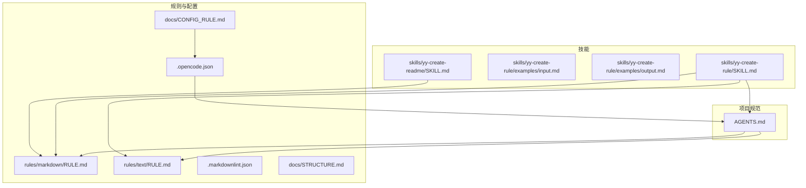
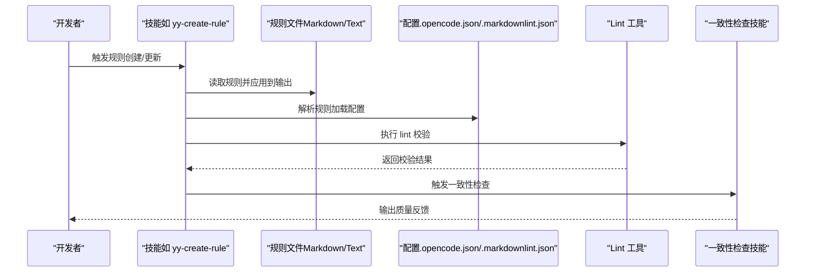
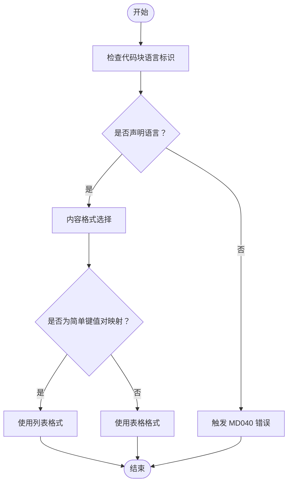
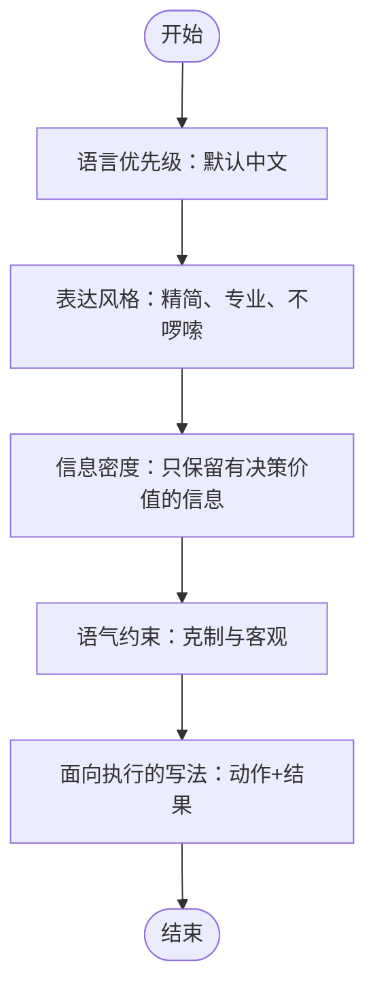
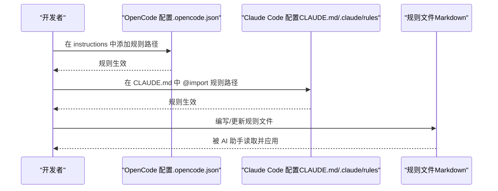
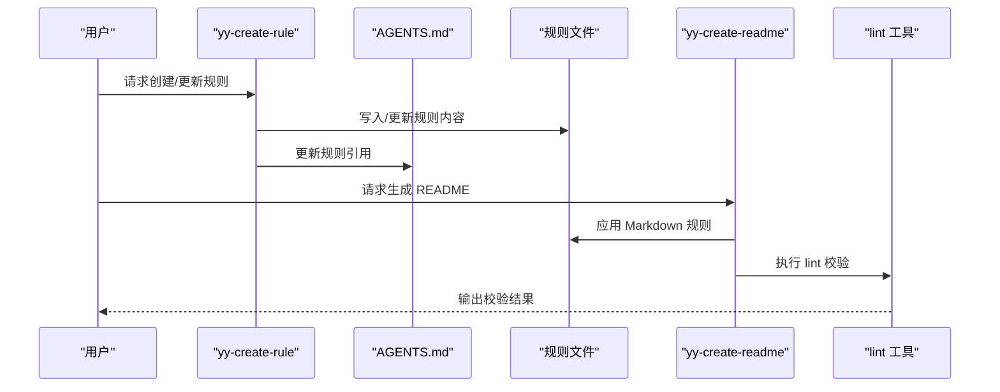
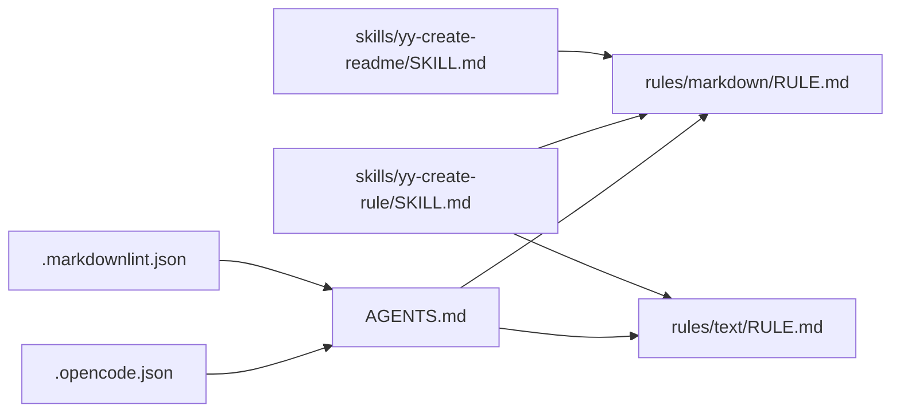

# 文档处理规则

<cite>
**本文引用的文件**
- [rules/markdown/RULE.md](file://rules/markdown/RULE.md)
- [rules/text/RULE.md](file://rules/text/RULE.md)
- [.markdownlint.json](file://.markdownlint.json)
- [.opencode.json](file://.opencode.json)
- [docs/CONFIG_RULE.md](file://docs/CONFIG_RULE.md)
- [docs/STRUCTURE.md](file://docs/STRUCTURE.md)
- [AGENTS.md](file://AGENTS.md)
- [skills/yy-create-rule/SKILL.md](file://skills/yy-create-rule/SKILL.md)
- [skills/yy-create-rule/examples/input.md](file://skills/yy-create-rule/examples/input.md)
- [skills/yy-create-rule/examples/output.md](file://skills/yy-create-rule/examples/output.md)
- [skills/yy-create-readme/SKILL.md](file://skills/yy-create-readme/SKILL.md)
</cite>

## 目录
1. [简介](#简介)
2. [项目结构](#项目结构)
3. [核心组件](#核心组件)
4. [架构总览](#架构总览)
5. [详细组件分析](#详细组件分析)
6. [依赖分析](#依赖分析)
7. [性能考虑](#性能考虑)
8. [故障排查指南](#故障排查指南)
9. [结论](#结论)
10. [附录](#附录)

## 简介
本文件系统性阐述文档处理规则体系，重点覆盖两类规则：
- Markdown 规则：面向 Markdown 文档的格式、结构与可读性规范，确保文档一致性、可读性与可维护性。
- Text 规则：面向自然语言表达的风格、信息密度与执行导向规范，确保输出简洁、专业、可执行。

规则在技能开发中的作用：
- 为 AI 助手提供“项目知识库”，统一输出风格与质量标准。
- 通过可执行的规则与工具链（如 lint）保障文档质量与一致性。
- 降低沟通成本，提升团队协作效率与交付质量。

## 项目结构
规则与文档相关的核心目录与文件：
- rules/markdown/RULE.md：Markdown 文档格式与结构规范。
- rules/text/RULE.md：自然语言表达风格与信息密度规范。
- .markdownlint.json：Markdown 语法检查工具的配置文件。
- .opencode.json：OpenCode 平台的指令与规则加载配置。
- docs/CONFIG_RULE.md：规则配置与引入方式说明。
- docs/STRUCTURE.md：项目结构概览。
- AGENTS.md：项目规范与关键参考，包含规则引用与路径规范。
- skills/yy-create-rule/SKILL.md：规则创建与更新的自动化技能说明。
- skills/yy-create-rule/examples/*：规则创建的输入/输出示例。
- skills/yy-create-readme/SKILL.md：README 生成技能，体现规则在文档中的应用。

**图表来源**
- [AGENTS.md:145-148](file://AGENTS.md#L145-L148)
- [.opencode.json:3-12](file://.opencode.json#L3-L12)
- [docs/CONFIG_RULE.md:1-34](file://docs/CONFIG_RULE.md#L1-L34)
- [rules/markdown/RULE.md:1-79](file://rules/markdown/RULE.md#L1-L79)
- [rules/text/RULE.md:1-90](file://rules/text/RULE.md#L1-L90)
- [skills/yy-create-rule/SKILL.md:1-133](file://skills/yy-create-rule/SKILL.md#L1-L133)
- [skills/yy-create-readme/SKILL.md:1-120](file://skills/yy-create-readme/SKILL.md#L1-L120)

**章节来源**
- [docs/STRUCTURE.md:1-10](file://docs/STRUCTURE.md#L1-L10)
- [docs/CONFIG_RULE.md:1-34](file://docs/CONFIG_RULE.md#L1-L34)
- [.opencode.json:1-14](file://.opencode.json#L1-L14)

## 核心组件
- Markdown 规则：定义代码块语言标识、内容格式选择（列表 vs 表格）、标题层级与列表结构、链接格式等规范，强调可读性与一致性。
- Text 规则：定义语言优先级（默认中文）、表达风格（精简、专业、不啰嗦）、信息密度（只保留有决策价值的信息）、语气约束（克制与客观）、面向执行的写法（优先动作与结果）。
- 配置与加载：通过 .opencode.json 加载规则文件；Claude Code 支持通过 @path 引入规则文件；OpenCode 需将规则置于 .opencode/rules/ 并在 opencode.json 中声明。
- 质量门禁与一致性：AGENTS.md 中的 Delivery Format、Quality Gate 与关键参考，确保规则落地与执行。

**章节来源**
- [rules/markdown/RULE.md:1-79](file://rules/markdown/RULE.md#L1-L79)
- [rules/text/RULE.md:1-90](file://rules/text/RULE.md#L1-L90)
- [.opencode.json:3-12](file://.opencode.json#L3-L12)
- [docs/CONFIG_RULE.md:1-34](file://docs/CONFIG_RULE.md#L1-L34)
- [AGENTS.md:11-32](file://AGENTS.md#L11-L32)

## 架构总览
规则系统在项目中的作用流程：
- 规则文件（Markdown/Text）作为“知识库”被加载到 AI 助手的上下文中。
- 技能（如规则创建、README 生成）在执行过程中遵循规则，保证输出风格与结构一致。
- 质量门禁（lint、一致性检查技能）对输出进行校验，确保规则得到落实。

**图表来源**
- [skills/yy-create-rule/SKILL.md:1-133](file://skills/yy-create-rule/SKILL.md#L1-L133)
- [.opencode.json:3-12](file://.opencode.json#L3-L12)
- [.markdownlint.json:1-13](file://.markdownlint.json#L1-L13)
- [AGENTS.md:11-17](file://AGENTS.md#L11-L17)

## 详细组件分析

### Markdown 规则详解
- 代码块语言标识：所有围栏代码块必须声明语言，避免空语言标识导致的 MD040 错误；常用语言标识对照表便于快速选择。
- 内容格式选择：简单键值对映射优先使用列表而非表格，提升可读性与移动端体验；复杂多列对比仍使用表格。
- 标题层级与列表结构：遵循 ATX 风格标题样式；列表缩进与层级清晰，便于导航与阅读。
- 链接格式：优先使用行内链接与标题锚点，确保跨文件引用清晰可追踪。

**图表来源**
- [rules/markdown/RULE.md:3-41](file://rules/markdown/RULE.md#L3-L41)
- [rules/markdown/RULE.md:43-79](file://rules/markdown/RULE.md#L43-L79)

**章节来源**
- [rules/markdown/RULE.md:1-79](file://rules/markdown/RULE.md#L1-L79)
- [.markdownlint.json:1-13](file://.markdownlint.json#L1-L13)

### Text 规则详解
- 语言优先级：默认使用中文表达，专有名词、命令、路径、代码标识符保留原文；用户指定语言时遵从用户要求。
- 表达风格：先结论后说明、一句话一个核心意思、短句为主、避免空话套话与情绪化表述。
- 信息密度：仅保留对当前任务有帮助的信息，说明修改原因时同时说明影响范围，说明风险时明确触发条件或受影响对象。
- 语气约束：保持克制与客观，避免口语化与主观臆断，不确定内容需标注“需确认”或“待验证”。
- 面向执行的写法：优先说明要做什么、改了什么、还有什么待验证，形成“修改原因—影响范围—验证结果”的结构化输出。

**图表来源**
- [rules/text/RULE.md:3-90](file://rules/text/RULE.md#L3-L90)

**章节来源**
- [rules/text/RULE.md:1-90](file://rules/text/RULE.md#L1-L90)

### 规则配置与加载
- OpenCode：将规则文件存放于 .opencode/rules/ 目录下，并在项目根目录的 opencode.json 中通过 instructions 数组引入规则文件路径。
- Claude Code：无需特别配置，只需在 CLAUDE.md 中通过 @path/to/import 引入规则文件路径，支持最多 5 层递归引用；可在 .claude/rules/ 目录下创建子目录存放规则文件。
- 配置示例与注意事项：参考 docs/CONFIG_RULE.md，确保路径正确与引用层级控制。

**图表来源**
- [docs/CONFIG_RULE.md:1-34](file://docs/CONFIG_RULE.md#L1-L34)
- [.opencode.json:3-12](file://.opencode.json#L3-L12)

**章节来源**
- [docs/CONFIG_RULE.md:1-34](file://docs/CONFIG_RULE.md#L1-L34)
- [.opencode.json:1-14](file://.opencode.json#L1-L14)

### 规则在技能开发中的应用
- 规则创建与更新：yy-create-rule 技能负责创建或更新规则文档，并在 AGENTS.md 中维护引用关系，确保规则知识库的完整性与可追溯性。
- README 生成：yy-create-readme 技能在生成 README 时遵循 Markdown 规则（标题层级、代码块语言标识、示例结构等），确保文档质量与一致性。
- 质量门禁：AGENTS.md 中的 Quality Gate 要求执行 lint 与一致性检查技能，规则作为质量标准的一部分被严格执行。

**图表来源**
- [skills/yy-create-rule/SKILL.md:1-133](file://skills/yy-create-rule/SKILL.md#L1-L133)
- [skills/yy-create-readme/SKILL.md:1-120](file://skills/yy-create-readme/SKILL.md#L1-L120)
- [AGENTS.md:11-17](file://AGENTS.md#L11-L17)

**章节来源**
- [skills/yy-create-rule/SKILL.md:1-133](file://skills/yy-create-rule/SKILL.md#L1-L133)
- [skills/yy-create-readme/SKILL.md:1-120](file://skills/yy-create-readme/SKILL.md#L1-L120)
- [AGENTS.md:11-32](file://AGENTS.md#L11-L32)

## 依赖分析
- 规则依赖关系：
  - AGENTS.md 引用 rules/markdown/RULE.md 与 rules/text/RULE.md，作为项目规范与质量标准的基础。
  - .opencode.json 通过 instructions 数组加载规则文件，使规则在 OpenCode 平台生效。
  - .markdownlint.json 控制 Markdown 语法检查工具的行为，与规则共同保障文档质量。
- 技能对规则的依赖：
  - yy-create-rule 与 yy-create-readme 在执行过程中遵循规则，确保输出风格与结构一致。
  - 质量门禁（lint 与一致性检查技能）对输出进行校验，规则作为判定依据。

**图表来源**
- [AGENTS.md:145-148](file://AGENTS.md#L145-L148)
- [.opencode.json:3-12](file://.opencode.json#L3-L12)
- [.markdownlint.json:1-13](file://.markdownlint.json#L1-L13)
- [skills/yy-create-rule/SKILL.md:1-133](file://skills/yy-create-rule/SKILL.md#L1-L133)
- [skills/yy-create-readme/SKILL.md:1-120](file://skills/yy-create-readme/SKILL.md#L1-L120)

**章节来源**
- [AGENTS.md:145-148](file://AGENTS.md#L145-L148)
- [.opencode.json:3-12](file://.opencode.json#L3-L12)
- [.markdownlint.json:1-13](file://.markdownlint.json#L1-L13)

## 性能考虑
- 规则文件体积与加载：规则文件应保持精简，避免冗长描述；通过 .opencode.json 或 @import 引用，减少重复加载。
- Lint 效率：.markdownlint.json 中关闭不必要的规则可降低 lint 时间；仅启用与项目质量门禁相关的规则。
- 技能执行：规则创建与 README 生成技能应尽量复用已有规则，减少重复计算与输出。

## 故障排查指南
- 规则未生效
  - 检查 .opencode.json 的 instructions 是否包含正确的规则路径。
  - 检查 Claude Code 中是否使用 @import 正确引入规则文件。
- Markdown 校验失败（如 MD040）
  - 检查所有围栏代码块是否声明语言标识。
  - 参考 rules/markdown/RULE.md 的示例与对照表修正。
- 输出不符合表达规范
  - 检查是否遵循 rules/text/RULE.md 的语言优先级、表达风格、信息密度与语气约束。
- 质量门禁未通过
  - 执行 lint 并根据结果修正；必要时运行一致性检查技能。

**章节来源**
- [docs/CONFIG_RULE.md:1-34](file://docs/CONFIG_RULE.md#L1-L34)
- [rules/markdown/RULE.md:1-79](file://rules/markdown/RULE.md#L1-L79)
- [rules/text/RULE.md:1-90](file://rules/text/RULE.md#L1-L90)
- [AGENTS.md:11-17](file://AGENTS.md#L11-L17)

## 结论
文档处理规则系统通过 Markdown 与 Text 两大维度，为技能开发提供了统一的输出规范与质量标准。结合配置与加载机制、质量门禁与一致性检查技能，规则得以在项目中有效落地，显著提升文档质量与团队协作效率。建议在日常开发中：
- 严格遵循规则文件中的格式与表达规范；
- 在 .opencode.json 或 Claude Code 中正确引入规则；
- 使用 lint 与一致性检查技能持续保障质量。

## 附录
- 规则创建与更新示例：参考 skills/yy-create-rule/examples/input.md 与 output.md，了解典型输入与输出形态。
- README 生成参考：参考 skills/yy-create-readme/SKILL.md，了解规则在 README 生成中的应用。

**章节来源**
- [skills/yy-create-rule/examples/input.md:1-34](file://skills/yy-create-rule/examples/input.md#L1-L34)
- [skills/yy-create-rule/examples/output.md:1-32](file://skills/yy-create-rule/examples/output.md#L1-L32)
- [skills/yy-create-readme/SKILL.md:1-120](file://skills/yy-create-readme/SKILL.md#L1-L120)