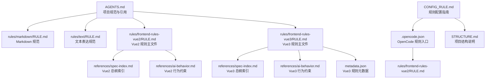
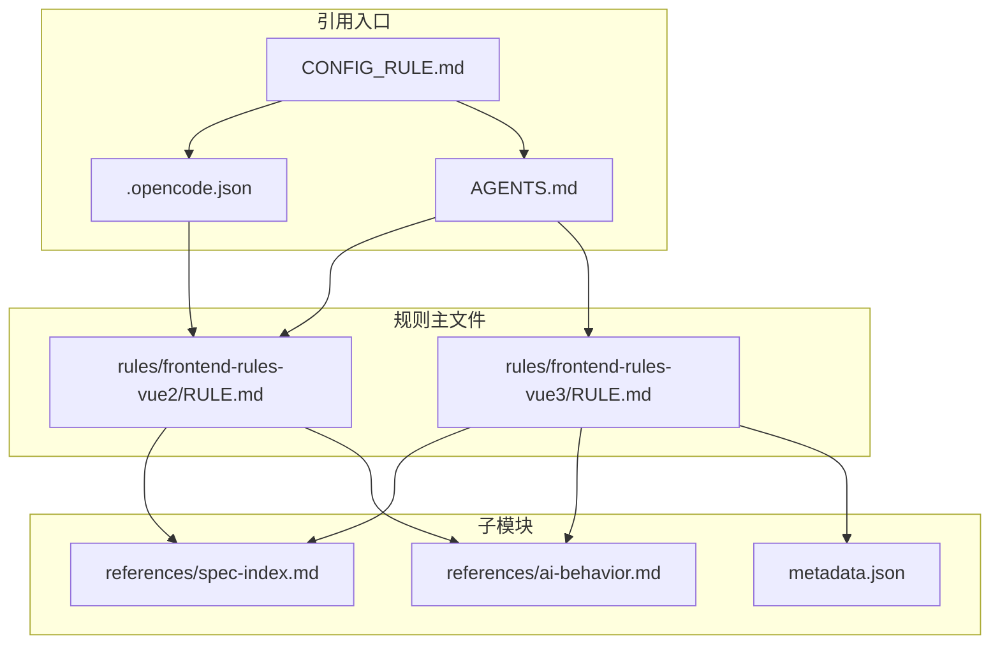
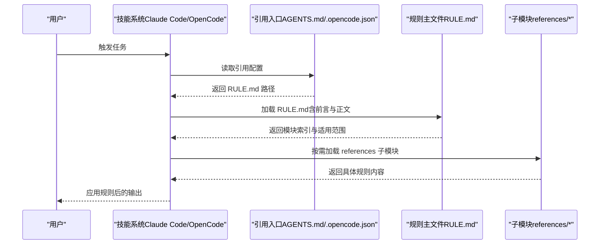
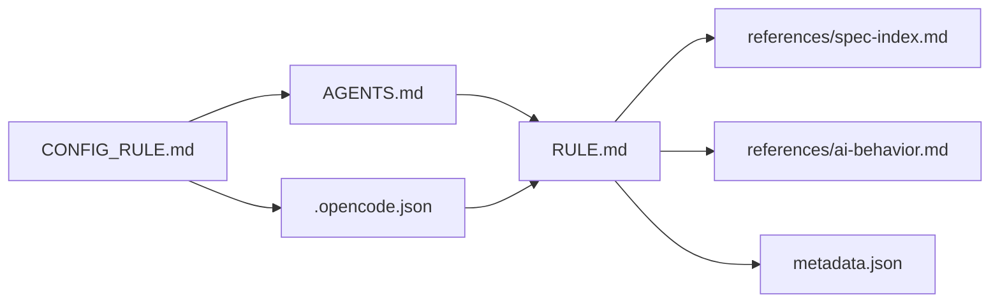

# 规则基础概念

<cite>
**本文引用的文件**
- [RULE.md（Vue2 规则）](file://rules/frontend-rules-vue2/RULE.md)
- [RULE.md（Vue3 规则）](file://rules/frontend-rules-vue3/RULE.md)
- [metadata.json（Vue3 规则元数据）](file://rules/frontend-rules-vue3/metadata.json)
- [SPEC-INDEX.md（Vue2 规则总纲）](file://rules/frontend-rules-vue2/references/spec-index.md)
- [SPEC-INDEX.md（Vue3 规则总纲）](file://rules/frontend-rules-vue3/references/spec-index.md)
- [AI-BEHAVIOR.md（Vue2 行为约束）](file://rules/frontend-rules-vue2/references/ai-behavior.md)
- [AI-BEHAVIOR.md（Vue3 行为约束）](file://rules/frontend-rules-vue3/references/ai-behavior.md)
- [CONFIG_RULE.md（规则配置指南）](file://docs/CONFIG_RULE.md)
- [AGENTS.md（项目规范与引用）](file://AGENTS.md)
- [STRUCTURE.md（项目结构）](file://docs/STRUCTURE.md)
- [.opencode.json（OpenCode 配置）](file://.opencode.json)
- [RULE.md（Markdown 规范）](file://rules/markdown/RULE.md)
- [RULE.md（文本表达规范）](file://rules/text/RULE.md)
- [SKILL.md（yy-create-rule 技能）](file://skills/yy-create-rule/SKILL.md)
</cite>

## 目录
1. [简介](#简介)
2. [项目结构](#项目结构)
3. [核心组件](#核心组件)
4. [架构总览](#架构总览)
5. [详细组件分析](#详细组件分析)
6. [依赖分析](#依赖分析)
7. [性能考虑](#性能考虑)
8. [故障排查指南](#故障排查指南)
9. [结论](#结论)
10. [附录](#附录)

## 简介
本文件系统性阐述规则系统的“基础概念”，围绕 RULE.md 的标准格式与语法规则展开，解释前言元数据配置（如 description、alwaysApply 等字段）、规则文件的结构组成（描述信息、适用范围、规则分类与模块索引）、规则的应用机制与执行逻辑（如何被技能系统识别与应用）、规则文件创建的最佳实践（命名规范、文件组织与版本管理），以及规则系统的扩展性设计与自定义规则开发指导。

## 项目结构
规则系统位于 rules/ 目录，按技术栈与主题拆分子模块；规则主文件（RULE.md）采用 YAML 前言（front matter）+ Markdown 正文的标准格式；规则元数据（metadata.json）用于描述版本、作者、摘要与结构化分类；规则通过 AGENTS.md 或 .opencode.json 等入口文件被技能系统引用与加载。

**图示来源**
- [AGENTS.md:145-149](file://AGENTS.md#L145-L149)
- [RULE.md（Vue2 规则）:1-62](file://rules/frontend-rules-vue2/RULE.md#L1-L62)
- [RULE.md（Vue3 规则）:1-68](file://rules/frontend-rules-vue3/RULE.md#L1-L68)
- [.opencode.json:1-14](file://.opencode.json#L1-L14)
- [CONFIG_RULE.md:1-34](file://docs/CONFIG_RULE.md#L1-L34)
- [STRUCTURE.md:1-10](file://docs/STRUCTURE.md#L1-L10)

**章节来源**
- [STRUCTURE.md:1-10](file://docs/STRUCTURE.md#L1-L10)
- [AGENTS.md:145-149](file://AGENTS.md#L145-L149)

## 核心组件
- 规则主文件（RULE.md）：采用 YAML front matter（前言）定义元数据，正文使用 Markdown 组织模块索引、适用范围与快速导航。
- 规则元数据（metadata.json）：描述版本、日期、作者、摘要与结构化分类（essential/strongly_recommended/recommended/ai_behavior）。
- 规则总纲（references/spec-index.md）：按优先级组织规则索引，提供“基础规范/强烈推荐/风格指南”的三级分类与快速跳转。
- 行为约束（references/ai-behavior.md）：定义 AI 在对话与文件操作中的权限边界与行为模式。
- 引用入口（AGENTS.md、.opencode.json）：将规则纳入技能系统，使规则被识别与应用。
- 配置指南（CONFIG_RULE.md）：说明不同平台（OpenCode、Claude Code）的规则配置方式与目录组织。

**章节来源**
- [RULE.md（Vue2 规则）:1-62](file://rules/frontend-rules-vue2/RULE.md#L1-L62)
- [RULE.md（Vue3 规则）:1-68](file://rules/frontend-rules-vue3/RULE.md#L1-L68)
- [metadata.json（Vue3 规则元数据）:1-17](file://rules/frontend-rules-vue3/metadata.json#L1-L17)
- [SPEC-INDEX.md（Vue2 规则总纲）:1-61](file://rules/frontend-rules-vue2/references/spec-index.md#L1-L61)
- [SPEC-INDEX.md（Vue3 规则总纲）:1-60](file://rules/frontend-rules-vue3/references/spec-index.md#L1-L60)
- [AI-BEHAVIOR.md（Vue2 行为约束）:1-29](file://rules/frontend-rules-vue2/references/ai-behavior.md#L1-L29)
- [AI-BEHAVIOR.md（Vue3 行为约束）:1-29](file://rules/frontend-rules-vue3/references/ai-behavior.md#L1-L29)
- [AGENTS.md:145-149](file://AGENTS.md#L145-L149)
- [.opencode.json:1-14](file://.opencode.json#L1-L14)
- [CONFIG_RULE.md:1-34](file://docs/CONFIG_RULE.md#L1-L34)

## 架构总览
规则系统通过“主文件 + 子模块 + 元数据 + 引用入口”的组合实现模块化与可扩展性。技能系统（如 Claude Code、OpenCode）通过引用入口加载 RULE.md 与 references 下的子模块，形成完整的规则集。

**图示来源**
- [RULE.md（Vue2 规则）:1-62](file://rules/frontend-rules-vue2/RULE.md#L1-L62)
- [RULE.md（Vue3 规则）:1-68](file://rules/frontend-rules-vue3/RULE.md#L1-L68)
- [SPEC-INDEX.md（Vue2 规则总纲）:1-61](file://rules/frontend-rules-vue2/references/spec-index.md#L1-L61)
- [SPEC-INDEX.md（Vue3 规则总纲）:1-60](file://rules/frontend-rules-vue3/references/spec-index.md#L1-L60)
- [AI-BEHAVIOR.md（Vue2 行为约束）:1-29](file://rules/frontend-rules-vue2/references/ai-behavior.md#L1-L29)
- [AI-BEHAVIOR.md（Vue3 行为约束）:1-29](file://rules/frontend-rules-vue3/references/ai-behavior.md#L1-L29)
- [metadata.json（Vue3 规则元数据）:1-17](file://rules/frontend-rules-vue3/metadata.json#L1-L17)
- [AGENTS.md:145-149](file://AGENTS.md#L145-L149)
- [.opencode.json:1-14](file://.opencode.json#L1-L14)
- [CONFIG_RULE.md:1-34](file://docs/CONFIG_RULE.md#L1-L34)

## 详细组件分析

### RULE.md 标准格式与语法规则
- YAML front matter（前言）：用于声明规则的基本元信息，如 description、alwaysApply 等字段。前言以 "---" 开始与结束，中间为键值对。
- 正文（Markdown）：使用标题层级组织模块索引、适用范围、规则分类与快速导航。
- 前言字段示例与含义：
  - description：规则的简要描述，便于识别与检索。
  - alwaysApply：布尔值，指示规则是否应始终应用（例如在某些平台上默认启用）。
- 正文结构要点：
  - 模块索引：列出 references 下的子模块，支持按需引用与跳转。
  - 适用范围：明确规则适用的文件类型、目录约束与技术栈。
  - 规则分类：按优先级组织（如 Essential/Strongly Recommended/Recommended）。
  - 快速导航：提供模块与核心内容的映射，便于查阅。

**章节来源**
- [RULE.md（Vue2 规则）:1-62](file://rules/frontend-rules-vue2/RULE.md#L1-L62)
- [RULE.md（Vue3 规则）:1-68](file://rules/frontend-rules-vue3/RULE.md#L1-L68)

### 规则文件结构组成
- 描述信息：通过前言与标题层级提供规则目的、范围与分类。
- 适用范围：限定文件类型、目录约束与技术栈，确保规则落地执行。
- 规则分类：三级优先级（Essential/Strongly Recommended/Recommended），并可包含 AI 行为约束模块。
- 模块索引：references 下的子模块文件，通过 RULE.md 的模块索引进行统一编排与跳转。

**章节来源**
- [SPEC-INDEX.md（Vue2 规则总纲）:1-61](file://rules/frontend-rules-vue2/references/spec-index.md#L1-L61)
- [SPEC-INDEX.md（Vue3 规则总纲）:1-60](file://rules/frontend-rules-vue3/references/spec-index.md#L1-L60)
- [AI-BEHAVIOR.md（Vue2 行为约束）:1-29](file://rules/frontend-rules-vue2/references/ai-behavior.md#L1-L29)
- [AI-BEHAVIOR.md（Vue3 行为约束）:1-29](file://rules/frontend-rules-vue3/references/ai-behavior.md#L1-L29)

### 规则的应用机制与执行逻辑
- 引用入口加载：技能系统通过 AGENTS.md 或 .opencode.json 等入口文件加载 RULE.md 与 references 子模块。
- 平台差异：
  - OpenCode：通过 .opencode.json 的 instructions 字段引入规则文件，规则需手动配置。
  - Claude Code：通过 CLAUDE.md 中的 @path/to/import 引入规则文件，支持最多 5 层递归引用。
- 执行逻辑：RULE.md 作为规则集的“索引与导航”，references 下的子模块承载具体规则；技能系统在执行任务时依据引用关系与前言元数据决定是否应用某条规则。

**图示来源**
- [AGENTS.md:145-149](file://AGENTS.md#L145-L149)
- [.opencode.json:1-14](file://.opencode.json#L1-L14)
- [CONFIG_RULE.md:1-34](file://docs/CONFIG_RULE.md#L1-L34)
- [RULE.md（Vue2 规则）:1-62](file://rules/frontend-rules-vue2/RULE.md#L1-L62)
- [RULE.md（Vue3 规则）:1-68](file://rules/frontend-rules-vue3/RULE.md#L1-L68)

**章节来源**
- [CONFIG_RULE.md:1-34](file://docs/CONFIG_RULE.md#L1-L34)
- [.opencode.json:1-14](file://.opencode.json#L1-L14)
- [AGENTS.md:145-149](file://AGENTS.md#L145-L149)

### 规则文件创建的最佳实践
- 命名规范：使用 kebab-case（如 vue-component-norms.md、api-best-practices.md），确保跨平台兼容与可读性。
- 文件组织：将规则文件置于 rules/ 目录下，按技术栈或主题拆分子目录；主文件（RULE.md）统一索引 references 下的子模块。
- 版本管理：通过 metadata.json 维护版本、日期、作者与摘要；结构化分类（essential/strongly_recommended/recommended/ai_behavior）便于检索与扩展。
- 内容结构：遵循“前言元数据 + 正文模块索引 + 适用范围 + 分类 + 快速导航”的标准格式；正文使用清晰的标题层级与列表/表格组织。
- 引用更新：使用 yy-create-rule 技能自动更新 AGENTS.md 中的引用关系，确保 AI 助手能够理解项目的具体规范与最佳实践。

**章节来源**
- [SKILL.md（yy-create-rule 技能）:1-133](file://skills/yy-create-rule/SKILL.md#L1-L133)
- [metadata.json（Vue3 规则元数据）:1-17](file://rules/frontend-rules-vue3/metadata.json#L1-L17)

### 规则系统的扩展性设计
- 模块化结构：RULE.md 作为索引，references 下的子模块独立维护，按需引用，降低耦合与提升可维护性。
- 三级分类体系：Essential/Strongly Recommended/Recommended 与 AI 行为约束模块，满足不同优先级与场景需求。
- 元数据驱动：metadata.json 提供版本、作者、摘要与结构化分类，便于工具链与平台识别与扩展。
- 平台适配：通过不同入口（AGENTS.md、.opencode.json、Claude Code 的 @import）适配多平台规则加载。

**章节来源**
- [SPEC-INDEX.md（Vue2 规则总纲）:1-61](file://rules/frontend-rules-vue2/references/spec-index.md#L1-L61)
- [SPEC-INDEX.md（Vue3 规则总纲）:1-60](file://rules/frontend-rules-vue3/references/spec-index.md#L1-L60)
- [metadata.json（Vue3 规则元数据）:1-17](file://rules/frontend-rules-vue3/metadata.json#L1-L17)

## 依赖分析
规则系统的核心依赖关系如下：
- RULE.md 依赖 references 下的子模块（spec-index.md、ai-behavior.md 等）。
- RULE.md 与 metadata.json 共同构成规则的“索引 + 元数据”双层结构。
- 引用入口（AGENTS.md、.opencode.json）决定规则的可见性与加载路径。
- 配置指南（CONFIG_RULE.md）提供不同平台的配置方式与目录组织建议。

**图示来源**
- [RULE.md（Vue2 规则）:1-62](file://rules/frontend-rules-vue2/RULE.md#L1-L62)
- [RULE.md（Vue3 规则）:1-68](file://rules/frontend-rules-vue3/RULE.md#L1-L68)
- [SPEC-INDEX.md（Vue2 规则总纲）:1-61](file://rules/frontend-rules-vue2/references/spec-index.md#L1-L61)
- [SPEC-INDEX.md（Vue3 规则总纲）:1-60](file://rules/frontend-rules-vue3/references/spec-index.md#L1-L60)
- [AI-BEHAVIOR.md（Vue2 行为约束）:1-29](file://rules/frontend-rules-vue2/references/ai-behavior.md#L1-L29)
- [AI-BEHAVIOR.md（Vue3 行为约束）:1-29](file://rules/frontend-rules-vue3/references/ai-behavior.md#L1-L29)
- [metadata.json（Vue3 规则元数据）:1-17](file://rules/frontend-rules-vue3/metadata.json#L1-L17)
- [AGENTS.md:145-149](file://AGENTS.md#L145-L149)
- [.opencode.json:1-14](file://.opencode.json#L1-L14)
- [CONFIG_RULE.md:1-34](file://docs/CONFIG_RULE.md#L1-L34)

**章节来源**
- [CONFIG_RULE.md:1-34](file://docs/CONFIG_RULE.md#L1-L34)
- [AGENTS.md:145-149](file://AGENTS.md#L145-L149)
- [.opencode.json:1-14](file://.opencode.json#L1-L14)

## 性能考虑
- 规则加载性能：通过引用入口（AGENTS.md、.opencode.json）按需加载 RULE.md 与 references 子模块，避免一次性加载全部规则导致的性能开销。
- 维护成本：模块化与三级分类降低规则维护成本，便于增量更新与版本演进。
- 工具链集成：结合 lint 工具与技能系统，确保规则一致性与执行质量。

## 故障排查指南
- 规则未生效：
  - 检查引用入口（AGENTS.md、.opencode.json）是否包含 RULE.md 路径。
  - 确认 RULE.md 的前言元数据（如 alwaysApply）与平台配置一致。
- 子模块缺失：
  - 确认 references 下的子模块文件存在且路径正确。
  - 检查 RULE.md 的模块索引是否与 references 文件名一致。
- 平台差异：
  - OpenCode 需要在 .opencode.json 中显式配置 instructions。
  - Claude Code 支持 @path/to/import 递归引用，注意最大递归层数限制。

**章节来源**
- [CONFIG_RULE.md:1-34](file://docs/CONFIG_RULE.md#L1-L34)
- [.opencode.json:1-14](file://.opencode.json#L1-L14)
- [AGENTS.md:145-149](file://AGENTS.md#L145-L149)

## 结论
规则系统通过“主文件 + 子模块 + 元数据 + 引用入口”的结构实现了模块化、可扩展与跨平台适配。RULE.md 的 YAML front matter 与正文结构提供了清晰的元信息与导航；metadata.json 与三级分类体系增强了可维护性与工具链支持；通过 AGENTS.md 与 .opencode.json 的配置，规则被技能系统识别与应用。遵循命名规范、文件组织与版本管理的最佳实践，可有效提升规则系统的稳定性与可演进性。

## 附录
- 相关规则文件：
  - [RULE.md（Markdown 规范）:1-79](file://rules/markdown/RULE.md#L1-L79)
  - [RULE.md（文本表达规范）:1-90](file://rules/text/RULE.md#L1-L90)
- 相关技能文件：
  - [SKILL.md（yy-create-rule 技能）:1-133](file://skills/yy-create-rule/SKILL.md#L1-L133)