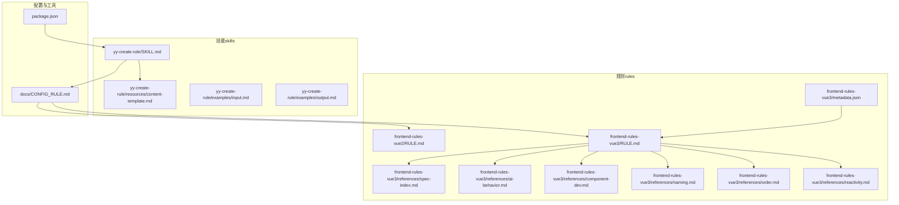
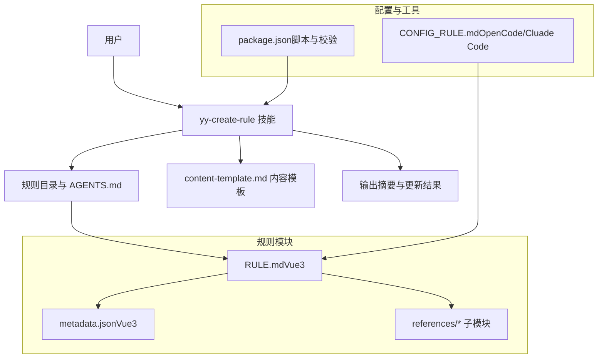
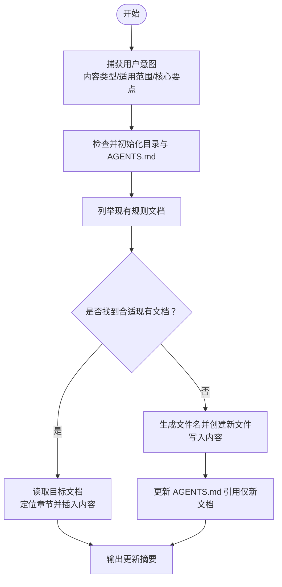
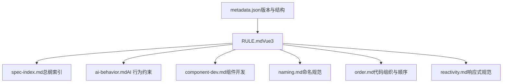
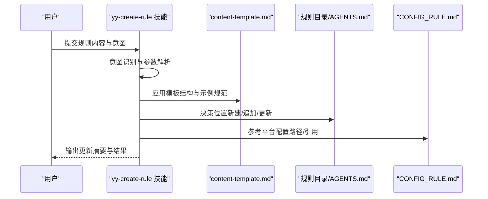
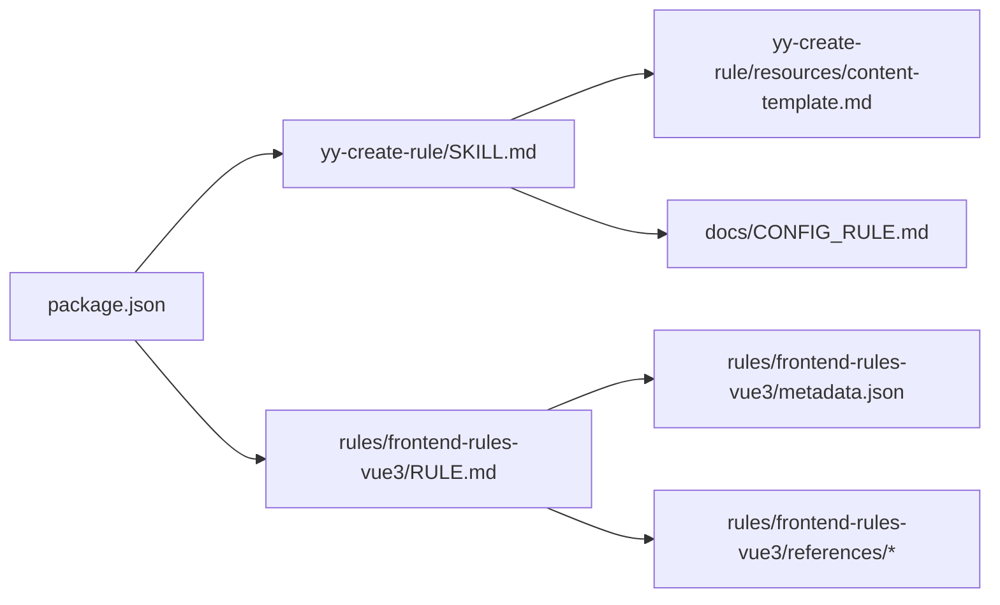

# 规则定制与扩展

<cite>
**本文引用的文件**
- [SKILL.md](file://skills/yy-create-rule/SKILL.md)
- [content-template.md](file://skills/yy-create-rule/resources/content-template.md)
- [input.md](file://skills/yy-create-rule/examples/input.md)
- [output.md](file://skills/yy-create-rule/examples/output.md)
- [RULE.md（Vue2 规则）](file://rules/frontend-rules-vue2/RULE.md)
- [RULE.md（Vue3 规则）](file://rules/frontend-rules-vue3/RULE.md)
- [metadata.json（Vue3 规则）](file://rules/frontend-rules-vue3/metadata.json)
- [spec-index.md（Vue3 规则）](file://rules/frontend-rules-vue3/references/spec-index.md)
- [ai-behavior.md（Vue3 规则）](file://rules/frontend-rules-vue3/references/ai-behavior.md)
- [component-dev.md（Vue3 规则）](file://rules/frontend-rules-vue3/references/component-dev.md)
- [naming.md（Vue3 规则）](file://rules/frontend-rules-vue3/references/naming.md)
- [order.md（Vue3 规则）](file://rules/frontend-rules-vue3/references/order.md)
- [reactivity.md（Vue3 规则）](file://rules/frontend-rules-vue3/references/reactivity.md)
- [CONFIG_RULE.md](file://docs/CONFIG_RULE.md)
- [package.json](file://package.json)
</cite>

## 目录
1. [简介](#简介)
2. [项目结构](#项目结构)
3. [核心组件](#核心组件)
4. [架构总览](#架构总览)
5. [详细组件分析](#详细组件分析)
6. [依赖分析](#依赖分析)
7. [性能考量](#性能考量)
8. [故障排查指南](#故障排查指南)
9. [结论](#结论)
10. [附录](#附录)

## 简介
本指南围绕“规则定制与扩展”主题，系统讲解如何基于 yy-create-rule 技能创建与更新规则文档，并结合规则模板、参数配置、版本管理、测试验证、共享分发与长期维护策略，帮助团队构建可演进、可复用、可协作的规则知识库。文档同时梳理了规则模块化结构（以 Vue3 规则为例）与引用关系，提供面向 AI 助手的知识注入与执行边界约束。

## 项目结构
本仓库将“规则”与“技能”两类资产分层组织：
- 规则（rules）：以模块化方式组织，按领域与优先级分级，便于按需引用与维护。
- 技能（skills）：以可执行能力为中心，提供自动化规则创建、更新与知识注入。

图表来源
- [RULE.md（Vue2 规则）:1-62](file://rules/frontend-rules-vue2/RULE.md#L1-L62)
- [RULE.md（Vue3 规则）:1-68](file://rules/frontend-rules-vue3/RULE.md#L1-L68)
- [metadata.json（Vue3 规则）:1-17](file://rules/frontend-rules-vue3/metadata.json#L1-L17)
- [spec-index.md（Vue3 规则）:1-60](file://rules/frontend-rules-vue3/references/spec-index.md#L1-L60)
- [ai-behavior.md（Vue3 规则）:1-29](file://rules/frontend-rules-vue3/references/ai-behavior.md#L1-L29)
- [component-dev.md（Vue3 规则）:1-81](file://rules/frontend-rules-vue3/references/component-dev.md#L1-L81)
- [naming.md（Vue3 规则）:1-85](file://rules/frontend-rules-vue3/references/naming.md#L1-L85)
- [order.md（Vue3 规则）:1-141](file://rules/frontend-rules-vue3/references/order.md#L1-L141)
- [reactivity.md（Vue3 规则）:1-227](file://rules/frontend-rules-vue3/references/reactivity.md#L1-L227)
- [SKILL.md（yy-create-rule）:1-133](file://skills/yy-create-rule/SKILL.md#L1-L133)
- [content-template.md（yy-create-rule）:1-122](file://skills/yy-create-rule/resources/content-template.md#L1-L122)
- [CONFIG_RULE.md:1-34](file://docs/CONFIG_RULE.md#L1-L34)
- [package.json:1-46](file://package.json#L1-L46)

章节来源
- [RULE.md（Vue2 规则）:1-62](file://rules/frontend-rules-vue2/RULE.md#L1-L62)
- [RULE.md（Vue3 规则）:1-68](file://rules/frontend-rules-vue3/RULE.md#L1-L68)
- [metadata.json（Vue3 规则）:1-17](file://rules/frontend-rules-vue3/metadata.json#L1-L17)
- [SPEC_INDEX.md（Vue3 规则）:1-60](file://rules/frontend-rules-vue3/references/spec-index.md#L1-L60)
- [AI_BEHAVIOR.md（Vue3 规则）:1-29](file://rules/frontend-rules-vue3/references/ai-behavior.md#L1-L29)
- [COMPONENT_DEV.md（Vue3 规则）:1-81](file://rules/frontend-rules-vue3/references/component-dev.md#L1-L81)
- [NAMING.md（Vue3 规则）:1-85](file://rules/frontend-rules-vue3/references/naming.md#L1-L85)
- [ORDER.md（Vue3 规则）:1-141](file://rules/frontend-rules-vue3/references/order.md#L1-L141)
- [REACTIVITY.md（Vue3 规则）:1-227](file://rules/frontend-rules-vue3/references/reactivity.md#L1-L227)
- [SKILL.md（yy-create-rule）:1-133](file://skills/yy-create-rule/SKILL.md#L1-L133)
- [content-template.md（yy-create-rule）:1-122](file://skills/yy-create-rule/resources/content-template.md#L1-L122)
- [CONFIG_RULE.md:1-34](file://docs/CONFIG_RULE.md#L1-L34)
- [package.json:1-46](file://package.json#L1-L46)

## 核心组件
- 规则技能（yy-create-rule）：负责捕获用户意图、初始化目录与文件、决定内容放置位置、格式化并插入内容、更新 AGENTS.md 引用、输出更新摘要。其工作流贯穿“意图识别—目录检查—位置决策—格式化—引用更新—结果输出”。
- 规则模块（rules）：以 RULE.md 为核心，辅以 metadata.json、references 子模块与索引文件，形成“总纲—行为约束—模块化规范”的三层结构，支持按需引用与版本化管理。
- 配置与工具（docs/CONFIG_RULE.md、package.json）：提供规则生效配置（OpenCode/Cluade Code）、规则引用路径与遍历策略；package.json 提供脚本与校验工具，保障规则与技能的一致性与质量。

章节来源
- [SKILL.md（yy-create-rule）:29-103](file://skills/yy-create-rule/SKILL.md#L29-L103)
- [RULE.md（Vue3 规则）:1-68](file://rules/frontend-rules-vue3/RULE.md#L1-L68)
- [metadata.json（Vue3 规则）:1-17](file://rules/frontend-rules-vue3/metadata.json#L1-L17)
- [CONFIG_RULE.md:1-34](file://docs/CONFIG_RULE.md#L1-L34)
- [package.json:1-46](file://package.json#L1-L46)

## 架构总览
规则定制与扩展的总体架构由“规则技能”驱动、“规则模块”承载、“配置工具”支撑，最终服务于 AI 助手的知识注入与行为约束。

图表来源
- [SKILL.md（yy-create-rule）:1-133](file://skills/yy-create-rule/SKILL.md#L1-L133)
- [content-template.md（yy-create-rule）:1-122](file://skills/yy-create-rule/resources/content-template.md#L1-L122)
- [RULE.md（Vue3 规则）:1-68](file://rules/frontend-rules-vue3/RULE.md#L1-L68)
- [metadata.json（Vue3 规则）:1-17](file://rules/frontend-rules-vue3/metadata.json#L1-L17)
- [CONFIG_RULE.md:1-34](file://docs/CONFIG_RULE.md#L1-L34)
- [package.json:1-46](file://package.json#L1-L46)

## 详细组件分析

### 组件 A：规则技能（yy-create-rule）
- 意图捕获：根据用户描述自动判断内容类型（最佳实践/规范约定/bug 修复/架构决策/其他），默认全局适用，支持指定模块范围。
- 初始化检查：确保规则目录存在（默认 .agents/rules 或用户指定），确保 AGENTS.md 存在并可读。
- 位置决策：扫描现有规则文档，判断新内容归属；若无合适文档则自动生成文件名并创建新文件；若用户指定在现有文档追加则直接追加。
- 格式化与插入：依据 content-template.md 的结构模板组织内容，保持层级与示例规范。
- 引用更新：仅在创建新规则文档时更新 AGENTS.md 的 Rules 章节引用。
- 输出结果：输出更新摘要，包含更新文件、章节、新增内容等信息。

图表来源
- [SKILL.md（yy-create-rule）:31-91](file://skills/yy-create-rule/SKILL.md#L31-L91)
- [content-template.md（yy-create-rule）:1-122](file://skills/yy-create-rule/resources/content-template.md#L1-L122)

章节来源
- [SKILL.md（yy-create-rule）:16-103](file://skills/yy-create-rule/SKILL.md#L16-L103)
- [content-template.md（yy-create-rule）:1-122](file://skills/yy-create-rule/resources/content-template.md#L1-L122)
- [input.md（yy-create-rule）:1-34](file://skills/yy-create-rule/examples/input.md#L1-L34)
- [output.md（yy-create-rule）:1-32](file://skills/yy-create-rule/examples/output.md#L1-L32)

### 组件 B：规则模块（Vue3 规则）
- 总体结构：通过 RULE.md 汇总子模块，包含“总纲索引、AI 行为约束、基础规范、强烈推荐、风格指南、适用范围、快速导航”等章节。
- 子模块引用：各子模块（如组件开发、命名、顺序、响应式、指令、网络、性能、注释、约束等）独立维护，按优先级组织。
- 版本元数据：metadata.json 提供版本、日期、作者、摘要、标签与结构统计（各类别子模块数量与清单）。
- 行为约束：ai-behavior.md 明确 AI 在对话与文件操作中的“直接输出/文档生成/修改权限”边界。

图表来源
- [RULE.md（Vue3 规则）:1-68](file://rules/frontend-rules-vue3/RULE.md#L1-L68)
- [metadata.json（Vue3 规则）:1-17](file://rules/frontend-rules-vue3/metadata.json#L1-L17)
- [spec-index.md（Vue3 规则）:1-60](file://rules/frontend-rules-vue3/references/spec-index.md#L1-L60)
- [ai-behavior.md（Vue3 规则）:1-29](file://rules/frontend-rules-vue3/references/ai-behavior.md#L1-L29)
- [component-dev.md（Vue3 规则）:1-81](file://rules/frontend-rules-vue3/references/component-dev.md#L1-L81)
- [naming.md（Vue3 规则）:1-85](file://rules/frontend-rules-vue3/references/naming.md#L1-L85)
- [order.md（Vue3 规则）:1-141](file://rules/frontend-rules-vue3/references/order.md#L1-L141)
- [reactivity.md（Vue3 规则）:1-227](file://rules/frontend-rules-vue3/references/reactivity.md#L1-L227)

章节来源
- [RULE.md（Vue3 规则）:1-68](file://rules/frontend-rules-vue3/RULE.md#L1-L68)
- [metadata.json（Vue3 规则）:1-17](file://rules/frontend-rules-vue3/metadata.json#L1-L17)
- [spec-index.md（Vue3 规则）:1-60](file://rules/frontend-rules-vue3/references/spec-index.md#L1-L60)
- [ai-behavior.md（Vue3 规则）:1-29](file://rules/frontend-rules-vue3/references/ai-behavior.md#L1-L29)
- [component-dev.md（Vue3 规则）:1-81](file://rules/frontend-rules-vue3/references/component-dev.md#L1-L81)
- [naming.md（Vue3 规则）:1-85](file://rules/frontend-rules-vue3/references/naming.md#L1-L85)
- [order.md（Vue3 规则）:1-141](file://rules/frontend-rules-vue3/references/order.md#L1-L141)
- [reactivity.md（Vue3 规则）:1-227](file://rules/frontend-rules-vue3/references/reactivity.md#L1-L227)

### 组件 C：规则模板与参数配置
- 内容模板：content-template.md 提供“章节标题—子标题/要点—详细描述—示例/代码—注意事项”的结构化模板，支持插入位置优先级与示例类别（最佳实践/bug 修复/架构决策）。
- 参数配置：CONFIG_RULE.md 说明在不同平台（OpenCode/Cluade Code）如何配置规则文件生效与引用路径，支持递归引用（最多 5 层）。

图表来源
- [SKILL.md（yy-create-rule）:31-103](file://skills/yy-create-rule/SKILL.md#L31-L103)
- [content-template.md（yy-create-rule）:1-122](file://skills/yy-create-rule/resources/content-template.md#L1-L122)
- [CONFIG_RULE.md:1-34](file://docs/CONFIG_RULE.md#L1-L34)

章节来源
- [content-template.md（yy-create-rule）:1-122](file://skills/yy-create-rule/resources/content-template.md#L1-L122)
- [CONFIG_RULE.md:1-34](file://docs/CONFIG_RULE.md#L1-L34)

## 依赖分析
- 技能对模板与配置的依赖：yy-create-rule 依赖 content-template.md 进行格式化，依赖 CONFIG_RULE.md 进行平台配置与引用路径解析。
- 规则模块之间的依赖：RULE.md 作为聚合入口，引用 metadata.json 与 references 子模块；子模块之间通过交叉引用实现知识串联。
- 工具链依赖：package.json 提供脚本与校验工具，保障规则与技能的一致性与质量。

图表来源
- [SKILL.md（yy-create-rule）:1-133](file://skills/yy-create-rule/SKILL.md#L1-L133)
- [content-template.md（yy-create-rule）:1-122](file://skills/yy-create-rule/resources/content-template.md#L1-L122)
- [CONFIG_RULE.md:1-34](file://docs/CONFIG_RULE.md#L1-L34)
- [RULE.md（Vue3 规则）:1-68](file://rules/frontend-rules-vue3/RULE.md#L1-L68)
- [metadata.json（Vue3 规则）:1-17](file://rules/frontend-rules-vue3/metadata.json#L1-L17)
- [package.json:1-46](file://package.json#L1-L46)

章节来源
- [package.json:1-46](file://package.json#L1-L46)

## 性能考量
- 规则检索与合并：在规则目录较大时，建议按领域划分子目录，减少扫描成本；在 AGENTS.md 中按需引用，避免一次性加载过多规则。
- 模板渲染与格式化：content-template.md 的结构化模板有利于快速生成与一致性校验，建议在 CI 中启用 Markdown Lint 与 LF 统一检查。
- 平台配置开销：Cluade Code 支持递归引用，但层级过深可能增加解析时间，建议控制在 5 层以内。

## 故障排查指南
- 规则未生效
  - 检查 CONFIG_RULE.md 中的平台配置与引用路径是否正确。
  - 确认 RULE.md 与 metadata.json 的结构与字段完整。
- AGENTS.md 未更新
  - 确认创建新规则文档时技能流程已执行“更新 AGENTS.md 引用”步骤。
  - 检查 Rules 章节是否存在，引用格式是否符合规范。
- 内容插入位置异常
  - 确认 content-template.md 的结构与插入优先级设置。
  - 检查现有规则文档的主题范围与章节匹配度。
- 版本与兼容性问题
  - 检查 metadata.json 的版本号与日期字段，确保与实际发布一致。
  - 在升级时保留向后兼容字段与引用路径，逐步迁移。

章节来源
- [CONFIG_RULE.md:1-34](file://docs/CONFIG_RULE.md#L1-L34)
- [SKILL.md（yy-create-rule）:83-103](file://skills/yy-create-rule/SKILL.md#L83-L103)
- [metadata.json（Vue3 规则）:1-17](file://rules/frontend-rules-vue3/metadata.json#L1-L17)

## 结论
通过 yy-create-rule 技能与规则模块化结构的协同，团队可以高效地沉淀与演进规则知识库。借助内容模板与平台配置，规则创建与更新流程标准化；通过 metadata.json 与 references 子模块，规则具备清晰的版本与结构信息；通过 AGENTS.md 与引用更新，规则可被 AI 助手稳定记忆与应用。建议在实践中持续完善验收清单、测试验证与共享分发机制，确保规则的可维护性与可扩展性。

## 附录

### 规则定制与扩展最佳实践
- 规则模板使用
  - 使用 content-template.md 的结构模板组织内容，确保章节标题、要点、示例与注意事项齐全。
  - 示例应包含语言标签与正反例说明，提升可读性与可操作性。
- 参数配置
  - OpenCode：将规则文件置于 .opencode/rules/，并在 opencode.json 的 instructions 中添加引用路径。
  - Claude Code：在 CLAUDE.md 中通过 @path/to/import 引入规则文件，支持最多 5 层递归引用。
- 版本管理
  - 使用 metadata.json 维护版本号、日期、作者与结构统计，升级时保持向后兼容字段与引用路径。
  - 采用语义化版本（如主版本.次版本.修订号），在 RULE.md 中记录变更摘要与迁移指引。
- 测试与验证
  - 在 CI 中运行 markdownlint 与 LF 统一检查，确保规则文档格式一致。
  - 通过 package.json 脚本进行技能与规则的类型检查与同步，保证质量。
- 共享与分发
  - 规则模板标准化：统一使用 content-template.md 的结构，鼓励社区贡献最佳实践与反例。
  - 社区贡献流程：建议通过 PR 提交规则变更，附带变更说明与示例，经评审后合并。
- 长期维护策略
  - 规则演进：定期回顾与重构 references 子模块，合并相似规则，淘汰过时内容。
  - 废弃处理：在 RULE.md 中标注废弃规则与替代方案，提供迁移指引与过渡期策略。

章节来源
- [content-template.md（yy-create-rule）:1-122](file://skills/yy-create-rule/resources/content-template.md#L1-L122)
- [CONFIG_RULE.md:1-34](file://docs/CONFIG_RULE.md#L1-L34)
- [metadata.json（Vue3 规则）:1-17](file://rules/frontend-rules-vue3/metadata.json#L1-L17)
- [package.json:1-46](file://package.json#L1-L46)