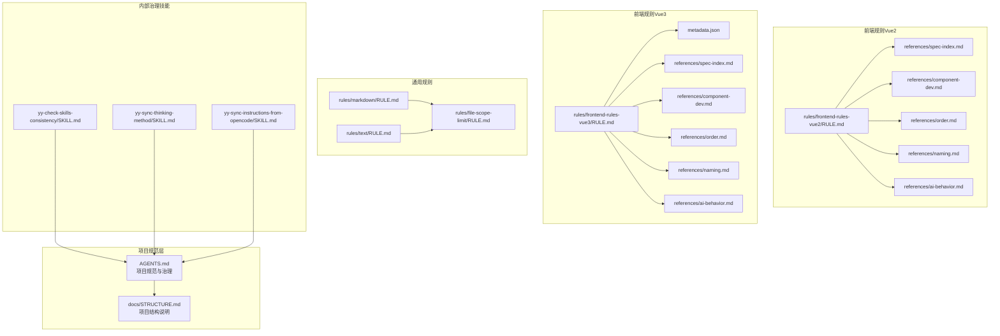
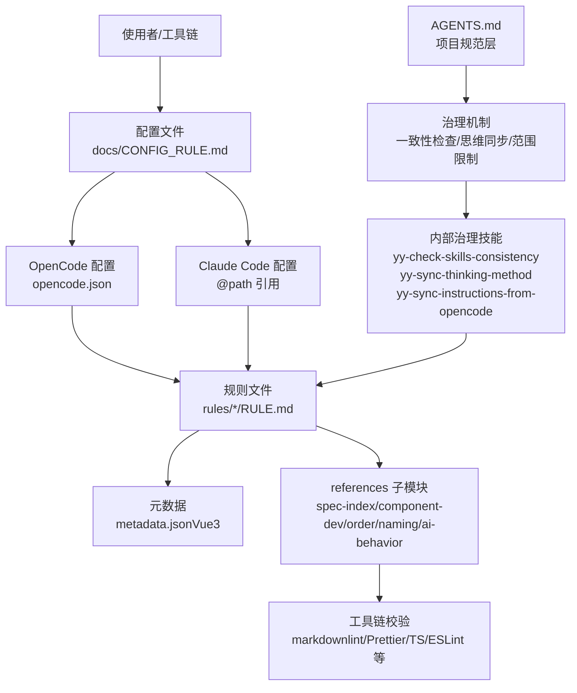
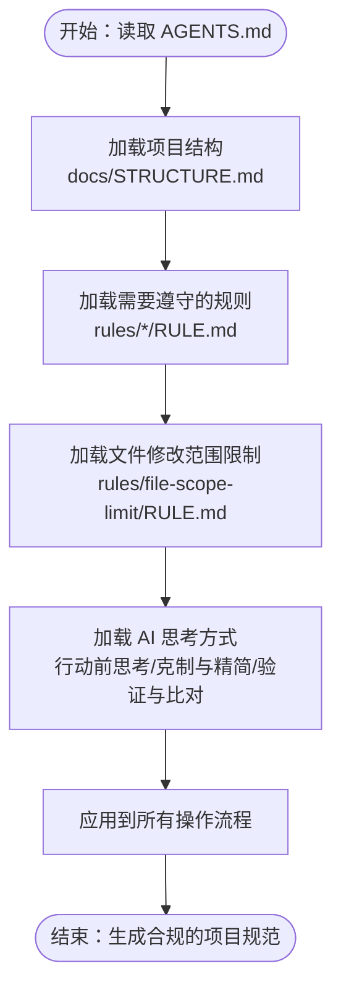
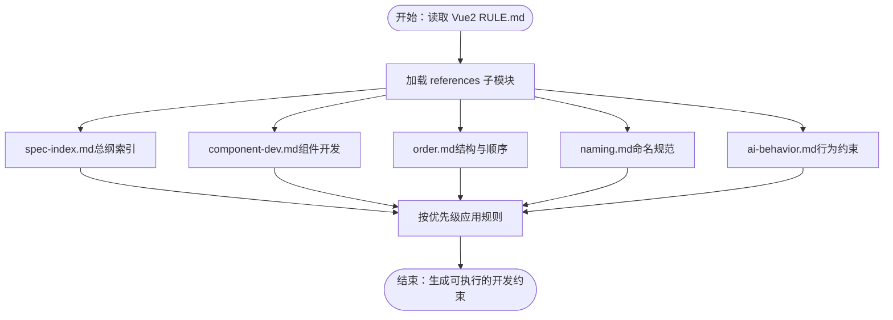
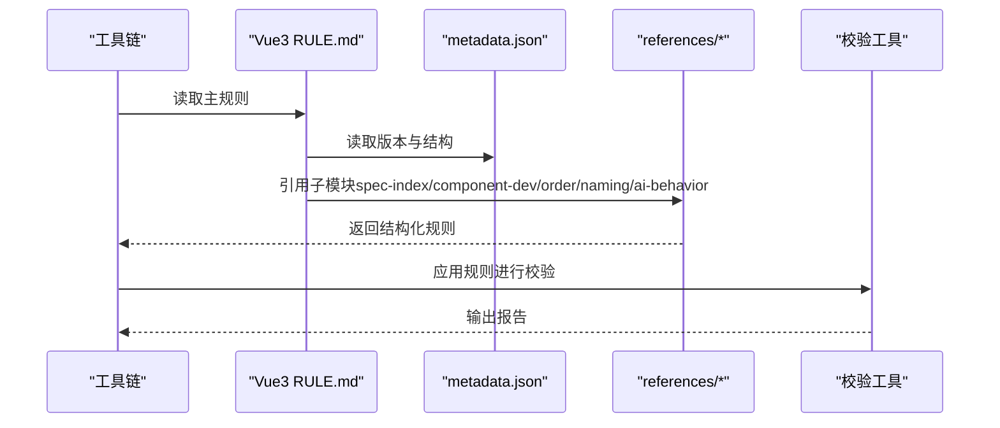
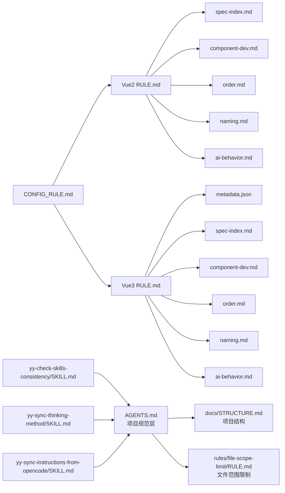

# 规则系统

<cite>
**本文引用的文件**
- [rules/frontend-rules-vue2/RULE.md](file://rules/frontend-rules-vue2/RULE.md)
- [rules/frontend-rules-vue3/RULE.md](file://rules/frontend-rules-vue3/RULE.md)
- [rules/frontend-rules-vue3/metadata.json](file://rules/frontend-rules-vue3/metadata.json)
- [docs/CONFIG_RULE.md](file://docs/CONFIG_RULE.md)
- [rules/frontend-rules-vue2/references/spec-index.md](file://rules/frontend-rules-vue2/references/spec-index.md)
- [rules/frontend-rules-vue3/references/spec-index.md](file://rules/frontend-rules-vue3/references/spec-index.md)
- [rules/frontend-rules-vue2/references/component-dev.md](file://rules/frontend-rules-vue2/references/component-dev.md)
- [rules/frontend-rules-vue3/references/component-dev.md](file://rules/frontend-rules-vue3/references/component-dev.md)
- [rules/frontend-rules-vue2/references/ai-behavior.md](file://rules/frontend-rules-vue2/references/ai-behavior.md)
- [rules/frontend-rules-vue3/references/ai-behavior.md](file://rules/frontend-rules-vue3/references/ai-behavior.md)
- [rules/frontend-rules-vue3/references/order.md](file://rules/frontend-rules-vue3/references/order.md)
- [rules/frontend-rules-vue2/references/order.md](file://rules/frontend-rules-vue2/references/order.md)
- [rules/frontend-rules-vue3/references/naming.md](file://rules/frontend-rules-vue3/references/naming.md)
- [rules/frontend-rules-vue2/references/naming.md](file://rules/frontend-rules-vue2/references/naming.md)
- [rules/markdown/RULE.md](file://rules/markdown/RULE.md)
- [rules/text/RULE.md](file://rules/text/RULE.md)
- [rules/file-scope-limit/RULE.md](file://rules/file-scope-limit/RULE.md)
- [AGENTS.md](file://AGENTS.md)
- [docs/STRUCTURE.md](file://docs/STRUCTURE.md)
- [skills-internal/yy-check-skills-consistency/SKILL.md](file://skills-internal/yy-check-skills-consistency/SKILL.md)
- [skills-internal/yy-sync-thinking-method/SKILL.md](file://skills-internal/yy-sync-thinking-method/SKILL.md)
- [skills-internal/yy-sync-instructions-from-opencode/SKILL.md](file://skills-internal/yy-sync-instructions-from-opencode/SKILL.md)
</cite>

## 更新摘要
**所做更改**
- 新增 AGENTS.md 项目规范章节，包含 AI 思考方式、输出保真度验证等改进
- 更新规则组织结构，增加文件修改范围限制规则
- 新增技能一致性检查和思维方法同步机制
- 优化项目范围和改动检查流程
- 增强规则系统的可维护性和版本管理能力

## 目录
1. [简介](#简介)
2. [项目结构](#项目结构)
3. [核心组件](#核心组件)
4. [架构总览](#架构总览)
5. [详细组件分析](#详细组件分析)
6. [依赖分析](#依赖分析)
7. [性能考虑](#性能考虑)
8. [故障排查指南](#故障排查指南)
9. [结论](#结论)
10. [附录](#附录)

## 简介
本规则系统围绕"规范化、可维护、可扩展"的目标设计，覆盖前端开发（Vue2/Vue3）、文档写作与文本表达三大领域。系统采用模块化规则文件组织，通过统一的 RULE.md 元信息与 references 子模块协同工作；同时提供跨平台配置能力（OpenCode/Claude Code），便于在不同工具链中复用与集成。

**更新** 新增 AGENTS.md 项目规范，强化 AI 思考方式和输出保真度验证机制，完善规则系统的项目治理能力。

规则系统的核心价值在于：
- 明确的分类体系：基础规范（Essential）、强烈推荐（Strongly Recommended）、风格指南（Recommended）与 AI 行为约束。
- 面向工具链的可执行性：规则文件以 Markdown 结构化呈现，便于解析与校验。
- 可演进的版本与元数据：通过 metadata.json 描述版本、标签与结构，支撑版本管理与兼容性治理。
- **新增** 完整的项目规范框架：包含文件修改范围限制、AI 思维方法、一致性检查等治理机制。

## 项目结构
规则系统以"主规则文件 + 子模块 references"的方式组织，确保规则可读、可维护、可组合。Vue2 与 Vue3 各自拥有独立的 RULE.md 与 references 目录，形成"总纲索引 + 子模块"的知识图谱。**更新** 新增 AGENTS.md 项目规范文件，提供完整的项目治理框架。

**图表来源**
- [AGENTS.md:1-149](file://AGENTS.md#L1-L149)
- [docs/STRUCTURE.md:1-10](file://docs/STRUCTURE.md#L1-L10)
- [rules/frontend-rules-vue2/RULE.md:1-62](file://rules/frontend-rules-vue2/RULE.md#L1-L62)
- [rules/frontend-rules-vue3/RULE.md:1-68](file://rules/frontend-rules-vue3/RULE.md#L1-L68)
- [rules/frontend-rules-vue3/metadata.json:1-17](file://rules/frontend-rules-vue3/metadata.json#L1-L17)
- [rules/markdown/RULE.md:1-79](file://rules/markdown/RULE.md#L1-L79)
- [rules/text/RULE.md:1-90](file://rules/text/RULE.md#L1-L90)
- [rules/file-scope-limit/RULE.md:1-138](file://rules/file-scope-limit/RULE.md#L1-L138)
- [skills-internal/yy-check-skills-consistency/SKILL.md:1-93](file://skills-internal/yy-check-skills-consistency/SKILL.md#L1-L93)
- [skills-internal/yy-sync-thinking-method/SKILL.md:1-74](file://skills-internal/yy-sync-thinking-method/SKILL.md#L1-L74)
- [skills-internal/yy-sync-instructions-from-opencode/SKILL.md:1-73](file://skills-internal/yy-sync-instructions-from-opencode/SKILL.md#L1-L73)

**章节来源**
- [AGENTS.md:1-149](file://AGENTS.md#L1-L149)
- [docs/STRUCTURE.md:1-10](file://docs/STRUCTURE.md#L1-L10)
- [rules/frontend-rules-vue2/RULE.md:1-62](file://rules/frontend-rules-vue2/RULE.md#L1-L62)
- [rules/frontend-rules-vue3/RULE.md:1-68](file://rules/frontend-rules-vue3/RULE.md#L1-L68)
- [rules/frontend-rules-vue3/metadata.json:1-17](file://rules/frontend-rules-vue3/metadata.json#L1-L17)

## 核心组件
- **项目规范层**
  - AGENTS.md：完整的项目规范说明，包含 AI 思考方式、输出保真度验证、路径格式规范等
  - docs/STRUCTURE.md：项目结构说明文档
- 主规则文件（RULE.md）
  - 用于声明规则描述、是否始终应用、以及子模块索引与快速导航
  - Vue2/Vue3 的 RULE.md 提供"总纲索引""适用范围""分类导航"，并指向 references 下的具体模块
- 子模块（references/*）
  - spec-index.md：按 Essential/Strongly Recommended/Recommended 三级优先级组织的规则索引
  - component-dev.md：组件开发规范（Options API/Vue2 vs <script setup>/Vue3）
  - order.md：SFC 结构顺序、imports 分组与脚本内部声明顺序
  - naming.md：文件/组件/函数/变量/常量/Hooks/TS 类型/CSS BEM 命名规范
  - ai-behavior.md：AI 行为与交互约束（修改权限、文档生成、直接输出）
- 通用规则
  - markdown/RULE.md：Markdown 书写规范（语言标识、内容格式选择）
  - text/RULE.md：文本表达规范（语言优先级、表达风格、信息密度、语气约束、面向执行的写法）
  - **新增** file-scope-limit/RULE.md：文件修改范围限制规则，确保 AI 仅在授权范围内操作

**章节来源**
- [AGENTS.md:1-149](file://AGENTS.md#L1-L149)
- [docs/STRUCTURE.md:1-10](file://docs/STRUCTURE.md#L1-L10)
- [rules/frontend-rules-vue2/RULE.md:1-62](file://rules/frontend-rules-vue2/RULE.md#L1-L62)
- [rules/frontend-rules-vue3/RULE.md:1-68](file://rules/frontend-rules-vue3/RULE.md#L1-L68)
- [rules/frontend-rules-vue2/references/spec-index.md:1-61](file://rules/frontend-rules-vue2/references/spec-index.md#L1-L61)
- [rules/frontend-rules-vue3/references/spec-index.md:1-60](file://rules/frontend-rules-vue3/references/spec-index.md#L1-L60)
- [rules/frontend-rules-vue2/references/component-dev.md:1-92](file://rules/frontend-rules-vue2/references/component-dev.md#L1-L92)
- [rules/frontend-rules-vue3/references/component-dev.md:1-81](file://rules/frontend-rules-vue3/references/component-dev.md#L1-L81)
- [rules/frontend-rules-vue2/references/order.md:1-131](file://rules/frontend-rules-vue2/references/order.md#L1-L131)
- [rules/frontend-rules-vue3/references/order.md:1-141](file://rules/frontend-rules-vue3/references/order.md#L1-L141)
- [rules/frontend-rules-vue2/references/naming.md:1-73](file://rules/frontend-rules-vue2/references/naming.md#L1-L73)
- [rules/frontend-rules-vue3/references/naming.md:1-85](file://rules/frontend-rules-vue3/references/naming.md#L1-L85)
- [rules/frontend-rules-vue2/references/ai-behavior.md:1-29](file://rules/frontend-rules-vue2/references/ai-behavior.md#L1-L29)
- [rules/frontend-rules-vue3/references/ai-behavior.md:1-29](file://rules/frontend-rules-vue3/references/ai-behavior.md#L1-L29)
- [rules/markdown/RULE.md:1-79](file://rules/markdown/RULE.md#L1-L79)
- [rules/text/RULE.md:1-90](file://rules/text/RULE.md#L1-L90)
- [rules/file-scope-limit/RULE.md:1-138](file://rules/file-scope-limit/RULE.md#L1-L138)

## 架构总览
规则系统采用"主规则 + 子模块 + 项目规范 + 内部治理"的多层架构，结合元数据与配置文件，实现跨平台复用与版本治理。**更新** 新增 AGENTS.md 项目规范层，提供完整的项目治理框架。

**图表来源**
- [docs/CONFIG_RULE.md:1-34](file://docs/CONFIG_RULE.md#L1-L34)
- [rules/frontend-rules-vue3/metadata.json:1-17](file://rules/frontend-rules-vue3/metadata.json#L1-L17)
- [rules/frontend-rules-vue2/RULE.md:1-62](file://rules/frontend-rules-vue2/RULE.md#L1-L62)
- [rules/frontend-rules-vue3/RULE.md:1-68](file://rules/frontend-rules-vue3/RULE.md#L1-L68)
- [AGENTS.md:1-149](file://AGENTS.md#L1-L149)
- [skills-internal/yy-check-skills-consistency/SKILL.md:1-93](file://skills-internal/yy-check-skills-consistency/SKILL.md#L1-L93)
- [skills-internal/yy-sync-thinking-method/SKILL.md:1-74](file://skills-internal/yy-sync-thinking-method/SKILL.md#L1-L74)
- [skills-internal/yy-sync-instructions-from-opencode/SKILL.md:1-73](file://skills-internal/yy-sync-instructions-from-opencode/SKILL.md#L1-L73)

## 详细组件分析

### 项目规范层（AGENTS.md）
**新增** AGENTS.md 作为项目的权威规范文件，提供完整的项目治理框架：

- **设计目标**
  - 统一 AI 思考方式，确保输出质量一致性
  - 建立严格的文件修改范围限制机制
  - 提供输出保真度验证方法
  - 规范路径格式和语言使用

- **核心机制**
  - AI 思考方式：包含假设显式化、决策点显式化、克制与精简等原则
  - 输出保真度验证：确保输出与原始定义保持一致
  - 文件范围限制：AI 仅能在授权目录范围内进行修改
  - 一致性检查：通过内部技能确保规则在多处文档中的一致性

**图表来源**
- [AGENTS.md:1-149](file://AGENTS.md#L1-L149)
- [docs/STRUCTURE.md:1-10](file://docs/STRUCTURE.md#L1-L10)
- [rules/file-scope-limit/RULE.md:1-138](file://rules/file-scope-limit/RULE.md#L1-L138)

**章节来源**
- [AGENTS.md:1-149](file://AGENTS.md#L1-L149)
- [docs/STRUCTURE.md:1-10](file://docs/STRUCTURE.md#L1-L10)
- [rules/file-scope-limit/RULE.md:1-138](file://rules/file-scope-limit/RULE.md#L1-L138)

### Vue2 规则体系
- **设计理念**
  - 以 Options API 为核心，强调组件结构、交互与性能的稳定性
  - 通过"总纲索引"将规则按优先级组织，便于快速检索与落地
- **架构模式**
  - 主规则文件聚合 references 子模块，形成"索引—细则"的双层结构
  - 适用范围限定在 src 目录，确保规则聚焦实际工程
- **应用机制**
  - 通过 OpenCode/Claude Code 的 @path 引用，将 RULE.md 与 references 注入到对话与文件操作中
  - AI 行为约束明确修改权限边界，避免越权操作

**图表来源**
- [rules/frontend-rules-vue2/RULE.md:1-62](file://rules/frontend-rules-vue2/RULE.md#L1-L62)
- [rules/frontend-rules-vue2/references/spec-index.md:1-61](file://rules/frontend-rules-vue2/references/spec-index.md#L1-L61)
- [rules/frontend-rules-vue2/references/component-dev.md:1-92](file://rules/frontend-rules-vue2/references/component-dev.md#L1-L92)
- [rules/frontend-rules-vue2/references/order.md:1-131](file://rules/frontend-rules-vue2/references/order.md#L1-L131)
- [rules/frontend-rules-vue2/references/naming.md:1-73](file://rules/frontend-rules-vue2/references/naming.md#L1-L73)
- [rules/frontend-rules-vue2/references/ai-behavior.md:1-29](file://rules/frontend-rules-vue2/references/ai-behavior.md#L1-L29)

**章节来源**
- [rules/frontend-rules-vue2/RULE.md:1-62](file://rules/frontend-rules-vue2/RULE.md#L1-L62)
- [rules/frontend-rules-vue2/references/spec-index.md:1-61](file://rules/frontend-rules-vue2/references/spec-index.md#L1-L61)
- [rules/frontend-rules-vue2/references/component-dev.md:1-92](file://rules/frontend-rules-vue2/references/component-dev.md#L1-L92)
- [rules/frontend-rules-vue2/references/order.md:1-131](file://rules/frontend-rules-vue2/references/order.md#L1-L131)
- [rules/frontend-rules-vue2/references/naming.md:1-73](file://rules/frontend-rules-vue2/references/naming.md#L1-L73)
- [rules/frontend-rules-vue2/references/ai-behavior.md:1-29](file://rules/frontend-rules-vue2/references/ai-behavior.md#L1-L29)

### Vue3 规则体系
- **设计理念**
  - 以 Composition API 为核心，强调响应式、Hooks 与类型安全
  - 通过 metadata.json 描述结构与版本，便于工具链识别与升级
- **架构模式**
  - 主规则文件聚合 references 子模块，新增 hooks、reactivity、watch 等 Vue3 特有模块
  - 适用范围扩展至 .ts 文件，体现 TypeScript 的强约束
- **应用机制**
  - 与 Vue2 类似的引用机制，但更强调 <script setup> 的结构与顺序
  - AI 行为约束与 Vue2 一致，确保跨版本一致性

**图表来源**
- [rules/frontend-rules-vue3/RULE.md:1-68](file://rules/frontend-rules-vue3/RULE.md#L1-L68)
- [rules/frontend-rules-vue3/metadata.json:1-17](file://rules/frontend-rules-vue3/metadata.json#L1-L17)
- [rules/frontend-rules-vue3/references/spec-index.md:1-60](file://rules/frontend-rules-vue3/references/spec-index.md#L1-L60)
- [rules/frontend-rules-vue3/references/component-dev.md:1-81](file://rules/frontend-rules-vue3/references/component-dev.md#L1-L81)
- [rules/frontend-rules-vue3/references/order.md:1-141](file://rules/frontend-rules-vue3/references/order.md#L1-L141)
- [rules/frontend-rules-vue3/references/naming.md:1-85](file://rules/frontend-rules-vue3/references/naming.md#L1-L85)
- [rules/frontend-rules-vue3/references/ai-behavior.md:1-29](file://rules/frontend-rules-vue3/references/ai-behavior.md#L1-L29)

**章节来源**
- [rules/frontend-rules-vue3/RULE.md:1-68](file://rules/frontend-rules-vue3/RULE.md#L1-L68)
- [rules/frontend-rules-vue3/metadata.json:1-17](file://rules/frontend-rules-vue3/metadata.json#L1-L17)
- [rules/frontend-rules-vue3/references/spec-index.md:1-60](file://rules/frontend-rules-vue3/references/spec-index.md#L1-L60)
- [rules/frontend-rules-vue3/references/component-dev.md:1-81](file://rules/frontend-rules-vue3/references/component-dev.md#L1-L81)
- [rules/frontend-rules-vue3/references/order.md:1-141](file://rules/frontend-rules-vue3/references/order.md#L1-L141)
- [rules/frontend-rules-vue3/references/naming.md:1-85](file://rules/frontend-rules-vue3/references/naming.md#L1-L85)
- [rules/frontend-rules-vue3/references/ai-behavior.md:1-29](file://rules/frontend-rules-vue3/references/ai-behavior.md#L1-L29)

### 文档与文本规则
- **Markdown 规则**
  - 强制代码块语言标识，避免 MD040 错误
  - 列表优于简单表格，提升可读性与移动端体验
- **文本表达规则**
  - 默认中文表达，保留专有名词原文；保持精简、专业、不啰嗦
  - 信息密度优先，仅保留有决策价值的信息；语气克制客观
- **文件范围限制规则**（新增）
  - 严格限制 AI 的文件修改范围，防止越权操作
  - 提供目录授权、文件授权、通配符授权等多种授权方式
  - 支持动态授权管理和授权记录

**章节来源**
- [rules/markdown/RULE.md:1-79](file://rules/markdown/RULE.md#L1-L79)
- [rules/text/RULE.md:1-90](file://rules/text/RULE.md#L1-L90)
- [rules/file-scope-limit/RULE.md:1-138](file://rules/file-scope-limit/RULE.md#L1-L138)

### 规则分类体系
- **基础规范（Essential）**
  - Vue2：必须使用 Options API、组件 name 声明、v-for 与 key、v-if 与 v-for 冲突、v-html 安全、数据修改限制、$parent 链式访问限制、Vue2 响应式陷阱
  - Vue3：必须使用 <script setup>、Props 定义规范、数据修改限制、v-for 与 key、v-if 与 v-for 冲突、v-html 安全
- **强烈推荐（Strongly Recommended）**
  - Vue2：命名规范、SFC 顺序与脚本结构、Import 分组、组件交互与通信、模板属性顺序、网络请求规范
  - Vue3：命名规范、ref/reactive/computed 原则、watch 规范、Hooks 规范、<script setup> 结构与代码组织、模板属性顺序、状态管理、组件交互与通信、网络请求规范
- **风格指南（Recommended）**
  - Vue2：computed/watch 原则、格式化与工具链、注释规范、指令简写、样式命名与作用域、性能优化、约束清单
  - Vue3：TypeScript 类型注解与约束、格式化与工具链、指令简写、样式命名与作用域、注释规范、性能优化、约束清单
- **AI 行为约束**
  - 直接输出、文档生成、修改权限，均限定在 src 目录内
- **项目治理规则**（新增）
  - 文件修改范围限制、AI 思考方式、输出保真度验证、一致性检查机制

**章节来源**
- [rules/frontend-rules-vue2/references/spec-index.md:1-61](file://rules/frontend-rules-vue2/references/spec-index.md#L1-L61)
- [rules/frontend-rules-vue3/references/spec-index.md:1-60](file://rules/frontend-rules-vue3/references/spec-index.md#L1-L60)
- [rules/frontend-rules-vue2/references/component-dev.md:1-92](file://rules/frontend-rules-vue2/references/component-dev.md#L1-L92)
- [rules/frontend-rules-vue3/references/component-dev.md:1-81](file://rules/frontend-rules-vue3/references/component-dev.md#L1-L81)
- [rules/frontend-rules-vue2/references/order.md:1-131](file://rules/frontend-rules-vue2/references/order.md#L1-L131)
- [rules/frontend-rules-vue3/references/order.md:1-141](file://rules/frontend-rules-vue3/references/order.md#L1-L141)
- [rules/frontend-rules-vue2/references/naming.md:1-73](file://rules/frontend-rules-vue2/references/naming.md#L1-L73)
- [rules/frontend-rules-vue3/references/naming.md:1-85](file://rules/frontend-rules-vue3/references/naming.md#L1-L85)
- [rules/frontend-rules-vue2/references/ai-behavior.md:1-29](file://rules/frontend-rules-vue2/references/ai-behavior.md#L1-L29)
- [rules/frontend-rules-vue3/references/ai-behavior.md:1-29](file://rules/frontend-rules-vue3/references/ai-behavior.md#L1-L29)

### Vue2 与 Vue3 规则差异
- **组件开发**
  - Vue2：Options API 结构（name/components/props/data/computed/watch/methods/生命周期）
  - Vue3：<script setup> 结构（imports/defineProps/defineEmits/Hooks/业务逻辑/defineExpose）
- **交互与通信**
  - Vue2：$refs、provide/inject、$parent/$children 限制
  - Vue3：defineExpose、provide/inject、$parent/$children 禁用
- **响应式与监听**
  - Vue2：computed/watch 原则、$set/$splice 响应式陷阱
  - Vue3：ref/reactive/computed 选择原则、watch/watchEffect 规范、Hooks 规范
- **结构顺序与导入分组**
  - Vue2：3 组导入分组（外部/全局/相对）
  - Vue3：4 组导入分组（外部/types/内部全局/内部相对）
- **适用范围**
  - Vue2：.vue/.js/.css/.scss/.less
  - Vue3：.vue/.ts/.js/.css/.scss/.less

**章节来源**
- [rules/frontend-rules-vue2/references/component-dev.md:1-92](file://rules/frontend-rules-vue2/references/component-dev.md#L1-L92)
- [rules/frontend-rules-vue3/references/component-dev.md:1-81](file://rules/frontend-rules-vue3/references/component-dev.md#L1-L81)
- [rules/frontend-rules-vue2/references/order.md:1-131](file://rules/frontend-rules-vue2/references/order.md#L1-L131)
- [rules/frontend-rules-vue3/references/order.md:1-141](file://rules/frontend-rules-vue3/references/order.md#L1-L141)
- [rules/frontend-rules-vue2/references/spec-index.md:1-61](file://rules/frontend-rules-vue2/references/spec-index.md#L1-L61)
- [rules/frontend-rules-vue3/references/spec-index.md:1-60](file://rules/frontend-rules-vue3/references/spec-index.md#L1-L60)

### 规则定制与扩展
- **自定义规则创建**
  - 在 rules/ 目录下新建子目录与 RULE.md，按 Vue2/Vue3 的结构组织 references 子模块
  - 在 RULE.md 中声明描述、是否始终应用、子模块索引与快速导航
  - 通过 metadata.json（如 Vue3）描述版本、标签与结构，便于工具链识别
- **现有规则修改**
  - 更新 references 子模块中的具体规则，保持与主规则文件的索引一致
  - 如涉及适用范围或技术栈变更，同步更新 RULE.md 的适用范围与技术栈说明
- **跨平台配置**
  - OpenCode：将规则文件放入 .opencode/rules/，并在 opencode.json 的 instructions 中引用
  - Claude Code：在 CLAUDE.md 中使用 @path 引用规则文件，支持最多 5 层递归引用
- **项目规范扩展**（新增）
  - 通过 AGENTS.md 扩展项目治理规则，新增 AI 思考方式、输出保真度验证等机制
  - 使用内部治理技能维护规则一致性，确保多处文档的同步

**章节来源**
- [docs/CONFIG_RULE.md:1-34](file://docs/CONFIG_RULE.md#L1-L34)
- [rules/frontend-rules-vue3/metadata.json:1-17](file://rules/frontend-rules-vue3/metadata.json#L1-L17)
- [rules/frontend-rules-vue2/RULE.md:1-62](file://rules/frontend-rules-vue2/RULE.md#L1-L62)
- [rules/frontend-rules-vue3/RULE.md:1-68](file://rules/frontend-rules-vue3/RULE.md#L1-L68)
- [AGENTS.md:1-149](file://AGENTS.md#L1-L149)

### 规则应用案例
- **Vue2**：某页面组件因未声明 name 与未按顺序组织 script 内容导致调试困难，应用组件开发与顺序规范后，问题得到定位与修复
- **Vue3**：某组件滥用 this 与未使用 <script setup> 导致类型安全缺失，应用组件开发与顺序规范后，重构为 Composition API 并提升可维护性
- **文档**：某技能文档缺少代码块语言标识导致 markdownlint 报错，应用 Markdown 规则后统一语言标识并通过校验
- **文本**：某评审反馈输出冗长，应用文本表达规则后，输出更精简、专业且具备执行性
- **项目治理**（新增）：某开发者越权修改配置文件，被文件范围限制规则阻止，确保项目安全性

**更新** 新增项目治理相关案例，展示 AGENTS.md 在实际项目中的应用效果。

### 规则执行逻辑
- **规则加载**
  - 工具链读取 RULE.md，解析元信息与子模块索引
  - 加载 metadata.json（如 Vue3）以获取版本与结构信息
  - **新增** 加载 AGENTS.md 获取项目规范和治理规则
- **子模块解析**
  - 按优先级加载 spec-index 与各子模块，形成规则图谱
  - **新增** 解析文件范围限制规则，建立授权检查机制
- **应用与校验**
  - 将规则注入到对话与文件操作中，结合工具链（markdownlint/Prettier/TS/ESLint 等）进行校验
  - **新增** 应用项目治理规则，进行一致性检查和权限验证
- **报告与反馈**
  - 输出违规项、影响范围与修复建议，辅助开发者改进代码质量
  - **新增** 输出治理检查结果，包括权限验证、一致性检查等

**章节来源**
- [rules/frontend-rules-vue2/RULE.md:1-62](file://rules/frontend-rules-vue2/RULE.md#L1-L62)
- [rules/frontend-rules-vue3/RULE.md:1-68](file://rules/frontend-rules-vue3/RULE.md#L1-L68)
- [rules/frontend-rules-vue3/metadata.json:1-17](file://rules/frontend-rules-vue3/metadata.json#L1-L17)
- [rules/markdown/RULE.md:1-79](file://rules/markdown/RULE.md#L1-L79)
- [rules/text/RULE.md:1-90](file://rules/text/RULE.md#L1-L90)
- [rules/file-scope-limit/RULE.md:1-138](file://rules/file-scope-limit/RULE.md#L1-L138)
- [AGENTS.md:1-149](file://AGENTS.md#L1-L149)

## 依赖分析
规则系统内部依赖关系清晰：主规则文件依赖 references 子模块；Vue3 通过 metadata.json 提供结构与版本信息；配置文件决定规则在不同工具链中的可见性与生效范围。**更新** 新增 AGENTS.md 项目规范层，提供完整的项目治理框架。

**图表来源**
- [AGENTS.md:1-149](file://AGENTS.md#L1-L149)
- [docs/STRUCTURE.md:1-10](file://docs/STRUCTURE.md#L1-L10)
- [rules/file-scope-limit/RULE.md:1-138](file://rules/file-scope-limit/RULE.md#L1-L138)
- [rules/frontend-rules-vue2/RULE.md:1-62](file://rules/frontend-rules-vue2/RULE.md#L1-L62)
- [rules/frontend-rules-vue3/RULE.md:1-68](file://rules/frontend-rules-vue3/RULE.md#L1-L68)
- [rules/frontend-rules-vue3/metadata.json:1-17](file://rules/frontend-rules-vue3/metadata.json#L1-L17)
- [docs/CONFIG_RULE.md:1-34](file://docs/CONFIG_RULE.md#L1-L34)
- [skills-internal/yy-check-skills-consistency/SKILL.md:1-93](file://skills-internal/yy-check-skills-consistency/SKILL.md#L1-L93)
- [skills-internal/yy-sync-thinking-method/SKILL.md:1-74](file://skills-internal/yy-sync-thinking-method/SKILL.md#L1-L74)
- [skills-internal/yy-sync-instructions-from-opencode/SKILL.md:1-73](file://skills-internal/yy-sync-instructions-from-opencode/SKILL.md#L1-L73)

## 性能考虑
- **规则体积与加载**
  - 将规则拆分为 references 子模块，按需加载，降低单文件体积与解析成本
  - **新增** AGENTS.md 采用模块化设计，按需加载项目治理规则
- **工具链集成**
  - 通过 metadata.json 描述结构与版本，减少工具链扫描与匹配时间
  - **新增** 文件范围限制规则采用预编译方式，提高授权检查效率
- **校验粒度**
  - 优先使用局部规则（如命名、顺序、注释）进行快速校验，再进行重型检查（如性能、网络请求）
  - **新增** 项目治理规则采用分层校验，先进行基础规则检查，再进行治理规则验证
- **缓存与增量**
  - 在工具链层面缓存规则解析结果，对未变更文件进行增量校验
  - **新增** 项目治理规则支持增量检查，仅对变更的文件进行一致性验证

## 故障排查指南
- **规则未生效**
  - 检查 opencode.json 或 CLAUDE.md 中的 @path 引用是否正确
  - 确认 RULE.md 的 alwaysApply 设置与工具链配置一致
  - **新增** 检查 AGENTS.md 中的项目规范是否正确加载
- **规则冲突**
  - 比较 Vue2 与 Vue3 的差异，确保使用正确的规则集
  - 核对 references 子模块的优先级与适用范围
  - **新增** 检查文件范围限制规则与项目规范的冲突
- **校验失败**
  - 按照 Markdown 与文本规则修正格式与表达风格
  - 使用工具链（markdownlint/Prettier/TS/ESLint）进行本地预检
  - **新增** 检查项目治理规则，包括一致性检查和权限验证
- **项目治理问题**（新增）
  - 检查文件修改范围限制是否正确配置
  - 验证 AI 思考方式是否符合项目规范
  - 确认内部治理技能是否正确执行

**章节来源**
- [docs/CONFIG_RULE.md:1-34](file://docs/CONFIG_RULE.md#L1-L34)
- [rules/markdown/RULE.md:1-79](file://rules/markdown/RULE.md#L1-L79)
- [rules/text/RULE.md:1-90](file://rules/text/RULE.md#L1-L90)
- [AGENTS.md:1-149](file://AGENTS.md#L1-L149)

## 结论
规则系统通过"主规则 + 子模块 + 项目规范 + 内部治理"的多层组合，实现了跨平台、可演进、可维护的规则治理方案。**更新** 新增 AGENTS.md 项目规范层，强化了项目治理能力和规则执行的完整性。Vue2 与 Vue3 的差异化设计满足不同技术栈的需求，而文档与文本规则则保障了知识表达的一致性与可执行性。新增的文件范围限制、AI 思考方式、输出保真度验证等机制，进一步提升了项目的安全性与一致性。建议在团队内推广该体系，结合工具链自动化校验和内部治理技能，持续提升代码质量与开发效率。

## 附录
- **配置参考**
  - OpenCode：将规则文件放入 .opencode/rules/，并在 opencode.json 的 instructions 中引用
  - Claude Code：在 CLAUDE.md 中使用 @path 引用规则文件，支持最多 5 层递归引用
- **版本与兼容**
  - 通过 metadata.json 描述版本与结构，便于工具链识别与升级
  - **新增** AGENTS.md 提供项目规范版本管理，支持规则演进和兼容性治理
- **快速导航**
  - Vue2：总纲索引、组件开发、顺序与导入、命名、AI 行为约束
  - Vue3：总纲索引、组件开发、顺序与导入、命名、AI 行为约束、元数据
  - **新增** 项目规范：文件范围限制、AI 思考方式、输出保真度验证
- **内部治理技能**
  - **新增** yy-check-skills-consistency：检查 README.md 与 skills/ 目录一致性
  - **新增** yy-sync-thinking-method：同步维护 AI 思考方式在多处文档中的一致性
  - **新增** yy-sync-instructions-from-opencode：将 .opencode.json 中的通用规则同步到 AGENTS.md

**章节来源**
- [docs/CONFIG_RULE.md:1-34](file://docs/CONFIG_RULE.md#L1-L34)
- [rules/frontend-rules-vue3/metadata.json:1-17](file://rules/frontend-rules-vue3/metadata.json#L1-L17)
- [rules/frontend-rules-vue2/RULE.md:1-62](file://rules/frontend-rules-vue2/RULE.md#L1-L62)
- [rules/frontend-rules-vue3/RULE.md:1-68](file://rules/frontend-rules-vue3/RULE.md#L1-L68)
- [AGENTS.md:1-149](file://AGENTS.md#L1-L149)
- [skills-internal/yy-check-skills-consistency/SKILL.md:1-93](file://skills-internal/yy-check-skills-consistency/SKILL.md#L1-L93)
- [skills-internal/yy-sync-thinking-method/SKILL.md:1-74](file://skills-internal/yy-sync-thinking-method/SKILL.md#L1-L74)
- [skills-internal/yy-sync-instructions-from-opencode/SKILL.md:1-73](file://skills-internal/yy-sync-instructions-from-opencode/SKILL.md#L1-L73)