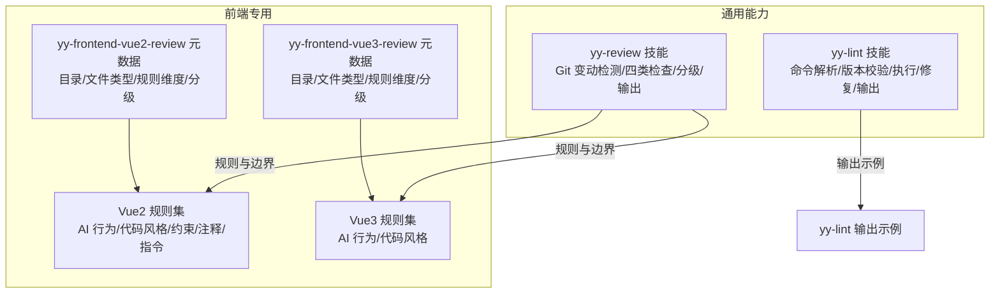
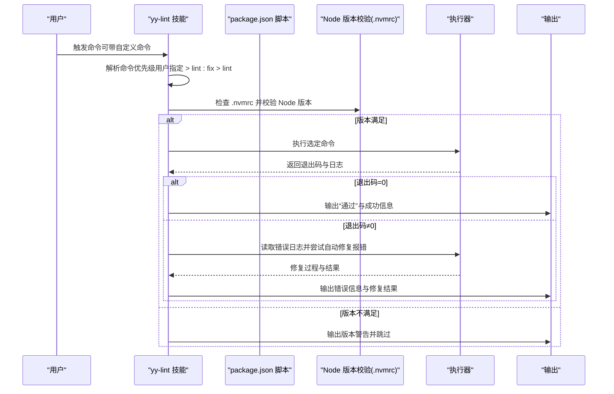
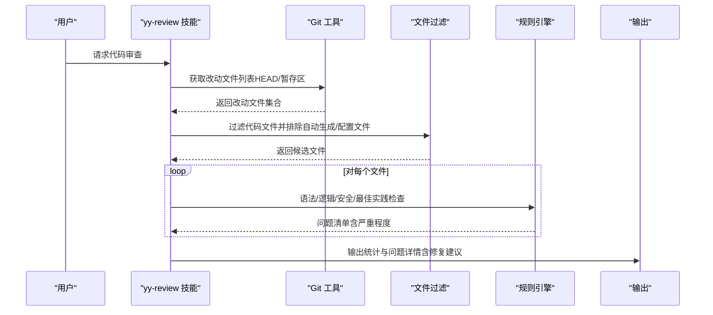
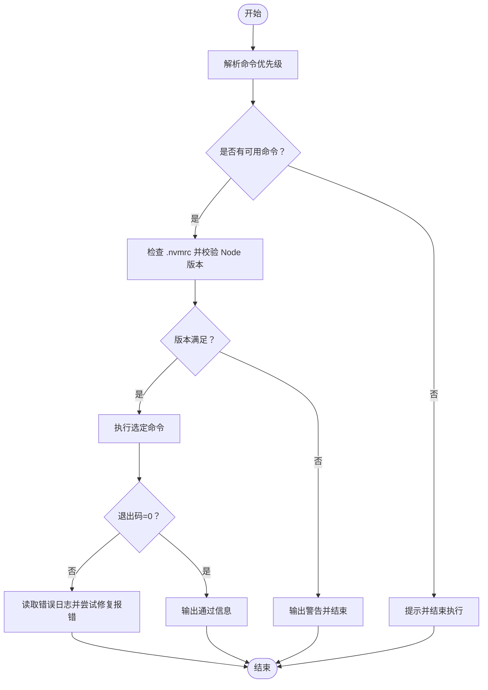
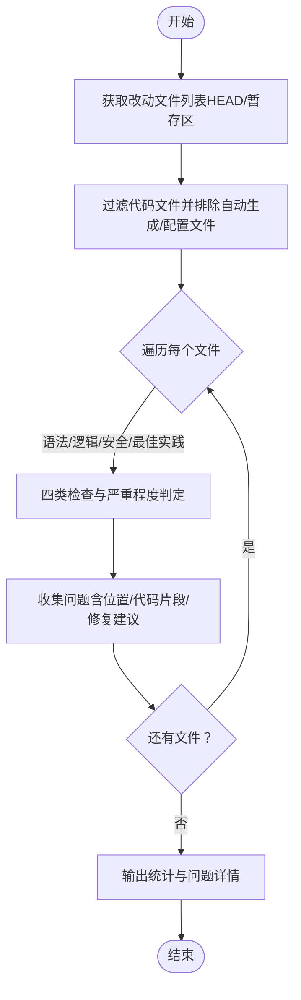
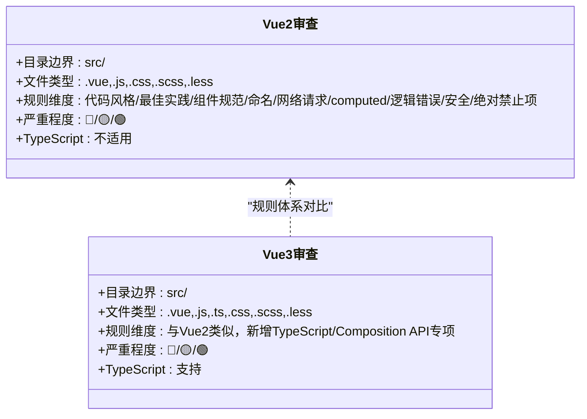
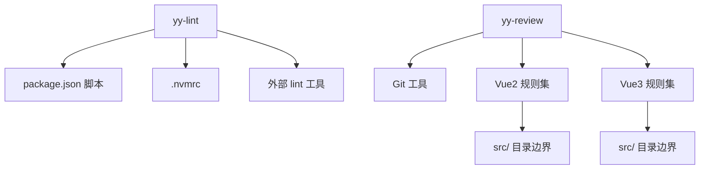

# 代码质量检查

<cite>
**本文引用的文件**
- [yy-lint/SKILL.md](file://skills/yy-lint/SKILL.md)
- [yy-lint/examples/output.md](file://skills/yy-lint/examples/output.md)
- [yy-review/SKILL.md](file://skills/yy-review/SKILL.md)
- [yy-frontend-vue2-review/metadata.json](file://skills/yy-frontend-vue2-review/metadata.json)
- [yy-frontend-vue2-review/rules/ai-behavior.md](file://skills/yy-frontend-vue2-review/rules/ai-behavior.md)
- [yy-frontend-vue2-review/rules/code-style.md](file://skills/yy-frontend-vue2-review/rules/code-style.md)
- [yy-frontend-vue2-review/rules/constraints.md](file://skills/yy-frontend-vue2-review/rules/constraints.md)
- [yy-frontend-vue2-review/rules/comments.md](file://skills/yy-frontend-vue2-review/rules/comments.md)
- [yy-frontend-vue2-review/rules/directives.md](file://skills/yy-frontend-vue2-review/rules/directives.md)
- [yy-frontend-vue3-review/metadata.json](file://skills/yy-frontend-vue3-review/metadata.json)
- [yy-frontend-vue3-review/rules/ai-behavior.md](file://skills/yy-frontend-vue3-review/rules/ai-behavior.md)
- [yy-frontend-vue3-review/rules/code-style.md](file://skills/yy-frontend-vue3-review/rules/code-style.md)
</cite>

## 目录
1. [简介](#简介)
2. [项目结构](#项目结构)
3. [核心组件](#核心组件)
4. [架构总览](#架构总览)
5. [详细组件分析](#详细组件分析)
6. [依赖关系分析](#依赖关系分析)
7. [性能考量](#性能考量)
8. [故障排查指南](#故障排查指南)
9. [结论](#结论)
10. [附录](#附录)

## 简介
本技术文档聚焦于仓库中的代码质量检查能力，系统阐述两类核心技能：yy-lint 与 yy-review 的工作原理、规则体系与自动化流程。其中：
- yy-lint：面向工程化工具链的“代码风格与静态检查”自动化，强调可配置的 lint 命令、Node 版本校验、错误自动修复边界与并行任务约束。
- yy-review：面向 Git 变动文件的“代码审查”自动化，按语法、逻辑、安全、最佳实践四类维度进行严重程度分级与修复建议输出。

文档还梳理了 Vue2/Vue3 专用代码审查技能的规则与边界，帮助读者理解不同框架下的检查重点与差异化约束。

## 项目结构
围绕代码质量检查的关键文件组织如下：
- yy-lint：提供 lint 命令解析、Node 版本校验、执行与修复策略、输出格式与安全边界。
- yy-review：提供 Git 变动文件检测、四类问题域的检查规则、严重程度分级与输出格式。
- Vue2/Vue3 专用审查：提供目录边界、文件类型、规则维度、严重程度分级、TypeScript 与 Composition API 专项约束等元数据与规则文件。

**图表来源**
- [yy-lint/SKILL.md:1-88](file://skills/yy-lint/SKILL.md#L1-L88)
- [yy-review/SKILL.md:1-131](file://skills/yy-review/SKILL.md#L1-L131)
- [yy-frontend-vue2-review/metadata.json:1-34](file://skills/yy-frontend-vue2-review/metadata.json#L1-L34)
- [yy-frontend-vue3-review/metadata.json:1-42](file://skills/yy-frontend-vue3-review/metadata.json#L1-L42)
- [yy-frontend-vue2-review/rules/ai-behavior.md:1-29](file://skills/yy-frontend-vue2-review/rules/ai-behavior.md#L1-L29)
- [yy-frontend-vue2-review/rules/code-style.md:1-63](file://skills/yy-frontend-vue2-review/rules/code-style.md#L1-L63)
- [yy-frontend-vue2-review/rules/constraints.md:1-57](file://skills/yy-frontend-vue2-review/rules/constraints.md#L1-L57)
- [yy-frontend-vue2-review/rules/comments.md:1-106](file://skills/yy-frontend-vue2-review/rules/comments.md#L1-L106)
- [yy-frontend-vue2-review/rules/directives.md:1-116](file://skills/yy-frontend-vue2-review/rules/directives.md#L1-L116)
- [yy-frontend-vue3-review/rules/ai-behavior.md:1-29](file://skills/yy-frontend-vue3-review/rules/ai-behavior.md#L1-L29)
- [yy-frontend-vue3-review/rules/code-style.md:1-61](file://skills/yy-frontend-vue3-review/rules/code-style.md#L1-L61)

**章节来源**
- [yy-lint/SKILL.md:1-88](file://skills/yy-lint/SKILL.md#L1-L88)
- [yy-review/SKILL.md:1-131](file://skills/yy-review/SKILL.md#L1-L131)

## 核心组件
- yy-lint 技能
  - 命令解析优先级：用户指定命令 > package.json 中的 lint:fix > package.json 中的 lint
  - Node 版本校验：依据 .nvmrc 判断，不满足则跳过执行
  - 执行与修复：exit code=0 视为通过；非 0 时读取错误日志并仅自动修复报错，不修复警告
  - 并行任务约束：多任务并行时不执行 lint，待完成后再统一执行
  - 输出格式：执行状态、命令名称、报错数量（如有）、修复结果（如有）
  - 安全边界：禁止主动执行编译/构建/部署、自动测试、除 node --version 外的 npx 命令等
- yy-review 技能
  - Git 变动文件检测：支持 HEAD 与暂存区，过滤代码文件并排除自动生成与配置文件
  - 四类检查维度：语法错误（未闭合标签、未定义变量、语法结构错误）、逻辑错误（空指针引用、数组越界、逻辑判断错误）、安全漏洞（XSS 风险、敏感信息泄露、SQL 注入风险）、最佳实践（调试代码、硬编码敏感信息、不必要的注释）
  - 严重程度分级：严重/中等/轻微；catch 块中的 console.warn 不视为问题；其他位置的 console.log/debugger 标记为轻微问题
  - 输出格式：问题统计与问题详情，含文件、位置、代码片段与修复建议；无问题时输出“审核通过”提示
  - 安全边界：禁止编译/构建/部署、自动测试、任何会修改代码的命令

**章节来源**
- [yy-lint/SKILL.md:28-88](file://skills/yy-lint/SKILL.md#L28-L88)
- [yy-review/SKILL.md:26-131](file://skills/yy-review/SKILL.md#L26-L131)

## 架构总览
下图展示了两类技能的自动化流程：从触发条件到文件检测、规则匹配、问题识别与修复建议生成的全过程。

**图表来源**
- [yy-lint/SKILL.md:30-68](file://skills/yy-lint/SKILL.md#L30-L68)

**图表来源**
- [yy-review/SKILL.md:28-84](file://skills/yy-review/SKILL.md#L28-L84)

## 详细组件分析

### yy-lint 技能
- 命令解析与执行
  - 优先级：用户指定命令 > package.json 中的 lint:fix > package.json 中的 lint
  - 安全边界：仅允许 lint 相关命令，禁止编译/构建/部署、自动测试、除 node --version 外的 npx 命令
- Node 版本校验
  - 依据 .nvmrc 判断，不满足则跳过执行并提示
- 执行与修复
  - exit code=0：通过，不读取输出日志
  - exit code≠0：读取错误日志，仅修复报错，不修复警告
  - 并行任务约束：多任务并行时不执行 lint
- 输出格式
  - 执行状态、命令名称、报错数量（如有）、修复结果（如有）

**图表来源**
- [yy-lint/SKILL.md:30-68](file://skills/yy-lint/SKILL.md#L30-L68)

**章节来源**
- [yy-lint/SKILL.md:28-88](file://skills/yy-lint/SKILL.md#L28-L88)
- [yy-lint/examples/output.md:1-66](file://skills/yy-lint/examples/output.md#L1-L66)

### yy-review 技能
- Git 变动文件检测
  - 支持 git diff --name-only HEAD 与 git diff --cached --name-only
  - 过滤代码文件，排除自动生成与配置文件
- 四类检查维度与严重程度
  - 语法错误：未闭合标签、未定义变量、语法结构错误
  - 逻辑错误：空指针引用、数组越界、逻辑判断错误
  - 安全漏洞：XSS 风险、敏感信息泄露、SQL 注入风险
  - 最佳实践：调试代码、硬编码敏感信息、不必要的注释
  - 严重程度：严重/中等/轻微；catch 块中的 console.warn 不视为问题；其他位置的 console.log/debugger 标记为轻微问题
- 输出格式
  - 问题统计与问题详情，含文件、位置、代码片段与修复建议；无问题时输出“审核通过”提示

**图表来源**
- [yy-review/SKILL.md:28-84](file://skills/yy-review/SKILL.md#L28-L84)

**章节来源**
- [yy-review/SKILL.md:26-131](file://skills/yy-review/SKILL.md#L26-L131)

### Vue2/Vue3 专用审查规则与边界
- 目录与文件类型边界
  - Vue2：仅在 src 目录内审核，文件类型包括 .vue/.js/.css/.scss/.less
  - Vue3：仅在 src 目录内审核，文件类型包括 .vue/.js/.ts/.css/.scss/.less
- 规则维度与分级
  - 九维覆盖：代码风格、最佳实践、组件规范、命名、网络请求、computed、逻辑错误、安全、绝对禁止项
  - 三级严重程度：🔴 严重 / 🟡 中等 / 🟢 轻微
  - 严格 src 目录边界保护，Vue3/React 项目自动识别并拒绝处理
- TypeScript 与 Composition API 专项
  - Vue3：支持 TypeScript 类型检查（禁止 any，要求明确类型）、Composition API Hooks 规范审核
- 规则文件要点
  - AI 行为与交互约束：仅允许修改 src 下文件与注释/JSDoc，禁止未经明确要求创建 README 等
  - 代码风格与格式化：遵循 Prettier 配置，强调 2 空格缩进、JS 单引号、HTML 属性双引号、行宽 120、尾随逗号、箭头函数等
  - 约束清单速查：绝对禁止项（如连续数据解构、父组件修改子组件数据、props 解构、v-for 与 v-if 同元素、index 作为 key、setTimeout 替代 $nextTick 等）、推荐项、不推荐项与响应式陷阱
  - 注释规范：模板区、脚本区、样式区注释格式与保护原则
  - 指令规范：v-for 与 key、v-if 与 v-for 冲突、v-html 安全、指令简写、模板属性顺序、v-model 写法、v-slot 风格

**图表来源**
- [yy-frontend-vue2-review/metadata.json:18-33](file://skills/yy-frontend-vue2-review/metadata.json#L18-L33)
- [yy-frontend-vue3-review/metadata.json:21-40](file://skills/yy-frontend-vue3-review/metadata.json#L21-L40)
- [yy-frontend-vue2-review/rules/ai-behavior.md:1-29](file://skills/yy-frontend-vue2-review/rules/ai-behavior.md#L1-L29)
- [yy-frontend-vue2-review/rules/code-style.md:1-63](file://skills/yy-frontend-vue2-review/rules/code-style.md#L1-L63)
- [yy-frontend-vue2-review/rules/constraints.md:1-57](file://skills/yy-frontend-vue2-review/rules/constraints.md#L1-L57)
- [yy-frontend-vue2-review/rules/comments.md:1-106](file://skills/yy-frontend-vue2-review/rules/comments.md#L1-L106)
- [yy-frontend-vue2-review/rules/directives.md:1-116](file://skills/yy-frontend-vue2-review/rules/directives.md#L1-L116)
- [yy-frontend-vue3-review/rules/ai-behavior.md:1-29](file://skills/yy-frontend-vue3-review/rules/ai-behavior.md#L1-L29)
- [yy-frontend-vue3-review/rules/code-style.md:1-61](file://skills/yy-frontend-vue3-review/rules/code-style.md#L1-L61)

**章节来源**
- [yy-frontend-vue2-review/metadata.json:1-34](file://skills/yy-frontend-vue2-review/metadata.json#L1-L34)
- [yy-frontend-vue3-review/metadata.json:1-42](file://skills/yy-frontend-vue3-review/metadata.json#L1-L42)
- [yy-frontend-vue2-review/rules/ai-behavior.md:1-29](file://skills/yy-frontend-vue2-review/rules/ai-behavior.md#L1-L29)
- [yy-frontend-vue2-review/rules/code-style.md:1-63](file://skills/yy-frontend-vue2-review/rules/code-style.md#L1-L63)
- [yy-frontend-vue2-review/rules/constraints.md:1-57](file://skills/yy-frontend-vue2-review/rules/constraints.md#L1-L57)
- [yy-frontend-vue2-review/rules/comments.md:1-106](file://skills/yy-frontend-vue2-review/rules/comments.md#L1-L106)
- [yy-frontend-vue2-review/rules/directives.md:1-116](file://skills/yy-frontend-vue2-review/rules/directives.md#L1-L116)
- [yy-frontend-vue3-review/rules/ai-behavior.md:1-29](file://skills/yy-frontend-vue3-review/rules/ai-behavior.md#L1-L29)
- [yy-frontend-vue3-review/rules/code-style.md:1-61](file://skills/yy-frontend-vue3-review/rules/code-style.md#L1-L61)

## 依赖关系分析
- yy-lint 依赖
  - package.json 中的 lint/lint:fix 脚本
  - .nvmrc 文件用于 Node 版本校验
  - 外部 lint 工具（如 ESLint/Prettier 等，具体取决于项目配置）
- yy-review 依赖
  - Git 工具链（diff 命令）用于检测改动文件
  - 规则文件（Vue2/Vue3）提供检查维度与严重程度判定
- Vue2/Vue3 专用审查
  - 严格目录边界 src/ 与文件类型白名单
  - TypeScript 与 Composition API 的专项规则

**图表来源**
- [yy-lint/SKILL.md:30-50](file://skills/yy-lint/SKILL.md#L30-L50)
- [yy-review/SKILL.md:28-42](file://skills/yy-review/SKILL.md#L28-L42)
- [yy-frontend-vue2-review/metadata.json:18-22](file://skills/yy-frontend-vue2-review/metadata.json#L18-L22)
- [yy-frontend-vue3-review/metadata.json:21-26](file://skills/yy-frontend-vue3-review/metadata.json#L21-L26)

**章节来源**
- [yy-lint/SKILL.md:30-50](file://skills/yy-lint/SKILL.md#L30-L50)
- [yy-review/SKILL.md:28-42](file://skills/yy-review/SKILL.md#L28-L42)
- [yy-frontend-vue2-review/metadata.json:18-22](file://skills/yy-frontend-vue2-review/metadata.json#L18-L22)
- [yy-frontend-vue3-review/metadata.json:21-26](file://skills/yy-frontend-vue3-review/metadata.json#L21-L26)

## 性能考量
- yy-lint
  - 退出码为 0 时不读取输出日志，有助于节省 token 与时间
  - 并行任务约束避免在多文件并发修改时触发 lint，降低冲突与重复执行成本
- yy-review
  - Git 变动文件检测仅针对改动文件，避免全量扫描
  - 规则维度明确，便于快速定位问题并生成修复建议

[本节为通用指导，不涉及具体文件分析]

## 故障排查指南
- yy-lint
  - 无可用命令：检查 package.json 中是否存在 lint 或 lint:fix 脚本
  - Node 版本不满足：根据 .nvmrc 指定版本调整运行环境
  - 退出码非 0：查看错误日志，确认是否为报错（仅报错会被自动修复）
  - 并行任务冲突：等待其他任务完成后重试
- yy-review
  - 未发现改动文件：确认 HEAD 与暂存区状态，检查过滤规则是否排除了目标文件
  - 问题过多无法一次性修复：按严重程度分级逐步修复，先修复严重/中等问题
  - 输出格式异常：检查输出模板与 Markdown 格式

**章节来源**
- [yy-lint/SKILL.md:30-68](file://skills/yy-lint/SKILL.md#L30-L68)
- [yy-lint/examples/output.md:1-66](file://skills/yy-lint/examples/output.md#L1-L66)
- [yy-review/SKILL.md:28-84](file://skills/yy-review/SKILL.md#L28-L84)

## 结论
- yy-lint 专注于工程化工具链的自动化 lint，强调命令解析、版本校验、错误修复边界与并行约束，适合在 CI/本地开发阶段快速发现与修复风格与静态问题。
- yy-review 面向 Git 变动文件的代码审查自动化，覆盖语法、逻辑、安全与最佳实践四类问题，并提供严重程度分级与修复建议，适合在提交前、合并前与 PR 审核场景使用。
- Vue2/Vue3 专用审查技能进一步细化了目录边界、文件类型与规则维度，尤其在 Vue3 场景下强化了 TypeScript 与 Composition API 的专项约束，确保框架层面的规范一致性。

[本节为总结，不涉及具体文件分析]

## 附录
- 实际输出示例参考：yy-lint 输出示例文档
- Vue2/Vue3 规则文件参考：AI 行为与交互约束、代码风格与格式化、约束清单速查、注释规范、指令规范等

**章节来源**
- [yy-lint/examples/output.md:1-66](file://skills/yy-lint/examples/output.md#L1-L66)
- [yy-frontend-vue2-review/rules/ai-behavior.md:1-29](file://skills/yy-frontend-vue2-review/rules/ai-behavior.md#L1-L29)
- [yy-frontend-vue2-review/rules/code-style.md:1-63](file://skills/yy-frontend-vue2-review/rules/code-style.md#L1-L63)
- [yy-frontend-vue2-review/rules/constraints.md:1-57](file://skills/yy-frontend-vue2-review/rules/constraints.md#L1-L57)
- [yy-frontend-vue2-review/rules/comments.md:1-106](file://skills/yy-frontend-vue2-review/rules/comments.md#L1-L106)
- [yy-frontend-vue2-review/rules/directives.md:1-116](file://skills/yy-frontend-vue2-review/rules/directives.md#L1-L116)
- [yy-frontend-vue3-review/rules/ai-behavior.md:1-29](file://skills/yy-frontend-vue3-review/rules/ai-behavior.md#L1-L29)
- [yy-frontend-vue3-review/rules/code-style.md:1-61](file://skills/yy-frontend-vue3-review/rules/code-style.md#L1-L61)