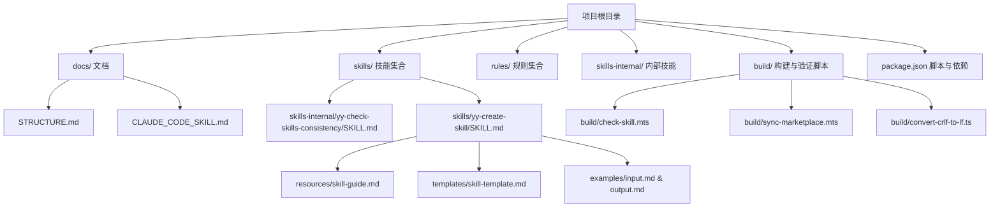
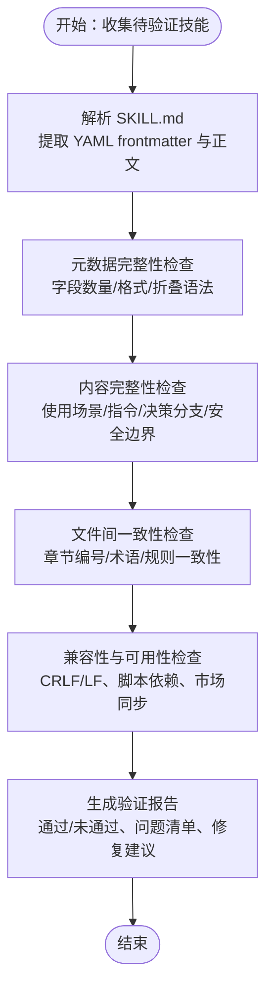
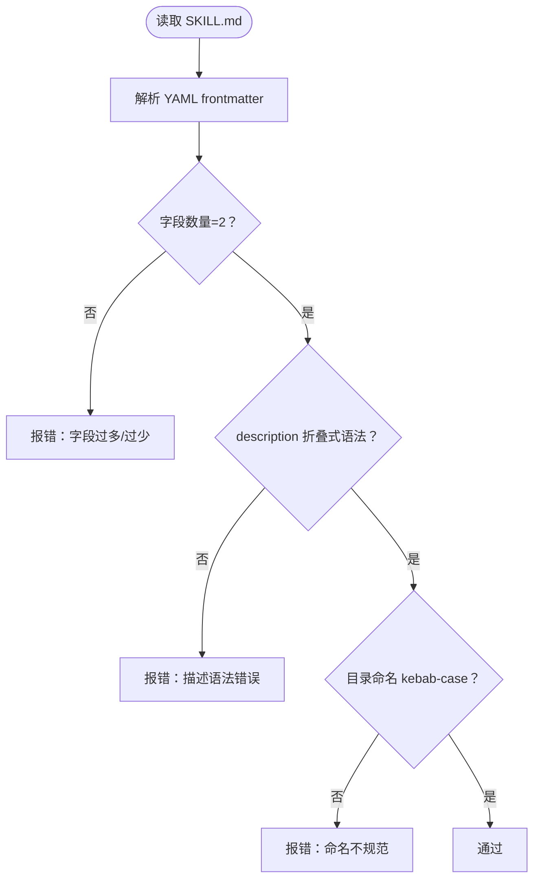
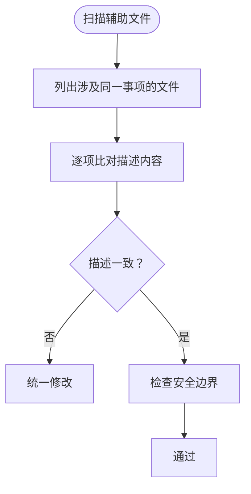
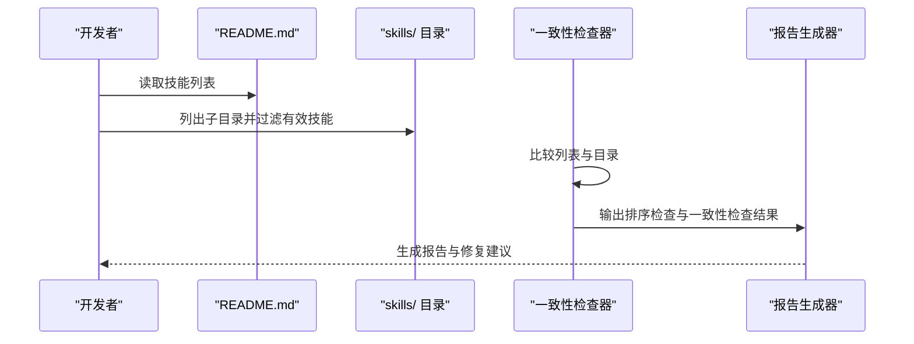
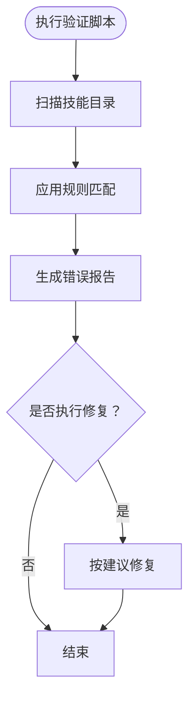
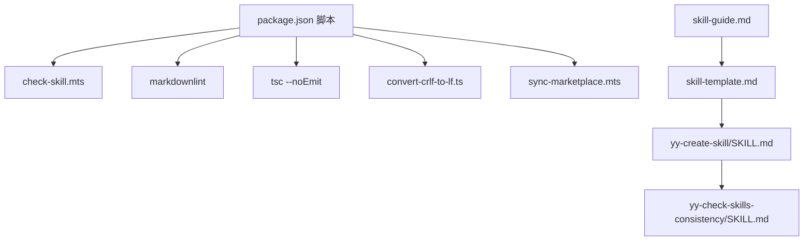

# 技能完整性验证

<cite>
**本文引用的文件**
- [README.md](file://README.md)
- [STRUCTURE.md](file://docs/STRUCTURE.md)
- [CLAUDE_CODE_SKILL.md](file://docs/CLAUDE_CODE_SKILL.md)
- [package.json](file://package.json)
- [yy-check-skills-consistency/SKILL.md](file://skills-internal/yy-check-skills-consistency/SKILL.md)
- [yy-create-skill/SKILL.md](file://skills/yy-create-skill/SKILL.md)
- [skill-guide.md](file://skills/yy-create-skill/resources/skill-guide.md)
- [skill-template.md](file://skills/yy-create-skill/templates/skill-template.md)
- [input.md（创建技能输入示例）](file://skills/yy-create-skill/examples/input.md)
- [output.md（创建技能输出示例）](file://skills/yy-create-skill/examples/output.md)
- [check-skill.mts](file://build/check-skill.mts)
- [sync-marketplace.mts](file://build/sync-marketplace.mts)
- [convert-crlf-to-lf.ts](file://build/convert-crlf-to-lf.ts)
</cite>

## 目录
1. [简介](#简介)
2. [项目结构](#项目结构)
3. [核心组件](#核心组件)
4. [架构总览](#架构总览)
5. [详细组件分析](#详细组件分析)
6. [依赖分析](#依赖分析)
7. [性能考虑](#性能考虑)
8. [故障排除指南](#故障排除指南)
9. [结论](#结论)
10. [附录](#附录)

## 简介
本文件面向“技能完整性验证”模块，系统化阐述技能文件结构验证、元数据完整性检查与功能可用性测试的流程与标准，覆盖 SKILL.md 文件格式验证、必需字段检查、依赖关系验证与兼容性测试。文档还解释自动化验证工具的工作机制（文件扫描、规则匹配、错误报告生成），给出技能质量评估指标体系（功能性完整性、文档完整性和代码质量评分），并总结验证失败的常见原因与解决方案，提供最佳实践与故障排除指南。

## 项目结构
该项目采用“技能 + 规则 + 构建工具”的分层组织方式：
- skills/：技能集合根目录，每个技能以独立目录存在，包含 SKILL.md 为主文件及可选的 examples/、templates/、resources/、scripts/ 等辅助目录
- rules/：自定义规则集合，按领域划分（如前端 Vue2/Vue3 规则）
- skills-internal/：内部技能（如一致性检查工具）
- docs/：项目文档（结构说明、安装指引、开发指南等）
- build/：自动化构建与验证脚本（如 check-skill.mts、sync-marketplace.mts、convert-crlf-to-lf.ts）
- package.json：项目脚本与依赖管理入口



图表来源
- [README.md:1-104](file://README.md#L1-L104)
- [STRUCTURE.md:1-10](file://docs/STRUCTURE.md#L1-L10)
- [CLAUDE_CODE_SKILL.md:1-10](file://docs/CLAUDE_CODE_SKILL.md#L1-L10)
- [package.json:1-46](file://package.json#L1-L46)

章节来源
- [README.md:1-104](file://README.md#L1-L104)
- [STRUCTURE.md:1-10](file://docs/STRUCTURE.md#L1-L10)
- [package.json:1-46](file://package.json#L1-L46)

## 核心组件
- 技能文件（SKILL.md）：技能的主文档，包含 YAML frontmatter、描述、使用场景、指令、相关资源等章节
- 技能模板与指南：提供结构化模板与编写规范，确保技能一致性与可维护性
- 内部技能：yy-check-skills-consistency 用于校验 README.md 与 skills/ 目录内容一致性
- 自动化验证工具：check-skill.mts、sync-marketplace.mts、convert-crlf-to-lf.ts 等脚本
- 项目脚本与依赖：通过 package.json 统一调度各类验证与同步任务

章节来源
- [yy-create-skill/SKILL.md:1-213](file://skills/yy-create-skill/SKILL.md#L1-L213)
- [skill-guide.md:1-395](file://skills/yy-create-skill/resources/skill-guide.md#L1-L395)
- [yy-check-skills-consistency/SKILL.md:1-93](file://skills-internal/yy-check-skills-consistency/SKILL.md#L1-L93)
- [check-skill.mts](file://build/check-skill.mts)
- [sync-marketplace.mts](file://build/sync-marketplace.mts)
- [convert-crlf-to-lf.ts](file://build/convert-crlf-to-lf.ts)

## 架构总览
技能完整性验证的总体流程分为三层：
- 结构与元数据层：校验 SKILL.md 的 YAML frontmatter、章节完整性与命名规范
- 内容与一致性层：校验使用场景、指令步骤、决策分支显式化、文件间一致性与安全边界
- 可用性与兼容性层：校验技能在不同平台与工具链中的可用性与兼容性（如 CRLF/LF 转换、市场同步）



图表来源
- [yy-create-skill/SKILL.md:1-213](file://skills/yy-create-skill/SKILL.md#L1-L213)
- [skill-guide.md:1-395](file://skills/yy-create-skill/resources/skill-guide.md#L1-L395)
- [convert-crlf-to-lf.ts](file://build/convert-crlf-to-lf.ts)
- [sync-marketplace.mts](file://build/sync-marketplace.mts)

## 详细组件分析

### 组件A：技能文件结构与元数据验证
- 验证目标
  - YAML frontmatter 仅包含 name 与 description 两字段
  - description 使用折叠式（>）语法，避免行内长描述
  - 技能名称遵循 kebab-case 命名规范
- 验证流程
  - 读取 SKILL.md，解析 frontmatter
  - 校验字段数量与类型
  - 校验 description 折叠语法与长度控制
  - 校验目录命名与文件存在性
- 常见问题与修复
  - frontmatter 字段过多：仅保留 name 与 description
  - description 使用行内长描述：改为折叠式语法
  - 目录命名不符合规范：改为 kebab-case



图表来源
- [yy-create-skill/SKILL.md:99-103](file://skills/yy-create-skill/SKILL.md#L99-L103)
- [skill-guide.md:9-25](file://skills/yy-create-skill/resources/skill-guide.md#L9-L25)
- [skill-guide.md:371-378](file://skills/yy-create-skill/resources/skill-guide.md#L371-L378)

章节来源
- [yy-create-skill/SKILL.md:99-103](file://skills/yy-create-skill/SKILL.md#L99-L103)
- [skill-guide.md:9-25](file://skills/yy-create-skill/resources/skill-guide.md#L9-L25)
- [skill-guide.md:371-378](file://skills/yy-create-skill/resources/skill-guide.md#L371-L378)

### 组件B：使用场景与指令完整性检查
- 验证目标
  - 使用场景明确列出“应触发”与“不应触发”的典型场景
  - 指令步骤清晰、可执行，最后一步描述输出格式
  - 决策点显式化，避免模糊表述
- 验证流程
  - 读取“使用场景”与“指令”章节
  - 校验场景列表完整性与边界定义
  - 校验指令步骤数量与可执行性
  - 校验决策分支是否显式化
- 常见问题与修复
  - 场景描述不完整：补充典型触发与非触发场景
  - 指令步骤不清晰：拆分为原子步骤，明确输出格式
  - 决策点模糊：用表格或分支列表替代“根据情况处理”

```mermaid
flowchart TD
B_Start(["读取使用场景与指令"]) --> B_Scenarios["校验场景列表完整性"]
B_Scenarios --> B_Steps["校验指令步骤可执行性"]
B_Steps --> B_Decision["校验决策分支显式化"]
B_Decision --> B_Scenarios && B_Steps && B_Decision --> B_Result{"通过？"}
B_Result --> |否| B_Fix["输出修复建议"]
B_Result --> |是| B_Pass["通过"]
```

图表来源
- [yy-create-skill/SKILL.md:21-33](file://skills/yy-create-skill/SKILL.md#L21-L33)
- [yy-create-skill/SKILL.md:104-111](file://skills/yy-create-skill/SKILL.md#L104-L111)
- [skill-guide.md:45-76](file://skills/yy-create-skill/resources/skill-guide.md#L45-L76)
- [skill-guide.md:78-124](file://skills/yy-create-skill/resources/skill-guide.md#L78-L124)

章节来源
- [yy-create-skill/SKILL.md:21-33](file://skills/yy-create-skill/SKILL.md#L21-L33)
- [yy-create-skill/SKILL.md:104-111](file://skills/yy-create-skill/SKILL.md#L104-L111)
- [skill-guide.md:45-76](file://skills/yy-create-skill/resources/skill-guide.md#L45-L76)
- [skill-guide.md:78-124](file://skills/yy-create-skill/resources/skill-guide.md#L78-L124)

### 组件C：文件间一致性与安全边界检查
- 验证目标
  - SKILL.md 与 examples/、templates/、resources/ 等辅助文件对同一事项描述一致
  - 安全边界明确禁止敏感操作
- 验证流程
  - 列出所有涉及同一事项的文件位置
  - 逐项比对描述内容（步骤编号、章节名称、术语、规则）
  - 发现矛盾时统一修改
  - 检查是否存在安全边界章节与禁止行为清单
- 常见问题与修复
  - 步骤编号不一致：统一编号
  - 术语不一致：统一术语
  - 规则矛盾：明确条件分支
  - 缺少安全边界：新增并明确禁止行为



图表来源
- [skill-guide.md:126-150](file://skills/yy-create-skill/resources/skill-guide.md#L126-L150)
- [skill-guide.md:151-166](file://skills/yy-create-skill/resources/skill-guide.md#L151-L166)

章节来源
- [skill-guide.md:126-150](file://skills/yy-create-skill/resources/skill-guide.md#L126-L150)
- [skill-guide.md:151-166](file://skills/yy-create-skill/resources/skill-guide.md#L151-L166)

### 组件D：技能一致性检查（README.md 与 skills/ 目录）
- 验证目标
  - README.md 中的技能列表按字母顺序排序
  - README.md 中的技能列表与 skills/ 目录实际内容一致
- 验证流程
  - 读取 README.md 并提取技能列表
  - 列出 skills/ 目录下的所有子目录，过滤出有效技能目录（包含 SKILL.md）
  - 比较两者内容，识别缺失项与冗余项
  - 生成验证报告并可选执行修复
- 常见问题与修复
  - 未排序：按字母顺序重新排列
  - 缺失项：在 README.md 中添加
  - 冗余项：从 README.md 中删除



图表来源
- [yy-check-skills-consistency/SKILL.md:21-46](file://skills-internal/yy-check-skills-consistency/SKILL.md#L21-L46)

章节来源
- [yy-check-skills-consistency/SKILL.md:21-46](file://skills-internal/yy-check-skills-consistency/SKILL.md#L21-L46)

### 组件E：自动化验证工具工作机制
- 工具职责
  - check-skill.mts：执行技能完整性验证（结构、元数据、内容、一致性）
  - sync-marketplace.mts：同步技能到市场配置
  - convert-crlf-to-lf.ts：统一换行符格式，保证跨平台兼容
- 工作流程
  - 文件扫描：遍历 skills/ 目录，收集 SKILL.md 与辅助文件
  - 规则匹配：依据模板与指南进行字段、语法与内容校验
  - 错误报告生成：汇总问题清单与修复建议
  - 可选修复：按建议自动修正部分问题（如排序、缺失项）



图表来源
- [check-skill.mts](file://build/check-skill.mts)
- [sync-marketplace.mts](file://build/sync-marketplace.mts)
- [convert-crlf-to-lf.ts](file://build/convert-crlf-to-lf.ts)

章节来源
- [check-skill.mts](file://build/check-skill.mts)
- [sync-marketplace.mts](file://build/sync-marketplace.mts)
- [convert-crlf-to-lf.ts](file://build/convert-crlf-to-lf.ts)

## 依赖分析
- 项目脚本通过 package.json 统一调度，包括技能检查、Markdown Lint、类型检查、换行符转换与市场同步
- 技能模板与指南为技能编写提供统一规范，降低人工校验成本
- 内部技能（一致性检查）与外部技能（如创建技能）形成闭环：前者保障文档一致性，后者保障技能质量



图表来源
- [package.json:7-16](file://package.json#L7-L16)
- [skill-guide.md](file://skills/yy-create-skill/resources/skill-guide.md)
- [skill-template.md](file://skills/yy-create-skill/templates/skill-template.md)
- [yy-create-skill/SKILL.md](file://skills/yy-create-skill/SKILL.md)
- [yy-check-skills-consistency/SKILL.md](file://skills-internal/yy-check-skills-consistency/SKILL.md)

章节来源
- [package.json:7-16](file://package.json#L7-L16)

## 性能考虑
- 扫描范围控制：仅扫描 skills/ 目录与必要的辅助文件，避免全仓库扫描
- 规则匹配优化：优先进行低成本规则（如字段数量、命名规范），再进行高成本规则（如文件间一致性比对）
- 并行处理：对多个技能文件的验证可并行执行，缩短整体耗时
- 缓存与增量：对已通过验证的技能缓存结果，仅对变更文件重新验证

## 故障排除指南
- 文件格式错误
  - 现象：YAML frontmatter 解析失败、description 语法错误
  - 排查：检查 frontmatter 字段数量与语法，确认使用折叠式语法
  - 修复：仅保留 name 与 description，使用折叠式语法
  - 参考
    - [yy-create-skill/SKILL.md:99-103](file://skills/yy-create-skill/SKILL.md#L99-L103)
    - [skill-guide.md:9-25](file://skills/yy-create-skill/resources/skill-guide.md#L9-L25)
- 缺少必要信息
  - 现象：使用场景不完整、指令步骤不清晰、缺少安全边界
  - 排查：对照模板与指南检查章节完整性
  - 修复：补充场景列表、细化指令步骤、新增安全边界
  - 参考
    - [skill-guide.md:45-76](file://skills/yy-create-skill/resources/skill-guide.md#L45-L76)
    - [skill-guide.md:151-166](file://skills/yy-create-skill/resources/skill-guide.md#L151-L166)
- 功能实现缺陷
  - 现象：技能无法在目标平台运行、换行符导致跨平台问题
  - 排查：检查脚本依赖、换行符格式、市场配置
  - 修复：统一换行符格式、完善依赖配置、同步市场信息
  - 参考
    - [convert-crlf-to-lf.ts](file://build/convert-crlf-to-lf.ts)
    - [sync-marketplace.mts](file://build/sync-marketplace.mts)
- 文档一致性问题
  - 现象：README.md 与 skills/ 目录不一致、排序错误
  - 排查：使用一致性检查工具比对列表
  - 修复：按字母顺序排序、补齐缺失项、删除冗余项
  - 参考
    - [yy-check-skills-consistency/SKILL.md:21-46](file://skills-internal/yy-check-skills-consistency/SKILL.md#L21-L46)

章节来源
- [yy-create-skill/SKILL.md:99-103](file://skills/yy-create-skill/SKILL.md#L99-L103)
- [skill-guide.md:9-25](file://skills/yy-create-skill/resources/skill-guide.md#L9-L25)
- [skill-guide.md:45-76](file://skills/yy-create-skill/resources/skill-guide.md#L45-L76)
- [skill-guide.md:151-166](file://skills/yy-create-skill/resources/skill-guide.md#L151-L166)
- [convert-crlf-to-lf.ts](file://build/convert-crlf-to-lf.ts)
- [sync-marketplace.mts](file://build/sync-marketplace.mts)
- [yy-check-skills-consistency/SKILL.md:21-46](file://skills-internal/yy-check-skills-consistency/SKILL.md#L21-L46)

## 结论
技能完整性验证模块通过“结构与元数据—内容与一致性—可用性与兼容性”的三层验证体系，结合模板与指南的规范化约束，以及自动化脚本的扫描、匹配与报告生成能力，实现了对技能质量的系统化保障。建议在日常开发中持续运行自动化验证脚本，并定期使用一致性检查工具维护文档与目录的一致性，以确保技能在不同平台与工具链中的稳定可用。

## 附录
- 技能质量评估指标体系（示例）
  - 功能性完整性：指令步骤可执行性、输出格式规范性、决策分支显式化程度
  - 文档完整性和一致性：章节完整性、文件间一致性、使用场景边界清晰度
  - 代码质量评分：脚本命名规范、依赖配置合理性、模板内容迁移情况
- 最佳实践
  - 使用模板与指南编写 SKILL.md，严格遵守命名与语法规范
  - 在创建/更新技能后执行自动化验证脚本
  - 定期运行一致性检查工具，保持 README.md 与 skills/ 目录同步
  - 统一换行符格式，确保跨平台兼容
  - 明确安全边界，避免敏感操作