# 质量保证体系

<cite>
**本文档引用的文件**
- [package.json](file://package.json)
- [.markdownlint.json](file://.markdownlint.json)
- [build/check-skill.mts](file://build/check-skill.mts)
- [build/sync-marketplace.mts](file://build/sync-marketplace.mts)
- [skills/yy-lint/SKILL.md](file://skills/yy-lint/SKILL.md)
- [skills/yy-review/SKILL.md](file://skills/yy-review/SKILL.md)
- [skills/yy-frontend-vue2-review/SKILL.md](file://skills/yy-frontend-vue2-review/SKILL.md)
- [skills/yy-frontend-vue3-review/SKILL.md](file://skills/yy-frontend-vue3-review/SKILL.md)
- [skills/yy-create-rule/SKILL.md](file://skills/yy-create-rule/SKILL.md)
- [skills/yy-create-skill/SKILL.md](file://skills/yy-create-skill/SKILL.md)
- [skills-internal/yy-check-skills-consistency/SKILL.md](file://skills-internal/yy-check-skills-consistency/SKILL.md)
- [rules/frontend-rules-vue2/RULE.md](file://rules/frontend-rules-vue2/RULE.md)
- [rules/frontend-rules-vue3/RULE.md](file://rules/frontend-rules-vue3/RULE.md)
- [rules/frontend-rules-vue2/references/spec-index.md](file://rules/frontend-rules-vue2/references/spec-index.md)
- [docs/CLAUDE_CODE_SKILL.md](file://docs/CLAUDE_CODE_SKILL.md)
</cite>

## 目录
1. [简介](#简介)
2. [项目结构](#项目结构)
3. [核心组件](#核心组件)
4. [架构总览](#架构总览)
5. [详细组件分析](#详细组件分析)
6. [依赖分析](#依赖分析)
7. [性能考虑](#性能考虑)
8. [故障排查指南](#故障排查指南)
9. [结论](#结论)
10. [附录](#附录)

## 简介
本质量保证体系围绕“规则 + 技能 + 工具”的三位一体架构，实现从代码质量检查、技能完整性验证到一致性保证的全流程自动化。体系包含：
- 规则层：面向 Vue2/Vue3 的前端开发规范与约束，形成可引用的参考文件集合
- 技能层：面向不同质量门禁的 AI 技能，覆盖 Lint、Review、规则创建、技能创建等
- 工具层：本地检查与 CI/CD 集成脚本，保障元数据一致性与市场同步

通过明确的触发条件、严格的边界约束与可量化的输出格式，确保质量门禁稳定可靠，并支持持续改进。

## 项目结构
项目采用“规则 + 技能 + 工具 + 文档”的分层组织方式：
- rules：前端开发规范与参考文件，按 Vue2/Vue3 拆分子模块
- skills：质量相关的 AI 技能，如 Lint、Review、规则创建、技能创建等
- skills-internal：内部质量检查技能，如技能目录一致性检查
- build：本地质量检查与市场同步工具
- docs：使用指南与安装说明
- 根目录配置：package.json、markdownlint 配置等

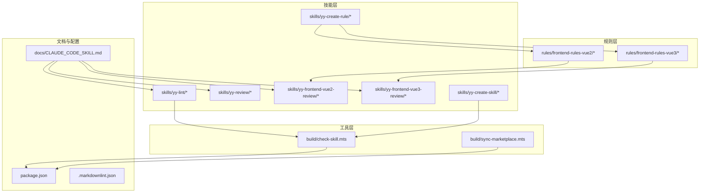

图表来源
- [rules/frontend-rules-vue2/RULE.md:1-62](file://rules/frontend-rules-vue2/RULE.md#L1-L62)
- [rules/frontend-rules-vue3/RULE.md:1-68](file://rules/frontend-rules-vue3/RULE.md#L1-L68)
- [skills/yy-lint/SKILL.md:1-88](file://skills/yy-lint/SKILL.md#L1-L88)
- [skills/yy-review/SKILL.md:1-131](file://skills/yy-review/SKILL.md#L1-L131)
- [skills/yy-frontend-vue2-review/SKILL.md:1-167](file://skills/yy-frontend-vue2-review/SKILL.md#L1-L167)
- [skills/yy-frontend-vue3-review/SKILL.md:1-206](file://skills/yy-frontend-vue3-review/SKILL.md#L1-L206)
- [skills/yy-create-rule/SKILL.md:1-133](file://skills/yy-create-rule/SKILL.md#L1-L133)
- [skills/yy-create-skill/SKILL.md:1-213](file://skills/yy-create-skill/SKILL.md#L1-L213)
- [build/check-skill.mts:1-230](file://build/check-skill.mts#L1-L230)
- [build/sync-marketplace.mts:1-93](file://build/sync-marketplace.mts#L1-L93)
- [docs/CLAUDE_CODE_SKILL.md:1-10](file://docs/CLAUDE_CODE_SKILL.md#L1-L10)
- [package.json:1-46](file://package.json#L1-L46)
- [.markdownlint.json:1-13](file://.markdownlint.json#L1-L13)

章节来源
- [package.json:1-46](file://package.json#L1-L46)
- [.markdownlint.json:1-13](file://.markdownlint.json#L1-L13)

## 核心组件
- 本地质量检查工具：校验 SKILL.md 元数据与 metadata.json 一致性，输出错误/警告统计
- 市场同步工具：同步 package.json 与 marketplace.json，自动整理技能列表并按前端/非前端分类
- Lint 技能：执行代码 Lint 检查，支持自定义命令与 Node 版本验证，避免并行任务冲突
- Review 技能：对改动文件进行语法、逻辑、安全与最佳实践检查，按严重程度分级输出
- Vue2/Vue3 专用 Review 技能：严格限定 src 目录范围，覆盖 9 大维度，生成审核清单
- 规则与技能创建技能：规范化规则与技能的创建流程，确保可复用与可维护性
- 技能一致性检查：验证 README.md 与 skills/ 目录内容一致性，支持排序与修复

章节来源
- [build/check-skill.mts:1-230](file://build/check-skill.mts#L1-L230)
- [build/sync-marketplace.mts:1-93](file://build/sync-marketplace.mts#L1-L93)
- [skills/yy-lint/SKILL.md:1-88](file://skills/yy-lint/SKILL.md#L1-L88)
- [skills/yy-review/SKILL.md:1-131](file://skills/yy-review/SKILL.md#L1-L131)
- [skills/yy-frontend-vue2-review/SKILL.md:1-167](file://skills/yy-frontend-vue2-review/SKILL.md#L1-L167)
- [skills/yy-frontend-vue3-review/SKILL.md:1-206](file://skills/yy-frontend-vue3-review/SKILL.md#L1-L206)
- [skills/yy-create-rule/SKILL.md:1-133](file://skills/yy-create-rule/SKILL.md#L1-L133)
- [skills/yy-create-skill/SKILL.md:1-213](file://skills/yy-create-skill/SKILL.md#L1-L213)
- [skills-internal/yy-check-skills-consistency/SKILL.md:1-93](file://skills-internal/yy-check-skills-consistency/SKILL.md#L1-L93)

## 架构总览
质量保证体系由“规则驱动 + 技能执行 + 工具保障”构成闭环：
- 规则驱动：前端规范文件作为审核依据，提供可引用的参考模块
- 技能执行：Lint/Review 技能按触发条件执行，输出结构化结果
- 工具保障：本地检查与市场同步工具确保元数据与市场一致，支撑质量门禁

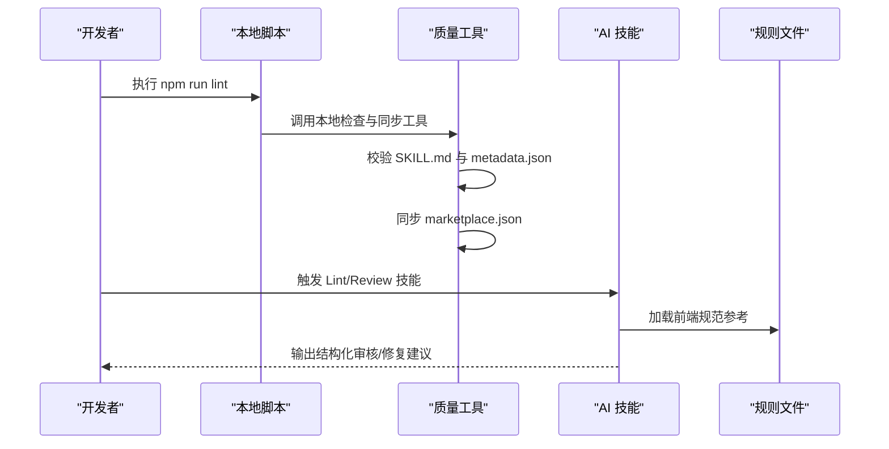

图表来源
- [package.json:7-16](file://package.json#L7-L16)
- [build/check-skill.mts:177-230](file://build/check-skill.mts#L177-L230)
- [build/sync-marketplace.mts:12-93](file://build/sync-marketplace.mts#L12-L93)
- [skills/yy-lint/SKILL.md:30-88](file://skills/yy-lint/SKILL.md#L30-L88)
- [skills/yy-review/SKILL.md:26-131](file://skills/yy-review/SKILL.md#L26-L131)
- [rules/frontend-rules-vue2/RULE.md:1-62](file://rules/frontend-rules-vue2/RULE.md#L1-L62)
- [rules/frontend-rules-vue3/RULE.md:1-68](file://rules/frontend-rules-vue3/RULE.md#L1-L68)

## 详细组件分析

### 本地质量检查工具（check-skill.mts）
职责与流程：
- 遍历 skills 目录，逐一校验 SKILL.md 的 YAML frontmatter、内容完整性与目录名一致性
- 对比 metadata.json 的 abstract/author/version 与 SKILL.md 的 description/metadata 字段，输出警告建议
- 统计错误与警告数量，错误导致进程退出，警告提示后续处理

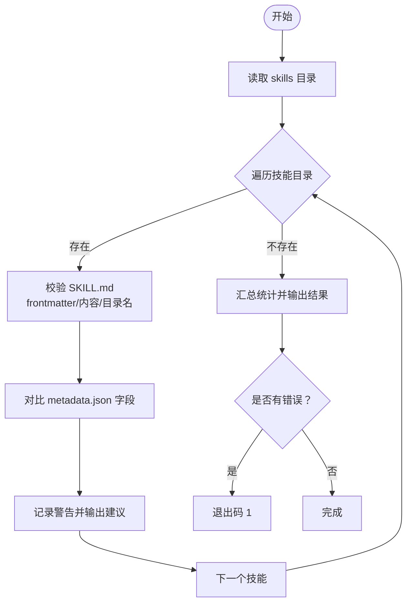

图表来源
- [build/check-skill.mts:177-230](file://build/check-skill.mts#L177-L230)

章节来源
- [build/check-skill.mts:1-230](file://build/check-skill.mts#L1-L230)

### 市场同步工具（sync-marketplace.mts）
职责与流程：
- 读取 package.json 与 marketplace.json，同步 name/version/description/author
- 扫描 skills 与 skills-internal 目录，过滤空目录并按字母排序
- 将技能列表分别写入 open-skills 与 frontend-skills 插件条目
- 写回 marketplace.json 并输出同步结果

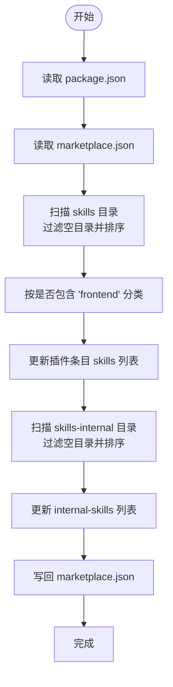

图表来源
- [build/sync-marketplace.mts:12-93](file://build/sync-marketplace.mts#L12-L93)

章节来源
- [build/sync-marketplace.mts:1-93](file://build/sync-marketplace.mts#L1-L93)

### Lint 技能（yy-lint）
职责与流程：
- 按优先级确定执行命令（用户指定 > package.json lint:fix > package.json lint）
- 验证 Node 版本（若存在 .nvmrc）
- 并行任务约束：若有并行任务，延迟执行
- 执行命令并根据 exit code 输出状态、命令名、报错数量与修复结果

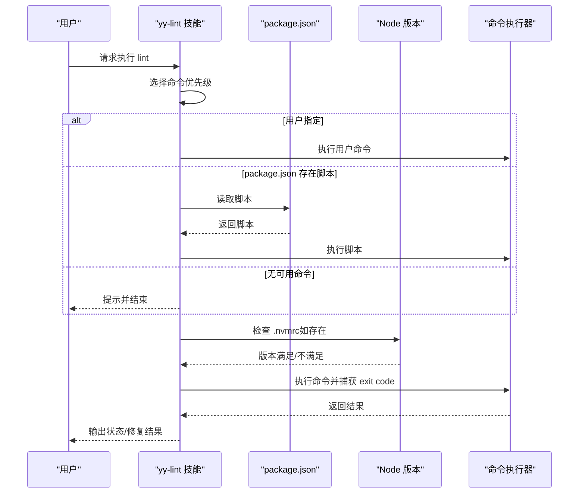

图表来源
- [skills/yy-lint/SKILL.md:30-88](file://skills/yy-lint/SKILL.md#L30-L88)

章节来源
- [skills/yy-lint/SKILL.md:1-88](file://skills/yy-lint/SKILL.md#L1-L88)

### Review 技能（yy-review）
职责与流程：
- 获取 git 变动文件，过滤代码文件与自动生成/配置文件
- 对改动文件进行语法、逻辑、安全与最佳实践检查
- 按严重程度分类输出问题统计与详情，支持仅轻微问题通过

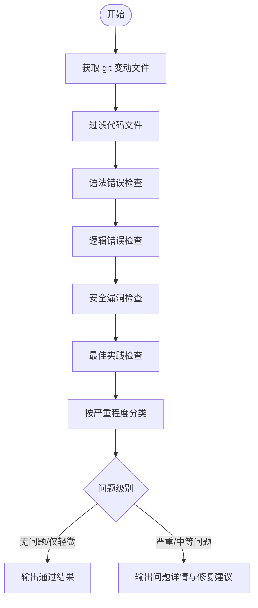

图表来源
- [skills/yy-review/SKILL.md:28-131](file://skills/yy-review/SKILL.md#L28-L131)

章节来源
- [skills/yy-review/SKILL.md:1-131](file://skills/yy-review/SKILL.md#L1-L131)

### Vue2 Review 技能（yy-frontend-vue2-review）
职责与流程：
- 严格限制在 src 目录内审核，覆盖 9 大维度（代码风格、最佳实践、组件规范、命名、网络请求、computed、逻辑错误、安全、绝对禁止项）
- 三级严重程度分级，生成审核清单，绝不修改代码（除非用户明确要求）

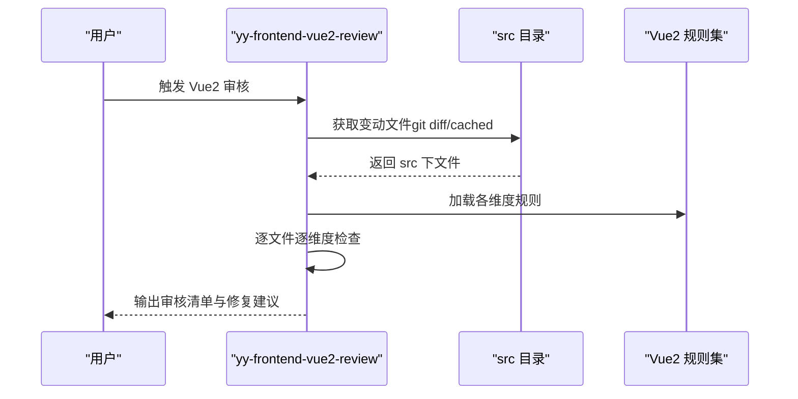

图表来源
- [skills/yy-frontend-vue2-review/SKILL.md:59-167](file://skills/yy-frontend-vue2-review/SKILL.md#L59-L167)
- [rules/frontend-rules-vue2/RULE.md:1-62](file://rules/frontend-rules-vue2/RULE.md#L1-L62)
- [rules/frontend-rules-vue2/references/spec-index.md:1-61](file://rules/frontend-rules-vue2/references/spec-index.md#L1-L61)

章节来源
- [skills/yy-frontend-vue2-review/SKILL.md:1-167](file://skills/yy-frontend-vue2-review/SKILL.md#L1-L167)

### Vue3 Review 技能（yy-frontend-vue3-review）
职责与流程：
- 仅审核 Vue3 项目 src 目录下改动文件，基于 Vue3 开发规范逐项检查
- 维度覆盖更广（含 TS、Hooks、响应式等），严格区分严重/中等/轻微问题
- 支持大型文件分段审核与用户要求修复的边界条件

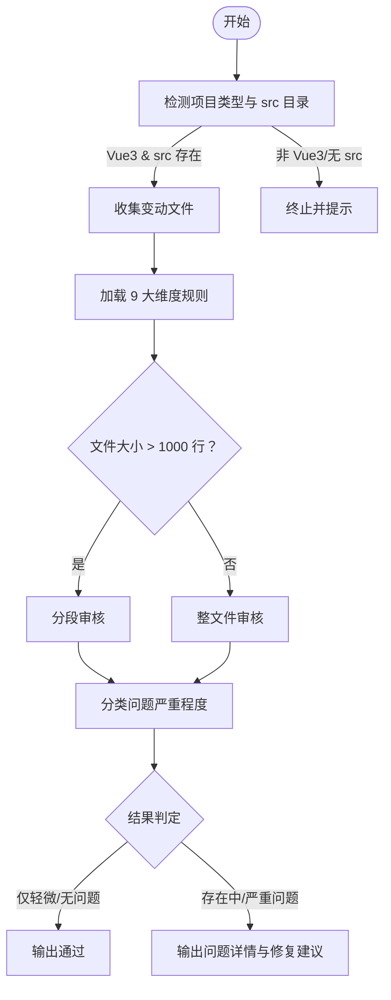

图表来源
- [skills/yy-frontend-vue3-review/SKILL.md:14-206](file://skills/yy-frontend-vue3-review/SKILL.md#L14-L206)
- [rules/frontend-rules-vue3/RULE.md:1-68](file://rules/frontend-rules-vue3/RULE.md#L1-L68)

章节来源
- [skills/yy-frontend-vue3-review/SKILL.md:1-206](file://skills/yy-frontend-vue3-review/SKILL.md#L1-L206)

### 规则创建技能（yy-create-rule）
职责与流程：
- 捕获用户意图，决定创建新规则或更新现有规则
- 检查并初始化规则目录与 AGENTS.md 引用
- 决定放置位置并格式化插入内容，必要时更新 AGENTS.md

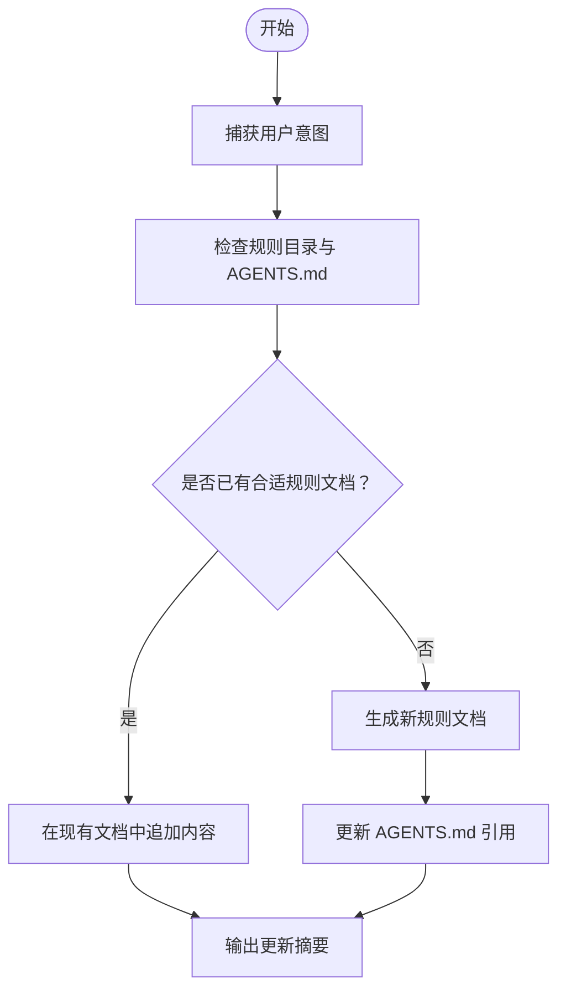

图表来源
- [skills/yy-create-rule/SKILL.md:29-133](file://skills/yy-create-rule/SKILL.md#L29-L133)

章节来源
- [skills/yy-create-rule/SKILL.md:1-133](file://skills/yy-create-rule/SKILL.md#L1-L133)

### 技能创建技能（yy-create-skill）
职责与流程：
- 明确创建新技能或更新现有技能，确定技能目录与输出目录
- 编写 SKILL.md，按需创建辅助目录（scripts/templates/resources/examples）
- 验收检查：描述准确性、使用场景、指令步骤、YAML 格式、决策显式化、文件一致性、安全边界

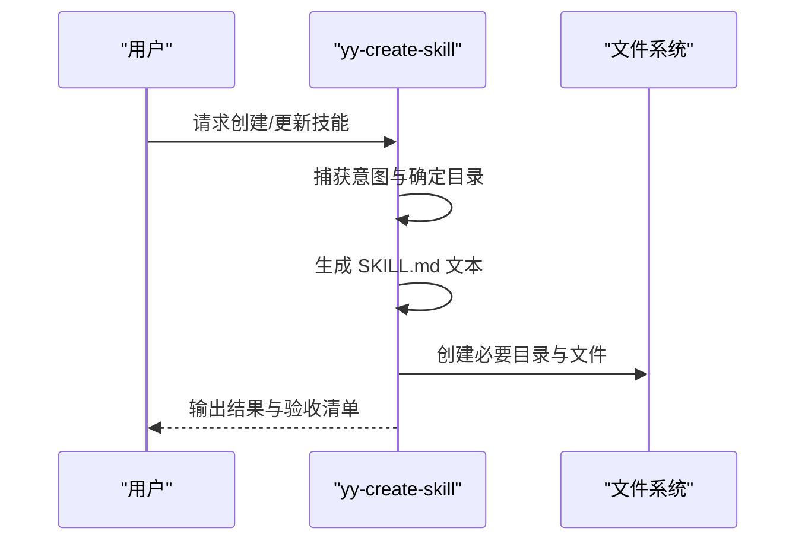

图表来源
- [skills/yy-create-skill/SKILL.md:34-213](file://skills/yy-create-skill/SKILL.md#L34-L213)

章节来源
- [skills/yy-create-skill/SKILL.md:1-213](file://skills/yy-create-skill/SKILL.md#L1-L213)

### 技能一致性检查（yy-check-skills-consistency）
职责与流程：
- 读取 README.md 与 skills/ 目录，验证字母排序与内容一致性
- 生成验证报告，支持可选修复（排序、缺失项、冗余项）

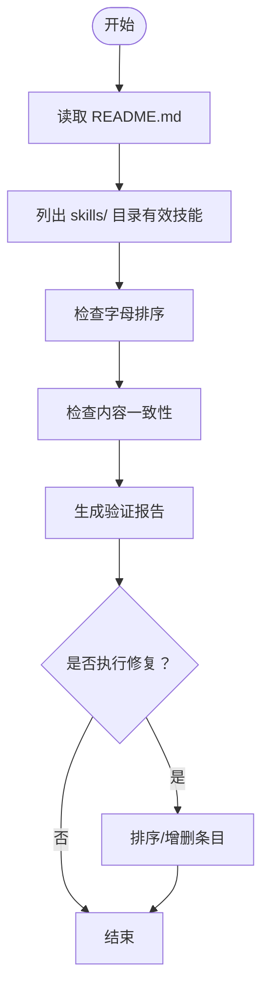

图表来源
- [skills-internal/yy-check-skills-consistency/SKILL.md:19-93](file://skills-internal/yy-check-skills-consistency/SKILL.md#L19-L93)

章节来源
- [skills-internal/yy-check-skills-consistency/SKILL.md:1-93](file://skills-internal/yy-check-skills-consistency/SKILL.md#L1-L93)

## 依赖分析
- 脚本依赖：package.json 中的 lint 脚本串联本地检查、Markdown Lint、TypeScript 类型检查、CRLF 转 LF、市场同步
- 规则依赖：Review 技能依赖 rules/frontend-rules-vue2 与 rules/frontend-rules-vue3 的参考文件
- 工具依赖：check-skill.mts 依赖 js-yaml 解析 YAML，sync-marketplace.mts 依赖文件系统读写

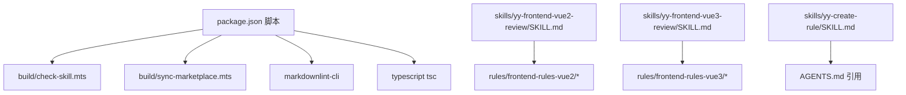

图表来源
- [package.json:7-16](file://package.json#L7-L16)
- [build/check-skill.mts:1-230](file://build/check-skill.mts#L1-L230)
- [build/sync-marketplace.mts:1-93](file://build/sync-marketplace.mts#L1-L93)
- [skills/yy-frontend-vue2-review/SKILL.md:1-167](file://skills/yy-frontend-vue2-review/SKILL.md#L1-L167)
- [skills/yy-frontend-vue3-review/SKILL.md:1-206](file://skills/yy-frontend-vue3-review/SKILL.md#L1-L206)
- [skills/yy-create-rule/SKILL.md:1-133](file://skills/yy-create-rule/SKILL.md#L1-L133)

章节来源
- [package.json:1-46](file://package.json#L1-L46)

## 性能考虑
- 本地检查批量化：check-skill.mts 一次性遍历所有技能，减少 IO 次数
- 市场同步增量：仅在变更时同步，避免重复写入
- Lint 执行优化：优先使用 package.json 脚本，避免额外开销；并行任务约束减少冲突
- Review 分段审核：大型文件分段处理，降低内存占用与 Token 消耗

## 故障排查指南
常见问题与处理：
- SKILL.md 元数据不一致：检查 metadata.json 的 abstract/author/version 与 SKILL.md 的 description/metadata 是否一致，按警告建议更新
- marketpalce.json 未同步：确认 package.json 字段与 marketplace.json 对应项一致，重新执行同步脚本
- Lint 命令失败：检查 .nvmrc 与 Node 版本，确认 package.json 中存在可用脚本；避免并行任务冲突
- Review 未发现问题：确认 src 目录存在且包含改动文件；检查文件类型是否受支持
- 规则创建失败：确认 AGENTS.md 存在并正确引用；检查规则目录权限

章节来源
- [build/check-skill.mts:127-172](file://build/check-skill.mts#L127-L172)
- [build/sync-marketplace.mts:12-93](file://build/sync-marketplace.mts#L12-L93)
- [skills/yy-lint/SKILL.md:43-88](file://skills/yy-lint/SKILL.md#L43-L88)
- [skills/yy-review/SKILL.md:28-131](file://skills/yy-review/SKILL.md#L28-L131)
- [skills/yy-create-rule/SKILL.md:48-90](file://skills/yy-create-rule/SKILL.md#L48-L90)

## 结论
本质量保证体系通过规则、技能与工具的协同，实现了从本地检查到 CI/CD 集成的全链路质量控制。技能层提供可复用的自动化能力，规则层提供权威的约束与参考，工具层保障元数据与市场同步。建议在团队内推广使用，结合 CI/CD 设置质量门禁，持续迭代规则与技能，提升整体代码质量与交付效率。

## 附录

### 质量门禁与阈值设定
- 严重问题：必须修复，审核不通过
- 中等问题：建议修复，审核不通过
- 轻微问题：不影响通过，建议修复
- 并行任务：延迟 Lint 执行，避免冲突
- Node 版本：若存在 .nvmrc，必须满足要求

章节来源
- [skills/yy-frontend-vue2-review/SKILL.md:82-96](file://skills/yy-frontend-vue2-review/SKILL.md#L82-L96)
- [skills/yy-frontend-vue3-review/SKILL.md:52-72](file://skills/yy-frontend-vue3-review/SKILL.md#L52-L72)
- [skills/yy-lint/SKILL.md:64-83](file://skills/yy-lint/SKILL.md#L64-L83)

### 质量数据分析与报告
- 技能一致性检查：输出排序检查与内容一致性检查结果，列出缺失项与冗余项
- Review 技能：按文件与维度生成审核矩阵，统计严重/中等/轻微问题数量
- Lint 技能：输出执行状态、命令名称、报错数量与修复结果

章节来源
- [skills-internal/yy-check-skills-consistency/SKILL.md:48-93](file://skills-internal/yy-check-skills-consistency/SKILL.md#L48-L93)
- [skills/yy-review/SKILL.md:77-131](file://skills/yy-review/SKILL.md#L77-L131)
- [skills/yy-lint/SKILL.md:69-88](file://skills/yy-lint/SKILL.md#L69-L88)

### 工具配置与自定义检查规则
- Lint 技能：支持用户自定义命令与 package.json 脚本优先级
- 规则创建：按主题自动生成文件名，更新 AGENTS.md 引用
- 技能创建：遵循命名规范与 YAML frontmatter 约束，明确使用场景与边界条件

章节来源
- [skills/yy-lint/SKILL.md:30-88](file://skills/yy-lint/SKILL.md#L30-L88)
- [skills/yy-create-rule/SKILL.md:53-90](file://skills/yy-create-rule/SKILL.md#L53-L90)
- [skills/yy-create-skill/SKILL.md:99-177](file://skills/yy-create-skill/SKILL.md#L99-L177)