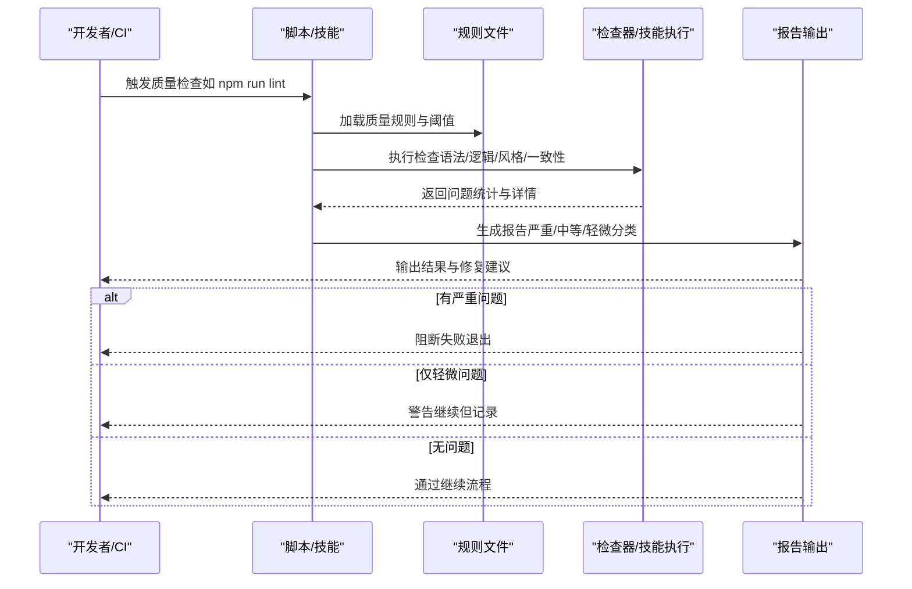
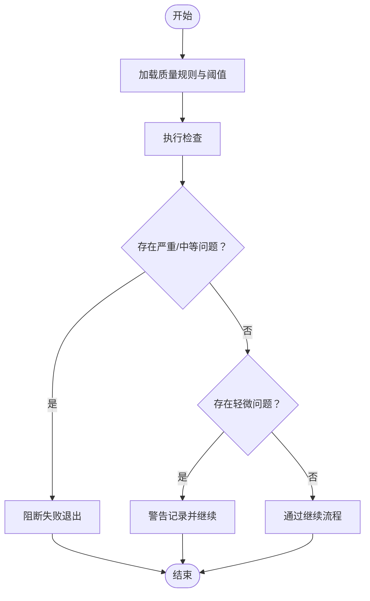
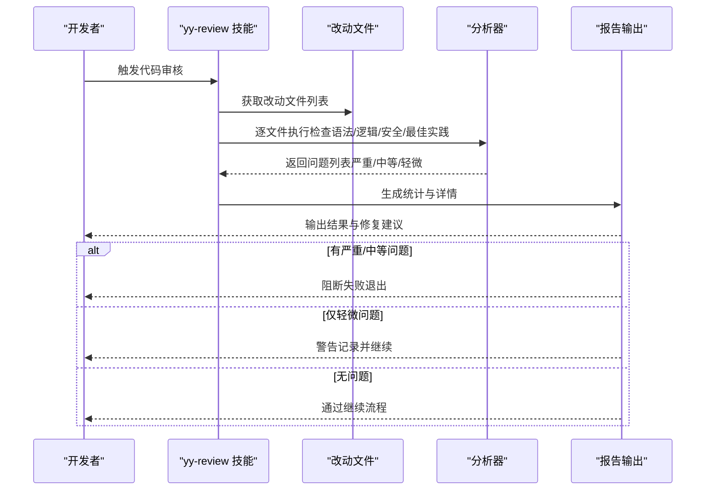
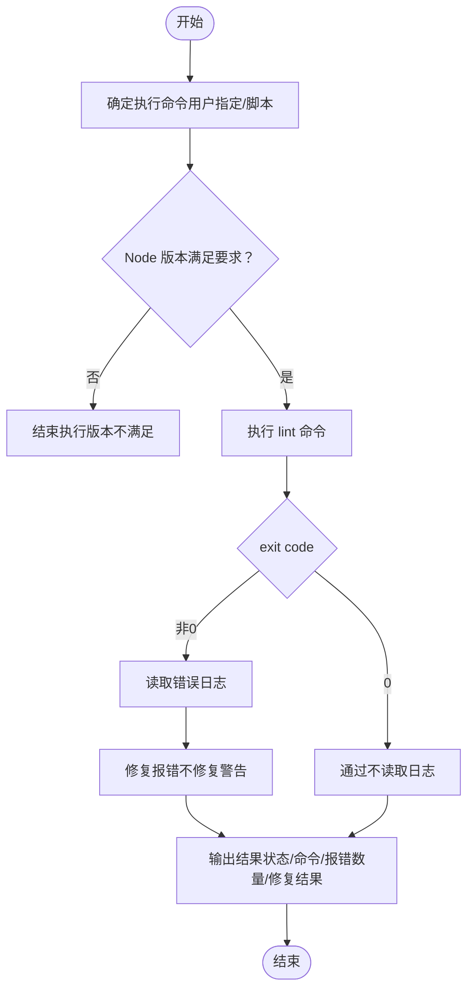
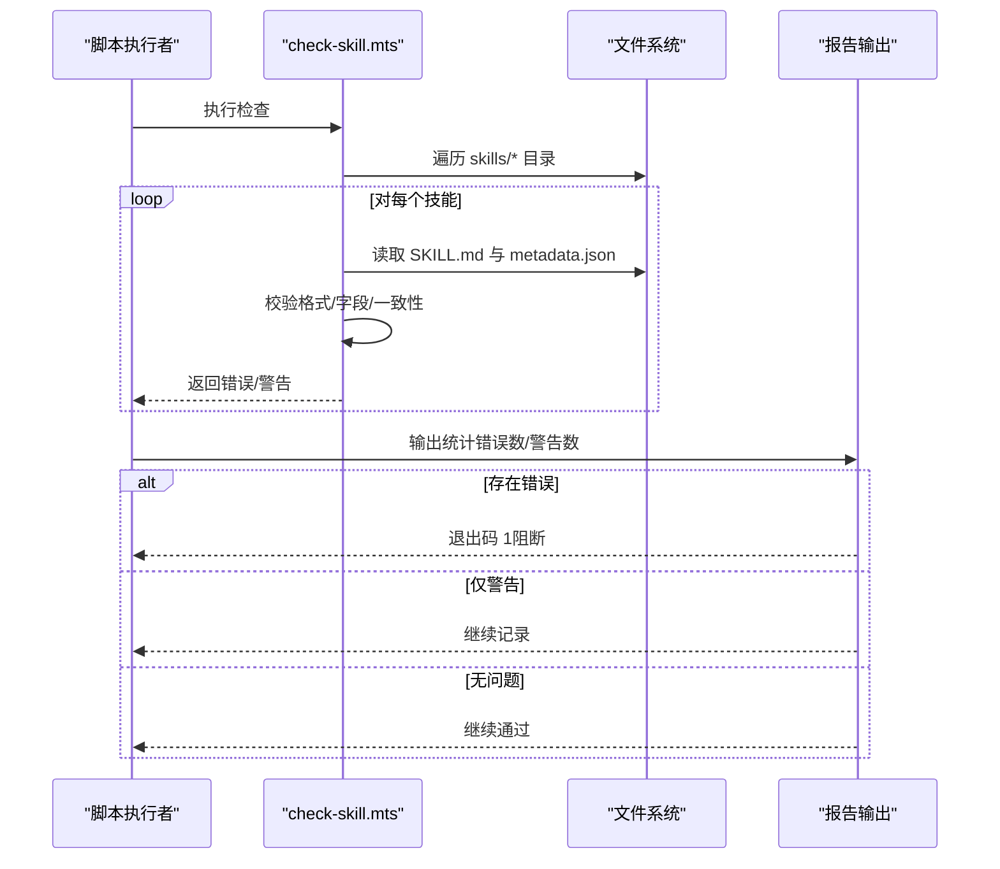
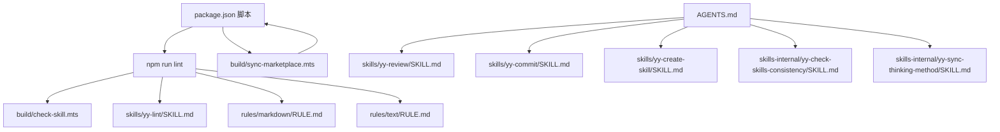

# 质量门禁系统

<cite>
**本文引用的文件**
- [package.json](file://package.json)
- [AGENTS.md](file://AGENTS.md)
- [STRUCTURE.md](file://docs/STRUCTURE.md)
- [CONFIG_RULE.md](file://docs/CONFIG_RULE.md)
- [yy-review 技能](file://skills/yy-review/SKILL.md)
- [yy-lint 技能](file://skills/yy-lint/SKILL.md)
- [yy-commit 技能](file://skills/yy-commit/SKILL.md)
- [yy-create-skill 技能](file://skills/yy-create-skill/SKILL.md)
- [yy-check-skills-consistency 技能](file://skills-internal/yy-check-skills-consistency/SKILL.md)
- [yy-sync-thinking-method 技能](file://skills-internal/yy-sync-thinking-method/SKILL.md)
- [check-skill.mts](file://build/check-skill.mts)
- [sync-marketplace.mts](file://build/sync-marketplace.mts)
- [markdown 规则](file://rules/markdown/RULE.md)
- [文本表达规范](file://rules/text/RULE.md)
</cite>

## 目录
1. [简介](#简介)
2. [项目结构](#项目结构)
3. [核心组件](#核心组件)
4. [架构总览](#架构总览)
5. [详细组件分析](#详细组件分析)
6. [依赖分析](#依赖分析)
7. [性能考量](#性能考量)
8. [故障排查指南](#故障排查指南)
9. [结论](#结论)
10. [附录](#附录)

## 简介
本质量门禁系统围绕“技能即规则”的理念构建，通过一系列标准化技能与自动化检查脚本，形成从“质量阈值设定、问题分级处理、自动化决策”到“CI/CD 集成、监控报告与持续优化”的闭环。系统以 AGENTS.md 为质量门禁的总体指导，结合 yy-review、yy-lint、yy-commit 等技能，以及 build 目录下的检查与同步脚本，确保仓库内容在结构、风格、一致性与可交付性方面达到统一标准。

## 项目结构
项目采用“技能 + 规则 + 构建脚本”的分层组织方式：
- skills/：对外可复用的技能集合，每个技能独立封装为 SKILL.md，具备触发条件、执行步骤与输出格式
- skills-internal/：内部维护类技能，用于一致性检查、思考方式同步等
- rules/：面向文档与文本的规则文件，约束 Markdown 与表达风格
- build/：自动化检查与市场同步脚本，保障技能元数据与市场配置一致
- docs/：项目说明与配置指南
- package.json：项目脚本与依赖入口

```mermaid
graph TB
subgraph "项目根目录"
PKG["package.json"]
DOCS["docs/"]
RULES["rules/"]
SKILLS["skills/"]
SKILLS_INTERNAL["skills-internal/"]
BUILD["build/"]
end
DOCS --> |"结构说明"| STRUCT["docs/STRUCTURE.md"]
DOCS --> |"规则配置"| CFG["docs/CONFIG_RULE.md"]
RULES --> |"Markdown 规则"| MRULE["rules/markdown/RULE.md"]
RULES --> |"文本表达规范"| TRULE["rules/text/RULE.md"]
SKILLS --> |"代码审核"| REV["skills/yy-review/SKILL.md"]
SKILLS --> |"代码风格检查"| LINT["skills/yy-lint/SKILL.md"]
SKILLS --> |"Git 提交规范"| COMMIT["skills/yy-commit/SKILL.md"]
SKILLS --> |"技能创建"| CREATESKILL["skills/yy-create-skill/SKILL.md"]
SKILLS_INTERNAL --> |"一致性检查"| CONSIST["skills-internal/yy-check-skills-consistency/SKILL.md"]
SKILLS_INTERNAL --> |"思考方式同步"| THINKSYNC["skills-internal/yy-sync-thinking-method/SKILL.md"]
BUILD --> |"技能元数据检查"| CHECKSKILL["build/check-skill.mts"]
BUILD --> |"市场配置同步"| SYNCMARKET["build/sync-marketplace.mts"]
PKG --> |"脚本入口"| REV
PKG --> |"脚本入口"| LINT
PKG --> |"脚本入口"| CHECKSKILL
PKG --> |"脚本入口"| SYNCMARKET
```

图表来源
- [STRUCTURE.md](file://docs/STRUCTURE.md)
- [CONFIG_RULE.md](file://docs/CONFIG_RULE.md)
- [AGENTS.md](file://AGENTS.md)
- [package.json](file://package.json)

章节来源
- [STRUCTURE.md](file://docs/STRUCTURE.md)
- [CONFIG_RULE.md](file://docs/CONFIG_RULE.md)
- [package.json](file://package.json)

## 核心组件
- 质量门禁总则（AGENTS.md）：定义“改动后必须执行”的检查清单与质量检查项，是质量门禁的权威依据
- 代码审核技能（yy-review）：对改动文件进行语法、逻辑、安全与最佳实践检查，输出问题分级与修复建议
- 代码风格检查技能（yy-lint）：自动执行 lint 脚本，验证 Node 版本，仅修复报错（不修复警告），并输出结果
- Git 提交规范技能（yy-commit）：生成规范的中文提交信息，约束暂存文件与提交信息格式
- 技能创建技能（yy-create-skill）：标准化技能创建流程，确保技能具备触发条件、明确边界与可执行指令
- 内部一致性检查（yy-check-skills-consistency）：校验 README.md 与 skills/ 目录内容一致性与排序
- 思考方式同步（yy-sync-thinking-method）：确保“AI 思考方式”在多处文件中保持一致
- 构建检查脚本（check-skill.mts）：校验 SKILL.md 元数据与 metadata.json 的一致性，输出错误与警告
- 市场同步脚本（sync-marketplace.mts）：同步 package.json 与 .claude-plugin/marketplace.json，维护技能分组与列表

章节来源
- [AGENTS.md](file://AGENTS.md)
- [yy-review 技能](file://skills/yy-review/SKILL.md)
- [yy-lint 技能](file://skills/yy-lint/SKILL.md)
- [yy-commit 技能](file://skills/yy-commit/SKILL.md)
- [yy-create-skill 技能](file://skills/yy-create-skill/SKILL.md)
- [yy-check-skills-consistency 技能](file://skills-internal/yy-check-skills-consistency/SKILL.md)
- [yy-sync-thinking-method 技能](file://skills-internal/yy-sync-thinking-method/SKILL.md)
- [check-skill.mts](file://build/check-skill.mts)
- [sync-marketplace.mts](file://build/sync-marketplace.mts)

## 架构总览
质量门禁系统以“技能 + 规则 + 脚本”协同工作：
- 触发层：用户在本地或 CI 中调用技能或执行脚本
- 决策层：技能与规则文件定义质量阈值与处理策略
- 执行层：技能执行具体检查与修复，脚本执行元数据与市场同步
- 反馈层：输出统计、问题详情与修复建议，支持持续改进

图表来源
- [AGENTS.md](file://AGENTS.md)
- [yy-review 技能](file://skills/yy-review/SKILL.md)
- [yy-lint 技能](file://skills/yy-lint/SKILL.md)
- [check-skill.mts](file://build/check-skill.mts)

## 详细组件分析

### 组件 A：质量门禁总则与阈值设定（AGENTS.md）
- 设定理念：以“改动后必须执行”的清单为核心，确保每次变更均经过统一的质量检查
- 质量阈值：通过“检查项”与“输出格式”定义问题分级与处理边界
- 自动化决策：在“输出格式”中明确“无问题/只有轻微问题/有严重或中等问题”的判定与处置策略

图表来源
- [AGENTS.md](file://AGENTS.md)

章节来源
- [AGENTS.md](file://AGENTS.md)

### 组件 B：代码审核技能（yy-review）
- 质量阈值：语法错误、逻辑错误、安全漏洞、最佳实践违规
- 问题分级：严重（阻断）、中等（阻断）、轻微（记录）
- 自动化决策：无问题输出“通过”，仅有轻微问题输出结果，存在严重或中等问题等待修复后重新审核

图表来源
- [yy-review 技能](file://skills/yy-review/SKILL.md)

章节来源
- [yy-review 技能](file://skills/yy-review/SKILL.md)

### 组件 C：代码风格检查技能（yy-lint）
- 质量阈值：lint 报错（修复）、警告（不修复）
- 问题分级：报错（阻断）、警告（记录）
- 自动化决策：exit code 为 0 通过，非 0 读取错误日志并尝试修复报错，不修复警告

图表来源
- [yy-lint 技能](file://skills/yy-lint/SKILL.md)

章节来源
- [yy-lint 技能](file://skills/yy-lint/SKILL.md)

### 组件 D：技能元数据一致性检查（check-skill.mts）
- 质量阈值：SKILL.md 格式、必填字段、与 metadata.json 的一致性
- 问题分级：错误（阻断）、警告（建议）
- 自动化决策：错误导致进程退出，警告输出建议供人工处理

图表来源
- [check-skill.mts](file://build/check-skill.mts)

章节来源
- [check-skill.mts](file://build/check-skill.mts)

### 组件 E：市场配置同步（sync-marketplace.mts）
- 质量阈值：marketplace.json 与 package.json 的字段一致性、技能列表完整性与排序
- 问题分级：不适用（同步脚本自动修正）
- 自动化决策：自动同步并写回 marketplace.json

章节来源
- [sync-marketplace.mts](file://build/sync-marketplace.mts)

### 组件 F：规则与文档规范（rules/markdown、rules/text）
- 质量阈值：代码块语言标识、表达风格、信息密度、语气约束
- 问题分级：不适用（规范性约束）
- 自动化决策：通过 lint 工具与人工审阅共同保证

章节来源
- [markdown 规则](file://rules/markdown/RULE.md)
- [文本表达规范](file://rules/text/RULE.md)

## 依赖分析
- 脚本依赖：package.json 中的 lint 脚本串联多个检查与同步任务
- 技能依赖：yy-review、yy-lint、yy-commit、yy-create-skill 等技能相互配合，形成质量门禁链路
- 规则依赖：AGENTS.md 作为权威来源，rules/* 与 skills/* 作为执行载体
- 构建依赖：check-skill.mts 与 sync-marketplace.mts 依赖文件系统与 JSON 结构

图表来源
- [package.json](file://package.json)
- [AGENTS.md](file://AGENTS.md)
- [check-skill.mts](file://build/check-skill.mts)
- [sync-marketplace.mts](file://build/sync-marketplace.mts)

章节来源
- [package.json](file://package.json)
- [AGENTS.md](file://AGENTS.md)

## 性能考量
- 并行与串行：yy-lint 中对并行任务的约束可减少冲突与重复检查
- 日志与 Token：yy-lint 在通过时不读取输出日志，有助于节省 token
- 目录扫描：check-skill.mts 与 sync-marketplace.mts 对目录进行排序与过滤，避免无效 IO
- 规则加载：AGENTS.md 与规则文件集中管理，便于缓存与复用

## 故障排查指南
- 代码审核未通过
  - 检查改动文件是否包含语法/逻辑/安全问题
  - 参考“输出格式”中的统计与详情，逐项修复
  - 严重/中等问题需修复后重新审核
- 代码风格检查失败
  - 按照 yy-lint 的“错误修复边界”原则修复报错
  - 警告不自动修复，需人工评估
- 技能元数据不一致
  - 检查 SKILL.md 的 YAML frontmatter 与 metadata.json 的字段一致性
  - 错误将导致进程退出，需修复后重试
- 市场配置不同步
  - 确认 package.json 与 marketplace.json 的字段是否一致
  - 运行同步脚本自动修正

章节来源
- [yy-review 技能](file://skills/yy-review/SKILL.md)
- [yy-lint 技能](file://skills/yy-lint/SKILL.md)
- [check-skill.mts](file://build/check-skill.mts)
- [sync-marketplace.mts](file://build/sync-marketplace.mts)

## 结论
本质量门禁系统通过“技能 + 规则 + 脚本”的协同，实现了从质量阈值设定、问题分级处理到自动化决策与持续优化的完整闭环。系统强调“阻断严重问题、警告中等问题、记录轻微问题”，并在 CI/CD 流程中以脚本与技能为入口，确保每次变更均符合统一标准。通过内置的监控与报告能力，团队能够持续跟踪质量趋势并生成改进建议，从而不断提升交付质量与效率。

## 附录

### CI/CD 集成建议
- 构建触发条件：在 PR 合并前、主分支推送后、发布前等关键节点触发
- 质量检查时机：在代码提交后、合并前、构建前、发布前依次执行
- 失败处理策略：严重/中等问题阻断流水线，轻微问题记录并继续

### 参数配置指南
- 阈值调整：通过 AGENTS.md 与规则文件调整质量阈值与处理策略
- 例外规则：在技能指令中显式化例外条件与边界，避免模糊表述
- 特殊场景处理：针对并行任务、大型变更、外部依赖等场景制定专门策略

### 监控与报告
- 质量趋势分析：基于“问题统计”与“修复结果”生成趋势图
- 问题统计：按严重/中等/轻微维度统计问题数量与分布
- 改进建议生成：结合规则文件与历史数据，自动生成优化建议

### 维护与优化
- 规则更新：定期审查规则文件，确保与项目演进保持一致
- 性能调优：优化目录扫描与并行任务策略，减少不必要的 IO 与冲突
- 用户体验改进：简化触发方式与输出格式，提升可读性与可操作性