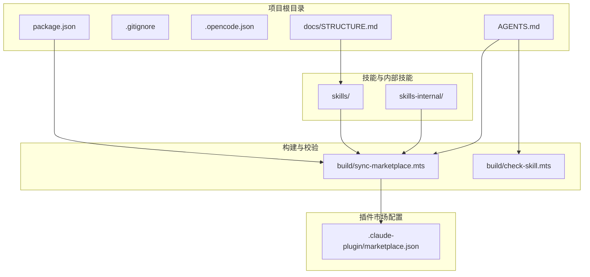
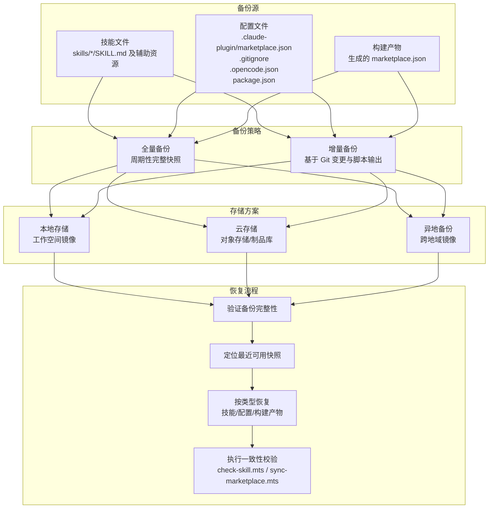
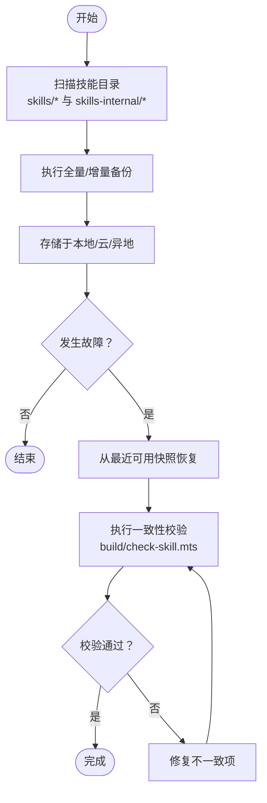
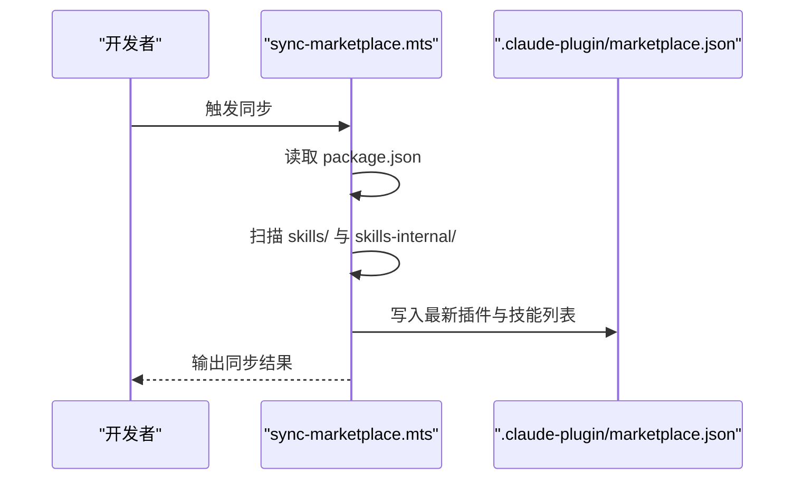
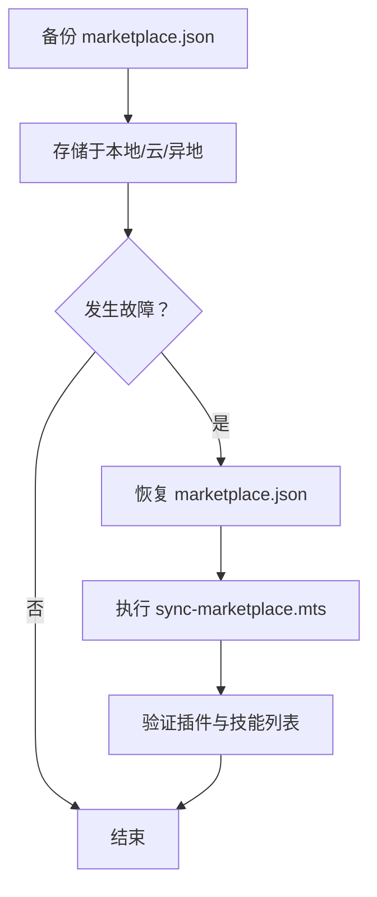
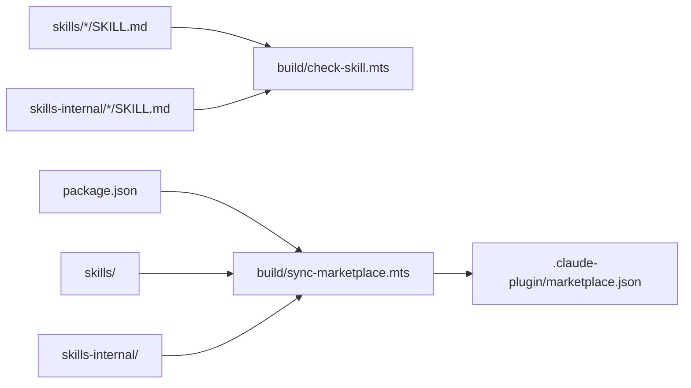

# 备份与恢复

<cite>
**本文引用的文件**
- [package.json](file://package.json)
- [.gitignore](file://.gitignore)
- [AGENTS.md](file://AGENTS.md)
- [docs/STRUCTURE.md](file://docs/STRUCTURE.md)
- [.claude-plugin/marketplace.json](file://.claude-plugin/marketplace.json)
- [build/check-skill.mts](file://build/check-skill.mts)
- [build/sync-marketplace.mts](file://build/sync-marketplace.mts)
- [.opencode.json](file://.opencode.json)
- [skills/yy-create-skill/SKILL.md](file://skills/yy-create-skill/SKILL.md)
- [skills/yy-create-skill/templates/skill-template.md](file://skills/yy-create-skill/templates/skill-template.md)
- [skills/yy-frontend-vue2-code-optimization/SKILL.md](file://skills/yy-frontend-vue2-code-optimization/SKILL.md)
- [skills/yy-mode-spec/templates/spec-template.md](file://skills/yy-mode-spec/templates/spec-template.md)
- [skills/yy-mode-spec/examples/output.md](file://skills/yy-mode-spec/examples/output.md)
</cite>

## 目录
1. [简介](#简介)
2. [项目结构](#项目结构)
3. [核心组件](#核心组件)
4. [架构总览](#架构总览)
5. [详细组件分析](#详细组件分析)
6. [依赖关系分析](#依赖关系分析)
7. [性能考量](#性能考量)
8. [故障排查指南](#故障排查指南)
9. [结论](#结论)
10. [附录](#附录)

## 简介
本文件面向仓库的备份与恢复策略，聚焦三类关键资产：技能文件（SKILL.md 及其配套资源）、配置文件（marketplace.json、.gitignore、.opencode.json 等）、以及构建产物（marketplace.json 的生成与同步）。文档提供定期备份计划的制定方法（全量与增量策略）、备份存储方案（本地/云/异地）、灾难恢复流程、备份验证与测试方法、版本控制在备份中的作用（Git 历史与元数据一致性校验）、以及恢复演练的组织与执行指南。

## 项目结构
该项目采用“技能即产物”的组织方式，核心目录与文件如下：
- 技能目录：skills/ 与 skills-internal/，每个技能以独立目录与 SKILL.md 为核心
- 配置与市场：.claude-plugin/marketplace.json 定义插件与技能分组
- 构建与校验：build/ 下的脚本负责技能元数据校验与 marketplace.json 同步
- 文档与规范：docs/STRUCTURE.md、AGENTS.md 等定义项目结构与开发规范
- 版本与忽略：package.json、.gitignore、.opencode.json 等

图表来源
- [docs/STRUCTURE.md:1-10](file://docs/STRUCTURE.md#L1-L10)
- [.claude-plugin/marketplace.json:1-65](file://.claude-plugin/marketplace.json#L1-L65)
- [build/sync-marketplace.mts:1-93](file://build/sync-marketplace.mts#L1-L93)
- [build/check-skill.mts:1-230](file://build/check-skill.mts#L1-L230)

章节来源
- [docs/STRUCTURE.md:1-10](file://docs/STRUCTURE.md#L1-L10)
- [.claude-plugin/marketplace.json:1-65](file://.claude-plugin/marketplace.json#L1-L65)

## 核心组件
- 技能文件与元数据
  - 每个技能以 SKILL.md 为核心，配合 examples/、templates/、resources/ 等辅助目录
  - 元数据一致性校验由 build/check-skill.mts 实现，确保 SKILL.md 与 metadata.json 的字段一致
- 插件市场配置
  - marketplace.json 由 build/sync-marketplace.mts 维护，同步 package.json 与技能目录变化
- 构建与校验脚本
  - check-skill.mts：遍历 skills/ 目录，校验 SKILL.md 格式与元数据一致性
  - sync-marketplace.mts：读取 package.json 与 skills/ 目录，生成/更新 marketplace.json
- 版本与忽略
  - package.json：项目元信息与脚本入口
  - .gitignore：排除构建产物与缓存目录，减少备份体积
  - .opencode.json：工具配置与指令集合

章节来源
- [build/check-skill.mts:1-230](file://build/check-skill.mts#L1-L230)
- [build/sync-marketplace.mts:1-93](file://build/sync-marketplace.mts#L1-L93)
- [package.json:1-46](file://package.json#L1-L46)
- [.gitignore:1-162](file://.gitignore#L1-L162)
- [.opencode.json:1-14](file://.opencode.json#L1-L14)

## 架构总览
备份与恢复体系围绕“技能文件、配置文件、构建产物”三类对象展开，结合 Git 历史与自动化脚本，形成可验证、可恢复、可审计的闭环。

## 详细组件分析

### 技能文件备份与恢复
- 备份范围
  - 技能目录：skills/* 与 skills-internal/* 下的 SKILL.md、metadata.json、examples/、templates/、resources/ 等
  - 元数据一致性：通过 build/check-skill.mts 校验 SKILL.md 与 metadata.json 的字段一致性
- 恢复步骤
  - 将技能目录恢复到原位置
  - 执行一致性校验脚本，修正不一致项
  - 验证技能在 IDE/工具链中的可用性

图表来源
- [build/check-skill.mts:177-230](file://build/check-skill.mts#L177-L230)

章节来源
- [build/check-skill.mts:1-230](file://build/check-skill.mts#L1-L230)

### 配置文件备份与恢复
- 备份范围
  - marketplace.json：由 sync-marketplace.mts 生成与维护
  - .gitignore：排除构建产物与缓存目录
  - .opencode.json：工具配置
  - package.json：项目元信息与脚本入口
- 恢复步骤
  - 恢复 marketplace.json、.gitignore、.opencode.json、package.json
  - 重新执行 sync-marketplace.mts，确保技能分组与版本同步
  - 验证 marketplace.json 的插件与技能列表正确性

图表来源
- [build/sync-marketplace.mts:12-93](file://build/sync-marketplace.mts#L12-L93)
- [.claude-plugin/marketplace.json:1-65](file://.claude-plugin/marketplace.json#L1-L65)

章节来源
- [build/sync-marketplace.mts:1-93](file://build/sync-marketplace.mts#L1-L93)
- [.claude-plugin/marketplace.json:1-65](file://.claude-plugin/marketplace.json#L1-L65)

### 构建产物备份与恢复
- 备份范围
  - marketplace.json：由 sync-marketplace.mts 生成
- 恢复步骤
  - 恢复 marketplace.json
  - 重新执行 sync-marketplace.mts，确保与 package.json、技能目录一致
  - 验证插件与技能列表正确性

图表来源
- [build/sync-marketplace.mts:85-93](file://build/sync-marketplace.mts#L85-L93)

章节来源
- [build/sync-marketplace.mts:1-93](file://build/sync-marketplace.mts#L1-L93)

### 版本控制在备份中的作用
- Git 历史追踪
  - 技能文件与配置文件均纳入 Git 管理，便于回溯与审计
  - .gitignore 排除构建产物与缓存，降低备份体积
- 元数据一致性校验
  - 通过 build/check-skill.mts 与 AGENTS.md 的质量门禁，确保 SKILL.md 与 metadata.json 的一致性
- 工具配置
  - .opencode.json 指令集合与 AGENTS.md 规范协同，确保变更可控

章节来源
- [.gitignore:1-162](file://.gitignore#L1-L162)
- [build/check-skill.mts:177-230](file://build/check-skill.mts#L177-L230)
- [AGENTS.md:11-25](file://AGENTS.md#L11-L25)
- [.opencode.json:1-14](file://.opencode.json#L1-L14)

### 恢复演练的组织与执行
- 演练目标
  - 熟悉从备份恢复技能文件、配置文件与构建产物的流程
  - 验证备份数据的完整性与可恢复性
- 演练步骤
  - 选定恢复目标（技能文件/配置文件/构建产物）
  - 从本地/云/异地存储中定位最近可用快照
  - 执行恢复操作并运行一致性校验脚本
  - 记录演练过程与问题，持续优化流程

章节来源
- [AGENTS.md:11-25](file://AGENTS.md#L11-L25)
- [build/check-skill.mts:177-230](file://build/check-skill.mts#L177-L230)
- [build/sync-marketplace.mts:85-93](file://build/sync-marketplace.mts#L85-L93)

## 依赖关系分析
- 技能文件依赖
  - SKILL.md 与 metadata.json 的一致性由 build/check-skill.mts 校验
  - 技能目录结构与命名规范由 AGENTS.md 与技能模板约束
- 配置文件依赖
  - marketplace.json 由 build/sync-marketplace.mts 维护，依赖 package.json 与 skills/ 目录
- 工具链依赖
  - package.json 中的脚本入口统一管理 lint、check、sync 等流程

图表来源
- [build/check-skill.mts:177-230](file://build/check-skill.mts#L177-L230)
- [build/sync-marketplace.mts:31-83](file://build/sync-marketplace.mts#L31-L83)
- [package.json:7-16](file://package.json#L7-L16)

章节来源
- [build/check-skill.mts:1-230](file://build/check-skill.mts#L1-L230)
- [build/sync-marketplace.mts:1-93](file://build/sync-marketplace.mts#L1-L93)
- [package.json:1-46](file://package.json#L1-L46)

## 性能考量
- 备份体积控制
  - 使用 .gitignore 排除构建产物与缓存目录，减少备份数据量
- 备份速度优化
  - 增量备份优先：基于 Git 变更与脚本输出差异，避免重复备份
- 恢复效率
  - 通过自动化脚本（check-skill.mts、sync-marketplace.mts）快速验证与重建

章节来源
- [.gitignore:1-162](file://.gitignore#L1-L162)
- [build/check-skill.mts:177-230](file://build/check-skill.mts#L177-L230)
- [build/sync-marketplace.mts:85-93](file://build/sync-marketplace.mts#L85-L93)

## 故障排查指南
- 技能文件一致性问题
  - 现象：metadata.json 与 SKILL.md 字段不一致
  - 处理：运行 build/check-skill.mts，按警告建议更新 metadata.json
- marketplace.json 异常
  - 现象：插件或技能列表缺失/顺序异常
  - 处理：重新执行 build/sync-marketplace.mts，确保与 package.json、skills/ 目录一致
- 构建产物丢失
  - 现象：marketplace.json 不可用
  - 处理：恢复 marketplace.json 后，重新执行 sync-marketplace.mts 重建

章节来源
- [build/check-skill.mts:127-172](file://build/check-skill.mts#L127-L172)
- [build/sync-marketplace.mts:85-93](file://build/sync-marketplace.mts#L85-L93)

## 结论
本仓库以“技能即产物”的理念，将技能文件、配置文件与构建产物纳入统一的备份与恢复体系。通过 Git 历史与自动化脚本（check-skill.mts、sync-marketplace.mts），实现可验证、可恢复、可审计的备份策略。建议结合全量与增量备份，采用本地/云/异地三层存储，定期开展恢复演练，确保业务连续性与数据安全。

## 附录
- 备份计划制定要点
  - 全量备份：建议按月执行，覆盖技能文件、配置文件与构建产物
  - 增量备份：建议按日执行，基于 Git 变更与脚本输出差异
  - 存储策略：本地用于快速恢复，云存储用于长期保存，异地存储用于灾难恢复
- 备份验证清单
  - 技能文件：运行 build/check-skill.mts，确保无错误与警告
  - 配置文件：执行 build/sync-marketplace.mts，验证 marketplace.json 正确性
  - 构建产物：核对插件与技能列表，确保与 package.json、skills/ 目录一致

章节来源
- [build/check-skill.mts:177-230](file://build/check-skill.mts#L177-L230)
- [build/sync-marketplace.mts:85-93](file://build/sync-marketplace.mts#L85-L93)
- [package.json:7-16](file://package.json#L7-L16)