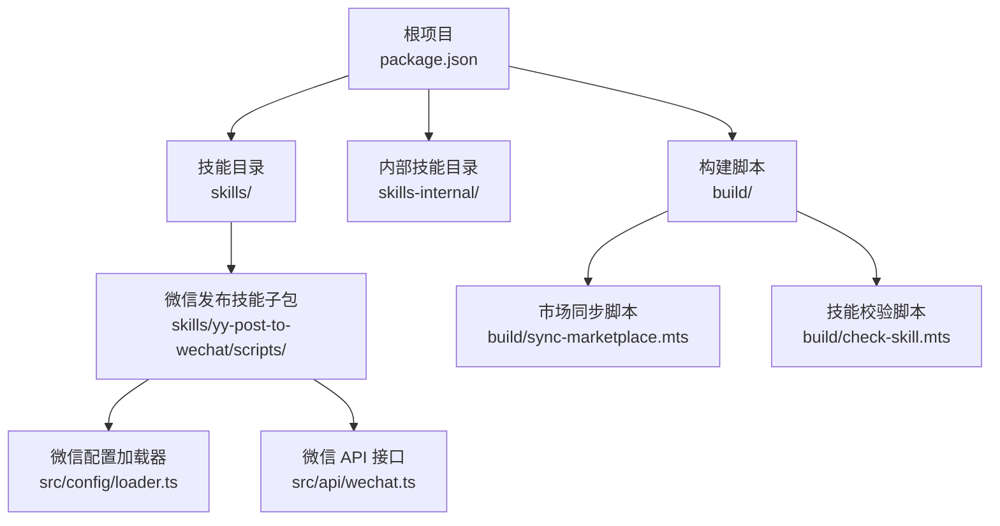
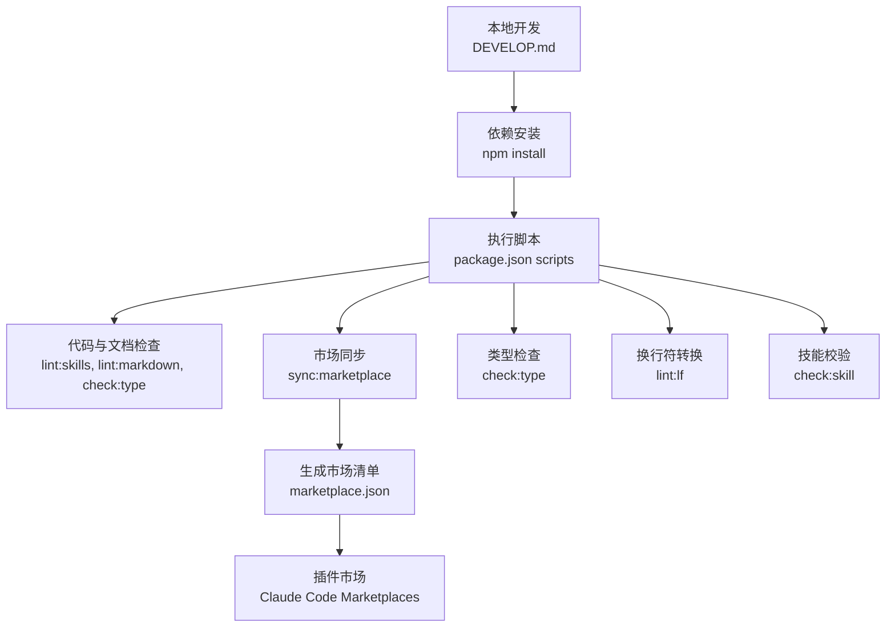
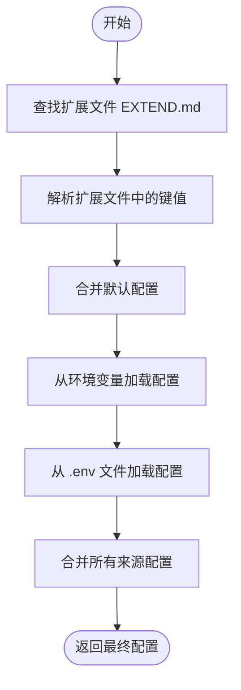
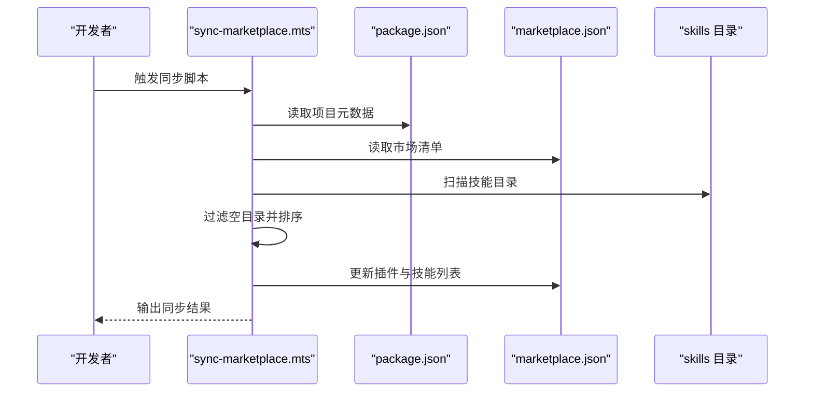
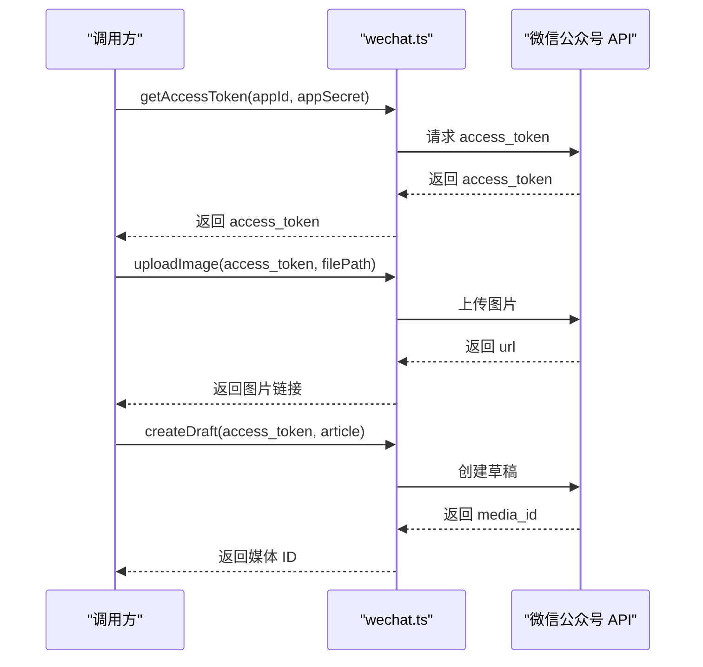
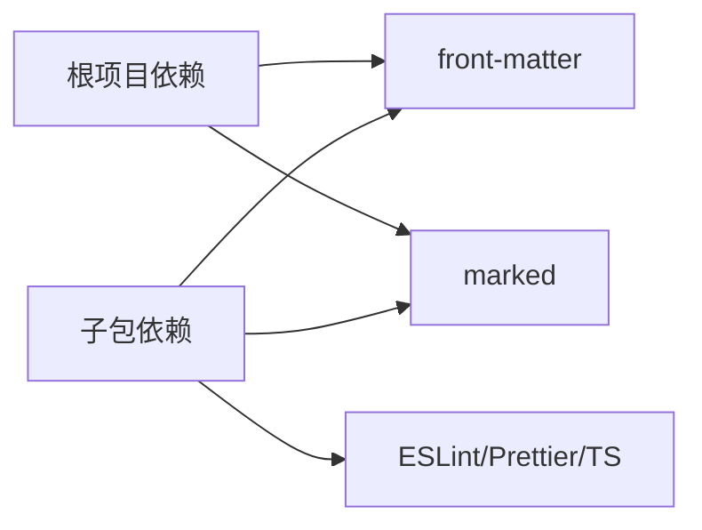

# 环境部署

<cite>
**本文引用的文件**
- [package.json](file://package.json)
- [tsconfig.json](file://tsconfig.json)
- [DEVELOP.md](file://docs/DEVELOP.md)
- [CLAUDE_CODE_SKILL.md](file://docs/CLAUDE_CODE_SKILL.md)
- [yy-post-to-wechat 包 package.json](file://skills/yy-post-to-wechat/scripts/package.json)
- [微信配置加载器 loader.ts](file://skills/yy-post-to-wechat/scripts/src/config/loader.ts)
- [微信 API 接口 wechat.ts](file://skills/yy-post-to-wechat/scripts/src/api/wechat.ts)
- [技能校验脚本 check-skill.mts](file://build/check-skill.mts)
- [市场同步脚本 sync-marketplace.mts](file://build/sync-marketplace.mts)
- [微信配置类型定义 config.d.ts](file://skills/yy-post-to-wechat/scripts/src/typings/config.d.ts)
</cite>

## 目录
1. [简介](#简介)
2. [项目结构](#项目结构)
3. [核心组件](#核心组件)
4. [架构总览](#架构总览)
5. [详细组件分析](#详细组件分析)
6. [依赖分析](#依赖分析)
7. [性能考虑](#性能考虑)
8. [故障排查指南](#故障排查指南)
9. [结论](#结论)
10. [附录](#附录)

## 简介
本指南面向生产环境与本地开发的部署与运维，覆盖服务器硬件与软件要求、依赖安装、环境变量配置、Docker 容器化部署、CI/CD 流水线设置以及多平台兼容性注意事项。同时提供针对市场同步与微信公众号发布能力的专项配置说明。

## 项目结构
该项目采用多包与脚本驱动的组织方式：
- 根级 package.json 定义统一的开发与校验脚本，包含市场同步、类型检查、Markdown Lint、LF 转换与技能校验等任务。
- skills 与 skills-internal 目录分别存放公开与私有技能文档与元数据。
- 微信发布技能子包位于 skills/yy-post-to-wechat/scripts，包含独立的 Node.js 引擎版本要求与 TypeScript 配置。
- build 目录包含市场同步与技能校验工具脚本。

**图表来源**
- [package.json:1-46](file://package.json#L1-L46)
- [skills/yy-post-to-wechat/scripts/package.json:1-29](file://skills/yy-post-to-wechat/scripts/package.json#L1-L29)
- [build/sync-marketplace.mts:1-93](file://build/sync-marketplace.mts#L1-L93)
- [build/check-skill.mts:1-230](file://build/check-skill.mts#L1-L230)

**章节来源**
- [package.json:1-46](file://package.json#L1-L46)
- [DEVELOP.md:1-18](file://docs/DEVELOP.md#L1-L18)

## 核心组件
- 依赖管理与脚本
  - 根级脚本涵盖 lint、类型检查、Markdown Lint、LF 转换、市场同步与技能安装等。
  - 微信发布子包独立维护 Node.js 引擎版本要求与开发工具链。
- 配置加载与认证
  - 支持从扩展文件、环境变量与 .env 文件加载配置，优先级与容错策略明确。
  - 微信公众号 API 需要应用 ID 与应用密钥。
- 市场同步与技能校验
  - 自动扫描技能目录，生成/更新市场清单；校验 SKILL.md 与 metadata.json 的一致性。

**章节来源**
- [package.json:7-16](file://package.json#L7-L16)
- [yy-post-to-wechat 包 package.json:6-8](file://skills/yy-post-to-wechat/scripts/package.json#L6-L8)
- [微信配置加载器 loader.ts:130-149](file://skills/yy-post-to-wechat/scripts/src/config/loader.ts#L130-L149)
- [技能校验脚本 check-skill.mts:50-122](file://build/check-skill.mts#L50-L122)
- [市场同步脚本 sync-marketplace.mts:31-83](file://build/sync-marketplace.mts#L31-L83)

## 架构总览
下图展示从本地开发到生产部署的关键路径：本地调试、依赖安装、环境变量注入、脚本执行与市场同步。

**图表来源**
- [DEVELOP.md:8-12](file://docs/DEVELOP.md#L8-L12)
- [package.json:7-16](file://package.json#L7-L16)
- [市场同步脚本 sync-marketplace.mts:1-93](file://build/sync-marketplace.mts#L1-L93)
- [CLAUDE_CODE_SKILL.md:1-10](file://docs/CLAUDE_CODE_SKILL.md#L1-L10)

## 详细组件分析

### 服务器与运行时要求
- Node.js 版本
  - 根项目使用 ES2022 模块目标与打包器解析，建议使用较新的 LTS 版本以获得稳定生态支持。
  - 微信发布子包明确要求 Node.js 版本不低于指定版本，生产环境需满足此最低版本。
- 内存与存储
  - 仓库主要为文档与脚本，无显著内存占用；建议为 CI/CD 缓存与日志保留充足磁盘空间。
- 平台兼容性
  - 使用 ES2022 与 NodeNext 模块解析，建议在 Linux/macOS/Windows 上均使用相同 Node.js 版本以避免差异。

**章节来源**
- [tsconfig.json:2-13](file://tsconfig.json#L2-L13)
- [yy-post-to-wechat 包 package.json:6-8](file://skills/yy-post-to-wechat/scripts/package.json#L6-L8)

### 依赖安装与环境准备
- 安装命令
  - 使用 npm 安装根项目依赖，随后进入微信发布子包目录执行安装。
- 依赖项说明
  - 根项目包含文档解析与 Markdown 处理相关依赖。
  - 子包包含前端内容解析、Markdown 渲染、ESLint、Prettier、TypeScript 等开发工具。

**章节来源**
- [package.json:41-44](file://package.json#L41-L44)
- [yy-post-to-wechat 包 package.json:16-27](file://skills/yy-post-to-wechat/scripts/package.json#L16-L27)

### 环境变量与认证配置
- 配置来源与优先级
  - 默认配置 → 扩展文件 → .env 文件 → 环境变量。
- 关键变量（微信）
  - WECHAT_APP_ID：微信公众号应用 ID。
  - WECHAT_APP_SECRET：微信公众号应用密钥。
- 配置文件位置
  - 当前工作目录下的 .yy-skills/.env。
  - 用户主目录下的 .yy-skills/.env。
  - 项目根目录下的 .env。
- 配置加载流程

**图表来源**
- [微信配置加载器 loader.ts:20-145](file://skills/yy-post-to-wechat/scripts/src/config/loader.ts#L20-L145)

**章节来源**
- [微信配置加载器 loader.ts:79-128](file://skills/yy-post-to-wechat/scripts/src/config/loader.ts#L79-L128)
- [微信配置类型定义 config.d.ts:7-15](file://skills/yy-post-to-wechat/scripts/src/typings/config.d.ts#L7-L15)

### 生产部署与市场同步
- 市场同步流程
  - 读取 package.json 与 marketplace.json，同步名称、版本、描述与作者。
  - 扫描 skills 与 skills-internal 目录，过滤空目录并排序，生成插件清单。
  - 写回 marketplace.json。
- 市场同步序列

**图表来源**
- [市场同步脚本 sync-marketplace.mts:12-93](file://build/sync-marketplace.mts#L12-L93)

**章节来源**
- [市场同步脚本 sync-marketplace.mts:18-83](file://build/sync-marketplace.mts#L18-L83)

### 微信公众号发布流程
- 关键接口
  - 获取 Access Token。
  - 上传图片与封面素材。
  - 创建草稿并返回媒体 ID。
- 错误处理
  - 对微信 API 返回的错误码与消息进行抛错，便于上层捕获与记录。
- 发布序列

**图表来源**
- [微信 API 接口 wechat.ts:4-105](file://skills/yy-post-to-wechat/scripts/src/api/wechat.ts#L4-L105)

**章节来源**
- [微信 API 接口 wechat.ts:4-105](file://skills/yy-post-to-wechat/scripts/src/api/wechat.ts#L4-L105)

### 本地开发环境搭建
- 步骤概览
  - 克隆仓库后安装根项目依赖。
  - 进入微信发布子包目录安装其依赖。
  - 配置环境变量或 .env 文件。
  - 执行本地调试命令以加载技能。
- 注意事项
  - 本地调试会生成特定文件，已在忽略列表中配置，避免提交到版本库。

**章节来源**
- [DEVELOP.md:8-17](file://docs/DEVELOP.md#L8-L17)

### Docker 容器化部署方案
- 基础镜像与 Node.js 版本
  - 基于官方 Node.js 镜像，版本需满足子包的最低要求。
- 工作目录与依赖安装
  - 设置工作目录，复制依赖文件后执行安装。
- 构建与运行
  - 构建阶段执行必要的脚本（如类型检查、市场同步），运行阶段暴露必要端口或执行任务。
- 常见做法
  - 使用 .dockerignore 忽略 node_modules、构建产物与日志。
  - 将环境变量通过 Docker 环境注入或挂载 .env 文件。

[本节为通用容器化建议，未直接分析具体文件，故不附加“章节来源”]

### CI/CD 流水线配置
- GitHub Actions 示例要点
  - 触发条件：push 到主分支或标签。
  - 步骤：设置 Node.js 版本（满足最低要求）、安装依赖、执行类型检查与 Lint、运行技能校验与市场同步、缓存与制品归档。
  - 安全：使用加密的仓库密钥注入环境变量，避免硬编码。
- 其他 CI 工具
  - 保持与 GitHub Actions 相同的步骤与触发条件，调整平台特定语法。

[本节为通用流水线建议，未直接分析具体文件，故不附加“章节来源”]

### 不同操作系统下的部署注意事项
- Linux/macOS
  - 使用相同 Node.js 版本，注意文件权限与符号链接。
- Windows
  - 使用 WSL 或 PowerShell，确保换行符与路径分隔符一致。
- 兼容性
  - 严格遵循 ES2022 与 NodeNext 模块解析，避免使用实验性特性。

[本节为通用兼容性建议，未直接分析具体文件，故不附加“章节来源”]

## 依赖分析
- 根项目依赖
  - 文档解析与 Markdown 处理相关依赖，服务于技能文档与市场同步。
- 子包依赖
  - 前端内容解析、Markdown 渲染、ESLint、Prettier、TypeScript 等，支撑微信发布功能的开发与质量保障。
- 脚本依赖
  - 类型检查、Markdown Lint、LF 转换与技能校验脚本共同构成质量门禁。

**图表来源**
- [package.json:41-44](file://package.json#L41-L44)
- [yy-post-to-wechat 包 package.json:16-27](file://skills/yy-post-to-wechat/scripts/package.json#L16-L27)

**章节来源**
- [package.json:41-44](file://package.json#L41-L44)
- [yy-post-to-wechat 包 package.json:16-27](file://skills/yy-post-to-wechat/scripts/package.json#L16-L27)

## 性能考虑
- 依赖安装
  - 使用缓存策略减少重复安装时间，优先使用更快的包管理器。
- 脚本执行
  - 并行执行独立任务（如 Lint、类型检查），缩短流水线时间。
- 市场同步
  - 仅在必要时运行，避免频繁扫描目录与写入文件。

[本节提供通用性能建议，未直接分析具体文件，故不附加“章节来源”]

## 故障排查指南
- 环境变量缺失
  - 确认 WECHAT_APP_ID 与 WECHAT_APP_SECRET 是否正确注入至环境变量或 .env 文件。
- 配置加载失败
  - 检查扩展文件与 .env 文件格式，确保键名大小写与格式正确。
- 市场同步异常
  - 确认 skills 与 skills-internal 目录结构与权限，检查 marketplace.json 写入权限。
- 技能校验失败
  - 按照校验脚本输出修复 SKILL.md 与 metadata.json 的不一致问题。

**章节来源**
- [微信配置加载器 loader.ts:130-149](file://skills/yy-post-to-wechat/scripts/src/config/loader.ts#L130-L149)
- [市场同步脚本 sync-marketplace.mts:31-83](file://build/sync-marketplace.mts#L31-L83)
- [技能校验脚本 check-skill.mts:177-226](file://build/check-skill.mts#L177-L226)

## 结论
本指南提供了从服务器要求、依赖安装、环境变量配置到 Docker 与 CI/CD 的完整部署路径，并结合微信发布与市场同步的实际场景给出可操作的配置与排障建议。建议在生产环境中严格遵循版本与兼容性要求，配合自动化流水线与质量门禁，确保部署的一致性与可靠性。

## 附录
- 插件市场安装指引
  - 通过 Claude Code 的 Marketplaces 功能添加并安装插件市场，再选择所需技能进行安装。

**章节来源**
- [CLAUDE_CODE_SKILL.md:1-10](file://docs/CLAUDE_CODE_SKILL.md#L1-L10)