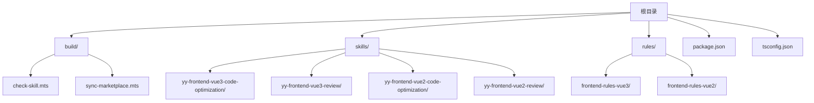
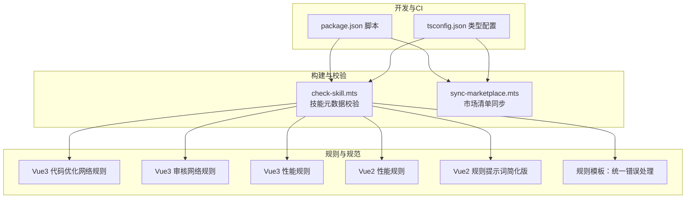
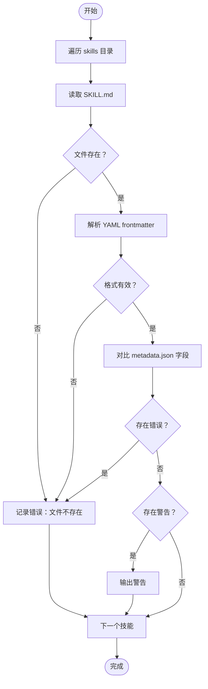
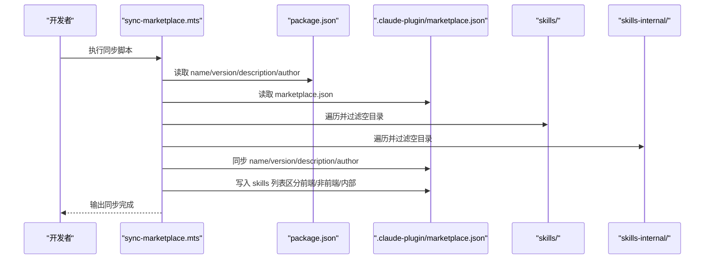
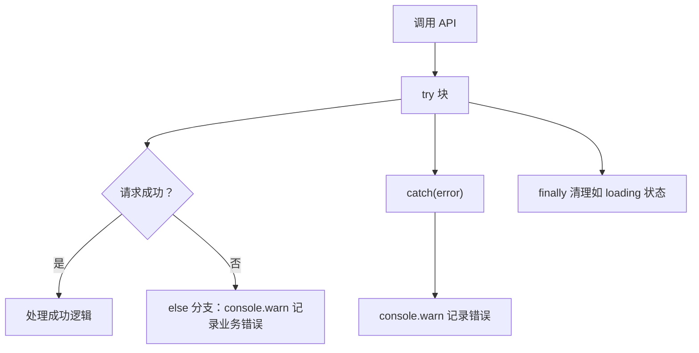
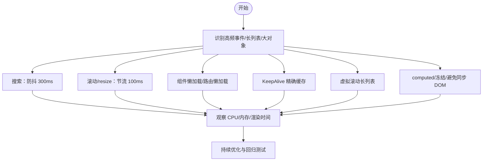
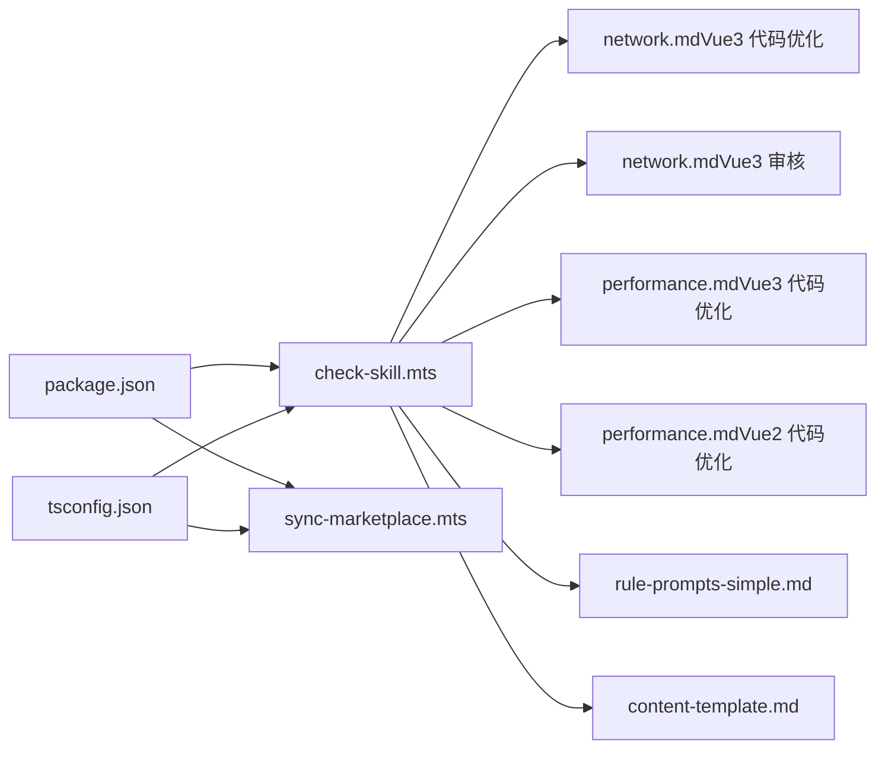

# 监控与日志

<cite>
**本文引用的文件**
- [package.json](file://package.json)
- [tsconfig.json](file://tsconfig.json)
- [check-skill.mts](file://build/check-skill.mts)
- [sync-marketplace.mts](file://build/sync-marketplace.mts)
- [network.md（Vue3 代码优化规则）](file://skills/yy-frontend-vue3-code-optimization/rules/network.md)
- [network.md（Vue3 审核规则）](file://skills/yy-frontend-vue3-review/rules/network.md)
- [network-request.md（Vue3 审核参考）](file://skills/yy-frontend-vue3-review/references/network-request.md)
- [performance.md（Vue3 代码优化规则）](file://skills/yy-frontend-vue3-code-optimization/rules/performance.md)
- [performance.md（Vue3 审核规则）](file://skills/yy-frontend-vue3-review/rules/performance.md)
- [performance.md（Vue2 代码优化规则）](file://skills/yy-frontend-vue2-code-optimization/rules/performance.md)
- [performance.md（Vue2 审核规则）](file://skills/yy-frontend-vue2-review/rules/performance.md)
- [rule-prompts-simple.md（Vue2 提示词简化版）](file://rules/frontend-rules-vue2/prompts/rule-prompts-simple.md)
- [content-template.md（规则模板）](file://skills/yy-create-rule/resources/content-template.md)
</cite>

## 目录
1. [简介](#简介)
2. [项目结构](#项目结构)
3. [核心组件](#核心组件)
4. [架构总览](#架构总览)
5. [详细组件分析](#详细组件分析)
6. [依赖分析](#依赖分析)
7. [性能考虑](#性能考虑)
8. [故障排查指南](#故障排查指南)
9. [结论](#结论)
10. [附录](#附录)

## 简介
本文件面向该代码库的监控与日志体系，聚焦以下目标：
- 日志配置选项：日志级别、输出格式与文件轮转策略
- 性能指标采集：构建时间、技能检查耗时、市场同步状态
- 错误追踪与告警：异常捕获、错误报告与通知机制
- 健康检查端点：为 Kubernetes/容器编排平台准备的就绪探针
- 日志分析工具：grep、awk 与日志聚合工具的使用方法
- 监控仪表板：关键指标可视化示例
- 远程日志收集与集中化管理最佳实践

当前仓库未内置专用的日志库或监控服务，但通过脚本与规则文档体现了日志与错误处理的实践路径。本文据此给出可落地的配置与实施建议。

## 项目结构
围绕监控与日志，仓库的关键位置如下：
- 构建与同步脚本位于 build 目录，负责技能元数据校验与市场清单同步
- 规则与参考文档位于 skills 与 rules 目录，体现前端网络请求与性能相关规范
- 根级配置文件 package.json 与 tsconfig.json 提供脚本与类型检查基础

图表来源
- [check-skill.mts](file://build/check-skill.mts)
- [sync-marketplace.mts](file://build/sync-marketplace.mts)
- [package.json](file://package.json)
- [tsconfig.json](file://tsconfig.json)

章节来源
- [package.json:1-46](file://package.json#L1-L46)
- [tsconfig.json:1-23](file://tsconfig.json#L1-L23)

## 核心组件
- 构建与校验脚本
  - 技能元数据校验：检查 SKILL.md 的 frontmatter、字段一致性与 metadata.json 对比
  - 市场清单同步：从 package.json 与 skills 目录同步 marketplace.json
- 规则与参考
  - 网络请求与错误处理规范：统一 try/catch/finally、禁止空 catch、业务错误 warn 记录
  - 性能优化规范：防抖/节流、懒加载、KeepAlive、虚拟滚动等，降低资源消耗
- 日志与告警实践
  - 统一错误处理与日志记录：全局错误处理器、warn 记录、必要时上报
  - 健康检查端点：为容器编排准备的就绪探针

章节来源
- [check-skill.mts:177-230](file://build/check-skill.mts#L177-L230)
- [sync-marketplace.mts:12-93](file://build/sync-marketplace.mts#L12-L93)
- [network.md（Vue3 代码优化规则）:113-149](file://skills/yy-frontend-vue3-code-optimization/rules/network.md#L113-L149)
- [network.md（Vue3 审核规则）:113-149](file://skills/yy-frontend-vue3-review/rules/network.md#L113-L149)

## 架构总览
下图展示监控与日志在仓库中的角色与交互：

图表来源
- [package.json:7-16](file://package.json#L7-L16)
- [tsconfig.json:2-13](file://tsconfig.json#L2-L13)
- [check-skill.mts:177-230](file://build/check-skill.mts#L177-L230)
- [sync-marketplace.mts:12-93](file://build/sync-marketplace.mts#L12-L93)
- [network.md（Vue3 代码优化规则）:113-149](file://skills/yy-frontend-vue3-code-optimization/rules/network.md#L113-L149)
- [network.md（Vue3 审核规则）:113-149](file://skills/yy-frontend-vue3-review/rules/network.md#L113-L149)
- [performance.md（Vue3 代码优化规则）:1-72](file://skills/yy-frontend-vue3-code-optimization/rules/performance.md#L1-L72)
- [performance.md（Vue2 代码优化规则）:1-133](file://skills/yy-frontend-vue2-code-optimization/rules/performance.md#L1-L133)
- [rule-prompts-simple.md:385-413](file://rules/frontend-rules-vue2/prompts/rule-prompts-simple.md#L385-L413)
- [content-template.md:92-122](file://skills/yy-create-rule/resources/content-template.md#L92-L122)

## 详细组件分析

### 组件A：技能元数据校验（check-skill.mts）
职责与流程
- 读取 skills 目录下每个技能的 SKILL.md 与 metadata.json
- 校验 frontmatter 格式与必填字段，比较 description 与 abstract、author 与 metadata.author、version 与 metadata.version
- 输出错误与警告，并在错误存在时退出进程

图表来源
- [check-skill.mts:50-172](file://build/check-skill.mts#L50-L172)

章节来源
- [check-skill.mts:177-230](file://build/check-skill.mts#L177-L230)

### 组件B：市场清单同步（sync-marketplace.mts）
职责与流程
- 从 package.json 读取项目元信息，同步至 marketplace.json
- 扫描 skills 与 skills-internal 目录，过滤空目录并排序
- 将前端与非前端技能分别写入对应插件条目
- 写回 marketplace.json 并输出同步结果

图表来源
- [sync-marketplace.mts:12-93](file://build/sync-marketplace.mts#L12-L93)

章节来源
- [sync-marketplace.mts:12-93](file://build/sync-marketplace.mts#L12-L93)

### 组件C：网络请求与错误处理规范
- 统一使用 async/await + try/catch/finally
- 禁止空 catch，捕获后必须记录
- 业务错误在 else 分支中使用 console.warn 记录
- 可结合全局错误处理器进行统一上报

图表来源
- [network.md（Vue3 代码优化规则）:113-149](file://skills/yy-frontend-vue3-code-optimization/rules/network.md#L113-L149)
- [network.md（Vue3 审核规则）:113-149](file://skills/yy-frontend-vue3-review/rules/network.md#L113-L149)
- [network-request.md（Vue3 审核参考）:16-38](file://skills/yy-frontend-vue3-review/references/network-request.md#L16-L38)
- [content-template.md:92-122](file://skills/yy-create-rule/resources/content-template.md#L92-L122)

章节来源
- [network.md（Vue3 代码优化规则）:77-149](file://skills/yy-frontend-vue3-code-optimization/rules/network.md#L77-L149)
- [network.md（Vue3 审核规则）:77-149](file://skills/yy-frontend-vue3-review/rules/network.md#L77-L149)
- [network-request.md（Vue3 审核参考）:1-39](file://skills/yy-frontend-vue3-review/references/network-request.md#L1-L39)
- [content-template.md:92-122](file://skills/yy-create-rule/resources/content-template.md#L92-L122)

### 组件D：性能指标采集与优化
- 防抖/节流：搜索（防抖 300ms）、滚动（节流 100ms）、窗口 resize（节流）
- 组件懒加载与 KeepAlive：减少初始包体与重复渲染
- 虚拟滚动：长列表仅渲染可视区域
- 响应式性能：computed 派生、大数据 Object.freeze、避免在 watch 中同步 DOM 操作

图表来源
- [performance.md（Vue3 代码优化规则）:1-72](file://skills/yy-frontend-vue3-code-optimization/rules/performance.md#L1-L72)
- [performance.md（Vue3 审核规则）:1-72](file://skills/yy-frontend-vue3-review/rules/performance.md#L1-L72)
- [performance.md（Vue2 代码优化规则）:1-133](file://skills/yy-frontend-vue2-code-optimization/rules/performance.md#L1-L133)
- [performance.md（Vue2 审核规则）:1-133](file://skills/yy-frontend-vue2-review/rules/performance.md#L1-L133)
- [rule-prompts-simple.md:385-413](file://rules/frontend-rules-vue2/prompts/rule-prompts-simple.md#L385-L413)

章节来源
- [performance.md（Vue3 代码优化规则）:1-72](file://skills/yy-frontend-vue3-code-optimization/rules/performance.md#L1-L72)
- [performance.md（Vue2 代码优化规则）:1-133](file://skills/yy-frontend-vue2-code-optimization/rules/performance.md#L1-L133)
- [rule-prompts-simple.md:385-413](file://rules/frontend-rules-vue2/prompts/rule-prompts-simple.md#L385-L413)

## 依赖分析
- 脚本依赖
  - package.json 的脚本命令驱动构建与同步流程
  - tsconfig.json 的编译选项影响脚本运行时行为
- 规则依赖
  - 网络与性能规则相互补充，共同指导前端性能与稳定性
  - 规则模板强调统一错误处理与日志记录

图表来源
- [package.json:7-16](file://package.json#L7-L16)
- [tsconfig.json:2-13](file://tsconfig.json#L2-L13)
- [check-skill.mts:177-230](file://build/check-skill.mts#L177-L230)
- [network.md（Vue3 代码优化规则）:113-149](file://skills/yy-frontend-vue3-code-optimization/rules/network.md#L113-L149)
- [network.md（Vue3 审核规则）:113-149](file://skills/yy-frontend-vue3-review/rules/network.md#L113-L149)
- [performance.md（Vue3 代码优化规则）:1-72](file://skills/yy-frontend-vue3-code-optimization/rules/performance.md#L1-L72)
- [performance.md（Vue2 代码优化规则）:1-133](file://skills/yy-frontend-vue2-code-optimization/rules/performance.md#L1-L133)
- [rule-prompts-simple.md:385-413](file://rules/frontend-rules-vue2/prompts/rule-prompts-simple.md#L385-L413)
- [content-template.md:92-122](file://skills/yy-create-rule/resources/content-template.md#L92-L122)

章节来源
- [package.json:7-16](file://package.json#L7-L16)
- [tsconfig.json:2-13](file://tsconfig.json#L2-L13)

## 性能考虑
- 构建时间
  - 使用 TypeScript 编译与 lint 脚本，建议在 CI 中缓存依赖与并行执行
  - 通过规则减少不必要的渲染与请求，间接缩短构建与运行时耗时
- 技能检查耗时
  - check-skill.mts 对每个技能逐项校验，建议在 CI 中分批执行并缓存中间结果
- 市场同步状态
  - sync-marketplace.mts 读取目录与写回文件，建议在变更较少时触发，避免频繁 IO

## 故障排查指南
- 技能元数据校验失败
  - 检查 SKILL.md frontmatter 格式与必填字段
  - 对比 metadata.json 的 abstract/author/version 与 SKILL.md 的 description/metadata.author/metadata.version
- 市场清单不同步
  - 确认 package.json 的 name/version/description/author 与 marketplace.json 对应字段一致
  - 检查 skills 与 skills-internal 目录是否包含空目录被删除
- 网络请求错误
  - 统一使用 try/catch/finally，避免空 catch
  - 业务错误在 else 分支中记录 warn 日志
- 性能问题
  - 应用防抖/节流、懒加载、KeepAlive 与虚拟滚动
  - 使用 computed 与冻结大对象，避免在 watch 中同步 DOM 操作

章节来源
- [check-skill.mts:177-230](file://build/check-skill.mts#L177-L230)
- [sync-marketplace.mts:12-93](file://build/sync-marketplace.mts#L12-L93)
- [network.md（Vue3 代码优化规则）:113-149](file://skills/yy-frontend-vue3-code-optimization/rules/network.md#L113-L149)
- [performance.md（Vue3 代码优化规则）:1-72](file://skills/yy-frontend-vue3-code-optimization/rules/performance.md#L1-L72)

## 结论
本仓库通过脚本与规则文档，提供了日志与错误处理的实践路径，并为性能优化与健康检查提供了明确规范。建议在此基础上引入标准化的日志库与监控系统，以实现更完善的可观测性与自动化运维。

## 附录

### 日志配置选项（建议）
- 日志级别
  - debug/info/warn/error，按环境切换
- 输出格式
  - JSON 格式便于机器解析与聚合
  - 包含时间戳、级别、模块、消息与上下文字段
- 文件轮转策略
  - 基于大小轮转与时间轮转，保留 N 天/文件数量

### 性能指标采集（建议）
- 构建时间：统计 npm/yarn 脚本执行耗时
- 技能检查耗时：记录 check-skill.mts 每个技能校验耗时
- 市场同步状态：记录 sync-marketplace.mts 的同步耗时与变更数量

### 错误追踪与告警（建议）
- 异常捕获：统一 try/catch/finally，禁止空 catch
- 错误报告：warn 记录 + 上报到统一错误平台
- 通知机制：结合 CI/CD 在失败时发送通知

### 健康检查端点（建议）
- 就绪探针：检查关键依赖可用性与本地服务状态
- 就绪条件：技能清单可用、市场同步完成、核心脚本可执行

### 日志分析工具使用（建议）
- grep/awk：快速筛选关键字、统计错误频次
- 日志聚合：集中化收集与索引，支持检索与告警

### 监控仪表板配置示例（建议）
- 关键指标：错误率、平均响应时间、吞吐量、资源占用
- 可视化：折线图、柱状图、热力图

### 远程日志收集与集中化管理（建议）
- 采集：Agent 收集 stdout/stderr 与文件日志
- 传输：TLS 加密，批量与压缩
- 存储：分层存储，冷热分离
- 查询：全文检索与结构化字段查询