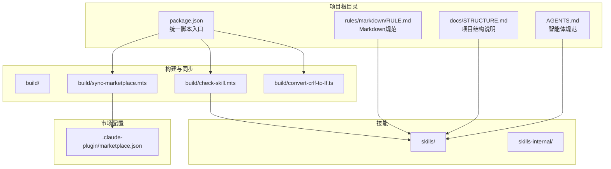
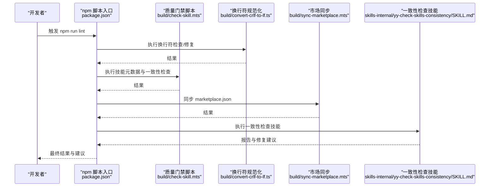
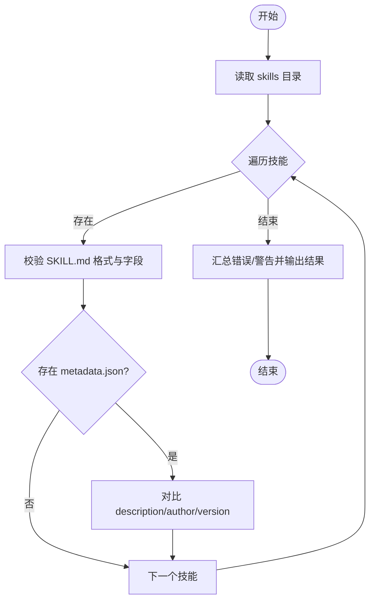
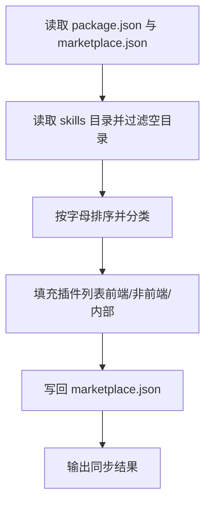
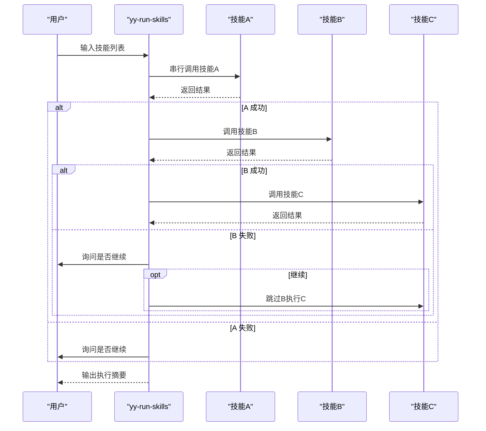
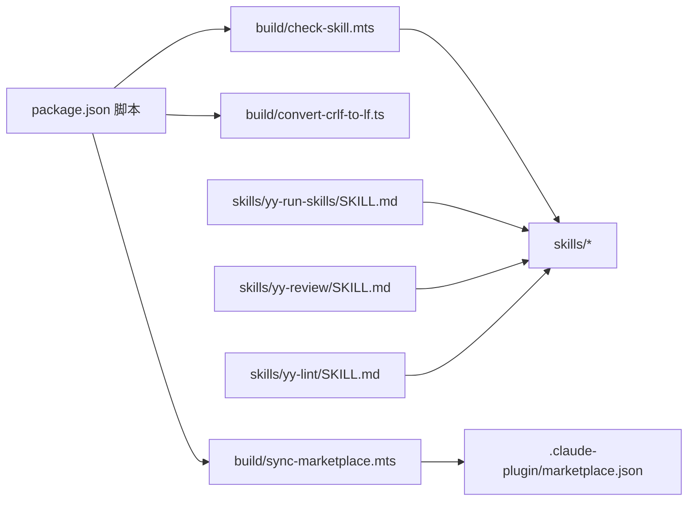

# 运维自动化

<cite>
**本文档引用的文件**
- [package.json](file://package.json)
- [AGENTS.md](file://AGENTS.md)
- [CLAUDE.md](file://CLAUDE.md)
- [docs/STRUCTURE.md](file://docs/STRUCTURE.md)
- [rules/markdown/RULE.md](file://rules/markdown/RULE.md)
- [skills/yy-run-skills/SKILL.md](file://skills/yy-run-skills/SKILL.md)
- [skills/yy-lint/SKILL.md](file://skills/yy-lint/SKILL.md)
- [skills/yy-review/SKILL.md](file://skills/yy-review/SKILL.md)
- [skills/yy-create-skill/SKILL.md](file://skills/yy-create-skill/SKILL.md)
- [skills/yy-post-to-wechat/scripts/src/cli.ts](file://skills/yy-post-to-wechat/scripts/src/cli.ts)
- [skills/yy-post-to-wechat/scripts/package.json](file://skills/yy-post-to-wechat/scripts/package.json)
- [build/check-skill.mts](file://build/check-skill.mts)
- [build/sync-marketplace.mts](file://build/sync-marketplace.mts)
- [build/convert-crlf-to-lf.ts](file://build/convert-crlf-to-lf.ts)
- [skills-internal/yy-check-skills-consistency/SKILL.md](file://skills-internal/yy-check-skills-consistency/SKILL.md)
</cite>

## 目录
1. [简介](#简介)
2. [项目结构](#项目结构)
3. [核心组件](#核心组件)
4. [架构总览](#架构总览)
5. [详细组件分析](#详细组件分析)
6. [依赖分析](#依赖分析)
7. [性能考虑](#性能考虑)
8. [故障排查指南](#故障排查指南)
9. [结论](#结论)
10. [附录](#附录)

## 简介
本指南围绕“运维自动化”的目标，结合仓库内的技能与构建脚本，系统阐述如何通过标准化的技能与自动化流程实现：
- 一键部署、回滚与扩缩容的自动化编排
- 监控脚本的配置与告警联动
- 维护工具的使用与代码质量保障
- 定时任务的配置与执行
- 运维机器人与自动化工具的集成
- 自动化测试与权限安全控制

仓库以“技能”为核心产物，配合构建与同步脚本，形成从质量门禁、市场同步到发布交付的闭环。

## 项目结构
项目采用“技能 + 规则 + 构建脚本 + 市场配置”的分层组织方式：
- skills/：对外可复用的技能集合
- skills-internal/：内部专用技能（如一致性检查、思维同步）
- rules/：文档与规则约束（如 Markdown 规范）
- build/：质量门禁与市场同步脚本
- docs/：项目结构与使用说明
- .claude-plugin/：技能市场配置
- package.json：统一的自动化脚本入口

**图示来源**
- [docs/STRUCTURE.md:1-10](file://docs/STRUCTURE.md#L1-L10)
- [package.json:7-16](file://package.json#L7-L16)
- [build/check-skill.mts:1-230](file://build/check-skill.mts#L1-L230)
- [build/sync-marketplace.mts:1-93](file://build/sync-marketplace.mts#L1-L93)
- [build/convert-crlf-to-lf.ts:1-119](file://build/convert-crlf-to-lf.ts#L1-L119)

**章节来源**
- [docs/STRUCTURE.md:1-10](file://docs/STRUCTURE.md#L1-L10)
- [package.json:7-16](file://package.json#L7-L16)

## 核心组件
- 质量门禁与一致性检查
  - 通过统一脚本入口触发，保证每次改动均执行 lint、类型检查、换行符规范化与市场同步。
  - 内置技能用于一致性检查与思维同步，保障技能生态稳定。
- 市场同步与发布
  - 自动扫描技能目录，生成/更新市场配置，按前端/非前端分类，确保市场可见性与一致性。
- 维护工具链
  - 代码风格检查、类型检查、Markdown 规范化、代码审查与质量门禁。
- 运维机器人与编排
  - 通过“串行执行多个技能”的能力，将部署、回滚、扩缩容、巡检等流程标准化为可复用的技能组合。

**章节来源**
- [package.json:7-16](file://package.json#L7-L16)
- [AGENTS.md:11-24](file://AGENTS.md#L11-L24)
- [skills-internal/yy-check-skills-consistency/SKILL.md:1-93](file://skills-internal/yy-check-skills-consistency/SKILL.md#L1-L93)
- [build/sync-marketplace.mts:1-93](file://build/sync-marketplace.mts#L1-L93)
- [build/check-skill.mts:1-230](file://build/check-skill.mts#L1-L230)
- [skills/yy-run-skills/SKILL.md:1-69](file://skills/yy-run-skills/SKILL.md#L1-L69)

## 架构总览
整体自动化架构以“技能为中心”，通过统一脚本入口串联质量门禁、市场同步与发布流程，形成“改动 → 检查 → 同步 → 验证 → 发布”的闭环。

**图示来源**
- [package.json:7-16](file://package.json#L7-L16)
- [build/check-skill.mts:1-230](file://build/check-skill.mts#L1-L230)
- [build/convert-crlf-to-lf.ts:1-119](file://build/convert-crlf-to-lf.ts#L1-L119)
- [build/sync-marketplace.mts:1-93](file://build/sync-marketplace.mts#L1-L93)
- [skills-internal/yy-check-skills-consistency/SKILL.md:1-93](file://skills-internal/yy-check-skills-consistency/SKILL.md#L1-L93)

## 详细组件分析

### 质量门禁与一致性检查（build/check-skill.mts）
- 功能要点
  - 校验每个技能的 SKILL.md 是否包含合法 YAML frontmatter、必需字段与目录名一致性
  - 对比 metadata.json 与 SKILL.md 的关键字段，输出一致性警告
  - 支持批量扫描并汇总错误/警告数量，失败时中断后续流程
- 适配运维自动化
  - 将该脚本纳入 CI/CD 的质量门禁，确保每次改动的技能元数据与文档一致
  - 与“一致性检查技能”配合，形成“自动检查 + 人工确认”的双保险

**图示来源**
- [build/check-skill.mts:177-230](file://build/check-skill.mts#L177-L230)

**章节来源**
- [build/check-skill.mts:1-230](file://build/check-skill.mts#L1-L230)
- [AGENTS.md:11-24](file://AGENTS.md#L11-L24)

### 市场同步（build/sync-marketplace.mts）
- 功能要点
  - 从 package.json 同步项目元信息到 marketplace.json
  - 扫描 skills 与 skills-internal 目录，按字母排序并分类填充插件列表
  - 清理空目录，写回 marketplace.json
- 适配运维自动化
  - 将技能目录变更自动同步到市场配置，确保市场可见性与一致性
  - 与“安装技能”脚本配合，实现一键安装与同步

**图示来源**
- [build/sync-marketplace.mts:12-93](file://build/sync-marketplace.mts#L12-L93)

**章节来源**
- [build/sync-marketplace.mts:1-93](file://build/sync-marketplace.mts#L1-L93)
- [package.json:15](file://package.json#L15)

### 换行符规范化（build/convert-crlf-to-lf.ts）
- 功能要点
  - 递归扫描项目中常见文本文件，将 CRLF 统一为 LF
  - 支持“仅检查模式”，便于在 CI 中预检
- 适配运维自动化
  - 在质量门禁中前置执行，避免跨平台换行符导致的差异与误报

**章节来源**
- [build/convert-crlf-to-lf.ts:1-119](file://build/convert-crlf-to-lf.ts#L1-L119)

### 代码风格与类型检查（skills/yy-lint/SKILL.md）
- 功能要点
  - 自动确定执行命令（优先用户指定、其次 package.json 脚本）
  - 支持 Node 版本验证与并行任务约束
  - 仅自动修复报错，保留警告供人工评估
- 适配运维自动化
  - 将该技能作为 CI 的“代码风格检查”步骤，统一团队风格
  - 与“串行执行多个技能”组合，形成“lint → 测试 → 构建 → 发布”的流水线

**章节来源**
- [skills/yy-lint/SKILL.md:1-88](file://skills/yy-lint/SKILL.md#L1-L88)

### 代码审查（skills/yy-review/SKILL.md）
- 功能要点
  - 基于 git 变动文件进行语法、逻辑、安全与最佳实践检查
  - 分类输出问题并提供修复建议
- 适配运维自动化
  - 作为 PR/合并前的质量门禁，减少线上风险
  - 与“串行执行多个技能”组合，形成“审查 → 修复 → 再审”的闭环

**章节来源**
- [skills/yy-review/SKILL.md:1-131](file://skills/yy-review/SKILL.md#L1-L131)

### 串行执行多个技能（skills/yy-run-skills/SKILL.md）
- 功能要点
  - 支持多种分隔符输入，按顺序串行调用多个技能
  - 对失败进行容错处理，支持继续或停止
- 适配运维自动化
  - 将“部署 → 回滚 → 扩缩容 → 巡检 → 告警”等流程封装为技能序列
  - 通过统一入口触发，降低误操作风险

**图示来源**
- [skills/yy-run-skills/SKILL.md:27-69](file://skills/yy-run-skills/SKILL.md#L27-L69)

**章节来源**
- [skills/yy-run-skills/SKILL.md:1-69](file://skills/yy-run-skills/SKILL.md#L1-L69)

### 技能创建与规范（skills/yy-create-skill/SKILL.md）
- 功能要点
  - 标准化技能目录结构与 YAML frontmatter
  - 明确使用场景、指令步骤与安全边界
- 适配运维自动化
  - 作为“运维自动化技能”的创建模板，确保新技能具备可复用性与安全性

**章节来源**
- [skills/yy-create-skill/SKILL.md:1-213](file://skills/yy-create-skill/SKILL.md#L1-L213)

### 微信公众号发布脚本（skills/yy-post-to-wechat/scripts/src/cli.ts）
- 功能要点
  - CLI 解析输入文件、主题、颜色、标题、摘要、作者、封面等参数
  - 支持 Markdown/HTML 输入，自动提取首标题、首段落与图片路径
  - 通过微信 API 获取 AccessToken、上传封面与正文图片、创建草稿
- 适配运维自动化
  - 可作为“内容发布自动化”的参考实现，对接企业内部内容平台
  - 注意：该脚本面向微信公众号，需结合企业平台接口进行适配

**章节来源**
- [skills/yy-post-to-wechat/scripts/src/cli.ts:148-264](file://skills/yy-post-to-wechat/scripts/src/cli.ts#L148-L264)
- [skills/yy-post-to-wechat/scripts/package.json:1-29](file://skills/yy-post-to-wechat/scripts/package.json#L1-L29)

### Markdown 规范（rules/markdown/RULE.md）
- 功能要点
  - 强制代码块语言标识，推荐使用列表而非表格展示简单键值对
- 适配运维自动化
  - 统一文档风格，便于自动化工具解析与生成报告

**章节来源**
- [rules/markdown/RULE.md:1-79](file://rules/markdown/RULE.md#L1-L79)

### 智能体规范（AGENTS.md）
- 功能要点
  - 质量门禁要求：执行 lint、一致性检查、必要时同步思维方式
  - 项目结构、编辑器配置、思考方式与路径格式规范
- 适配运维自动化
  - 为 AI 驱动的运维机器人提供统一的行为准则与质量标准

**章节来源**
- [AGENTS.md:11-24](file://AGENTS.md#L11-L24)
- [AGENTS.md:135-155](file://AGENTS.md#L135-L155)

## 依赖分析
- 脚本依赖
  - package.json 中的 lint 脚本串联多项检查，形成质量门禁
  - 各脚本依赖 Node 生态工具（markdownlint、typescript、js-yaml 等）
- 技能依赖
  - 技能之间通过“串行执行”进行组合，形成复杂流程
  - 市场同步脚本依赖技能目录结构与 marketplace.json 格式

**图示来源**
- [package.json:7-16](file://package.json#L7-L16)
- [build/check-skill.mts:1-230](file://build/check-skill.mts#L1-L230)
- [build/convert-crlf-to-lf.ts:1-119](file://build/convert-crlf-to-lf.ts#L1-L119)
- [build/sync-marketplace.mts:1-93](file://build/sync-marketplace.mts#L1-L93)
- [skills/yy-run-skills/SKILL.md:1-69](file://skills/yy-run-skills/SKILL.md#L1-L69)
- [skills/yy-review/SKILL.md:1-131](file://skills/yy-review/SKILL.md#L1-L131)
- [skills/yy-lint/SKILL.md:1-88](file://skills/yy-lint/SKILL.md#L1-L88)

**章节来源**
- [package.json:7-16](file://package.json#L7-L16)

## 性能考虑
- 批量检查与增量处理
  - 质量门禁脚本按技能目录批量扫描，建议在 CI 中缓存依赖与结果，减少重复计算
- I/O 优化
  - 换行符规范化脚本递归扫描，建议在大型项目中启用“仅检查模式”预检
- 市场同步
  - 仅在技能目录发生变更时触发同步，避免频繁写入 marketplace.json

[本节为通用指导，无需特定文件引用]

## 故障排查指南
- 常见问题与定位
  - SKILL.md 格式错误：检查 YAML frontmatter 与必需字段，参考质量门禁脚本的错误输出
  - metadata.json 不一致：根据警告提示同步 abstract/author/version 字段
  - 换行符问题：在 CI 中启用换行符检查，统一为 LF
  - 市场同步失败：确认 skills 与 skills-internal 目录结构与命名规范
- 建议流程
  - 先执行 lint 与类型检查，修复报错后再进行市场同步
  - 使用“一致性检查技能”核对 README 与实际目录一致性
  - 对失败的技能执行“串行执行多个技能”时，选择“继续”以完成其余流程

**章节来源**
- [build/check-skill.mts:177-230](file://build/check-skill.mts#L177-L230)
- [build/convert-crlf-to-lf.ts:96-119](file://build/convert-crlf-to-lf.ts#L96-L119)
- [build/sync-marketplace.mts:85-93](file://build/sync-marketplace.mts#L85-L93)
- [skills-internal/yy-check-skills-consistency/SKILL.md:38-65](file://skills-internal/yy-check-skills-consistency/SKILL.md#L38-L65)

## 结论
本仓库以“技能”为核心，结合质量门禁、市场同步与一致性检查，形成了可复用、可审计、可扩展的运维自动化体系。通过“串行执行多个技能”的能力，可将复杂的部署、回滚、扩缩容与巡检流程标准化为可执行的技能序列，显著提升运维效率与准确性。建议在实际落地中：
- 将质量门禁与市场同步纳入 CI/CD
- 以“技能”为单位封装运维动作，逐步完善技能库
- 结合企业平台接口，将内容发布等脚本适配为内部自动化工具

[本节为总结性内容，无需特定文件引用]

## 附录

### 一键部署、回滚与扩缩容自动化（实践建议）
- 将部署、回滚、扩缩容拆分为独立技能，使用“串行执行多个技能”进行编排
- 在技能中明确输入参数（如版本号、实例数、环境标识）与安全边界（禁止危险命令）
- 通过市场同步确保新技能可被发现与调用

**章节来源**
- [skills/yy-run-skills/SKILL.md:1-69](file://skills/yy-run-skills/SKILL.md#L1-L69)
- [build/sync-marketplace.mts:1-93](file://build/sync-marketplace.mts#L1-L93)

### 监控脚本配置（实践建议）
- 使用“代码风格检查”与“代码审查”技能作为监控前置检查
- 在 CI 中增加“类型检查”与“Markdown 规范”校验，减少监控脚本的误报
- 将监控脚本输出标准化为可解析的结构化数据，便于告警系统消费

**章节来源**
- [skills/yy-lint/SKILL.md:1-88](file://skills/yy-lint/SKILL.md#L1-L88)
- [skills/yy-review/SKILL.md:1-131](file://skills/yy-review/SKILL.md#L1-L131)
- [rules/markdown/RULE.md:1-79](file://rules/markdown/RULE.md#L1-L79)

### 维护工具与代码质量验证（实践建议）
- 将“技能创建”、“一致性检查”、“思维同步”作为日常维护的固定流程
- 在质量门禁中强制执行，确保技能生态的健康与稳定

**章节来源**
- [skills/yy-create-skill/SKILL.md:1-213](file://skills/yy-create-skill/SKILL.md#L1-L213)
- [skills-internal/yy-check-skills-consistency/SKILL.md:1-93](file://skills-internal/yy-check-skills-consistency/SKILL.md#L1-L93)
- [AGENTS.md:11-24](file://AGENTS.md#L11-L24)

### 定时任务配置（实践建议）
- 将“每日备份”、“每周清理”、“每月报告生成”封装为独立技能
- 在调度系统中以“串行执行多个技能”的方式触发，确保顺序与容错

[本节为概念性建议，无需特定文件引用]

### 运维机器人与自动化工具集成
- 以“技能”为原子能力，通过“串行执行多个技能”进行组合
- 与市场同步脚本配合，确保新能力可被发现与调用

**章节来源**
- [skills/yy-run-skills/SKILL.md:1-69](file://skills/yy-run-skills/SKILL.md#L1-L69)
- [build/sync-marketplace.mts:1-93](file://build/sync-marketplace.mts#L1-L93)

### 自动化测试与权限安全控制
- 在技能中明确“禁止主动执行的命令”，避免误操作
- 将“代码审查”与“代码风格检查”作为测试前置，减少线上风险
- 对涉及敏感操作的技能，增加权限校验与二次确认流程

**章节来源**
- [skills/yy-review/SKILL.md:120-127](file://skills/yy-review/SKILL.md#L120-L127)
- [skills/yy-lint/SKILL.md:75-83](file://skills/yy-lint/SKILL.md#L75-L83)