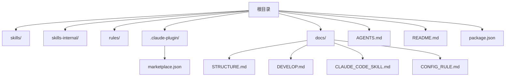
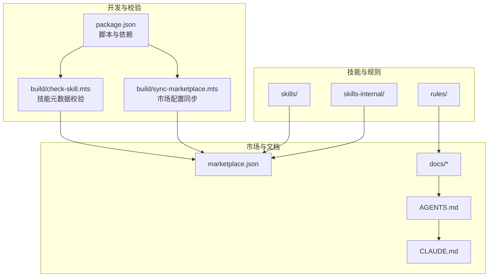
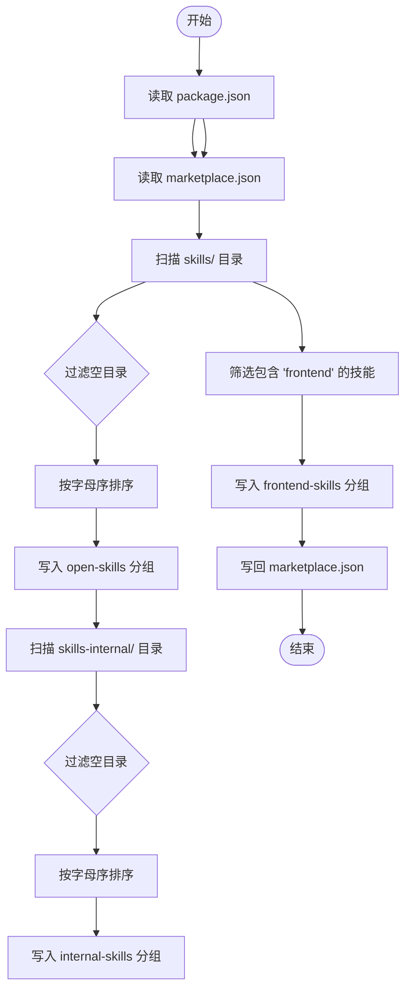
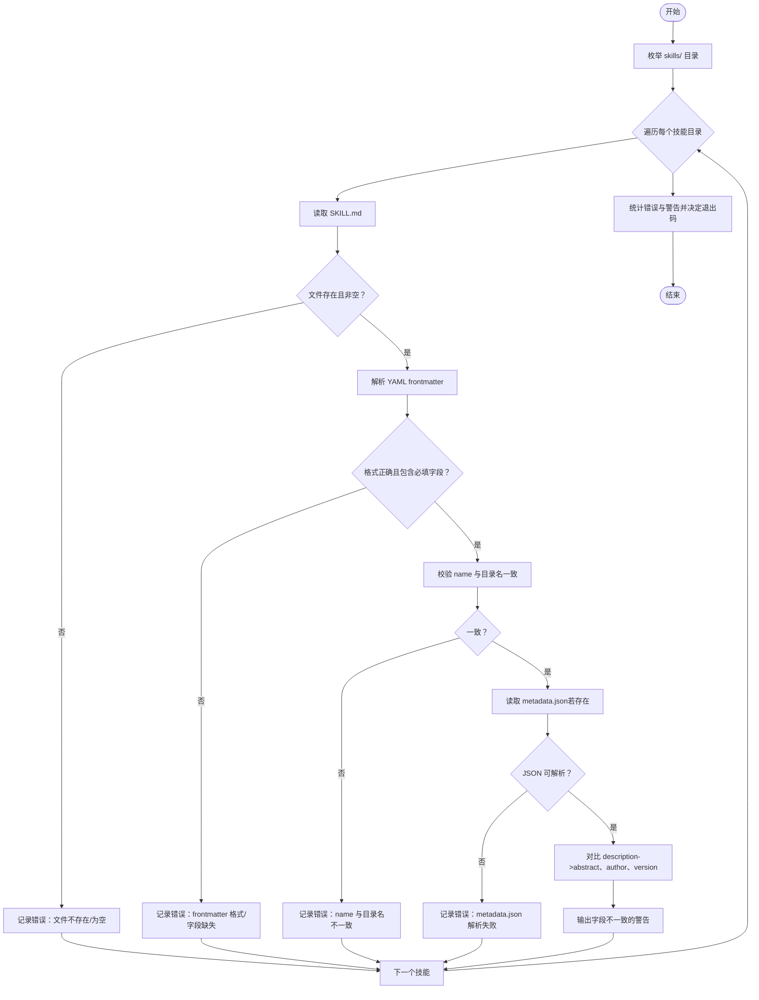
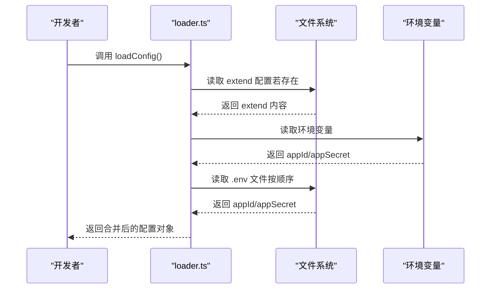
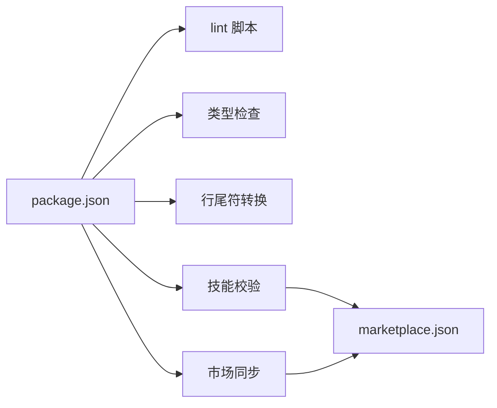

# 部署与运维

<cite>
**本文引用的文件**
- [package.json](file://package.json)
- [README.md](file://README.md)
- [docs/DEVELOP.md](file://docs/DEVELOP.md)
- [docs/STRUCTURE.md](file://docs/STRUCTURE.md)
- [docs/CLAUDE_CODE_SKILL.md](file://docs/CLAUDE_CODE_SKILL.md)
- [.claude-plugin/marketplace.json](file://.claude-plugin/marketplace.json)
- [AGENTS.md](file://AGENTS.md)
- [build/check-skill.mts](file://build/check-skill.mts)
- [build/sync-marketplace.mts](file://build/sync-marketplace.mts)
- [skills/yy-post-to-wechat/scripts/src/config/loader.ts](file://skills/yy-post-to-wechat/scripts/src/config/loader.ts)
- [skills/yy-mode-spec/templates/checklist-template.md](file://skills/yy-mode-spec/templates/checklist-template.md)
- [skills/yy-mode-spec/examples/output.md](file://skills/yy-mode-spec/examples/output.md)
- [skills/yy-frontend-vue2-review/evals.json](file://skills/yy-frontend-vue2-review/evals.json)
- [skills/yy-frontend-vue3-review/evals.json](file://skills/yy-frontend-vue3-review/evals.json)
- [docs/CONFIG_RULE.md](file://docs/CONFIG_RULE.md)
- [CLAUDE.md](file://CLAUDE.md)
</cite>

## 目录
1. [简介](#简介)
2. [项目结构](#项目结构)
3. [核心组件](#核心组件)
4. [架构总览](#架构总览)
5. [详细组件分析](#详细组件分析)
6. [依赖分析](#依赖分析)
7. [性能考虑](#性能考虑)
8. [故障排除指南](#故障排除指南)
9. [结论](#结论)
10. [附录](#附录)

## 简介
本指南面向生产环境的部署与运维团队，围绕本仓库的技能与规则体系，提供从服务器要求、依赖安装、环境变量设置，到 CI/CD 流水线、监控与日志、故障排除、备份与恢复、运维自动化与日常应急响应的全流程实践建议。由于本仓库为技能与规则集合，不包含运行时服务端应用，因此部署重点在于“技能市场配置”“本地开发与校验流程”“文档与规则一致性保障”，以及面向使用者的“技能安装与使用”流程。

## 项目结构
本仓库采用“技能 + 规则 + 市场配置”的组织方式，便于在不同 AI 编程工具中统一管理与分发。

图表来源
- [docs/STRUCTURE.md:1-10](file://docs/STRUCTURE.md#L1-L10)
- [.claude-plugin/marketplace.json:1-65](file://.claude-plugin/marketplace.json#L1-L65)

章节来源
- [docs/STRUCTURE.md:1-10](file://docs/STRUCTURE.md#L1-L10)
- [README.md:1-104](file://README.md#L1-L104)

## 核心组件
- 技能集合（skills/ 与 skills-internal/）：面向使用者的可调用能力，包含通用技能与内部维护技能。
- 规则集合（rules/）：面向代码质量与行为约束的规则文件，可在不同工具中引用。
- 市场配置（.claude-plugin/marketplace.json）：定义技能分组、来源与版本同步策略。
- 开发与校验工具（build/）：提供技能元数据校验与市场配置同步脚本。
- 文档与规范（docs/、AGENTS.md、CLAUDE.md）：提供安装指引、开发流程、质量门禁与路径规范。

章节来源
- [README.md:32-86](file://README.md#L32-L86)
- [.claude-plugin/marketplace.json:10-63](file://.claude-plugin/marketplace.json#L10-L63)
- [AGENTS.md:11-24](file://AGENTS.md#L11-L24)
- [build/check-skill.mts:177-226](file://build/check-skill.mts#L177-L226)
- [build/sync-marketplace.mts:18-93](file://build/sync-marketplace.mts#L18-L93)

## 架构总览
本仓库的“部署与运维”关注点集中在“技能市场配置的自动化同步”“技能元数据一致性校验”“文档与规则的一致性保障”以及“使用者安装与使用流程”。

图表来源
- [package.json:7-16](file://package.json#L7-L16)
- [build/check-skill.mts:177-226](file://build/check-skill.mts#L177-L226)
- [build/sync-marketplace.mts:18-93](file://build/sync-marketplace.mts#L18-L93)
- [.claude-plugin/marketplace.json:10-63](file://.claude-plugin/marketplace.json#L10-L63)
- [AGENTS.md:11-24](file://AGENTS.md#L11-L24)
- [docs/CONFIG_RULE.md:1-34](file://docs/CONFIG_RULE.md#L1-L34)

## 详细组件分析

### 组件A：技能市场配置同步（build/sync-marketplace.mts）
- 目标：将 package.json 的元信息与技能目录内容同步到 marketplace.json，自动分组并排序。
- 关键流程：
  - 读取 package.json，填充 marketplace.json 的名称、版本、描述与所有者。
  - 扫描 skills/ 与 skills-internal/，过滤空目录并按字母序排序，分别写入 open-skills 与 internal-skills 分组。
  - 识别包含“frontend”的技能，写入 frontend-skills 分组。
  - 写回 marketplace.json。
- 错误处理：对空目录自动删除并输出提示；对读写异常抛出错误。
- 性能与复杂度：目录扫描与排序为 O(n log n)，整体线性于技能数量。

图表来源
- [build/sync-marketplace.mts:12-93](file://build/sync-marketplace.mts#L12-L93)

章节来源
- [build/sync-marketplace.mts:18-93](file://build/sync-marketplace.mts#L18-L93)

### 组件B：技能元数据一致性校验（build/check-skill.mts）
- 目标：校验每个技能的 SKILL.md 与 metadata.json 的一致性，确保 name、description、author、version 等字段匹配。
- 关键流程：
  - 遍历 skills/ 下的每个技能目录，读取 SKILL.md 与 metadata.json。
  - 校验 SKILL.md 的 YAML frontmatter 结构与必填字段，以及与目录名的一致性。
  - 对比 metadata.json 与 SKILL.md 的字段，输出警告建议。
  - 统计错误与警告数量，错误时退出进程。
- 错误处理：文件缺失、格式错误、字段不一致均记录为错误或警告；最终根据错误数决定退出码。
- 性能与复杂度：对每个技能执行 O(1) 校验，总体 O(n)。

图表来源
- [build/check-skill.mts:50-172](file://build/check-skill.mts#L50-L172)
- [build/check-skill.mts:177-226](file://build/check-skill.mts#L177-L226)

章节来源
- [build/check-skill.mts:177-226](file://build/check-skill.mts#L177-L226)

### 组件C：技能安装与使用（docs/CLAUDE_CODE_SKILL.md、README.md）
- 安装方式：提供在 Claude Code 中通过插件市场安装技能的步骤说明。
- 使用方式：README 中列举技能列表与安装命令，便于使用者快速获取所需能力。
- 注意事项：本地调试会生成特定文件，需纳入忽略列表，避免提交到版本库。

章节来源
- [docs/CLAUDE_CODE_SKILL.md:1-10](file://docs/CLAUDE_CODE_SKILL.md#L1-L10)
- [README.md:32-86](file://README.md#L32-L86)
- [docs/DEVELOP.md:14-18](file://docs/DEVELOP.md#L14-L18)

### 组件D：规则配置与引用（docs/CONFIG_RULE.md、CLAUDE.md、AGENTS.md）
- OpenCode：将规则文件放置于 .opencode/rules/，并在项目根目录创建 opencode.json 指定引入路径。
- Claude Code：通过 CLAUDE.md 引入规则文件，支持多层递归引用；也可在 .claude/rules/ 下创建规则文件。
- 项目规范：AGENTS.md 明确了默认语言、允许修改目录、质量门禁与交付格式等。

章节来源
- [docs/CONFIG_RULE.md:1-34](file://docs/CONFIG_RULE.md#L1-L34)
- [CLAUDE.md:1-2](file://CLAUDE.md#L1-L2)
- [AGENTS.md:3-24](file://AGENTS.md#L3-L24)

### 组件E：环境变量与配置加载（skills/yy-post-to-wechat/scripts/src/config/loader.ts）
- 配置来源：默认配置 + extend 配置文件 + 环境变量 + .env 文件（按顺序覆盖）。
- 关键字段：WECHAT_APP_ID、WECHAT_APP_SECRET。
- 加载策略：按优先级合并，最终返回完整配置对象；提供凭据完整性检查。

图表来源
- [skills/yy-post-to-wechat/scripts/src/config/loader.ts:130-149](file://skills/yy-post-to-wechat/scripts/src/config/loader.ts#L130-L149)

章节来源
- [skills/yy-post-to-wechat/scripts/src/config/loader.ts:98-149](file://skills/yy-post-to-wechat/scripts/src/config/loader.ts#L98-L149)

### 组件F：质量门禁与验收清单（AGENTS.md、skills/yy-mode-spec/templates/checklist-template.md、examples/output.md）
- 质量门禁：每次改动后必须执行 lint、一致性检查、必要时同步思考方式。
- 验收清单：提供模板与示例，覆盖“实施前检查、实施中检查、实施后验证、质量门禁”四个维度。

章节来源
- [AGENTS.md:11-24](file://AGENTS.md#L11-L24)
- [skills/yy-mode-spec/templates/checklist-template.md:1-32](file://skills/yy-mode-spec/templates/checklist-template.md#L1-L32)
- [skills/yy-mode-spec/examples/output.md:152-208](file://skills/yy-mode-spec/examples/output.md#L152-L208)

### 组件G：代码审核与评估（skills/yy-frontend-vue2-review/evals.json、skills/yy-frontend-vue3-review/evals.json）
- 评估维度：逻辑错误、网络请求规范、白名单处理等，提供定性断言与文件范围。
- 价值：为前端代码质量提供可执行的评估基准，便于持续改进。

章节来源
- [skills/yy-frontend-vue2-review/evals.json:236-277](file://skills/yy-frontend-vue2-review/evals.json#L236-L277)
- [skills/yy-frontend-vue3-review/evals.json:240-281](file://skills/yy-frontend-vue3-review/evals.json#L240-L281)

## 依赖分析
- 语言与工具链：Node.js（ES 模块）、TypeScript、markdownlint、js-yaml。
- 本地开发：通过 npm 脚本统一执行 lint、类型检查、行尾符转换、技能校验与市场同步。
- 依赖耦合：构建脚本与市场配置文件存在直接耦合；技能元数据校验与技能目录存在直接耦合。

图表来源
- [package.json:7-16](file://package.json#L7-L16)
- [build/check-skill.mts:177-226](file://build/check-skill.mts#L177-L226)
- [build/sync-marketplace.mts:18-93](file://build/sync-marketplace.mts#L18-L93)

章节来源
- [package.json:7-16](file://package.json#L7-L16)

## 性能考虑
- 目录扫描与排序：技能数量较多时，市场同步与一致性校验的时间复杂度近似 O(n log n)。建议在 CI 中缓存依赖与减少重复扫描。
- 文件读取与解析：YAML 解析与 JSON 解析为 O(1) 每文件，整体受技能数量线性影响。
- 建议：
  - 将市场同步与一致性校验拆分为独立流水线阶段，避免重复执行。
  - 对大型仓库启用增量校验（仅对变更目录执行校验）。
  - 使用并行任务加速多技能校验。

## 故障排除指南
- 常见问题与诊断
  - 技能元数据错误：frontmatter 缺失或字段不一致，导致校验失败。依据错误输出定位具体技能与字段，修正后重试。
  - 市场配置不同步：package.json 更新后未执行市场同步脚本，导致 marketplace.json 未更新。执行同步脚本并确认写回成功。
  - 环境变量未生效：WECHAT_APP_ID/WECHAT_APP_SECRET 未在环境变量或 .env 文件中正确设置。检查加载顺序与文件格式。
  - 规则未生效：OpenCode 未将规则文件放入 .opencode/rules/ 或 opencode.json 未正确配置；Claude Code 未在 CLAUDE.md 中正确引入。
- 日志与审计
  - 构建脚本输出包含错误与警告统计，便于快速定位问题。
  - 市场同步脚本对空目录删除与写回动作有明确提示。
- 性能调优
  - 减少不必要的技能目录数量，清理空目录。
  - 在 CI 中缓存 Node 依赖与构建产物，缩短流水线时间。

章节来源
- [build/check-skill.mts:177-226](file://build/check-skill.mts#L177-L226)
- [build/sync-marketplace.mts:31-45](file://build/sync-marketplace.mts#L31-L45)
- [skills/yy-post-to-wechat/scripts/src/config/loader.ts:130-149](file://skills/yy-post-to-wechat/scripts/src/config/loader.ts#L130-L149)
- [docs/CONFIG_RULE.md:1-34](file://docs/CONFIG_RULE.md#L1-L34)

## 结论
本仓库以“技能 + 规则 + 市场配置”为核心，通过构建脚本实现自动化校验与同步，配合文档与规范形成完整的质量门禁体系。运维侧应重点关注：市场配置的自动化同步、技能元数据一致性、规则配置的正确性与可维护性，以及使用者安装与使用流程的顺畅性。通过上述组件与流程的协同，可实现稳定、可追溯、可扩展的技能与规则管理体系。

## 附录
- 生产环境部署建议（概念性）
  - 服务器要求：具备 Node.js 运行时与包管理器，满足构建脚本与规则工具链需求。
  - 依赖安装：在 CI/CD 机器上安装 Node.js 与项目依赖，确保脚本可执行。
  - 环境变量设置：为需要外部 API 的技能准备必要的密钥与参数，遵循最小权限原则。
  - CI/CD 流水线：将“技能校验 + 市场同步 + 文档与规则一致性检查 + 发布”作为流水线阶段，设置并行与缓存策略。
  - 监控与日志：记录流水线执行日志与错误统计，结合规则与评估文件输出进行质量度量。
  - 故障排除：建立“问题定位 → 修复 → 回归验证 → 发布”的闭环流程。
  - 备份与恢复：定期备份 marketplace.json、规则文件与关键配置，确保可回滚。
  - 运维自动化：封装常用脚本（校验、同步、安装、规则导入），提供一键化运维能力。
  - 应急响应：制定技能市场不可用、规则冲突、凭据泄露等场景的应急预案与演练计划。