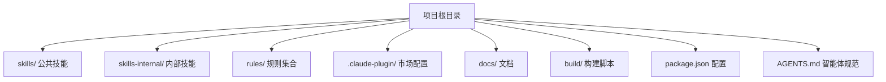
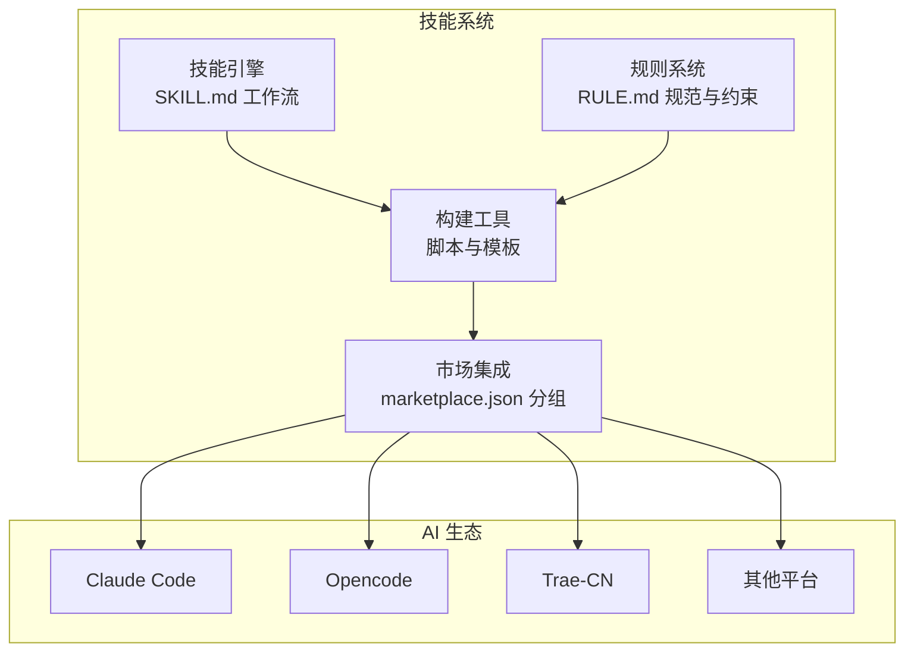
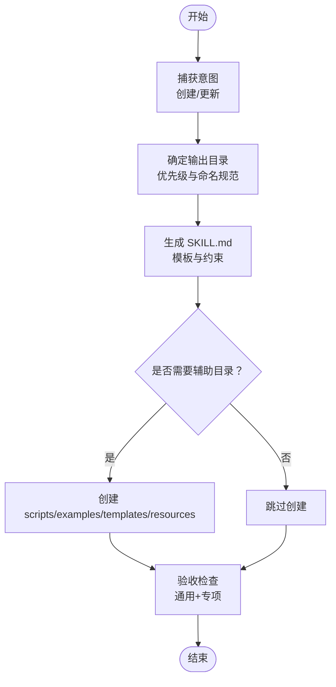
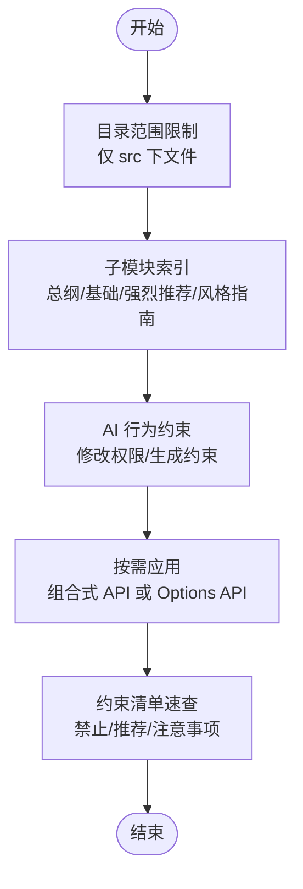
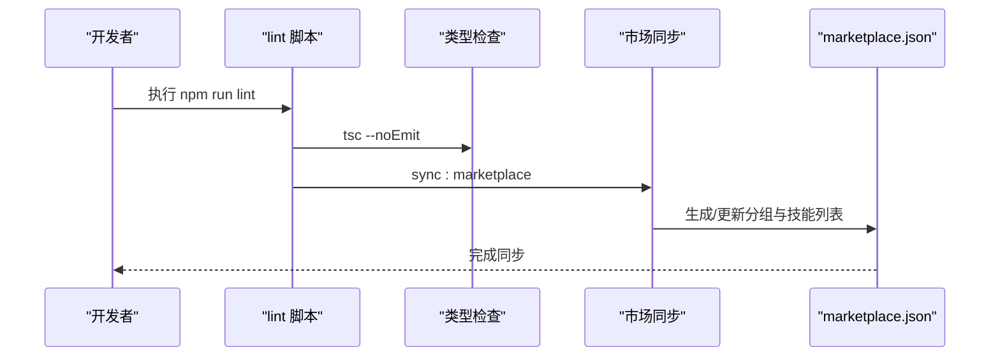
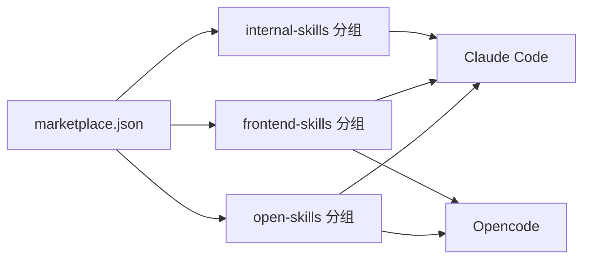
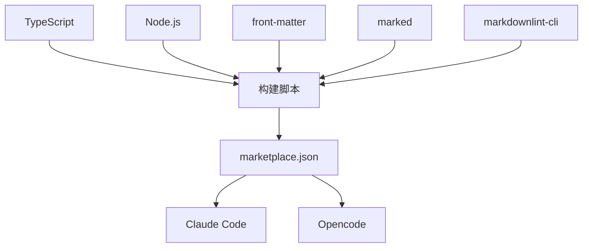

# 项目概述

<cite>
**本文引用的文件**
- [package.json](file://package.json)
- [README.md](file://README.md)
- [AGENTS.md](file://AGENTS.md)
- [STRUCTURE.md](file://docs/STRUCTURE.md)
- [DEVELOP.md](file://docs/DEVELOP.md)
- [marketplace.json](file://.claude-plugin/marketplace.json)
- [yy-create-skill/SKILL.md](file://skills/yy-create-skill/SKILL.md)
- [yy-create-rule/SKILL.md](file://skills/yy-create-rule/SKILL.md)
- [RULE.md（Vue2 规则）](file://rules/frontend-rules-vue2/RULE.md)
- [RULE.md（Vue3 规则）](file://rules/frontend-rules-vue3/RULE.md)
- [skill-template.md](file://skills/yy-create-skill/templates/skill-template.md)
- [content-template.md](file://skills/yy-create-rule/resources/content-template.md)
- [yy-post-to-wechat/scripts/package.json](file://skills/yy-post-to-wechat/scripts/package.json)
</cite>

## 目录
1. [简介](#简介)
2. [项目结构](#项目结构)
3. [核心组件](#核心组件)
4. [架构总览](#架构总览)
5. [详细组件分析](#详细组件分析)
6. [依赖分析](#依赖分析)
7. [性能考虑](#性能考虑)
8. [故障排查指南](#故障排查指南)
9. [结论](#结论)
10. [附录](#附录)

## 简介
本项目是一个面向 AI 技能生态的“技能库系统”，旨在帮助开发者快速创建、管理与分发可复用的 AI 技能。项目围绕“技能”“规则”“构建工具”“市场集成”四大支柱展开，形成从内容创作、质量门禁、自动化构建到多平台分发的闭环。

- 核心目标
  - 降低 AI 技能的创建门槛，提供标准化的技能模板与验收清单
  - 通过规则系统约束 AI 的行为边界与输出质量，确保安全与一致性
  - 以构建工具链保障技能与规则的可维护性与可审计性
  - 通过市场集成模块实现多平台分发与统一管理

- 在 AI 技能生态系统中的定位
  - 技能引擎：以 SKILL.md 为载体，承载“意图捕获—目录结构—指令步骤—验收清单”的完整工作流
  - 规则系统：以 RULE.md 为载体，沉淀项目规范、最佳实践与经验教训，作为 AI 的“项目知识库”
  - 构建工具：通过脚本与模板，保障技能与规则的结构化、可验证与可扩展
  - 市场集成：通过 marketplace.json 与多平台插件生态对接，实现一键安装与统一管理

- 商业价值与应用场景
  - 企业内部：统一团队开发规范、减少重复劳动、加速知识沉淀与传承
  - 开发者社区：提供可复用的技能与规则模板，降低协作成本，提升交付质量
  - 自动化流水线：结合 CI/CD，将技能与规则纳入质量门禁，实现持续治理

- 发展历程与未来规划
  - 发展历程：从单一技能集合逐步演进为包含规则、构建与市场的完整体系
  - 社区贡献：鼓励通过技能与规则贡献扩展生态，提供本地调试与一致性校验工具
  - 未来规划：进一步完善市场分组与权限控制、引入更丰富的模板与验收清单、增强跨平台兼容性

**章节来源**
- [README.md:1-104](file://README.md#L1-L104)
- [AGENTS.md:1-155](file://AGENTS.md#L1-L155)

## 项目结构
项目采用“按功能域划分”的目录组织方式，核心目录与职责如下：

- skills/：公共技能集合，包含通用技能与前端专项技能
- skills-internal/：内部维护技能，主要用于仓库自身的维护与一致性校验
- rules/：规则集合，按框架/语言维度拆分子模块，便于按需引用
- .claude-plugin/：插件市场配置，定义技能分组与安装路径
- docs/：项目文档，包含结构说明、开发指南、规则配置等
- build/：构建与同步脚本（如检查技能、同步市场）
- 根目录配置：package.json、AGENTS.md、TS 配置等

**图表来源**
- [STRUCTURE.md:1-10](file://docs/STRUCTURE.md#L1-L10)
- [.claude-plugin/marketplace.json:1-65](file://.claude-plugin/marketplace.json#L1-L65)

**章节来源**
- [STRUCTURE.md:1-10](file://docs/STRUCTURE.md#L1-L10)
- [DEVELOP.md:1-18](file://docs/DEVELOP.md#L1-L18)

## 核心组件
- 技能引擎（Skill Engine）
  - 以 SKILL.md 为核心，定义技能的意图、目录结构、指令步骤与验收清单
  - 支持创建新技能与更新现有技能，具备模板化与辅助资源目录（examples/templates/resources/scripts）
- 规则系统（Rule System）
  - 以 RULE.md 为核心，沉淀项目规范、最佳实践与经验教训
  - 拆分子模块，按需引用，支持 AI 行为约束与目录范围限制
- 构建工具（Build Tools）
  - 通过脚本实现 lint、类型检查、CRLF 转换、市场同步等功能
  - 提供本地调试与一致性校验能力
- 市场集成（Marketplace Integration）
  - 通过 marketplace.json 定义技能分组与安装路径，支持多平台一键安装
  - 与 Claude Code、Opencode、Trae-CN 等生态对接

**章节来源**
- [yy-create-skill/SKILL.md:1-213](file://skills/yy-create-skill/SKILL.md#L1-L213)
- [yy-create-rule/SKILL.md:1-133](file://skills/yy-create-rule/SKILL.md#L1-L133)
- [RULE.md（Vue2 规则）:1-62](file://rules/frontend-rules-vue2/RULE.md#L1-L62)
- [RULE.md（Vue3 规则）:1-68](file://rules/frontend-rules-vue3/RULE.md#L1-L68)
- [marketplace.json:1-65](file://.claude-plugin/marketplace.json#L1-L65)
- [package.json:1-46](file://package.json#L1-L46)

## 架构总览
下图展示了技能系统在 AI 技能生态中的整体架构：技能引擎负责内容创作与验收，规则系统负责行为约束与规范沉淀，构建工具负责质量门禁与自动化，市场集成负责多平台分发与统一管理。

**图表来源**
- [yy-create-skill/SKILL.md:1-213](file://skills/yy-create-skill/SKILL.md#L1-L213)
- [yy-create-rule/SKILL.md:1-133](file://skills/yy-create-rule/SKILL.md#L1-L133)
- [marketplace.json:1-65](file://.claude-plugin/marketplace.json#L1-L65)

## 详细组件分析

### 技能引擎（Skill Engine）
- 设计理念
  - 自动发现：技能仅在相关时加载，避免上下文膨胀
  - 精确触发：description 仅用于触发判断，避免误触发
  - 明确边界：使用场景与不应触发场景清晰界定
  - 指令清晰：步骤明确，最后一步描述输出格式
  - 决策显式化：将隐含分支转化为明确规则
- 关键流程
  - 意图捕获：区分“创建新技能”与“更新现有技能”
  - 目录确定：按命名规范与优先级选择输出目录
  - 内容生成：生成 SKILL.md 与必要辅助目录
  - 验收检查：通用检查项与创建/更新后专项检查
- 目录结构
  - 支持 scripts/、examples/、templates/、resources/ 等可选目录
  - 脚本依赖通过 scripts/package.json 管理

**图表来源**
- [yy-create-skill/SKILL.md:34-177](file://skills/yy-create-skill/SKILL.md#L34-L177)
- [skill-template.md:1-37](file://skills/yy-create-skill/templates/skill-template.md#L1-L37)

**章节来源**
- [yy-create-skill/SKILL.md:1-213](file://skills/yy-create-skill/SKILL.md#L1-L213)
- [skill-template.md:1-37](file://skills/yy-create-skill/templates/skill-template.md#L1-L37)
- [yy-post-to-wechat/scripts/package.json:1-29](file://skills/yy-post-to-wechat/scripts/package.json#L1-L29)

### 规则系统（Rule System）
- 设计理念
  - 拆分子模块：按“总纲—基础规范—强烈推荐—风格指南”分级索引
  - 目录范围限制：仅允许修改指定目录内的文件，其他目录不处理
  - AI 行为约束：明确修改权限、文档生成约束与直接输出规则
- Vue2 与 Vue3 规则差异
  - Vue2：Options API 风格，强调组件结构、交互通信与性能优化
  - Vue3：组合式 API 风格，强调响应式、Hooks、TypeScript 类型与结构顺序
- 快速导航与约束清单：提供模块化索引与速查表，便于检索与落地

**图表来源**
- [RULE.md（Vue2 规则）:1-62](file://rules/frontend-rules-vue2/RULE.md#L1-L62)
- [RULE.md（Vue3 规则）:1-68](file://rules/frontend-rules-vue3/RULE.md#L1-L68)

**章节来源**
- [RULE.md（Vue2 规则）:1-62](file://rules/frontend-rules-vue2/RULE.md#L1-L62)
- [RULE.md（Vue3 规则）:1-68](file://rules/frontend-rules-vue3/RULE.md#L1-L68)

### 构建工具（Build Tools）
- 脚本职责
  - 代码与文档 lint：markdownlint、TypeScript 类型检查
  - 文件格式转换：CRLF 到 LF 的转换检查
  - 技能一致性检查：通过内部技能校验技能与 AGENTS.md 的一致性
  - 市场同步：自动生成 marketplace.json 的分组与技能列表
- 本地开发调试
  - 通过 npx skills add 本地调试 skills/ 目录下的技能
  - 本地调试生成的文件不在版本控制范围内，避免污染仓库

**图表来源**
- [package.json:7-16](file://package.json#L7-L16)
- [AGENTS.md:11-17](file://AGENTS.md#L11-L17)

**章节来源**
- [package.json:1-46](file://package.json#L1-L46)
- [DEVELOP.md:1-18](file://docs/DEVELOP.md#L1-L18)
- [AGENTS.md:11-17](file://AGENTS.md#L11-L17)

### 市场集成（Marketplace Integration）
- 分组策略
  - open-skills：通用技能集合
  - frontend-skills：前端专项技能集合
  - internal-skills：内部维护技能集合
- 安装与管理
  - 通过 npx skills add 一键安装
  - 支持多平台插件生态（Claude Code、Opencode、Trae-CN 等）

**图表来源**
- [.claude-plugin/marketplace.json:1-65](file://.claude-plugin/marketplace.json#L1-L65)

**章节来源**
- [.claude-plugin/marketplace.json:1-65](file://.claude-plugin/marketplace.json#L1-L65)
- [README.md:36-41](file://README.md#L36-L41)

## 依赖分析
- 技术栈选择与优势
  - TypeScript：强类型保障，提升可维护性与可审计性
  - Node.js：构建脚本与 CLI 工具链，便于自动化与跨平台部署
  - Markdown 处理库（front-matter、marked）：规则与技能内容的结构化与渲染
  - markdownlint-cli：统一文档风格与质量门禁
- 外部依赖与集成点
  - 技能市场：通过 marketplace.json 与多平台生态对接
  - 内部工具：一致性检查与思维方法同步技能，保障项目治理

**图表来源**
- [package.json:34-44](file://package.json#L34-L44)
- [yy-post-to-wechat/scripts/package.json:16-27](file://skills/yy-post-to-wechat/scripts/package.json#L16-L27)

**章节来源**
- [package.json:1-46](file://package.json#L1-L46)
- [yy-post-to-wechat/scripts/package.json:1-29](file://skills/yy-post-to-wechat/scripts/package.json#L1-L29)

## 性能考虑
- 技能与规则的模块化拆分，减少一次性加载的上下文大小，提升 AI 的响应效率
- 通过脚本实现批量 lint 与类型检查，避免重复扫描与人工干预
- 市场同步脚本在增量更新时尽量减少不必要的重写，降低 I/O 压力

## 故障排查指南
- 本地调试问题
  - 确认已执行本地安装命令，避免将本地调试生成的文件提交到仓库
- 质量门禁失败
  - 按照 AGENTS.md 的质量门禁要求逐项检查：lint、一致性检查、思维方法同步
- 市场同步异常
  - 检查 marketplace.json 的分组与技能路径是否正确，必要时重新执行同步脚本

**章节来源**
- [DEVELOP.md:8-18](file://docs/DEVELOP.md#L8-L18)
- [AGENTS.md:11-17](file://AGENTS.md#L11-L17)

## 结论
本项目通过“技能引擎—规则系统—构建工具—市场集成”的协同架构，形成了可复用、可治理、可分发的 AI 技能生态闭环。它不仅降低了技能创建与维护的成本，还通过规则与质量门禁保障了输出的一致性与安全性。面向未来，项目将持续完善模板与验收清单、增强跨平台兼容性，并鼓励社区贡献，共同建设开放、高效的 AI 技能生态。

## 附录
- 相关资源
  - 技能模板与指南：见技能模板与指南文件
  - 规则内容模板：见规则内容模板文件
  - 本地开发调试指南：见开发文档

**章节来源**
- [skill-template.md:1-37](file://skills/yy-create-skill/templates/skill-template.md#L1-L37)
- [content-template.md:1-122](file://skills/yy-create-rule/resources/content-template.md#L1-L122)
- [DEVELOP.md:1-18](file://docs/DEVELOP.md#L1-L18)