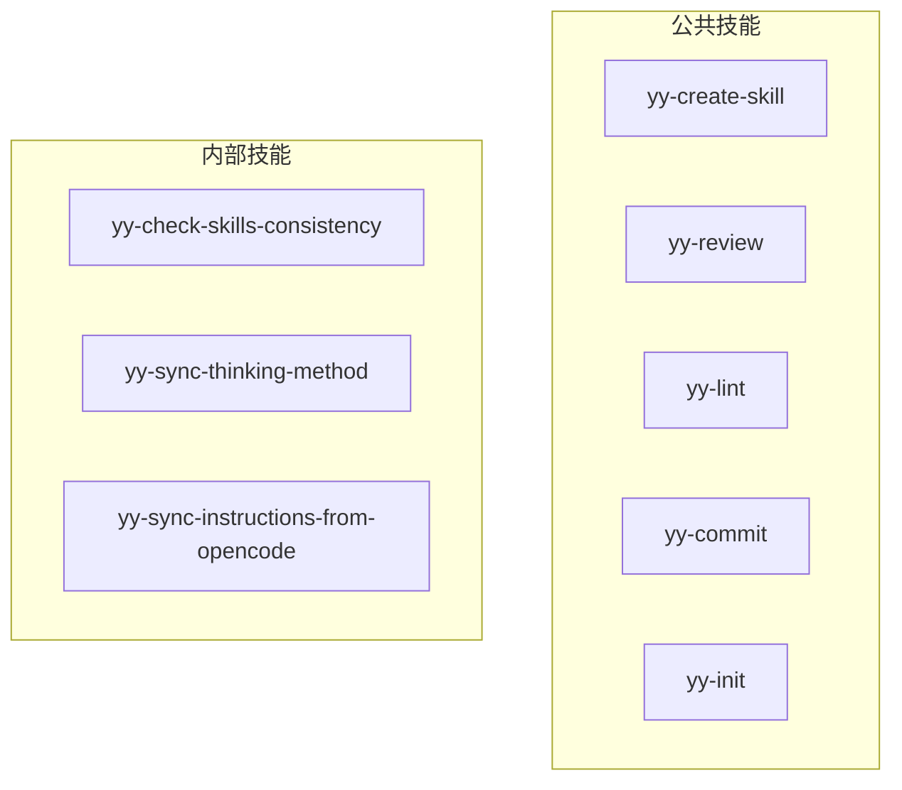
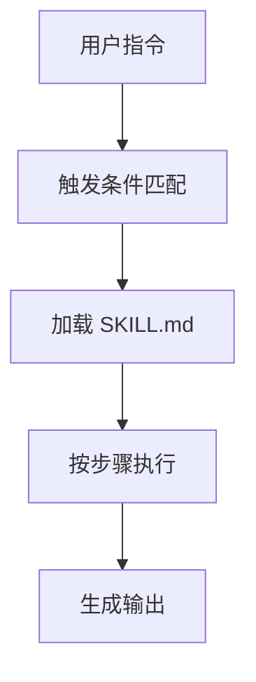

# 技能系统（Skills）

<cite>
**本文引用的文件**
- [skills/yy-create-skill/SKILL.md](file://skills/yy-create-skill/SKILL.md)
- [skills/yy-review/SKILL.md](file://skills/yy-review/SKILL.md)
- [skills/yy-lint/SKILL.md](file://skills/yy-lint/SKILL.md)
- [skills/yy-commit/SKILL.md](file://skills/yy-commit/SKILL.md)
- [skills/yy-init/SKILL.md](file://skills/yy-init/SKILL.md)
</cite>

## 目录

- [简介](#简介)
- [项目结构](#项目结构)
- [核心组件](#核心组件)
- [架构总览](#架构总览)
- [详细组件分析](#详细组件分析)
- [依赖分析](#依赖分析)
- [性能考虑](#性能考虑)
- [故障排查指南](#故障排查指南)
- [结论](#结论)
- [附录](#附录)

## 简介

技能系统是本仓库的核心产出物，每个技能是一个独立的 SKILL.md 文件，定义了可按需加载的任务工作流。技能通过 description 字段实现自动发现与精确触发，避免上下文膨胀。

**章节来源**

- [skills/yy-create-skill/SKILL.md:1-20](file://skills/yy-create-skill/SKILL.md#L1-L20)

## 项目结构

```text
skills/
├── yy-comment/
├── yy-commit/
├── yy-create-skill/
├── yy-create-wiki/
├── yy-review/
├── yy-lint/
└── ... (27 个公共技能)
skills-internal/
├── yy-check-skills-consistency/
├── yy-sync-thinking-method/
└── yy-sync-instructions-from-opencode/
```



**图表来源**

- [README.md:1-30](file://README.md#L1-L30)

**章节来源**

- [README.md:1-30](file://README.md#L1-L30)

## 核心组件

- **yy-create-skill**：创建或更新符合规范的 Skill 技能文件
- **yy-review**：审核 git 变动文件的语法、逻辑、安全和最佳实践
- **yy-lint**：执行代码风格检查
- **yy-commit**：生成规范的中文提交信息并执行提交
- **yy-init**：初始化或更新项目的 AGENTS.md 文档

**章节来源**

- [skills/yy-create-skill/SKILL.md:1-10](file://skills/yy-create-skill/SKILL.md#L1-L10)
- [skills/yy-review/SKILL.md:1-10](file://skills/yy-review/SKILL.md#L1-L10)

## 架构总览

技能系统采用"自描述文件 + 触发条件匹配"的架构：



**图表来源**

- [skills/yy-create-skill/SKILL.md:20-40](file://skills/yy-create-skill/SKILL.md#L20-L40)

**章节来源**

- [skills/yy-create-skill/SKILL.md:20-40](file://skills/yy-create-skill/SKILL.md#L20-L40)

## 详细组件分析

### yy-create-skill

- 设计要点：标准化 SKILL.md 文件格式，确保技能的可发现性和可复用性
- 数据流：用户指定技能名称 → 生成 SKILL.md 模板 → 填充内容 → 验证格式

**章节来源**

- [skills/yy-create-skill/SKILL.md:1-50](file://skills/yy-create-skill/SKILL.md#L1-L50)

### yy-review

- 设计要点：审核 git 变动文件，覆盖语法、逻辑、安全和最佳实践
- 数据流：获取 git diff → 逐文件审核 → 生成审核报告

**章节来源**

- [skills/yy-review/SKILL.md:1-50](file://skills/yy-review/SKILL.md#L1-L50)

## 依赖分析

- 运行时依赖：Node.js、git
- 内部依赖：AGENTS.md（技能引用入口）、marketplace.json（技能市场配置）

**章节来源**

- [package.json:1-30](file://package.json#L1-L30)

## 性能考虑

- 技能按需加载，避免上下文膨胀
- description 字段精确匹配触发条件，减少误触发

**章节来源**

- [skills/yy-create-skill/SKILL.md:30-50](file://skills/yy-create-skill/SKILL.md#L30-L50)

## 故障排查指南

- **技能未触发**：检查 SKILL.md 的"何时使用"章节是否匹配当前场景
- **技能执行失败**：检查步骤定义是否完整，输出格式是否正确

**章节来源**

- [skills/yy-create-skill/SKILL.md:40-60](file://skills/yy-create-skill/SKILL.md#L40-L60)

## 结论

技能系统通过标准化的 SKILL.md 文件格式，实现了可发现、可触发、可复用的 AI 工作流定义。27 个公共技能覆盖代码质量、创建生成、Git 操作等核心场景。

**章节来源**

- [README.md:1-10](file://README.md#L1-L10)

## 附录

- [yy-create-skill SKILL.md](file://skills/yy-create-skill/SKILL.md)
- [yy-review SKILL.md](file://skills/yy-review/SKILL.md)
- [yy-lint SKILL.md](file://skills/yy-lint/SKILL.md)

**章节来源**

- [README.md:1-50](file://README.md#L1-L50)
