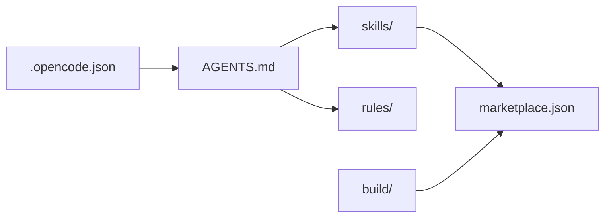

# 文档与配置

项目根目录的文档和配置文件，提供项目说明、开发指南和编辑器集成配置。

## 目录结构

```text
docs/
  CLAUDE_CODE_SKILL.md   # Claude Code 技能开发指南
  CONFIG_RULE.md         # 规则配置说明
  DEVELOP.md             # 开发指南
  RECOMMEND_SKILLS.md    # 推荐技能列表
  STRUCTURE.md           # 项目结构说明
.claude-plugin/
  marketplace.json       # 技能市场配置（自动生成，禁止手动修改）
.opencode.json           # OpenCode 编辑器配置
.qoder/                  # Qoder 编辑器配置
AGENTS.md                # AI 代理规范（权威来源）
README.md                # 项目说明
```

## 核心组成

### 文档（docs/）

- `CLAUDE_CODE_SKILL.md`：面向 Claude Code 的技能开发指南
- `CONFIG_RULE.md`：规则配置与引用方式说明
- `DEVELOP.md`：项目开发流程与约定
- `RECOMMEND_SKILLS.md`：推荐技能及使用场景
- `STRUCTURE.md`：项目目录结构说明

### 配置文件

- `AGENTS.md`：AI 代理的项目规范，是技能、规则、思考方式的权威来源
- `marketplace.json`：由 `build/sync-marketplace.mts` 自动生成，定义技能分组和分发配置
- `.opencode.json`：OpenCode 编辑器的指令和规则配置

## 依赖关系



AGENTS.md 是核心枢纽：技能和规则通过它引用生效；marketplace.json 由构建工具从 skills/ 目录自动生成；`.opencode.json` 中的通用规则需同步到 AGENTS.md。
