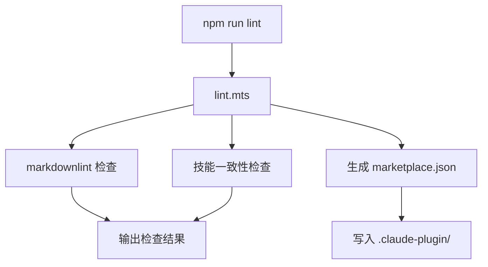

# 构建工具（Build）

<cite>
**本文引用的文件**
- [build/lint.mts](file://build/lint.mts)
- [.claude-plugin/marketplace.json](file://.claude-plugin/marketplace.json)
- [package.json](file://package.json)
</cite>

## 目录

- [简介](#简介)
- [项目结构](#项目结构)
- [核心组件](#核心组件)
- [架构总览](#架构总览)
- [详细组件分析](#详细组件分析)
- [依赖分析](#依赖分析)
- [性能考虑](#性能考虑)
- [故障排查指南](#故障排查指南)
- [结论](#结论)
- [附录](#附录)

## 简介

构建工具负责项目的代码质量检查和技能市场配置同步。lint.mts 是核心入口脚本，marketplace.json 由 lint.mts 自动生成，禁止手动修改。

**章节来源**
- [build/lint.mts:1-20](file://build/lint.mts#L1-L20)

## 项目结构

```text
build/
└── lint.mts
.claude-plugin/
└── marketplace.json
```

**章节来源**
- [build/lint.mts:1-10](file://build/lint.mts#L1-L10)

## 核心组件

- **lint.mts**：lint 入口脚本，执行代码和文档检查
- **marketplace.json**：技能市场配置文件，定义插件和技能分组

**章节来源**
- [build/lint.mts:1-20](file://build/lint.mts#L1-L20)

## 架构总览



**图表来源**
- [build/lint.mts:1-30](file://build/lint.mts#L1-L30)

**章节来源**
- [build/lint.mts:1-30](file://build/lint.mts#L1-L30)

## 详细组件分析

### lint.mts

- 设计要点：统一入口执行所有检查，自动生成 marketplace.json
- 数据流：读取 skills/ 目录 → 执行 markdownlint → 检查技能一致性 → 生成 marketplace.json

**章节来源**
- [build/lint.mts:1-50](file://build/lint.mts#L1-L50)

## 依赖分析

- 运行时依赖：Node.js
- 开发依赖：markdownlint-cli、eslint、prettier

**章节来源**
- [package.json:1-30](file://package.json#L1-L30)

## 性能考虑

- lint 采用增量检查策略，只检查变更的文件
- marketplace.json 由 lint.mts 自动生成，避免手动维护带来的不一致

**章节来源**
- [build/lint.mts:20-40](file://build/lint.mts#L20-L40)

## 故障排查指南

- **lint 报错**：检查 markdownlint 规则，确保所有代码块声明了语言标识
- **marketplace.json 不一致**：执行 `npm run lint` 重新生成
- **技能一致性检查失败**：检查 README.md 中的技能列表是否与 skills/ 目录一致

**章节来源**
- [build/lint.mts:30-50](file://build/lint.mts#L30-L50)

## 结论

构建工具通过 lint.mts 统一入口，实现了代码质量检查和技能市场配置的自动化管理。marketplace.json 的自动生成机制避免了手动维护的不一致问题。

**章节来源**
- [build/lint.mts:1-20](file://build/lint.mts#L1-L20)

## 附录

- [lint.mts](file://build/lint.mts)
- [marketplace.json](file://.claude-plugin/marketplace.json)

**章节来源**
- [build/lint.mts:1-50](file://build/lint.mts#L1-L50)