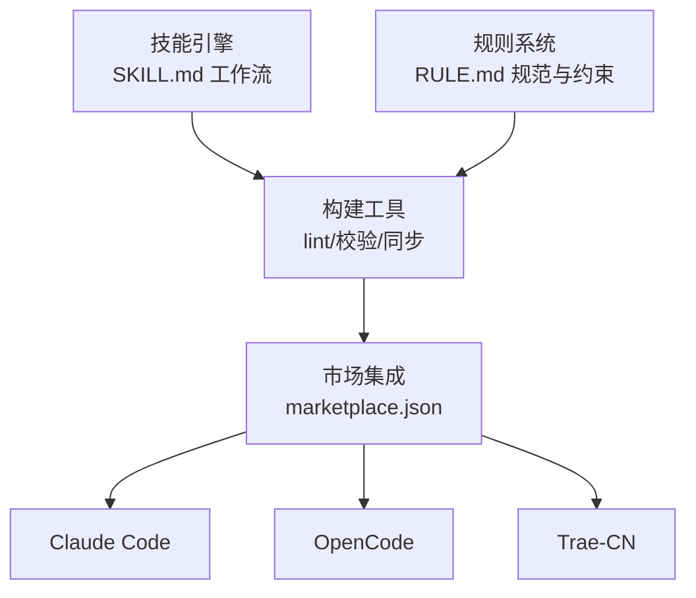

# 项目概述

本仓库是一个面向 AI 技能生态的技能库系统，帮助开发者快速创建、管理与分发可复用的 AI 技能。项目围绕技能、规则、构建工具、市场集成四大支柱展开，形成从内容创作、质量门禁、自动化构建到多平台分发的闭环。

## 技术栈

- TypeScript + Node.js：构建脚本与类型检查
- js-yaml：YAML frontmatter 解析
- front-matter + marked：Markdown 文档处理
- markdownlint-cli：文档风格门禁

## 目录结构

```text
skills/
  yy-comment/ ... yy-wechat-to-markdown/  (27 个公共技能)
skills-internal/
  yy-check-skills-consistency/
  yy-sync-instructions-from-opencode/
  yy-sync-thinking-method/
rules/
  file-scope-limit/
  frontend-rules-vue2/
  frontend-rules-vue3/
  markdown/
  npm/
  text/
build/
  check-skill.mts
  convert-crlf-to-lf.ts
  sync-marketplace.mts
docs/
  CLAUDE_CODE_SKILL.md
  CONFIG_RULE.md
  DEVELOP.md
  RECOMMEND_SKILLS.md
  STRUCTURE.md
.claude-plugin/
  marketplace.json
```

## 整体架构



## 文档索引

- [技能系统](./技能系统.md)
- [规则系统](./规则系统.md)
- [构建工具](./构建工具.md)
- [文档与配置](./文档与配置.md)
