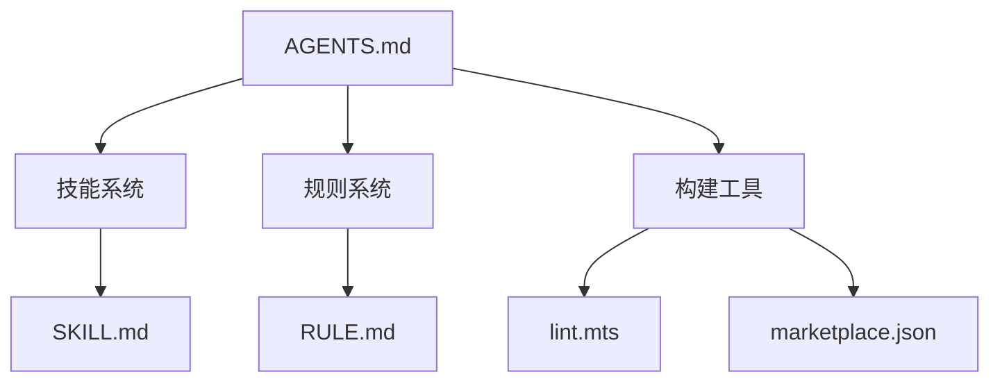

# 项目概述

<cite>
**本文引用的文件**
- [README.md](file://README.md)
- [package.json](file://package.json)
- [AGENTS.md](file://AGENTS.md)
</cite>

## 目录

- [简介](#简介)
- [项目结构](#项目结构)
- [核心组件](#核心组件)
- [架构总览](#架构总览)
- [详细组件分析](#详细组件分析)
- [依赖分析](#依赖分析)
- [性能考虑](#性能考虑)
- [故障排查指南](#故障排查指南)
- [结论](#结论)
- [附录](#附录)

## 简介

本项目是一个实用的规则和 AI 技能仓库，维护可复用的规则文档和 AI 技能定义。每个技能是独立的 SKILL.md 文件，定义了触发条件、执行步骤和输出格式。

**章节来源**
- [README.md:1-10](file://README.md#L1-L10)

## 项目结构

```text
skills/
├── yy-create-wiki/
│   ├── SKILL.md
│   ├── templates/
│   │   └── chapter-template.md
│   └── examples/
│       └── wiki/
├── yy-review/
│   └── SKILL.md
├── yy-lint/
│   └── SKILL.md
└── yy-commit/
    └── SKILL.md
```

**章节来源**
- [README.md:12-30](file://README.md#L12-L30)

## 核心组件

- **技能系统 (Skills)**：独立的 SKILL.md 文件，定义触发条件、执行步骤和输出格式
- **规则系统 (Rules)**：RULE.md 文件，定义编码规范和约束
- **构建工具 (Build)**：lint 脚本和市场配置同步工具

**章节来源**
- [AGENTS.md:1-15](file://AGENTS.md#L1-L15)

## 架构总览



**图表来源**
- [AGENTS.md:1-15](file://AGENTS.md#L1-L15)

## 详细组件分析

### 技能系统

每个技能是一个独立目录，包含 SKILL.md 主文件。SKILL.md 定义了技能的触发条件、执行步骤和输出格式。

### 规则系统

规则文件定义编码规范和约束，通过 AGENTS.md 中的引用关系关联到项目。

### 构建工具

lint 脚本负责检查技能和文档的一致性，marketplace.json 由 lint.mts 自动生成。

**章节来源**
- [AGENTS.md:20-40](file://AGENTS.md#L20-L40)

## 依赖分析

- 运行时依赖：Node.js
- 开发依赖：eslint、prettier
- 构建工具：自定义 lint.mts 脚本

**章节来源**
- [package.json:1-30](file://package.json#L1-L30)

## 性能考虑

- lint 脚本采用增量检查策略，只检查变更的文件
- marketplace.json 由 lint.mts 自动生成，避免手动维护

**章节来源**
- [build/lint.mts:1-20](file://build/lint.mts#L1-L20)

## 故障排查指南

- **技能未触发**：检查 SKILL.md 中的"何时使用"章节是否匹配当前场景
- **lint 报错**：检查 markdownlint 规则，确保所有代码块声明了语言标识
- **marketplace.json 不一致**：执行 `npm run lint` 重新生成

**章节来源**
- [AGENTS.md:50-60](file://AGENTS.md#L50-L60)

## 结论

本项目通过标准化的技能和规则定义，为 AI 辅助开发提供可复用的工作流。技能系统支持触发条件匹配和步骤化执行，规则系统确保输出质量。

**章节来源**
- [README.md:1-10](file://README.md#L1-L10)

## 附录

### 文档索引

- [技能系统](./技能系统%20(Skills)/技能系统%20(Skills).md)
- [规则系统](./规则系统%20(Rules)/规则系统%20(Rules).md)
- [构建工具](./构建工具%20(Build)/构建工具%20(Build).md)

**章节来源**
- [README.md:1-50](file://README.md#L1-L50)
