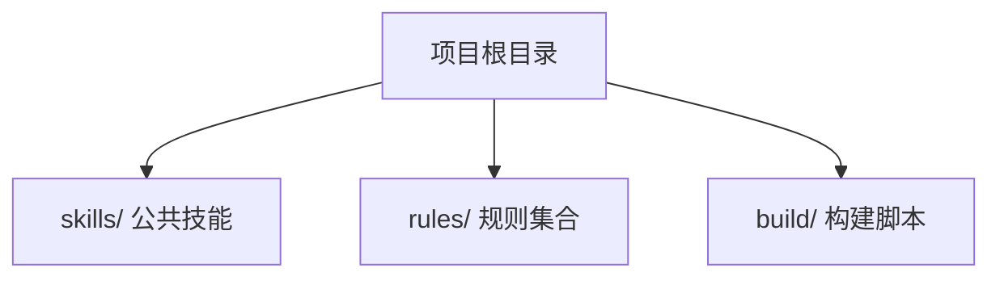
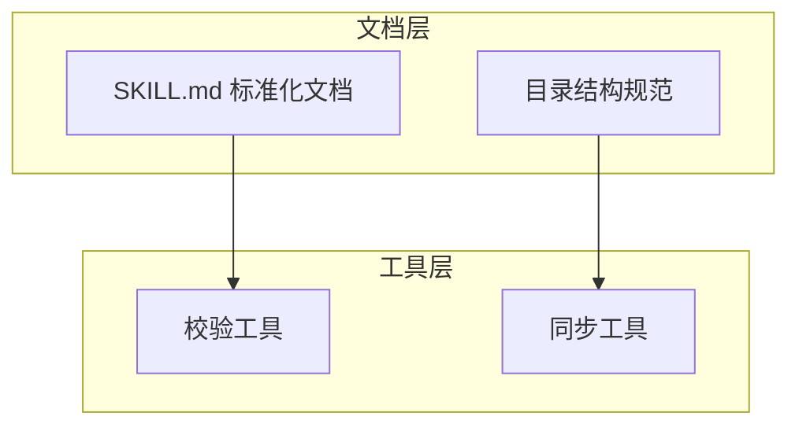

# Wiki 文档章节模板

每个 Wiki 文档必须包含以下 10 个章节，按顺序排列。

## 1. 简介

模块的职责、定位和核心价值。

**内容要素**：

- 用 1 段话概括模块的核心定位
- 列出核心目标（3-5 条，使用列表形式）
- 在 AI 生态系统中的定位（如适用）
- 商业价值与应用场景（如适用）
- 发展历程与未来规划（如适用）

**写法要求**：

- 从 `README.md`、`AGENTS.md` 或模块自描述文件提取事实信息
- 不做推测或扩展，保留原文语义

## 2. 项目结构

模块的目录树和文件组织方式。

**内容要素**：

- 用 1 段话说明目录组织方式
- 使用 mermaid graph 展示目录结构关系
- 列出核心目录及其职责（使用列表形式）

**写法要求**：

- mermaid 图使用 `graph TB` 方向
- 每个节点标注目录名和简要职责
- 节点间用箭头表示包含关系

**示例**：

````markdown
项目采用"按功能域划分"的目录组织方式，核心目录与职责如下：

- skills/：公共技能集合
- rules/：规则集合
- build/：构建脚本


````

## 3. 核心组件

模块内的主要子项及其职责。

**内容要素**：

- 每个核心组件 1 条，使用列表形式
- 每条包含组件名称和 1 句话职责描述
- 避免只列名称不说明作用

**写法要求**：

- 从源文件或自描述文件提取组件职责
- 组件名称使用加粗格式

## 4. 架构总览

模块的整体架构和各部分关系。

**内容要素**：

- 用 1 段话说明架构组成
- 使用 mermaid graph 展示架构层次和关系
- 标注各子系统的职责

**写法要求**：

- mermaid 图使用 `graph TB` 方向
- 使用 `subgraph` 按层次分组
- 节点间用箭头表示依赖或数据流方向

**示例**：

````markdown
下图展示了模块的整体架构，各子系统通过标准化接口协同工作。


````

## 5. 详细组件分析

每个核心组件的深入分析。

**内容要素**：

- 每个核心组件使用 `###` 三级标题
- 包含设计理念、关键流程、目录结构等子章节（按需）
- 使用 mermaid flowchart 或 sequenceDiagram 展示流程
- 列出关键决策点和分支逻辑

**写法要求**：

- 深入到组件内部机制，但不过度展开源代码
- 流程图使用 `flowchart TD` 方向
- 交互图使用 `sequenceDiagram`
- 每个组件分析末尾标注**章节来源**

## 6. 依赖分析

技术栈、外部依赖和内部依赖。

**内容要素**：

- 技术栈选择与优势（列表形式）
- 外部依赖与集成点
- 内部依赖关系（使用 mermaid graph 展示）

**写法要求**：

- 从 `package.json` 提取依赖信息
- mermaid 图展示依赖层次
- 区分运行时依赖和开发依赖

## 7. 性能考虑

性能相关的设计决策和优化策略。

**内容要素**：

- 内容规模控制策略
- 加载与解析优化
- 缓存与增量机制
- 交互轮次优化（如适用）

**写法要求**：

- 从源代码和配置中提取性能相关设计
- 不做未经验证的性能断言
- 如无特殊性能考虑，说明常规策略即可

## 8. 故障排查指南

常见问题和解决方案。

**内容要素**：

- 按问题类型分类（如配置问题、运行时错误、集成问题等）
- 每类问题列出症状和处理方法
- 使用列表形式，每条 1 个问题

**写法要求**：

- 从源代码的错误处理逻辑和常见配置问题提取
- 每条包含症状描述和处理步骤
- 不列举不可能发生的问题

## 9. 结论

模块的总结和未来展望。

**内容要素**：

- 用 1-2 段话总结模块的核心价值和设计特点
- 建议后续行动（2-3 条，使用列表形式）

**写法要求**：

- 总结应与简介呼应，形成闭环
- 建议应具体可执行，不使用模糊表述

## 10. 附录

补充信息和快速参考。

**内容要素**：

- 相关资源链接
- 快速导航索引
- 配置参考（如适用）
- 版本与兼容信息（如适用）

**写法要求**：

- 仅包含正文中未展开但有参考价值的信息
- 使用列表形式组织
- 项目概述文档的附录必须包含文档索引

---

## 通用规则

以下规则适用于所有章节：

- **章节来源标注**：每个章节末尾标注引用的源文件及行号范围，格式为 `**章节来源**` 后跟列表
- **图表来源标注**：每个 mermaid 图后标注引用的源文件，格式为 `**图表来源**` 后跟列表
- **代码块语言标识**：所有围栏代码块必须声明语言标识（`text`、`mermaid`、`bash`、`yaml` 等）
- **路径保留原文**：代码路径和命令保留原文，不做翻译
- **列表优先**：使用列表而非表格展示简单映射关系
