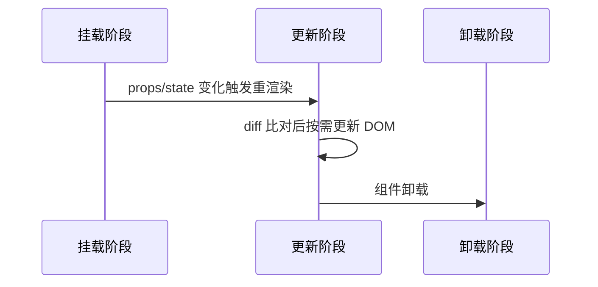
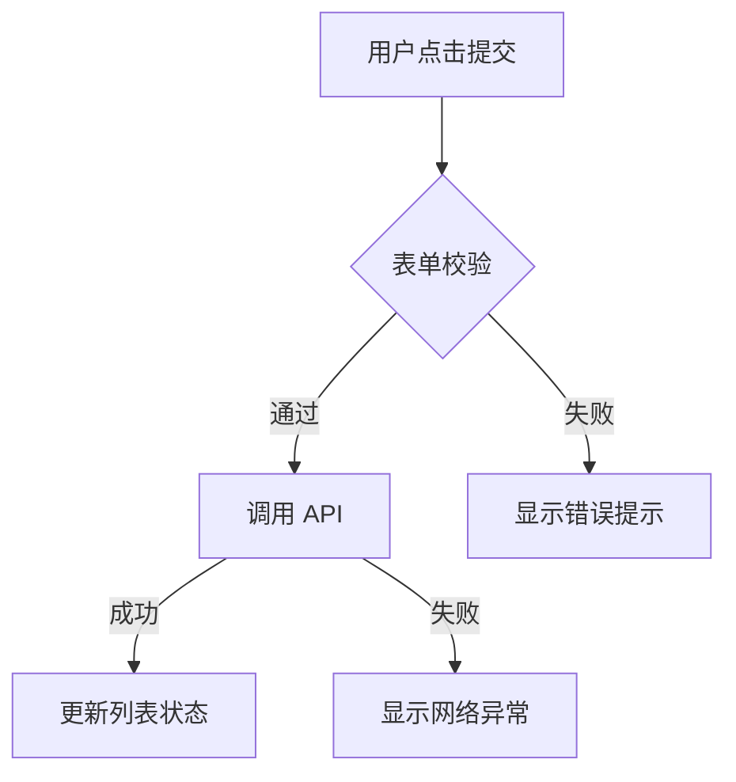
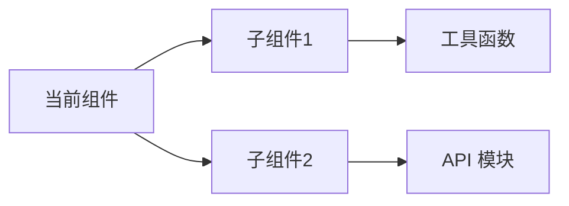
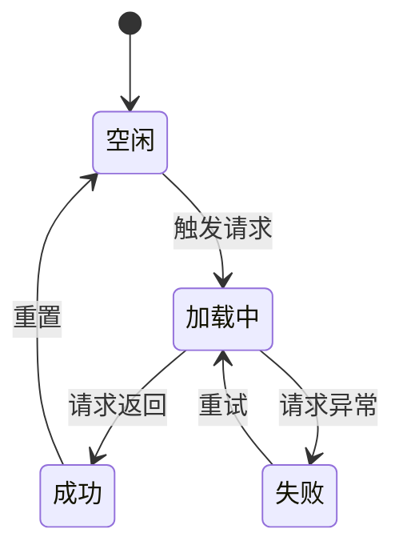

# 输出模板

## 变更记录输出格式（步骤 6）

对每个目标文件输出：

- **文件路径**：相对路径。
- **项目类型**：Vue3 / Vue2 / React / JS / TS / 样式 / 文档。
- **注入位置**：文件顶部 / `<script>` 内部顶部。
- **业务摘要**：职责（1 句）。
- **变更记录**：本次追加的时间戳与改动摘要。

示例：

```text
✅ src/views/User/index.vue
   项目类型: Vue3
   注入位置: <script setup> 内部顶部
   职责: 用户管理页面，支持列表展示、搜索和编辑
   变更记录: 2025-01-15 14:00:00 | feat(user): 新增搜索过滤功能
```

## 逻辑梳理输出格式

当用户需求侧重逻辑梳理（而非变更记录）时，按以下结构输出分析结果，使用 Mermaid 语法结合结构化文档。

### 1. 组件/页面概述

简要说明组件的背景、功能定位和核心职责，一段话概括组件的核心价值。

### 2. 核心属性（Props / State）

列出组件的所有关键属性，包括：

**Props 接口**（如适用）：

- 属性名称
- 类型
- 是否必填
- 说明
- 默认值

**State 状态**（如适用）：

- 状态名称
- 类型
- 初始值
- 说明

**Ref / Context**（如适用）：

- 名称
- 用途
- 作用域

### 3. 生命周期 / 渲染逻辑

使用 Mermaid 时序图展示组件的生命周期和渲染流程：



用文字补充说明：

- 关键生命周期钩子 / Hook 的用途和执行时机
- 渲染触发条件和渲染内容分支

### 4. 交互事件与处理流程

用列表列出所有交互事件：

```text
事件名称：[事件名]
触发条件：[用户操作/系统事件]
处理函数：[执行的函数]
处理流程：
  1. [步骤1]
  2. [步骤2]
后置影响：[状态变化/UI更新]
```

当事件间存在流转关系时，用 Mermaid 流程图表示：



### 5. 依赖关系

用列表展示组件的依赖关系和外部接口：

```text
组件依赖：
  - [依赖组件1]
    - [依赖组件1.1]
    - [依赖组件1.2]
  - [依赖组件2]

API 接口：
  - 接口名称：[名称]
  - 调用时机：[何时调用]
  - 用途：[用途说明]
```

当依赖关系较复杂时，用 Mermaid 图表示：



### 6. 状态流转

当组件内部涉及状态机或复杂状态变化时，用 Mermaid 状态图描述：



用文字补充说明状态定义和流转规则。

### 7. 异常边界与处理

用列表列出所有异常场景：

- 异常场景
- 触发条件
- 处理策略
- 回退方案
