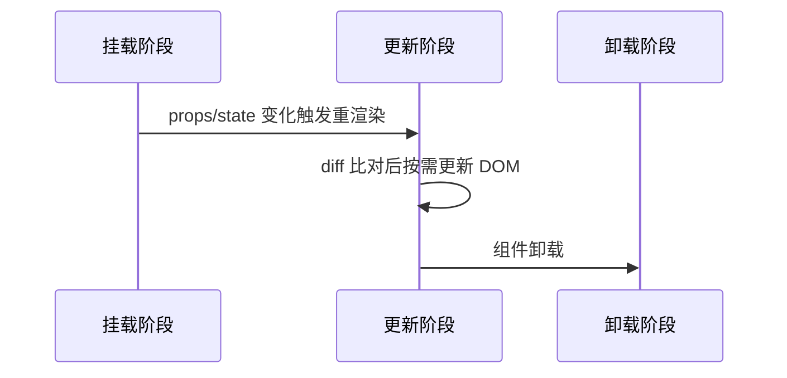

# 输出模板

## 变更记录输出格式

变更记录的输出格式和示例见 SKILL.md 步骤 6，此处不再重复。

## 逻辑梳理输出格式

当用户需求侧重逻辑梳理（而非变更记录）时，按以下结构输出分析结果，使用 Mermaid 语法结合结构化文档。

### 1. 组件/页面概述

简要说明组件的背景、功能定位和核心职责，一段话概括组件的核心价值。

### 2. 核心属性（Props / State）

列出组件的所有关键属性，包括：

**Props 接口**（如适用）：

- 属性名称
- 类型
- 是否必填
- 说明
- 默认值

**State 状态**（如适用）：

- 状态名称
- 类型
- 初始值
- 说明

**Ref / Context**（如适用）：

- 名称
- 用途
- 作用域

### 3. 生命周期 / 渲染逻辑

使用 Mermaid 时序图展示组件的生命周期和渲染流程（根据实际框架选用对应阶段的参与者）：



用文字补充说明：关键生命周期钩子/Hook 的用途和执行时机、渲染触发条件和内容分支。

### 4. 交互事件与处理流程

用列表列出所有交互事件：

```text
事件名称：[事件名]
触发条件：[用户操作/系统事件]
处理函数：[执行的函数]
处理流程：
  1. [步骤1]
  2. [步骤2]
后置影响：[状态变化/UI更新]
```

当事件间存在流转关系时，用 Mermaid `flowchart TD` 展示决策分支和状态影响。

### 5. 依赖关系

用列表展示组件的依赖关系和外部接口：

```text
组件依赖：
  - [依赖组件1]
    - [依赖组件1.1]
    - [依赖组件1.2]
  - [依赖组件2]

API 接口：
  - 接口名称：[名称]
  - 调用时机：[何时调用]
  - 用途：[用途说明]
```

当依赖关系较复杂时，用 Mermaid `flowchart LR` 展示依赖树和模块层级。

### 6. 状态流转

当组件内部涉及状态机或复杂状态变化时，用 Mermaid `stateDiagram-v2` 描述状态定义、触发事件和流转规则，并补充文字说明。

### 7. 异常边界与处理

用列表列出所有异常场景：

- 异常场景
- 触发条件
- 处理策略
- 回退方案
