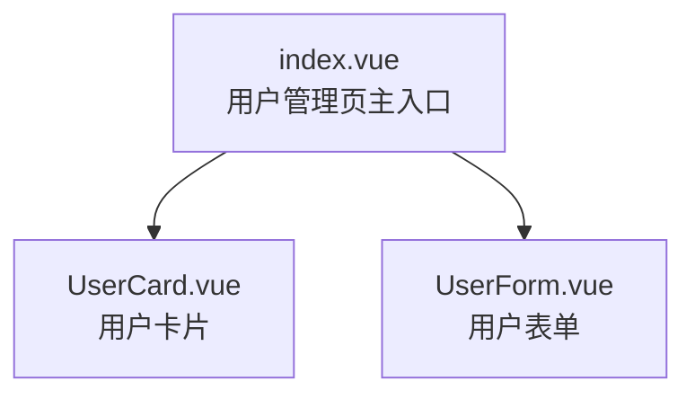

# 原始布局分析细则

> 步骤 3 加载本文件，按以下规则产出原始文件夹的结构化布局视图。

## 产出清单

| 序号 | 产出项 | 必出 | 触发条件 |
| --- | --- | --- | --- |
| 1 | 目录结构树 | ✅ | 始终 |
| 2 | 文件清单表 | ✅ | 始终 |
| 3 | 入口文件识别 | ✅ | 始终（无则标注「未检测到入口」） |
| 4 | 路由表 | ⚠️ | 检测到 router 配置文件时 |
| 5 | 组件依赖关系图 | ⚠️ | 组件数 ≥ 3 时；否则用列表替代 |

## 1. 目录结构树

**生成规则**：

- 使用 `tree` 命令或递归 `ls` 收集结构，剔除 `node_modules/` / `dist/` / `.git/` / `*.log` 等噪声。
- 深度上限 5 层，超过则在叶子节点标 `... (N more)`。
- 每个文件/文件夹后追加**简要职责注释**（不超过 1 行，源自文件名、目录语义、首行注释）。

**输出格式**（PLAN.md 中以代码块呈现）：

```text
src/views/user/
├── index.vue              # 用户管理页主入口（列表 + 搜索 + 分页）
├── components/
│   ├── UserCard.vue       # 用户卡片（单条数据展示）
│   └── UserForm.vue       # 用户表单（新增/编辑共用）
├── utils.js               # 工具函数（格式化、校验）
└── api.js                 # 接口定义（getUserList / createUser / updateUser）
```

**异常降级**：

- 文件名含中文、空格、特殊字符 → 保持原样，不要转义。
- 文件层级极深（> 5 层） → 折叠中间层，仅在 PLAN.md 中提醒「实际层级更深，详见文件清单表」。

## 2. 文件清单表

**字段定义**：

| 字段 | 含义 | 取值示例 |
| --- | --- | --- |
| 路径 | 相对原始文件夹根的相对路径 | `src/views/user/index.vue` |
| 类型 | 文件类型分类 | `Vue` / `JS` / `TS` / `JSX` / `TSX` / `CSS` / `SCSS` / `LESS` / `TEST` / `JSON` / `MD` |
| 推测职责 | 基于文件名、目录、首行注释的 1 句话推测 | `用户管理页主入口` |
| 入口标识 | 是否为框架/路由入口 | `是` / `—` |
| 备注 | 其他需要标注的信息 | `空文件` / `仅含模板` / `测试用例` |

**输出格式**（Markdown 表格）：

| 路径 | 类型 | 推测职责 | 入口 | 备注 |
| --- | --- | --- | --- | --- |
| `index.vue` | Vue | 用户管理页主入口 | 是 | — |
| `components/UserCard.vue` | Vue | 用户卡片 | — | — |
| `api.js` | JS | 接口定义 | — | — |

**分类规则**：

- 仅纳入「业务/源码」文件，跳过：`node_modules/` / `dist/` / `.git/` / 构建产物 / 锁文件（`*.lock` / `package-lock.json` / `pnpm-lock.yaml` / `yarn.lock`）。
- 样式文件（`.css` / `.scss` / `.less`）默认纳入，但仅在「类型」列标注，不强制分析逻辑。
- 测试文件（`.test.*` / `.spec.*`）默认纳入并标 `TEST` 类型，不分析逻辑。

## 3. 入口文件识别

**入口候选清单**：

| 框架 | 入口文件候选 |
| --- | --- |
| Vue3 / Vue2 | `main.js` / `main.ts` / `App.vue` / `index.html` / `index.js` |
| React | `main.jsx` / `main.tsx` / `index.jsx` / `index.tsx` / `App.jsx` / `App.tsx` / `index.html` |
| 通用 | `package.json`（`main` / `module` 字段指向的文件） |

**输出**：

- 找到 → 在「文件清单表」的「入口」列标 `是`，并在 PLAN.md 中单列一节列出所有入口文件及其作用。
- 未找到 → 在 PLAN.md 中标注「未检测到入口文件，本文件夹可能不是项目根，建议确认分析范围」。

## 4. 路由表

**触发条件**：

检测到以下任一文件时尝试解析路由：

- Vue：`router/index.js` / `router/index.ts` / `router/routes.js` / `router.js` / `router.ts`
- React：`routes/index.jsx` / `routes/index.tsx` / `App.jsx`（含 `<Route>`）/ `App.tsx`（含 `<Route>`）

**提取字段**：

| 字段 | 来源 | 备注 |
| --- | --- | --- |
| `path` | `path: '/user'` / `<Route path="/user">` | 路由路径 |
| `name` | `name: 'User'` | 命名路由（无则 `—`） |
| `component` | `component: () => import('...')` / `element={<User/>}` | 组件路径或组件名 |
| `meta` | `meta: { title: '用户管理' }` | 元信息（无则 `—`） |
| `redirect` | `redirect: '/user/list'` | 重定向（无则 `—`） |

**输出格式**（Markdown 表格）：

| path | name | component | meta | redirect |
| --- | --- | --- | --- | --- |
| `/user` | User | `views/user/index.vue` | `title: 用户管理` | — |
| `/user/detail/:id` | UserDetail | `views/user/detail.vue` | `title: 用户详情` | — |

**异常降级**：

- 路由文件存在但解析失败（动态路由、复杂守卫、嵌套过深） → 标注「路由表自动解析失败，请人工补充」，不阻塞流程。
- 多个路由文件（如分模块） → 合并输出，按文件分组。
- React 路由嵌套层级深 → 仅提取顶层 `<Route>` 与一级子 `<Route>`，深层用列表呈现。

## 5. 组件依赖关系图

**触发条件**：

- 原始文件夹内组件数 ≥ 3 个 → 生成 Mermaid 图。
- 组件数 < 3 → 跳过，用列表替代。

**关系判定**：

- Vue：通过 `import Xxx from './components/Xxx.vue'` + `<xxx />` 或 `<Xxx />` 模板使用判定父子关系。
- React：通过 `import Xxx from './Xxx'` + `<Xxx />` JSX 使用判定父子关系。

**Mermaid 写法**（`graph TD`，自上而下）：



**简化规则**：

- 节点数 > 30 → 只画顶层组件与一级子组件，深层用列表。
- 节点标签同时显示文件名 + 1 行职责（来自文件清单表）。
- 跨目录引用（如引用 `@/components/common/`）→ 用虚线 `-.->` 标注。

**异常降级**：

- 组件循环依赖 → 在 PLAN.md 中标注「检测到循环依赖：A → B → A」，不阻塞。
- 动态组件（`<component :is="...">`）→ 标注「动态组件，依赖关系需人工确认」。
