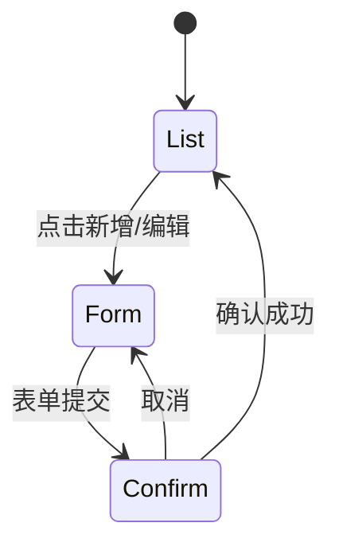
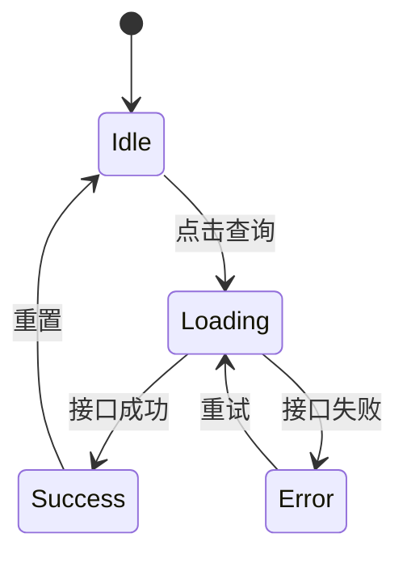

# 逻辑与交互规则分析细则

> 步骤 4 加载本文件，**按当前识别到的框架**读对应章节，对每个组件产出结构化的逻辑/交互分析。

## 通用输出项（所有框架统一）

每个组件产出以下 6 项，缺项标 `—`：

| 序号 | 输出项 | 说明 |
| --- | --- | --- |
| 1 | 职责概述 | 1 句话概括组件做什么 |
| 2 | Props 清单 | 名称 / 类型 / 必填 / 默认值 |
| 3 | Emits/Events 清单 | 事件名 / 触发条件 / 载荷 |
| 4 | 关键事件 | 模板/JSX 中绑定的事件（如 `@click` / `onChange`） |
| 5 | 数据流 | 调用的接口、状态管理（store / context） |
| 6 | 状态流转 | 显著状态机用 Mermaid `stateDiagram` 表达；简单组件跳过 |

## Vue2 专属规则（Options API）

### Props 清单

来源：组件 `props` 选项。

```js
props: {
  userId: { type: Number, required: true },
  readonly: { type: Boolean, default: false }
}
```

提取为：

| name | type | required | default |
| --- | --- | --- | --- |
| `userId` | `Number` | ✅ | — |
| `readonly` | `Boolean` | — | `false` |

**简写形式**（`props: ['userId', 'readonly']`）→ type/required/default 全部 `—`。

### Emits 清单

来源：模板中 `this.$emit('xxx', ...)` 调用 + 子组件 `$emit` 调用。

| name | trigger | payload |
| --- | --- | --- |
| `submit` | 用户点击保存按钮 | `{ id, name }` |
| `close` | 弹窗关闭 | — |

### 关键事件

来源：模板中 `@xxx` 绑定（排除原生 DOM 事件冒泡，聚焦业务回调）。

| element | event | handler |
| --- | --- | --- |
| `<el-button>` | `@click` | `handleSearch` |
| `<el-input>` | `@change` | `handleKeywordChange` |

### 数据流

- **接口调用**：在 `methods` 中查找 `await apiXxx()` / `xxxRequest()` 模式，提取接口函数名。
- **Vuex**：查找 `this.$store.dispatch('user/getList')` / `this.$store.commit('user/SET_LIST')` / `mapState` / `mapActions`。

### 状态流转

仅当组件含显著状态机时输出。典型场景：

- 弹窗开关链（list → form → confirm）
- 审批流（draft → pending → approved / rejected）
- 向导步骤（step1 → step2 → step3）



## Vue3 专属规则（`<script setup>`）

### Props 清单

来源：`defineProps`。

```ts
const props = defineProps<{
  userId: number
  readonly?: boolean
}>()

// 或运行时声明
const props = defineProps({
  userId: { type: Number, required: true },
  readonly: { type: Boolean, default: false }
})
```

提取为：

| name | type | required | default |
| --- | --- | --- | --- |
| `userId` | `number` | ✅ | — |
| `readonly` | `boolean` | — | `undefined` / `false` |

### Emits 清单

来源：`defineEmits` + 模板/脚本中的 `emit('xxx', ...)` 调用。

```ts
const emit = defineEmits<{
  (e: 'submit', payload: { id: number }): void
  (e: 'close'): void
}>()
```

### 关键事件

同 Vue2，来源为模板 `@xxx` 绑定。

### 数据流

- **接口调用**：在 `<script setup>` 中查找 `await apiXxx()` / `xxxRequest()`。
- **Pinia**：查找 `const store = useXxxStore()` + `store.xxxAction()` / `store.xxxRef`。
- **Vuex**（Vue3 项目仍可能用 Vuex 4）：同 Vue2 的 Vuex 检测。

### 状态流转

同 Vue2。

## React 专属规则（函数组件 + Hooks）

### Props 清单

来源：函数组件参数解构。

```tsx
interface UserCardProps {
  userId: number
  readonly?: boolean
}

function UserCard({ userId, readonly = false }: UserCardProps) { ... }

// 或无类型
function UserCard({ userId, readonly = false }) { ... }
```

提取为：

| name | type | required | default |
| --- | --- | --- | --- |
| `userId` | `number` | ✅ | — |
| `readonly` | `boolean` | — | `false` |

### Events/回调清单

来源：props 中 `onXxx` 命名的回调。

| name | trigger | payload |
| --- | --- | --- |
| `onSubmit` | 用户点击保存按钮 | `{ id, name }` |
| `onClose` | 弹窗关闭 | — |

### 关键事件

来源：JSX 中 `onXxx` 绑定。

| element | event | handler |
| --- | --- | --- |
| `<button>` | `onClick` | `handleSearch` |
| `<input>` | `onChange` | `handleKeywordChange` |

### 数据流

- **接口调用**：查找 `useEffect` / 事件回调中的 `await apiXxx()` / `fetchXxx()`。
- **Context**：`const { user } = useUserContext()` / `useContext(UserContext)`。
- **Redux**：`useSelector(state => state.user)` / `const dispatch = useDispatch()` + `dispatch(xxxAction())`。
- **Zustand / Jotai 等原子状态**：`const user = useUserStore(state => state.user)`。

### 状态流转



## 异常降级

| 场景 | 处理 |
| --- | --- |
| 组件为空文件（仅含 `<template>` 骨架） | 所有输出项标 `—`，职责概述写「空组件，待实现」 |
| 组件超过 500 行 | 仅分析核心 6 项，跳过细节；在 PLAN.md 中标注「组件过大，详细逻辑建议人工补充」 |
| 组件含 mixin / HOC / 自定义 Hook 嵌套 | 标注「依赖外部 mixin/Hook：<name>」，不深入分析 |
| 组件用 `<script lang="ts">` 但无类型注解 | 视为 JS 处理，标 `type: any` 或 `—` |
| 动态 props（`v-bind="obj"` / `{...obj}`） | Props 清单标「动态绑定，需人工补充」 |

## 状态流转图判定标准

仅在以下场景输出状态流转图：

| 场景 | 示例 |
| --- | --- |
| 多步骤向导 | 表单分步提交、引导流程 |
| 状态机显著的业务 | 审批流、订单状态、工单状态 |
| 弹窗/抽屉嵌套 | 主弹窗 → 子弹窗 → 确认框 |
| 加载流程 | idle → loading → success / error |

**禁止滥用**：单个 `dialogVisible` 的开关不输出状态图，在「关键事件」中提及即可。
