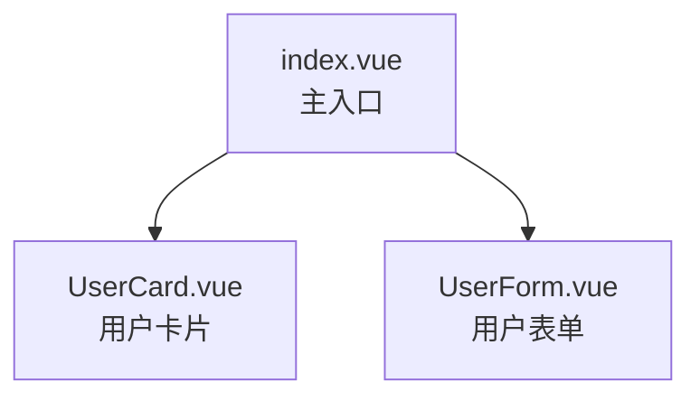
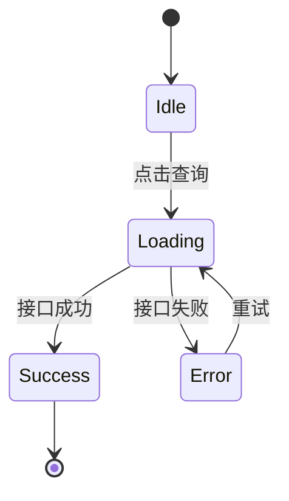

# PLAN.md 模板

> 步骤 5 加载本文件，按以下模板生成 `<target>/PLAN.md`。

## 文件位置

固定写入**重构目标文件夹根目录**，文件名固定为 `PLAN.md`（全大写）。

## 标准模板

````markdown
# 重构方案 PLAN

## 元信息

| 项                   | 值                                                          |
| -------------------- | ----------------------------------------------------------- |
| 原始文件夹           | `<source>`                                                  |
| 重构目标文件夹       | `<target>`                                                  |
| 原始框架识别         | `<Vue3 / Vue2 / React / JS-TS>`                             |
| 目标框架（占位骨架） | `<Vue3 / Vue2 / React / JS-TS>`                             |
| 生成时间             | `<YYYY-MM-DD HH:mm:ss>`（来自 `date "+%Y-%m-%d %H:%M:%S"`） |
| 跨子项目             | `<是 / 否>`（若是，标注差异）                               |

---

## 一、原始布局分析

### 1.1 目录结构树

```text
<目录树（来自 layout-analysis.md §1）>
```

### 1.2 文件清单表

| 路径 | 类型 | 推测职责 | 入口 | 备注 |
| ---- | ---- | -------- | ---- | ---- |
| ...  | ...  | ...      | ...  | ...  |

### 1.3 入口文件

- `<入口文件路径>` —— `<作用>`
- ...

> 未检测到入口时：本节填「未检测到入口文件，本文件夹可能不是项目根」。

### 1.4 路由表

| path | name | component | meta | redirect |
| ---- | ---- | --------- | ---- | -------- |
| ...  | ...  | ...       | ...  | ...      |

> 未检测到路由时：本节填「未检测到路由配置」。

### 1.5 组件依赖关系图

```mermaid
graph TD
    <Mermaid 节点与边>
```

> 组件数 < 3 时：本节替换为「组件数较少，依赖关系：A → B → C」列表形式。

---

## 二、逻辑与交互规则分析

### 2.1 `<组件路径>`

**职责概述**：<1 句话>

| Props | type | required | default |
| ----- | ---- | -------- | ------- |
| ...   | ...  | ...      | ...     |

| Emits/Events | trigger | payload |
| ------------ | ------- | ------- |
| ...          | ...     | ...     |

| 关键事件 | element | event | handler |
| -------- | ------- | ----- | ------- |
| ...      | ...     | ...   | ...     |

**数据流**：

- 接口调用：`<api 函数名>`
- 状态管理：`<store / context>`

**状态流转**（若适用）：


### 2.2 `<下一个组件路径>`

...（按文件清单表逐个输出）

---

## 三、待确认清单

> 以下为生成占位文件前需要用户拍板的开放问题：

- [ ] **文件映射表是否准确？** 是否有遗漏 / 多余 / 路径错误？
- [ ] **目录结构是否调整？** 保持原结构 / 扁平化 / 自定义合并？
- [ ] **占位文件清单是否齐全？** 是否包含路由配置 / 入口注册 / 类型定义？
- [ ] **其他疑点**：
  - `<疑点 1>`
  - `<疑点 2>`

---

## 四、文件映射表（核心）

> 用户确认后，本表是生成占位文件的唯一依据。

| #   | 原始路径                           | 重构路径                           | 文件类型 | 推测职责         | 备注                |
| --- | ---------------------------------- | ---------------------------------- | -------- | ---------------- | ------------------- |
| 1   | `<source>/index.vue`               | `<target>/index.vue`               | Vue3     | 用户管理页主入口 | —                   |
| 2   | `<source>/components/UserCard.vue` | `<target>/components/UserCard.vue` | Vue3     | 用户卡片         | —                   |
| 3   | `<source>/api.js`                  | `<target>/api.ts`                  | JS→TS    | 接口定义         | 类型从 JS 升级为 TS |
| ... | ...                                | ...                                | ...      | ...              | ...                 |

**映射规则**：

- 默认保持原文件名与原目录结构。
- 跨代际重构（如 Vue2 → Vue3）允许在「重构路径」列调整扩展名（如 `.js` → `.ts`），并在「备注」列说明。
- 用户在确认环节可手动增删行。
````

## Mermaid 图写法速查

### 组件依赖图（graph）



**节点 ID 用 PascalCase**（与文件名解耦，便于复用），**标签用 `<文件名><br/><职责>`** 双行格式。

### 状态流转图（stateDiagram）



**箭头标签**用 `: `（冒号空格）分隔目标状态与触发条件。

## 待确认清单的填写规则

待确认清单是步骤 6 用户确认环节的依据，必须**显式列出所有开放问题**，禁止留空或写「无」。

填写来源：

1. **框架识别中等置信度** → 列入疑点。
2. **跨子项目场景的别名/状态管理/UI 库差异** → 列入疑点。
3. **某组件职责推测模糊** → 列入疑点，注明「推测为 X，但可能为 Y」。
4. **路由表/依赖图自动解析失败** → 列入疑点。
5. **文件映射表中的扩展名升级**（如 `.js` → `.ts`） → 列入疑点。
6. **大型组件（> 500 行）** → 列入疑点，建议人工补充逻辑分析。

## 时间戳获取

生成 PLAN.md 前**必须**执行：

```bash
date "+%Y-%m-%d %H:%M:%S"
```

将输出填入「元信息」表的「生成时间」字段。**禁止 AI 推算或猜测时间**——AI 不具备系统时钟感知能力。
